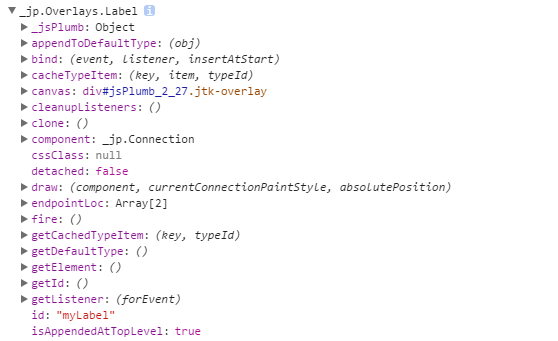
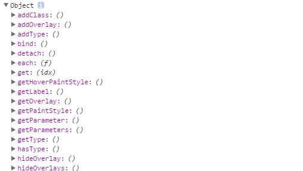

# jsPlumb DOCS

> 阅读jsPlumb提供的DOC中所产生的知识点

## setup

如果不使用jQuery或者类jQuery库，则传入的节点得用id的形式,否则jsPlumb会为元素设置一个id。

```
jsPlumb.ready(function(){
  ···
});
//or
jsPlumb.bind("ready",function(){
  ···
});
```
最好确认jsPlumb加载完毕之后，再开始使用相关功能。
-----------------------------------------

默认情况下，jsPlumb在浏览器的窗口中注册，为整个页面提供一个静态实例，所以也可以把它看成一个类，来实例化jsPlumb：
```
var firstInstance = jsPlumb.getInstance();
```
------------------------------------------

如果在使用过程中，元素的id产生了新的变化（多是生成了新的节点，旧的节点被删除了）。则可以：
* `jsPlumb.setId(el,newId)`
* `jsPlumb.setIdChanged(oldId,newId)`
-------------------------------------

在使用过程中，每个部分的`z-index`需要注意，否则连线可能会被覆盖，jsPlumb会为每个节点设置端点，用于定位端点。

jsPlumb也提供了拖动方法：
```
var secondInstance = jsPlumb.getInstance();
secondInstance.draggable("some element");
```
-----------------------------------------

重绘，每次使用连线时，都会导致相关联的元素重绘，但当加载大量数据时，可以使用：
```
jsPlumb.setSuspendDrawing(true);

jsPlumb.setSuspendDrawing(false,true);
```
这里第二个参数的true，会使整个jsPlumb立即重绘。
也可以使用batch：
```
jsPlumb.batch(fn,[doNotRepaintAfterwards]);
```
这个函数也是一样，可以先将所有的连接全部注册好，再一次重绘。
这个方法在1.7.3版本之前名称为`doWhileSuspended`.

## config defaults
当然，jsPlumb会有一些默认的参数：
分为全局默认参数和连线默认参数，
```
Anchor : "BottomCenter",//端点的定位点的位置声明（锚点）：left，top，bottom等
Anchors : [ null, null ],//多个锚点的位置声明
ConnectionsDetachable   : true,//连接是否可以使用鼠标默认分离
ConnectionOverlays  : [],//附加到每个连接的默认重叠
Connector : "Bezier",//要使用的默认连接器的类型：折线，流程等
Container : null,//设置父级的元素，一个容器
DoNotThrowErrors  : false,//如果请求不存在的Anchor，Endpoint或Connector，是否会抛出
DragOptions : { },//用于配置拖拽元素的参数
DropOptions : { },//用于配置元素的drop行为的参数
Endpoint : "Dot",//端点（锚点）的样式声明（Dot）
Endpoints : [ null, null ],//多个端点的样式声明（Dot）
EndpointOverlays : [ ],//端点的重叠
EndpointStyle : { fill : "#456" },//端点的css样式声明
EndpointStyles : [ null, null ],//同上
EndpointHoverStyle : null,//鼠标经过样式
EndpointHoverStyles : [ null, null ],//同上
HoverPaintStyle : null,//鼠标经过线的样式
LabelStyle : { color : "black" },／／标签的默认样式。
LogEnabled : false,//是否打开jsPlumb的内部日志记录
Overlays : [ ],//重叠
MaxConnections : 1,//最大连接数
PaintStyle : { lineWidth : 8, stroke : "#456" },//连线样式
ReattachConnections : false,//是否重新连接使用鼠标分离的线
RenderMode : "svg",//默认渲染模式
Scope : "jsPlumb_DefaultScope"//范围，标识
```
如果是全局则可以使用`jsPlumb.importDefaults({···})`，
也可以在实例化时，重新定义`jsPlumb.getInstance({···})`，

## Basic Concepts
jsPlumb关键点就是连接线，从上面也可以看出，大部分的配置项都是为了线而设。
其分为五个方面：
* Anchor：锚点位置
* Endpoint：端点，连接的起点或终点
* Connector：连线，连接两个节点的直观表现，有四种默认类型：Bezier（贝塞尔曲线），Straight（直线），Flowchart（流程图），State machine（状态机）
* Overlay：装饰连接器的组件，类似箭头之类
* Group：包含在某个其他元素中的一组元素，可以折叠，导致与所有组成员的连接被合并到折叠的组容器上。

### Anchor
锚点位置有四种类型：
* Static：静态，会固定到元素上的某个点，不会移动
* Dynamic：动态，是静态锚的集合，就是jsPlumb每次连接时选择最合适的锚
* Perimeter anchors：周边锚，动态锚的应用。
* Continuous anchors：连续锚
--------------------------

1. Static
jsPlumb有九个默认位置，元素的四个角，元素的中心，元素的每个边的中点。
* Top(TopCenter),TopRight,TopLeft
* Right(RightMiddle)
* Bottom(BottomCenter),BottomRight,BottomLeft
* Left(LeftMiddle)
* center
可以使用基于数组的形式来定义锚点位置：[x,y,dx,dy,offsetX,offsetY]。
[0,0]表示节点的左上角。
x表示锚点在横轴上的距离，y表示锚点在纵轴上的距离，这两个值可以从0到1来设置，0.5为center。
而dx表示锚点向横轴射出线，dy表示锚点向纵轴射出线，有0，-1，1三个值来设置。0为不放射线。
offsetX表示锚点偏移量x（px），offsetY表示锚点偏移量y（px）。

2. Dynamic Anchors
选择每当某物移动或在UI中绘制时最合适的位置。
```
var dynamicAnchors = [ [0.2,0,0,0],"Top","Bottom" ]
```
在使用过程中，发现其就是指定锚点应该出现在哪个地方。jsPlumb会选取最近的点，来当作锚点。可以设置多个点，来当作可能出现的锚点。
当然，jsPlumb自带了默认的参数，`AutoDefault`。其实与`["Top","Right","Bottom","Left"]`相同。

3. Perimeter Anchors
jsPlumb提供了六种形状：
* Circle
* Ellipse
* Triangle
* Diamond
* Rectangle
* Square

4. Continuous Anchors
```
anchor:"Continuous"
//or
anchor:["Continuous",{faces:["top","left"]}]
```
faces同样有四个值：`top`,`left`,`right`,`bottom`。

### 将CSS类与Anchors相关联
```
var ep = jsPlumb.addEndpoint("ele1",{
  anchor:[0,0,0,0,0,0,"test"]
});
```

也可以修改前缀：
```
jsPlumb.endpointAnchorClass="anchor_";
```

### Connectors
连接器是实际连接UI元素的线，默认连接器是贝塞尔曲线，也就是默认值是"Bezier";
这里才是画线的地方，
* Bezier：它有一个配置项，curviness（弯曲度），默认为150.这定义了Bezier的控制点与锚点的距离
* Straight：在两个端点之间绘制一条直线，支持两个配置参数：stub，默认为0。gap，默认为0
* Flowchart：由一系列垂直或水平段组成的连接。支持四个参数，stub，默认为30；alwaysRespectStubs，默认为false；gap，默认为0；midpoint，默认为0.5；cornerRadius，默认为0；
* StateMachine：状态器，支持在同一元素上开始和结束的连接，支持的参数有：margin，默认为5；curviness，默认为10；proximityLimit，默认为80；

### Endpoints
端点的配置和外观参数。
jsPlumb带有四个端点实现-点，矩形，空白和图像，可以在使用connect(),addEndpoint(),makeSource()或jsPlumb.makeTarget时使用endpoint参数指定Endpoint属性。

#### 给端点进行配置
* jsPlumb.connect(),创建连接的时候可以配置端点的属性
* jsPlumb.addEndpoint(),创建一个新的端点时配置属性
* jsPlumb.makeSource(),配置元素并随后从该元素中拖动连接时，将创建并分配一个新的端点

#### 端点的预设类型
1. Dot：支持三个参数：
  radius，默认为10px，定义圆点的半径
  cssClass，附加到Endpoint创建的元素的CSS类
  hoverClass，一个CSS类，当鼠标悬停在元素或连接的线上时附加到EndPoint创建的元素

2. Rectangle：支持的参数：
  width，默认为20，定义矩形的宽度
  height，默认为20，定义矩形的高度
  cssClass，附加到Endpoint创建的元素的CSS类
  hoverClass，当鼠标悬停在元素或连接的线上时附加到EndPoint创建的元素

3. image：从给定的URL中绘制图像，支持三个参数：
  src，必选，指定要使用的图像的URL，
  cssClass，附加到Endpoint创建的元素的CSS类
  hoverClass，当鼠标悬停在元素或连接的线上时附加到EndPoint创建的元素，
4. Blank：空白

### Overlays（叠加层）
jsPlumb有五种类型的叠加：
1. Arrow：箭头，在连接器的某个点绘制的可配置箭头，可以控制箭头的长度和宽度,参数有：
  width，箭头尾部的宽度
  length，从箭头的尾部到头部的距离
  location，位置，建议使用0～1之间，当作百分比，便于理解
  direction，方向，默认值为1（表示向前），可选-1（表示向后）
  foldback，折回，也就是尾翼的角度，默认0.623，当为1时，为正三角
  paintStyle，样式对象

2. Label：在连接点的可配置标签，参数有
  label，要显示的文本
  cssClass，Label的可选css
  labelStyle，标签外观的可选参数：font，适应canvas的字体大小参数；color，标签文本的颜色；padding，标签的可选填充，比例而不是px；borderWidth，标签边框的可选参数，默认为0；borderStyle，颜色等边框参数
  location，位置，默认0.5
  也可以使用getLabel，和setLabel，来获取和设置label的文本,可传函数

3. PlainArrow：箭头形状为三角形
  只是Arrow的foldback为1时的例子，参数与Arrow相同

4. Diamond：棱形
  同样是Arrow的foldback为2时的例子，参数与Arrow相同

5. Custom：自定义
  允许创建自定义的叠加层，需要使用create(),来返回DOM元素或者有效的选择器（ID）
  ```
  var conn = jsPlumb.connect({
  source:"d1",
  target:"d2",
  paintStyle:{
    stroke:"red",
    strokeWidth:3
  },
  overlays:[
    ["Custom", {
      create:function(component) {
        return $("<select id='myDropDown'><option value='foo'>foo</option><option value='bar'>bar</option></select>");
      },
      location:0.7,
      id:"customOverlay"
    }]
  ]
  });
  ```

作为[0,1]的小数，其表示沿着由连接器内接的路径的一些成比例的行程，默认值为0.5。
作为大于1的整数，表示从起点沿连接器行进的某些绝对像素数。等于1时，在终点。
作为小于零的整数，其指示沿着连接器从端点向后行进的一些绝对值的像素。等于0时，在起点。

所有叠加层都支持：
getLocation-返回当前位置
setLocation-设置当前位置

#### 添加叠加层
例子：
```
jsPlumb.connect({
  overlays:[
    "Arrow",
      [ "Label", { label:"foo", location:0.25, id:"myLabel" } ]
    ]
});
```

而在addEndpoint和makeSource方法中，则不能使用`overlays`,需要使用`connectOverlays`.
也可以使用`addOverlay`:
```
var e = jsPlumb.addEndpoint("someElement");
e.addOverlay([ "Arrow", { width:10, height:10, id:"arrow" }]);
```

当然还有获取叠加层的方法：`getOverlay(id)`这里的id与元素中的id不同，只是组件在jsPlumb中的唯一标识而已，在控制台打印之后，能看到内部提供了很多方法,另外注意原型链中的方法。


在官方的`Hiding/Showing Overlays`中，向我们展示了`setVisible`,`showOverlay(id)`,`hideOverlay(id)`，`removeOverlay(id)`等方法，当然，因为对象中有DOM元素，我们也可以使用其他方法来控制DOM元素。

### Groups
相当于给节点之间加入了分组的概念，一旦分组，那么就可以使用组来控制组下的所有元素。
但这里的分组仍然是在jsPlumb中建立索引，当有相关事例时，再进行介绍。

## Drag
如果不使用jsPlumb提供的拖动，则需要使用`repaint()`来对拖动之后的连线进行重绘。
而当修改了节点的层级，或者偏移则需要使用`revalidate(container)`来刷新。

## Establishing Connections
在上面的例子中，已经介绍了基本的连接方式`jsPlumb.connect({source:"element1",target:"element2"})`。
这种方式创建的连接线一旦移除，则创建的端点也会自动移除。如果不想端点被移除，则可以继续加参数，将
`deleteEndpointsOnDetach`设为false。如果不想鼠标能够移除连接线，则可以在局部配置中将`ConnectionsDetachable`设为false，或者在connect时，加入`detachable:false`。

### 拖放连接
一开始就要创建一个端点来作为源点
```
var endpoint = jsPlumb.addEndpoint('elementId',{isSource:true})
```
这样就可以从该端点拉线出去。
如果给另一个创建的点加入`isTarget:true`，则就可以用上面的点连入这个点。

或者使用`makeSource`或者`makeTarget`：
```
jsPlumb.makeSource("ele1",{
  anchor:"Continuous",
  maxConnections:1
  ···
})
```
上述例子中，如果配置了maxConnections，则最多只能出现这个参数的连线，一旦多于这个数目的连线，就可以用`onMaxConnections(params,originalEvent)`这个回调函数来做其他事.
`connect`与`makeSource，makeTarget`，都可以配置第三个参数，相当于公共配置参数，与第二个参数类似。
-----------------------------------------------------------------------

在`connect`中如果使用`newConnection：true`参数，则会取消`makeTarget，makeSoucr，addEndpoint`中所添加的配置项,重绘连接线。

而`makeTarget`也有`onMaxConnections`方法。
因为`makeTarget`包括上面介绍的`isTarget`都可以指向源点元素，所以，如果不想造成回环（自己连自己），则可以在`makeTarget`中设置`allowLoopback：false`.如果只想产生一个端点，而不是多个端点，则需要使用`uniqueEndpoint:true`.
默认情况下，使用makeTarget创建的端点将`deleteEndpointsOnDetach`设置为true，即删除连线，端点删除；如果不要删除，则需要手动改为false。
--------------------------------------------------------

如果既配置了元素可拖动，又设置了元素可拖放连接，那jsPlumb没有办法区分拖动元素和从元素中拖动连接，所以它提供了`filter`方法。
```
jsPlumb.makeSource("foo",{
  filter:"span",
  filterExclude:true
});
```
则除span元素的其他元素都可以创建拖放连接，filter也接受函数。`filter:function(event,element)`.

也可以使用`isTarget("id")`,`isSource("id")`来判断节点是否成为了源点。
如果配置了source和target之后，想切换源的激活状态，则可以使用`setTargetEnabled(id)`,`setSourceEnabled(id)`。
如果想取消`makeTarget`和`makeSource`所创建的源点，可以使用：
* unmakeTarget("id")
* unmakeSource("id")
* unmakeEveryTarget
* unmakeEverySource

#### Drag and Drop scope
如果使用了jsPlumb自带的drag或者drop，那么给端点配置scope是很有必要的，这意味着之后创建端点只能连接到对应scope的端点。如果不设置scope，其默认的scope是一样的。

## Removeing Nodes
移除节点没什么好说的，关键还是要移除与之关联的端点和连接线。

### Removeing Connections／Endpoints

**Connections**
1. detach
```
var conn = jsPlumb.connect({...});
jsPlumb.detach(conn);
```
如果使用该方法来删除连接线，那么会有几种情况：
* 如果使用`jsPlumb.connect`创建的线，而且没有设置`deleteEndpointsOnDetach:false`,则使用detach时，端点也会一起被移除。
* 如果通过makeSource配置的元素创建了连接线，而且没有设置`deleteEndpointsOnDetach:false`,则使用detach时，端点也会一起被移除。
* 如果使用addEndpoint注册的元素通过鼠标创建了连接线，则不会删除端点。

2. detachAllConnections(el,[params])
用于删除元素上的所有连接线。

3. detachEveryConnection()
删除所有连接线。

**Endpoints**
1. deleteEndpoint
删除一个端点。
2. deleteEveryEndpoint
删除所有的端点

## Connection and Endpoint Types
可以通过提供的方法来动态的修改连接线或端点的样式。

### Connection Type
```
jsPlumb.registerConnectionType("example",{
  paintStyle:{stroke:"blue",strokeWidth:5},
});
var c = jsPlumb.connect({source:"someDiv",target:"someOtherDiv"});
c.bind("click",function(){
  c.setType("example")
});
```
当点击连接线时，会替换连接线的样式
也可以使用：
```
jsPlumb.registerConnectionTypes({
  "basic":{
    paintStyle:{stroke:"blue",strokeWidth:7}
  },
  "selected":{
    paintStyle:{stroke:"red",strokeWidth:5}
  }
});

c.bind("click",function(){
  c.toggleType("selected");
});
```
而type支持的属性都和css相关：
* anchor
* anchors
* detachable
* paintStyle
* hoverPaintStyle
* scope
* cssClass
* parameters
* overlays
* endpoint

### Endpoint type
```
jsPlumb.registerEndpointTypes({
  "basic":{
    paintStyle:{fill:"blue"}
  }
});
```
端点的type支持的参数：
* paintStyle
* endpointStyle
* hoverPaintStyle
* endpointHoverStyle
* maxConnections
* connectorStyle
* connectorHoverStyle
* connector
* connectionType
* scope
* cssClass
* parameters
* overlays

## Events
首先看个小例子：
```
jsPlumb.bind("connection",function(info){
  console.log(info);
});
```
`connection(info,originalEvent)`即监听所有的连接事件。info包含的信息有：
* connection
* sourceId
* targetId
* source
* target
* sourceEndpoint
* targetEndpoint

`connectionDetached(info,originalEvent)`即监听当连接断掉时的事件。info类似`connection`.

右键点击也有相应的`contextmenu`方法。

关于connection和endpoint的事件方法，请参考官网api。
记录下overlay的事件。
```
jsPlumb.connect({
  source:"el1",
  target:"el2",
  overlays:[
    ["Label",{
      events:{
        click:function(labelOverlay,originalEvent){
          console.log(labelOverlay);
        }
      }
      }
    }],
  ]
})
```

同样，使用unbind方法，可以移除上面所添加的监听。

## 筛选jsPlumb
使用`jsPlumb.select()`方法，用于在Connections列表上做筛选，打印一下值：

就可以使用这些方法对于连接线来进行获取（get）和修改（set）。
还有`getConnections`,`getAllConnections()`等方法也可以获取到连接线，只不过这两个方法没有上面slect的方法，相当于静态属性

使用`jsPlumb.selectEndpoints()`方法，用于在Endpoints上做筛选，同样有相应的方法。

`select()`和`selectEndpoints()`都有一个each方法，用于对筛选出的方法进行操作。

## Repainting an element or elements
当需要对修改过后的元素重新计算端点和连接线时，则可以使用
```
jsPlumb.repaint(el,[ui])
```
或
```
jsPlumb.repaintEverything().
```

## Element Ids
当元素上的id也被改变时，可以使用
```
jsPlumb.setId(el,newId);
//or
jsPlumb.setIdChanged(oldId,newId);
```
来重新对之前注册的节点进行修改。

# 小结
前期调研完成，接下来开始真正设计界面和逻辑。
