# jsPlumb DEMO

> 在使用jsPlumb过程中,所遇到的问题,以及解决方案,文中引用了《数据结构与算法JavaScript描述》的相关图片和一部分代码

## 前言

首先是UML类图
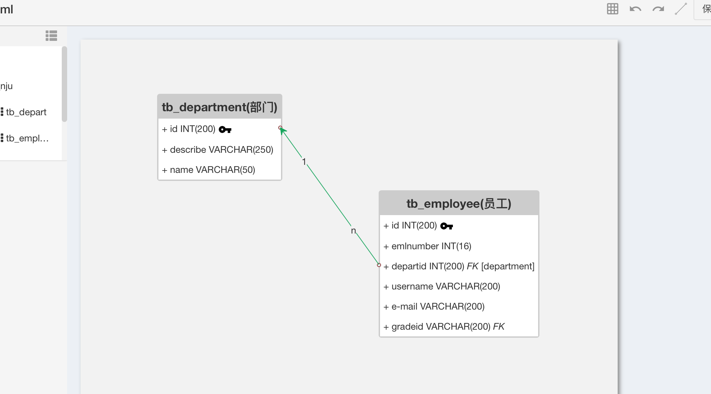

然后是流程图
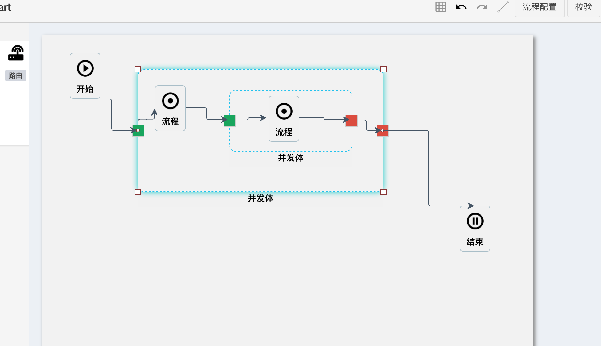

使用了jsPlumb的相关功能,初版是可以看到雏形了,差不多用了两个月的时间,中间断断续续的又有其它工作穿插,但还是把基本功能做出来了.

其实做完了之后,才发现jsPlumb的功能,只用到了很少的一部分,更多的是对于内部数据结构的理解和实现,只能说做到了数据同步更新,距离数据驱动仍然有一定的距离.

这里会总结和记录一下项目中遇到的问题,和解决的方法,如果有更好的方法,欢迎指出.

## 对于连线上的多个标签的处理
如上图所示,一开始是认为是否是要在连线时,配置两个overlays,
```
    var j = jsPlumb.getInstance();

    j.connect({
        source:source,
        target:target,
        overlays:[
            "Arrow",
            ["label",{label:"foo1",location:0.25,id:"m1"}],
            ["label",{label:"foo2",location:0.75,id:"m2"}]
        ]
    })
```
当然,这里也有坑,如果id重复,那么会使用最后一个,而不会重合,包括jsPlumb内部缓存的数据都只会剩下最后的那个.

后面发现,其实也可以通过`importDefaults`函数来动态修改配置项.
```
    j.importDefaults({
        ConnectionOverlays: [
            ["Arrow", { location: 1, id: "arrow", length: 10, foldback: 0, width: 10 }],
            ["Label", { label: "n", id: "label-n", location: 0.25, cssClass: "jspl-label" }],
            ["Label", { label: "1", id: "label-1", location: 0.75, cssClass: "jspl-label" }]
        ]
    })
```
只不过这样,只会在运行了函数之后的连线里,才能有两个标签显示,而之前的则无法一起变化.
所以为了方便,直接在初始化里将其给修改了.

## Groups的使用
在做流程图时,Group确实是个问题,如上图的无限嵌套层级中,就无法使用jsPlumb提供的`Groups`功能.
按照文档中来说,如果标识一个元素为组,则该组中的元素则会跟随组的移动而移动,连线也是,但问题就是一旦一个元素成为组了,那就不能接受其它组元素了,换句话说,它所提供的的Groups方法只有一层,自然无法满足要求.
先把总结的组的用法贴出来:
```
    j.addGroup({
        el:el,
        id:"one"
        constrain:true, // 子元素仅限在元素内拖动
        droppable:true, // 子元素是否可以放置其他元素
        draggable:true, // 默认为true,组是否可以拖动
        dropOverride:true ,// 组中的元素是否可以拓展到其他组,为true时表示否,这里的拓展会对dom结构进行修改,而非单纯的位置移动
        ghost:true, // 是否创建一个子元素的副本元素
        revert:true, // 元素是否可以拖到只有边框可以重合
    })
```
后面采用了新的方式,在节点移动时,动态刷新连线
```
    j.repaintEverything();
```
而为了不阻塞页面,需要用到函数节流`throttle()`
```
    function throttle(fn,interval){
        var canRun = true;

        return function(){
            if(!canRun) return;
            canRun = false;
            setTimeout(function(){
                fn.apply(this,arguments);
                canRun = true;
            },interval ? interval : 300);
        };
    };
```
这是一个简单的实现方式,主要就是为了减少dom中事件移动时重复调用的事件,同时达到执行事件的目的(只允许一个函数在x毫秒内执行一次);
当然,也可以使用underscore.js中自带的`_.throttle()`函数,同样可以达到目的.

这里的html结构就使用了嵌套的层级,将父级和子级使用这种层级保存到内部的数据源里

## 多层or一层 数据结构解析
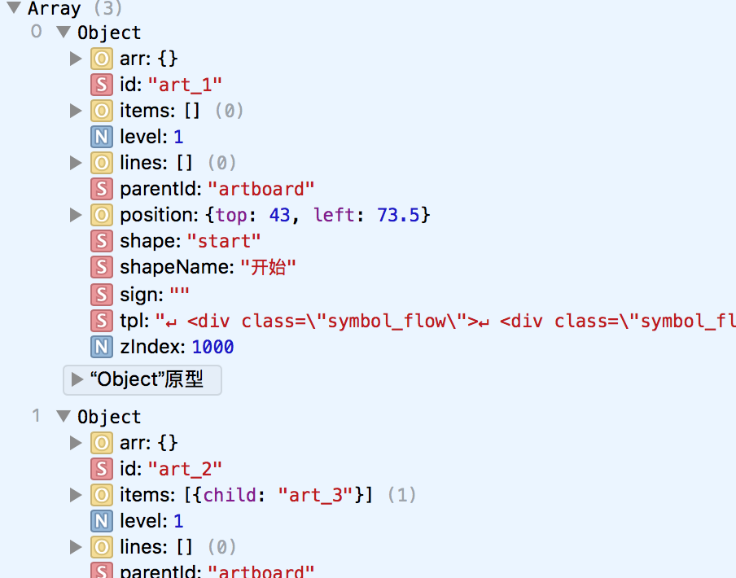;
类似这种实际存在嵌套关系的数据体,有两种方式可以进行管理,

* 多层级嵌套:类似
    ```
        [
            {
                id:"1",
                child:{
                    id:"2",
                    child:{
                        id:"3",
                        child:{}
                    }
                }
            }
        ]
    ```
用来进行管理的话,优点是直观,能根据层级就知道整体结构大概是多少,转换成xml或者html也很方便.
但缺点就是进行查找和修改,并不是那么方便.

* 一层展示所有节点:类似
    ```
        [
            {
                id:"1",
                child:[{
                    id:"2"
                }]
            },
            {
                id:"2",
                parentId:"1",
                child:[{
                    id:"3"
                }]
            },
            {
                id:"3",
                parentId:"2",
                child:[]
            }
        ]
    ```
这种结构好处就是全部在一个层级中,查找起来和修改数据非常方便,而如果想要解析成多层级的结构,只需要运用递归,来生成新结构:
```
    function mt(){
        var OBJ;
        this.root = null;
        this.Node = function(e) {
            this.id = e.id;
            this.name = e.name;
            this.parentId = e.parentId;
            this.children = [];
        };

        this.insert=function(e,key){
            function add(obj,e){
                if(obj.id == e.parentId){
                    obj.children.push(e);
                } else {
                    for (var i = 0; i < obj.children.length; i++) {
                        add(obj.children[i], e);
                    }
                }
            }

            if (e != undefined) {
                e = new this.Node(e);
            } else {
                return;
            }

            if (this.root == null) {
                this.root = e;
            } else {
                OBJ = this.root;
                add(OBJ, e);
            }
        }

        this.init = function(data){
            var _this = this;
            for(var i = 0;i<data.length;i++){
                _this.insert(data[i]);
            }

            return OBJ;
        }
    }
```
将一层的数组通过初始化函数`init`,就可以转为多层级
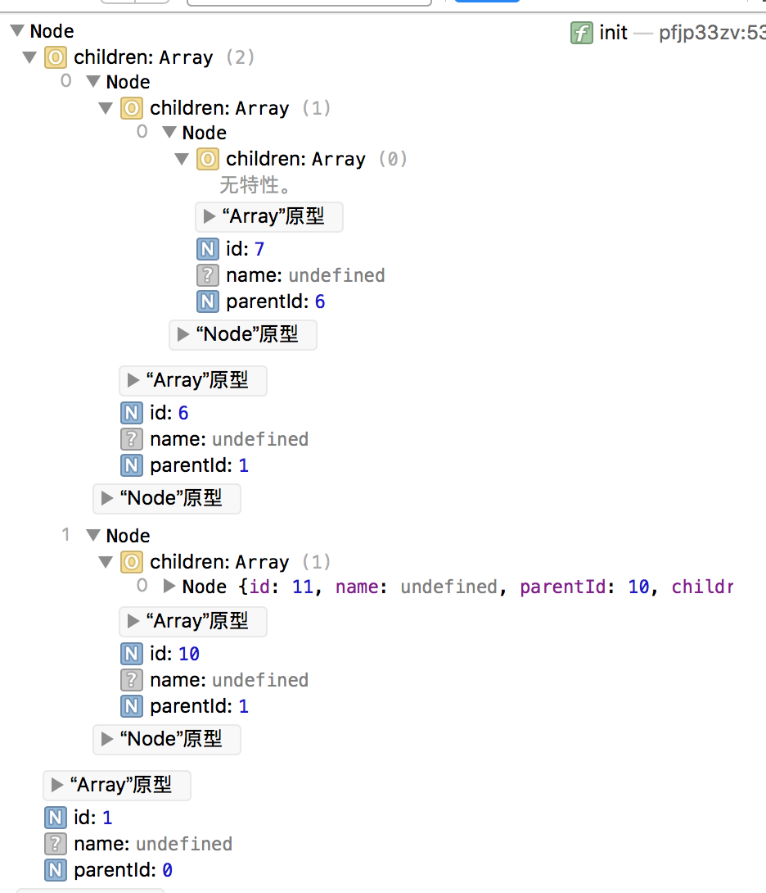
如果想转成html结构,只需要稍微改下函数,就可以实现了.

## 校验流程是否存在死路(是否存在不能到达图的终点的路径的点)
这个就完全得靠算法来实现了.首先,对于图的理解是重点
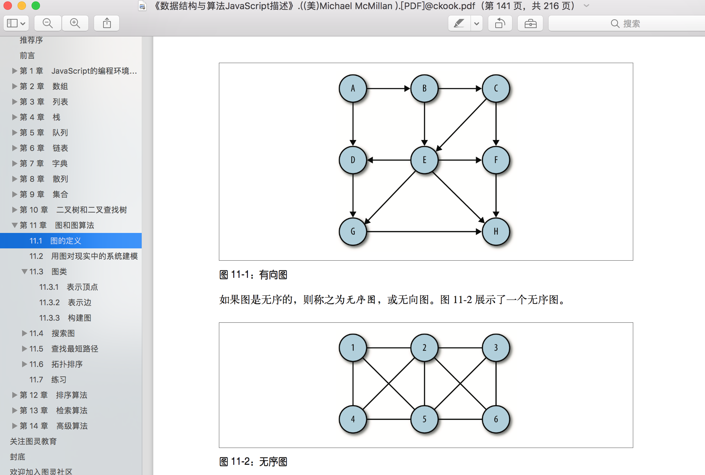
我也懒得打字了,直接用图表示一下,基本的图大致是这样,而具体的表现形式则是
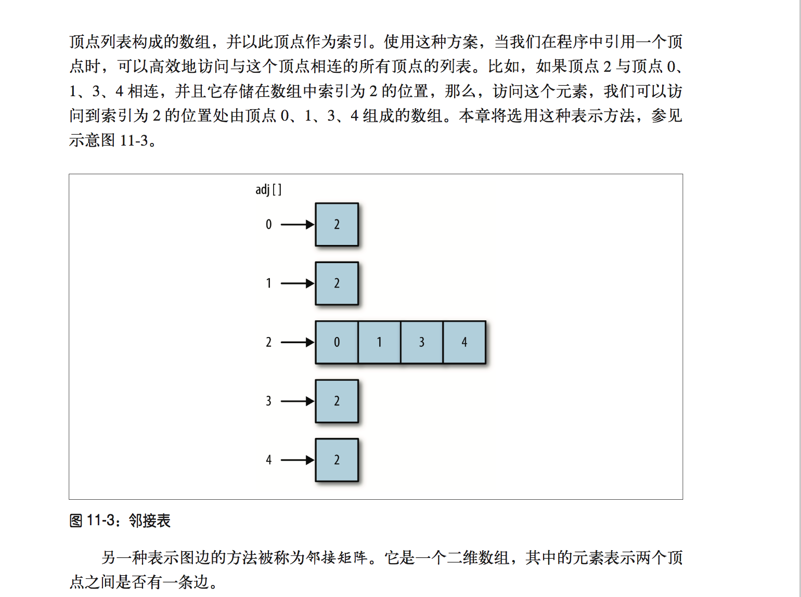
可以看到,基础的图的表现形式,可以用一个邻接表来表示;

而实现,则可以看到下列的代码:
```
function Graph1(v) {
  this.vertices = v; // 总顶点
  this.edges = 0; // 图的边数
  this.adj = [];

  // 通过 for 循环为数组中的每个元素添加一个子数组来存储所有的相邻顶点，[并将所有元素初始化为空字符串。]?
  for (var i = 0; i < this.vertices; ++i) {
    this.adj[i] = [];
  }

  /**
   * 当调用这个函数并传入顶点 v 和 w 时，函数会先查找顶点 v 的邻接表，将顶点 w 添加到列表中
   * 然后再查找顶点 w 的邻接表，将顶点 v 加入列表。最后，这个函数会将边数加 1。
   * @param {[type]} v [第一个顶点]
   * @param {[type]} w [第二个顶点]
   */
  this.addEdge = function(v, w) {
    this.adj[v].push(w);
    this.adj[w].push(v);
    this.edges++;
  }

  /**
   * 打印所有顶点的关系简单表现形式
   * @return {[type]} [description]
   */
  this.showGraph = function() {
    for (var i = 0; i < this.vertices; ++i) {
      var str = i + " ->";
      for (var j = 0; j < this.vertices; ++j) {
        if (this.adj[i][j] != undefined) {
          str += this.adj[i][j] + ' '
        }
      }

      console.log("表现形式为：" + str);
    }

    console.log(this.adj);
  }
}
```
而光构建是不够的,所以来看下基础的搜索方法:
深度优先搜索和广度优先搜索;

### 深度优先搜索
先从初始节点开始访问,并标记为已访问过的状态,再递归的去访问在初始节点的邻接表中其他没有访问过的节点,依次之后,就能访问过所有的节点了
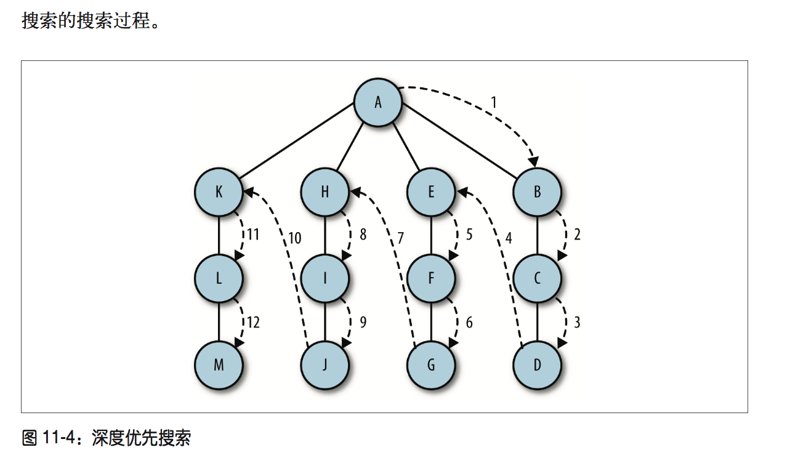
```
  /**
   * 深度优先搜索算法
   * 这里不需要顶点，也就是邻接表的初始点
   */
    this.dfs = (v) {
        this.marked[v] = true;
        for (var w of this.adj[v]) {
            if (!this.marked[w]) {
                this.dfs(w);
            }
        }
    }
```
根据图片和上述的代码,可以看出深度搜索其实可以做很多其他的扩展

### 广度优先搜索
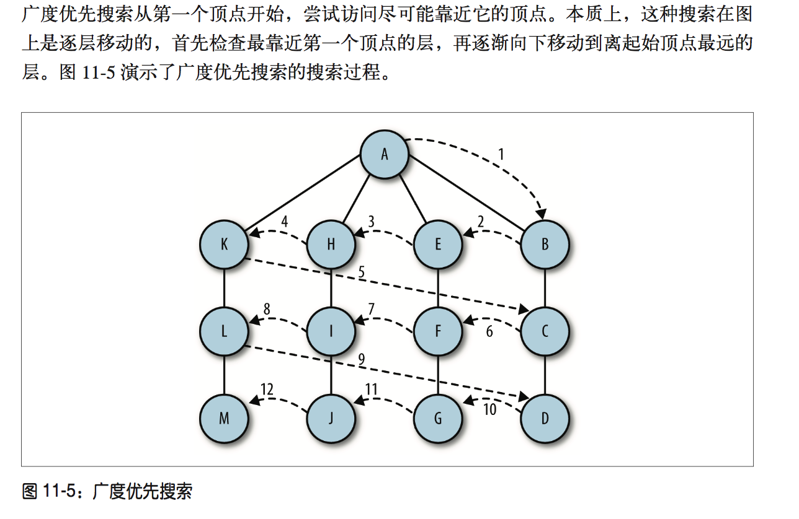
```
  /**
   * 广度优先搜索算法
   * @param  {[type]} s [description]
   */
  this.bfs = function(s) {
    var queue = [];
    this.marked[s] = true;
    queue.push(s); // 添加到队尾
    while (queue.length > 0) {
      var v = queue.shift(); // 从队首移除
      console.log("Visisted vertex: " + v);
      for (var w of this.adj[v]) {
        if (!this.marked[w]) {
          this.edgeTo[w] = v;
          this.marked[w] = true;
          queue.push(w);
        }
      }
    }
  }
```
而如果看了《数据结构与算法JavaScript描述》这本书,有兴趣的可以去实现下`查找最短路径`和`拓扑排序`;

### 两点之间所有路径
这算是找到的比较能理解的方式来计算
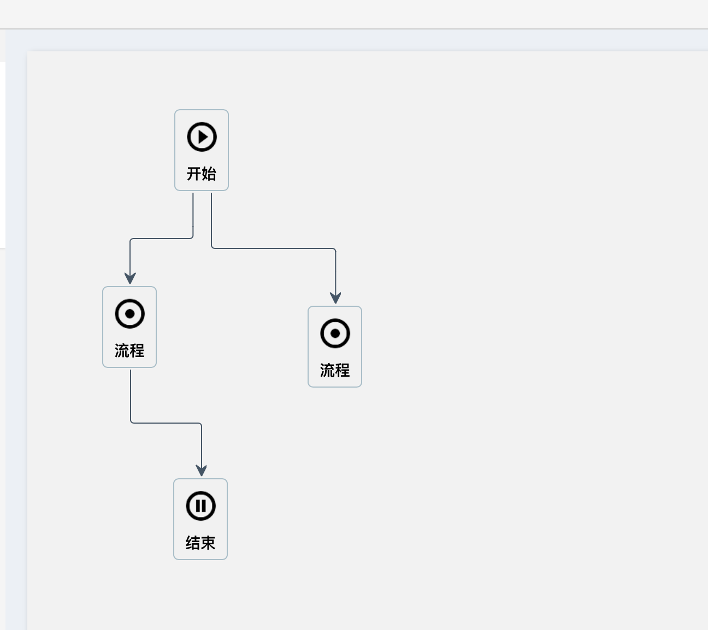
以上图为例,这是一个简单的流程图,可以很简单的看出,右边的流程实际上是未完成的,因为无法到达终点,所以是一个非法点,而通过上面的深度搜索,可以看出,只要对深度优先搜索算法进行一定的修改,那么就可以找到从开始到结束的所有的路径,再通过对比,就可以知道哪些点无法到达终点,从而确定非法点.
上代码:
```
    /**
     * 深度搜索,dfs,解两点之间所有路径
     * @param  {[type]} v [description]
     * @return {[type]}   [description]
     */
    function Graph2(v) {
        var _this = this;

        this.vertices = v; // 总顶点
        this.edges = 0; //图的起始边数
        this.adj = []; //内部邻接表表现形式
        this.marked = []; // 内部顶点访问状态,与邻接表对应
        this.path = []; // 路径表示
        this.lines = []; // 所有路径汇总

        for (var i = 0; i < this.vertices; ++i) {
            _this.adj[i] = [];
        }

        /**
         * 初始化访问状态
         * @return {[type]} [description]
         */
        this.initMarked = function() {
            for (var i = 0; i < _this.vertices; ++i) {
                _this.marked[i] = false;
            }
        };

        /**
         * 在邻接表中增加节点
         * @param {[type]} v [description]
         * @param {[type]} w [description]
         */
        this.addEdge = function(v, w) {
            this.adj[v].push(w);
            this.edges++;
        };

        /**
         * 返回生成的邻接表
         * @return {[type]} [description]
         */
        this.showGraph = function() {
            return this.adj;
        };

        /**
         * 深度搜索算法
         * @param  {[type]} v    [起点]
         * @param  {[type]} d    [终点]
         * @param  {[type]} path [路径]
         * @return {[type]}      [description]
         */
        this.dfs = function(v, d, path) {
            var _this = this;

            this.marked[v] = true;
            path.push(v);

            if (v == d) {
                var arr = [];
                for (var i = 0; i < path.length; i++) {
                    arr.push(path[i]);
                }

                _this.lines.push(arr);
            } else {
                for (var w of this.adj[v]) {
                    if (!this.marked[w]) {
                        this.dfs(w, d, path);
                    }
                }
            }

            path.pop();
            this.marked[v] = false;
        };

        this.verify = function(arr, start, end) {

            this.initMarked();

            for (var i = 0; i < arr.length; i++) {
                _this.addEdge(arr[i].from, arr[i].to);
            }

            this.dfs(start, end, this.path);
            return this.lines;
        };
    }
```
可以看出修改了`addEdge()`函数,将邻接表中的双向记录改为单向记录,可以有效避免下图的错误计算:
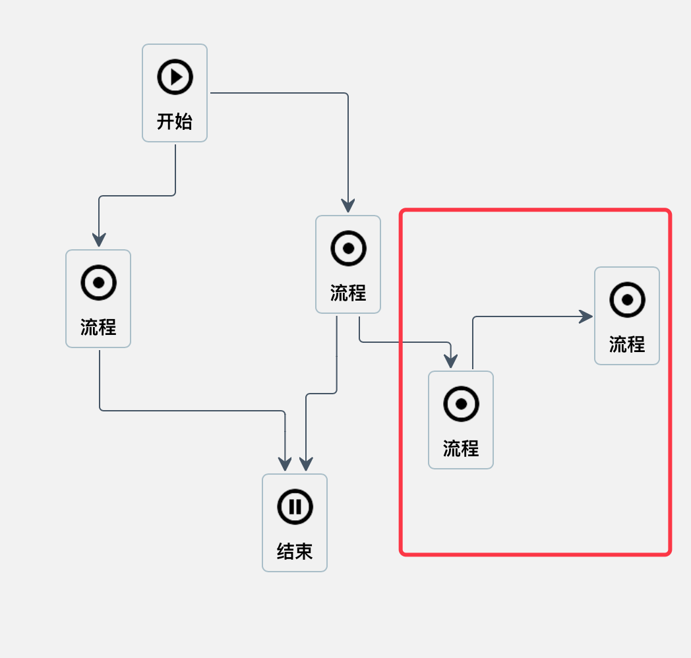
只计算起点到终点的所有连线有时并不客观,如果出现
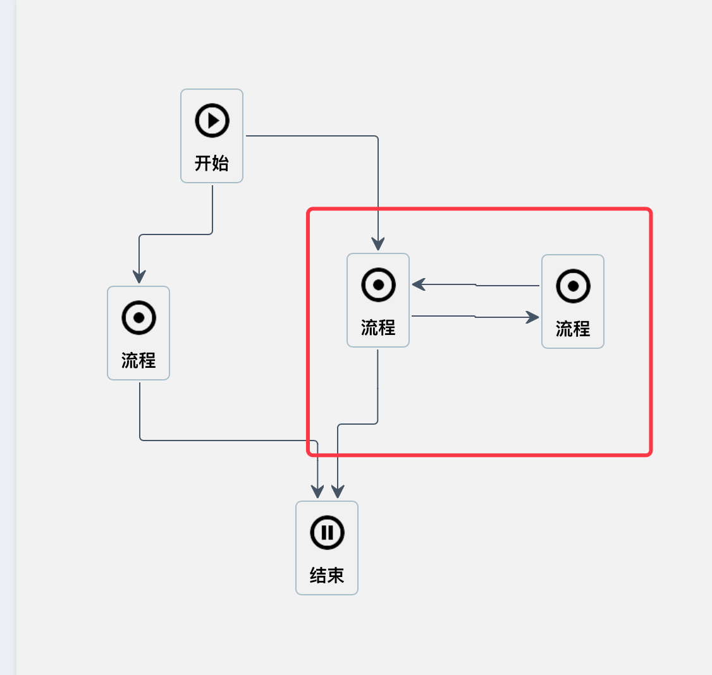
这种情况的话,实际上深度遍历并不能计算出最右边的节点是合法的,那么就需要重新修改起点和终点,来推导是否能够到达终点.从而判定该点是否合法.至于其他的,只是多了个返回值,存储了一下计算出来的所有路径.
而在dfs函数中,当满足能够从起点走到终点的,则记录下当前的path中的值,保存到lines中去,而每一次对于path的推入或者推出,保证了只有满足条件的点,才能被返回;
而`this.marked[v] = false`,则确保了,在每一次重新计算路径时,都会验证每个点是否存在不同的相对于终点能够到达的路径是否存在.
当然,一定会有更加简单的方法,我这里只是稍微修改了下基础的代码!

## redo和undo
这是我觉得最简单却耗时最久的功能,思路都知道:创建一个队列,记录每一次创建一个流程节点,删除一个流程节点,建立一个新的关联关系,删除一个新的关联关系等,都需要记录下来,再通过统一的接口来访问队列,执行操作.
但在具体实现上,jsPlumb的remove确实需要注意一下:
首先,如果需要删除连线,那么使用jsPlumb提供的`detach()`方法,就可以删除连线,注意,传入的数据应该是`connection`对象.
当然,也可以使用`remove()`方法,参数为选择器或者element对象都可以,这个方法删除的是一个节点,包括节点上所有的线.
而jsPlumb中会内部缓存所有的数据,用于刷新,和重连.
那么当我移除一个多层级且内部有连线的情况时,如果只删除最外层的元素,那么内部的连线实际上并没有清除,所以当redo或者移动时,会出现连线的端点有一端会跑到坐标原点,也就是div上(0,0)的地方去.所以清除时,需要注意,要把内部的所有节点依次清除,才不会发生一些莫名其妙的bug.

而在删除和连接连线上,我使用了jsPlumb提供的事件`bind('connection')`和`bind("connectionDetached")`,用于判断一条连线被连接或者删除.而在记录这里的redo和undo事件时,尤其要注意,需要首先确定删除和连接时的连线的类型,否则会产生额外的队列事件.
因此,在使用连接事件时,就可以使用
```
jsPlumb.connect({
    source:"foo",
    target:"bar",
    parameters:{
        "p1":34,
        "p2":new Date(),
        "p3":function() { console.log("i am p3"); }
    }
});
```
来进行类型的传参,这样事件触发时就可以分类处理.
也可以使用`connection.setData()`事件,参数可以指定任意的值,通过`connection.getData()`方法,就可以拿到相应的数据了.
而redo和undo本身确实没有什么东西
```
    var defaults = {
        'name': "mutation",
        'afterAddServe':$.noop,
        'afterUndo':$.noop,
        'afterRedo':$.noop
    }

    var mutation = function(options){
        this.options = $.extend(true,{},defaults,options);

        this.list = [];
        this.index = 0;
    };

    mutation.prototype = {
        addServe:function(undo,redo){
            if(!_.isFunction(undo) || !_.isFunction(redo)) return false;

            // 说明是在有后续操作时,更新了队列
            if(this.canRedo){
                this.splice(this.index+1);
            };
            this.list.push({
                undo:undo,
                redo:redo
            });

            console.log(this.list);

            this.index = this.list.length - 1;

            _.isFunction(this.options.afterAddServe) && this.options.afterAddServe(this.canUndo(),this.canRedo());
        },
        /**
         * 相当于保存之后清空之前的所有保存的操作
         * @return {[type]} [description]
         */
        reset:function(){
            this.list = [];
            this.index = 0;
        },
        /**
         * 当破坏原来队列时,需要对队列进行修改,
         * index开始的所有存储值都没有用了
         * @param  {[type]} index [description]
         * @return {[type]}       [description]
         */
        splice:function(index){
            this.list.splice(index);
        },
        /**
         * 撤销操作
         * @return {[type]} [description]
         */
        undo:function(){
            if(this.canUndo()){
                this.list[this.index].undo();
                this.index--;

                _.isFunction(this.options.afterUndo) && this.options.afterUndo(this.canUndo(),this.canRedo());
            }
        },
        /**
         * 重做操作
         * @return {[type]} [description]
         */
        redo:function(){
            if(this.canRedo()){
                this.index++;
                this.list[this.index].redo();

                _.isFunction(this.options.afterRedo) && this.options.afterRedo(this.canUndo(),this.canRedo());
            }
        },
        canUndo:function(){
            return this.index !== -1;
        },
        canRedo:function(){
            return this.list.length - 1 !== this.index;
        }
    }

    return mutation;
```
每次在使用redo或者undo时,只需要判断当前是否是队列的尾端或者起始端,再确定是否redo或者undo就可以了.
调用时的`undo()`和`redo()`通过传参,将不同的函数封装进队列里,就可以减少耦合度.

## 放大缩小
这里想了想还是记录一下,方法采用了最简单的`mousedown`和`mousemove`,让元素在节流中动态的变化大小,就可以了,
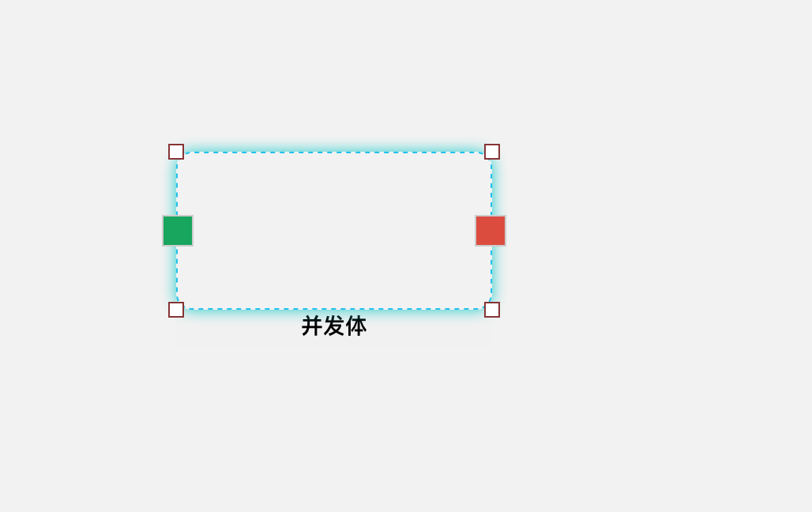
只需要用一个节点,在点击元素时,根据元素的大小来确定该辅助节点四个点的位置,就可以了,只要监听了这四个点的位置,再同步给该定位元素,就能实现这一效果,方法就不贴了,没有太多东西

## 小结
这次的项目我个人还是觉得蛮有意思的,可以学习新的算法,了解新的数据结构,包括设计模式,也代入了其中,进行代码的整合,所用到的中间件模式和发布订阅者模式都让我对于js有了一个新的理解.虽然已经用require来管理模块,但结构仍然存在高度耦合的情况,应该还是被限制住了.
作为离职前的最后一次的项目来说,其实我感觉我的代码能力仍然与年初没有什么太大的改变,也许是时候脱离安逸的环境,重新开始了.
