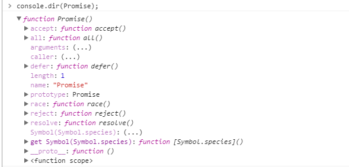

# javaScript的异步编程(重新理解)

> 参考文档：<a href="">Javascript异步编程;作者：阮一峰</a>

***

javaScript是单线程的，这点不用多说；我认为的在单线程语言中所产生的异步，则是通过一系列方式，把原本一个十分耗时的大任务，分割成许多的小任务，再通过合适的语法还有函数，决定是不是继续执行当前任务的接下来的任务，还是可以执行其它任务了，注意：**都是一个一个的小任务在执行，与同步不同的是，这里的任务顺序可能与代码顺序不一致**，这样，就可以比较容易的跳过浏览器失去响应的坑，但在使用过程中，如果不怎么了解深究的原理，那么编写合理的代码（回调地狱），甚至阅读源码都会存在问题。
本文希望可以通过阅读各种文章，撰写各种例子，从最开始的异步编程方式，到最新的es6的promise对象方式，还有jquery3.1.1中包含的deferred方式来详细的，重新理解下异步编程方式。

## 异步编程方式归纳

* setTimeout

    如果说最简单的方式，该延时函数充分说明了异步编程在js中最简单的使用方式，为了确保一个函数是在一个函数的使用过程中被调用，而不是同步的顺序执行着：

```()
//假设f2里的函数要运行至少300毫秒以上
f2();

setTimeout(function(){
  f1()
},300)
```

这种近似同时执行着两种函数（虽然f1在f2之后执行，但不一定比f2后执行完），相对于js的单线程同步，就是一种异步编程的方式，但只是近似，本质上还是单线程的语言。

* 回调函数
    这既是问题的开始解决方法，也是其它问题的根源，我认为一份好的代码就算做不到良好的可理解性(我想多了么),只要可扩展性高，使用方式方便，就是很好的了，如果可读性也十分的高，那更好。不过读代码还是得要基本功和动手。首先上demo:

<a href="http://runjs.cn/detail/2f53f7cf">demo1</a>

```()
//假定有三个函数，f1,f2,f3,按顺序执行；
//现在需求变更，做成异步编程。
f1(f2);
f3();
```

写的略繁琐，其实只有f1(f2)就可以了,我想说明的是在回调函数的使用中，同步执行虽然是本质（f1函数中），但通过回调的方式，可以在一定程度上将f1函数细分，先执行其它函数，再执行耗时的函数。问题也不少，简单的例子可以这么写，一旦f2需要以f1中耗时部分的运行结果来决定是否运行。则需要继续细分，这就会带来可读性的问题。且之后的修改需要考虑到回调部分。

* 事件监听
将处理流程变为f2是否执行，要看f1是否发生了某种事件，从而达到任务的执行不取决于代码的顺序，而是取决是否达到了某种条件。写个例子:

<a href="http://runjs.cn/detail/je0pyrsj">demo2</a>

例子中可以看出，实际上f2函数是否运行，完全看f1绑定的事件有没有达到条件来触发。但这种方法可以看出，一旦事件多个，则运行和管理复杂度就上去了。
使用范围：对象会发生简单的状态变化，或单一事件。

* 监听者模式（发布／订阅）
只要在前端工作一段时间，不可避免的会提到这种模式，这种模式，就是用来解决监听模式中，如果事件变多之后如何管理的问题。这种模式有一个主对象，多个观察者；当主对象产生变化时，观察者们会监听主对象产生的变化，从而去更新。
<a href="http://runjs.cn/detail/bzvn6d0a">demo3.1</a>
<a href="http://runjs.cn/detail/plorqsr3">demo3.2</a>
<a href="http://runjs.cn/detail/hf0mgxvr">demo3.3</a>
从例子中可以看出通过回调，可以将一系列的事件，以一对多的方式，来编写。而使用jquery所带来的on/off，则可以退订匿名函数。
使用范围：对象所发生的变化是不可预期的，会逐渐增加的。

* promise对象
promise对象在es6中已实装，promise：

<a href="http://runjs.cn/detail/rzxb5caf">demo4.1</a>
<a href="http://runjs.cn/detail/boutfjlu">demo4.2</a>
<a href="http://runjs.cn/detail/mhadmcra">demo4.3</a>
<a href="http://runjs.cn/detail/q04gtydh">demo4.4</a>
从demo中我们至少可以知道promise的resolve可以将参数传给其对象的处理函数，类似之前的回调中，把数据传回触发函数。then中的函数能够在runAsync这个异步任务执行完成之后被执行。而reject的作用就是把promise的状态置为rejected,然后在then中可以增加失败之后的回调。promise的all用法则是并行执行多个任务的能力，并在所有异步操作执行完才执行回调，比如很多图片的一起加载。而race方法则是谁先执行完，立刻执行回调，所以then函数里只有执行完的任务的回调。
