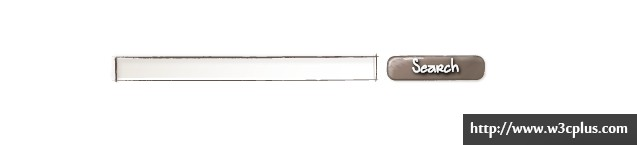
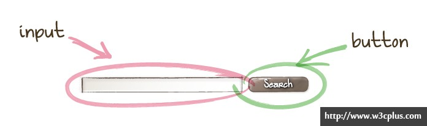
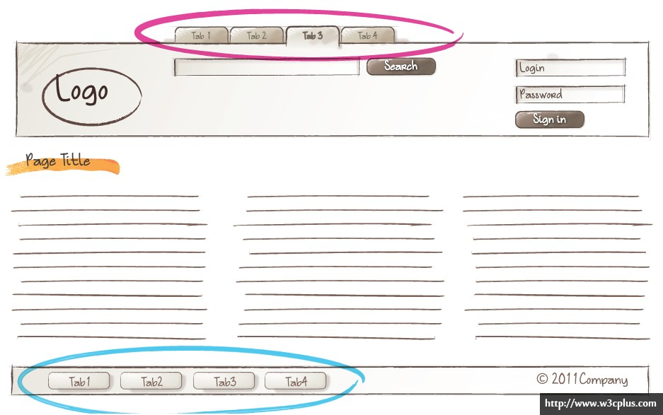
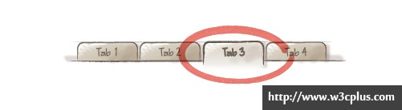

# 序文

> axis-css 是什么?这其实是一种 css 代码命名与开发规范,其引用了 BEM 的思想,通过对页面结构的分析,将页面解耦为一个个可独立使用的组件,从而达到良好的重用与二次开发管理.

<!-- TOC -->

- [序文](#序文)
    - [分类](#分类)
        - [CSS 文件的分类和引用顺序](#css-文件的分类和引用顺序)
        - [CSS 内部的分类及其顺序](#css-内部的分类及其顺序)
    - [命名规则](#命名规则)
        - [使用类选择器，放弃 ID 选择器](#使用类选择器放弃-id-选择器)
        - [特殊字符："-"连字符](#特殊字符-连字符)
        - [特殊字符："\_"连字符](#特殊字符\_连字符)
        - [特殊字符: "--"修饰符](#特殊字符---修饰符)
        - [后代选择器命名](#后代选择器命名)
        - [相同语义的不同类命名](#相同语义的不同类命名)
        - [模块和元件的扩展类的命名方法](#模块和元件的扩展类的命名方法)
        - [防止污染和被污染](#防止污染和被污染)
    - [代码格式](#代码格式)
        - [选择器、属性和值都使用小写](#选择器属性和值都使用小写)
        - [最后一个值也以分号结尾](#最后一个值也以分号结尾)
        - [省略值为 0 时的单位](#省略值为-0-时的单位)
        - [使用单引号](#使用单引号)
        - [使用 16 进制表示颜色值](#使用-16-进制表示颜色值)
        - [根据属性的重要性按顺序书写](#根据属性的重要性按顺序书写)
        - [私有在前，标准在后](#私有在前标准在后)
        - [选择器顺序](#选择器顺序)
        - [统一语义理解和命名](#统一语义理解和命名)
    - [BEM 简介](#bem-简介)
        - [块](#块)
        - [元素](#元素)
        - [装饰及状态](#装饰及状态)
    - [](#)
    - [示例](#示例)

<!-- /TOC -->

## 分类

### CSS 文件的分类和引用顺序

通常，一个项目我们只引用一个 CSS，但是对于较大的项目，我们需要把 CSS 文件进行分类。

我们按照 CSS 的性质和用途，将 CSS 文件分成“公共型样式”、“特殊型样式”、“皮肤型样式”，并以此顺序引用（按需求决定是否添加版本号）。

1.  公共型样式：包括了以下几个部分：“标签的重置和设置默认值”、“统一调用背景图和清除浮动或其他需统一处理的长样式”、“网站通用布局”、“通用模块和其扩展”、“功能类样式”、“皮肤类样式”。
2.  特殊型样式：当某个栏目或页面的样式与网站整体差异较大或者维护率较高时，可以独立引用一个样式：“特殊的布局、模块和元件及扩展”、“特殊的功能、颜色和背景”，也可以是某个大型控件或模块的独立样式。
3.  皮肤型样式：如果产品需要换肤功能，那么我们需要将颜色、背景等抽离出来放在这里。

### CSS 内部的分类及其顺序

1.  重置（reset）和默认（base）（tags）：消除默认样式和浏览器差异，并设置部分标签的初始样式，以减少后面的重复劳动！你可以根据你的网站需求设置！
2.  布局（grid）（.g-）：将页面分割为几个大块，通常有头部、主体、主栏、侧栏、尾部等！
3.  模块（block）（.m-）：通常是一个语义化的可以重复使用的较大的整体！比如导航、登录、注册、各种列表、评论、搜索等！
4.  元素（element）（.m_element）：通常是一个不可再分的较为小巧的个体，通常被重复用于各种模块中,且依赖于模块而存在！比如按钮、输入框、loading、图标等！
5.  状态或装饰（modify）：为状态类样式加入前缀，统一标识，方便识别，她只能组合使用或作为后代出现（.m-list .m-list--vertical），具体详见命名规则的扩展相关项。
6.  功能（function）（.f-）：为方便一些常用样式的使用，我们将这些使用率较高的样式剥离出来，按需使用，通常这些选择器具有固定样式表现，比如清除浮动等！不可滥用！
7.  皮肤（skin）（.s-）：如果你需要把皮肤型的样式抽离出来，通常为文字色、背景色（图）、边框色等，非换肤型网站通常只提取文字色！非换肤型网站不可滥用此类！
8.  原子(.element) : 单一的,无法影响其他类的,甚至无法复用的 css 类,它与元素不同点在于,不需要依赖于模块而可以独立存在,原子类中最好不要控制布局,且最好功能单一

## 命名规则

### 使用类选择器，放弃 ID 选择器

ID 在一个页面中的唯一性导致了如果以 ID 为选择器来写 CSS，就无法重用。

### 特殊字符："-"连字符

"-"在本规范中并不表示连字符的含义。

它只表示两种含义：分类前缀分隔符，详见以下具体规则。

### 特殊字符："\_"连字符

"\_"在本规范中并不表示引用的含义。

它只表示一种含义：模块与元素之间的关联符，详见以下具体规则。

### 特殊字符: "--"修饰符

"--"在本规范中表示修饰符的含义

它只表示模块及元素的装饰或状态

### 后代选择器命名

约定不以单个字母+"-"为前缀且长度大于等于 2 的类选择器为后代选择器.

这里的后代指两个 block 相互嵌套,在不考虑复用时,即可以使用后代选择器,同时,后代选择器的优先级会高于普通的 BEM 选择器,所以需要注意使用方式,最高支持两个 block 元素相互嵌套.

通过使用后代选择器的方法，你不需要考虑他的命名是否已被使用，因为他只在当前模块或元件中生效，同样的样式名可以在不同的模块或元件中重复使用，互不干扰；在多人协作或者分模块协作的时候效果尤为明显！

**注：后代选择器不要在页面布局中使用，因为污染的可能性较大；**

```后代选择器
/* 这里的.itm和.cnt只在.m-list中有效 */
.m-list{margin:0;padding:0;}
.m-list .m-menu_itm{margin:1px;padding:1px;}
.m-list .m-menu_cnt{margin-left:100px;}
/* 这里的.cnt和.num只在.m-page中有效 */
.m-page{height:20px;}
.m-page .m-menu_cnt{text-align:center;}
.m-page .m-menu_num{border:1px solid #ddd;}
```

### 相同语义的不同类命名

方法：直接加数字或字母区分即可（如：.m-list、.m-list2、.m-list3 等，都是列表模块，但是是完全不一样的模块）。

其他举例：.f-fw0、.f-fw1、.s-fc0、.s-fc1、.m-logo2、.m-logo3、m-button1、m-button2 等等。

### 模块和元件的扩展类的命名方法

遵循 BEM 的命名规范,以**block-element\_\_modify**作为扩展方式.

### 防止污染和被污染

当模块或元件之间互相嵌套，且使用了相同的标签选择器或其他后代选择器，那么里面的选择器就会被外面相同的选择器所影响。

所以，如果你的模块或元件可能嵌套或被嵌套于其他模块或元件，那么要慎用标签选择器，必要时采用类选择器，并注意命名方式，可以采用.m-layer .layerxxx、.m-list2 .list2xxx 的形式来降低后代选择器的污染性。

## 代码格式

### 选择器、属性和值都使用小写

在 xhtml 标准中规定了所有标签、属性和值都小写，CSS 也是如此。

### 最后一个值也以分号结尾

通常在大括号结束前的值可以省略分号，但是这样做会对修改、添加和维护工作带来不必要的失误和麻烦。

### 省略值为 0 时的单位

为节省不必要的字节同时也使阅读方便，我们将 0px、0em、0%等值缩写为 0。

```
.m-box{margin:0 10px;background-position:50% 0;}
```

### 使用单引号

省略 url 引用中的引号，其他需要引号的地方使用单引号。

```
.m-box{background:url(bg.png);}
.m-box:after{content:'.';}
```

### 使用 16 进制表示颜色值

除非你需要透明度而使用 rgba，否则都使用#f0f0f0 这样的表示方法，并尽量缩写。

```
.m-box{color:#f00;background:rgba(0,0,0,0.5);}
```

### 根据属性的重要性按顺序书写

只遵循横向顺序即可，先显示定位布局类属性，后盒模型等自身属性，最后是文本类及修饰类属性。

| 显示属性   | 自身属性  | 文本属性和其他修饰 |
| ---------- | --------- | ------------------ |
| display    | width     | font               |
| visibility | height    | text-align         |
| position   | margin    | text-decoration    |
| float      | padding   | vertical-align     |
| clear      | border    | white-space        |
| list-style | overflow  | color              |
| top        | min-width | background         |

### 私有在前，标准在后

先写带有浏览器私有标志的，后写 W3C 标准的。

```
.m-box{-webkit-box-shadow:0 0 0 #000;-moz-box-shadow:0 0 0 #000;box-shadow:0 0 0 #000;}
```

### 选择器顺序

请综合考虑以下顺序依据：

从大到小（以选择器的范围为准）从低到高（以等级上的高低为准）从先到后（以结构上的先后为准）从父到子（以结构上的嵌套为准）以下仅为简单示范：

以下仅为简单示范：

```
/* 从大到小 */
.m-list p{margin:0;padding:0;}
.m-list p.part{margin:1px;padding:1px;}
/* 从低到高 */
.m-logo a{color:#f00;}
.m-logo a:hover{color:#fff;}
/* 从先到后 */
.g-hd{height:60px;}
.g-bd{height:60px;}
.g-ft{height:60px;}
/* 从父到子 */
.m-list{width:300px;}
.m-list .itm{float:left;}
```

### 统一语义理解和命名

布局（.g-）

| 语义       | 命名     | 简写     |
| ---------- | -------- | -------- |
| 文档       | doc      | doc      |
| 头部       | head     | hd       |
| 主体       | body     | bd       |
| 尾部       | foot     | ft       |
| 主栏       | main     | mn       |
| 主栏子容器 | mainc    | mnc      |
| 侧栏       | side     | sd       |
| 侧栏子容器 | sidec    | sdc      |
| 盒容器     | wrap/box | wrap/box |

模块（.m-）

| 语义   | 命名         | 简写  |
| ------ | ------------ | ----- |
| 导航   | nav          | nav   |
| 子导航 | subnav       | snav  |
| 面包屑 | crumb        | crm   |
| 菜单   | menu         | menu  |
| 选项卡 | tab          | tab   |
| 标题区 | head/title   | hd/tt |
| 内容区 | body/content | bd/ct |
| 列表   | list         | lst   |
| 表格   | table        | tb    |
| 表单   | form         | fm    |
| 热点   | hot          | hot   |
| 排行   | top          | top   |
| 登录   | login        | log   |
| 标志   | logo         | logo  |
| 广告   | advertise    | ad    |
| 搜索   | search       | sch   |
| 幻灯   | slide        | sld   |
| 提示   | tips         | tips  |
| 帮助   | help         | help  |
| 新闻   | news         | news  |
| 下载   | download     | dld   |
| 注册   | regist       | reg   |
| 投票   | vote         | vote  |
| 版权   | copyright    | cprt  |
| 结果   | result       | rst   |
| 标题   | title        | tt    |
| 按钮   | button       | btn   |
| 输入   | input        | ipt   |
| 卡片   | card         | cd    |

功能（.f-）

| 语义     | 命名                | 简写 |
| -------- | ------------------- | ---- |
| 浮动清除 | clearboth           | cb   |
| 向左浮动 | floatleft           | fl   |
| 向右浮动 | floatright          | fr   |
| 内联块级 | inlineblock         | ib   |
| 文本居中 | textaligncenter     | tac  |
| 文本居右 | textalignright      | tar  |
| 文本居左 | textalignleft       | tal  |
| 垂直居中 | verticalalignmiddle | vam  |
| 溢出隐藏 | overflowhidden      | oh   |
| 完全消失 | displaynone         | dn   |
| 字体大小 | fontsize            | fs   |
| 字体粗细 | fontweight          | fw   |

皮肤（.s-）

| 语义     | 命名               | 简写 |
| -------- | ------------------ | ---- |
| 字体颜色 | fontcolor          | fc   |
| 背景     | background         | bg   |
| 背景颜色 | backgroundcolor    | bgc  |
| 背景图片 | backgroundimage    | bgi  |
| 背景定位 | backgroundposition | bgp  |
| 边框颜色 | bordercolor        | bdc  |

状态（modify）

| 语义   | 命名     | 简写  |
| ------ | -------- | ----- |
| 选中   | selected | sel   |
| 当前   | current  | crt   |
| 显示   | show     | show  |
| 隐藏   | hide     | hide  |
| 打开   | open     | open  |
| 关闭   | close    | close |
| 出错   | error    | err   |
| 不可用 | disabled | dis   |

## BEM 简介

### 块

一个块是一个独立的实体，就像应用的一块“积木”。一个块既可以是简单的也可以是复合的（包含其他块）。

例如搜索表单块：


### 元素

一个元素是块的一部分，具有某种功能。元素是依赖上下文的：它们只有处于他们应该属于的块的上下文中时才是有意义的。

例如一个输入域和一个按钮是 Search 块的中的元素。



### 装饰及状态

我们经常需要创建一个和已存在的块非常相似的块，只是外观或行为有些许改变。

比如说我们有一个这样的任务：

给 Footer 添加另外一个布局不一样的 Menu。



为了避免开发一个和现有的块只稍微有点不同的另一个块，我们引入修饰符（modifier）的概念。

修饰符作为一个块或是一个元素的一种属性，代表这个块或这个元素在外观或是行为上的改变。

一个修饰符有一个名字和一个值。多个修饰符可以同时使用

例如：一个用来指定背景颜色的块修饰符(m-search--bg1)


例如：一个改变“当前”选项的元素修饰符(m-tab_item--selected)



## 

## 示例

一张设计图:


针对红框的区域,我们可以查看原先的源码:

```
<div class="top_left_1">
    <div class="cbox" frag="面板41">
        <div class="post post1" frag="窗口41">
            <div class="subnav">
                <h3 class="title">
                    <span class="title" frag="标题">
                        <span frag="标题内容">标题41</span>
                    </span>
                </h3>
                <div class="con-more">
                    <div class="more-btn" frag="按钮" type="更多">
                        <span class="more-text" frag="按钮内容">更多>></span>
                    </div>
                </div>
            </div>
            <div class="con">
                <div frag="窗口内容">
                    <ul class="news_list clearfix">
                        <!--[InfoCycleBegin]-->
                        <li class="news n{序号值} clearfix">
                            <div class="news_left1">
                                <div class="new_photo">{缩略图}</div>
                            </div>
                            <div class="news_right1">
                                <div class="news_title">{标题}</div>
                                <div class="news_text">{简介}</div>
                            </div>
                        </li>
                        <!--[InfoCycleEnd]-->
                    </ul>
                </div>
            </div>
        </div>
    </div>
</div>
```

针对于该区域的值,我们应当思考如果想要进行修改需要从何入手,当然,我们可以使用同名class名称直接覆盖,但这样会带来维护及修改的高额成本,且因为语义不明确,在转手他人进行修改时,无法直接指明可复用的样式.

当我们使用规范时:

```
<div class="m-news">
    <div class="m-news_item f-fl">
        <div class="m-news_title">
            <div class="m-news_head f-fl" frag="标题">近期活动</div>
            <div class="m-news_more f-fr">
                <a class="m-news-button" frag="按钮">
                    <span class="f-fs1" frag="按钮内容">更多>></span>
                </a>
            </div>
        </div>
        <div class="m-news_content">
            <ul class="m-list m-list--vertical f-cb_li">
                <!--[InfoCycleBegin]-->
                <li class="m-list_item">
                    <div class="f-fl f-fs1">
                        
                    </div>
                    <div class="m-list_content f-fr">
                        <div class="f-fs1">{标题}</div>
                        <div class="f-fs1">{简介}</div>
                    </div>
                </li>
                <!--[InfoCycleEnd]-->
            </ul>
        </div>
    </div>
</div>
```

可以看出,单从html标签的class类名中,我们就能清晰的知道每一块区域的语义

```
.m-news_more {
    width: 60px;
    height: 20px;
    display: block;
    margin: 8px 0px 0px 0px;
    color: #6f6f6f;
}

.m-news-button {
    width: 44px;
    height: 20px;
    margin: 0px 10px 0px 0px;
    line-height: 20px;
}

.m-list {
    list-style: none;
    padding: 0;
}

.m-list.m-list--horizontal {
}

.m-list--horizontal .m-list_thumbnail {
    width: 155px;
    height: 110px;
    padding: 1px 0px;
}
```

在编写样式的时候,我们遵循BEM的规范,将每一块平铺开来,当需要调整某一块样式时,就能快速对应html文档结构
**demo请查看附件1**