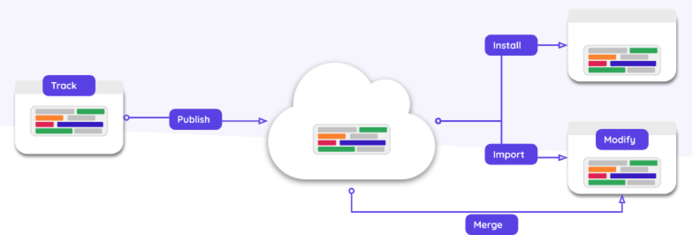
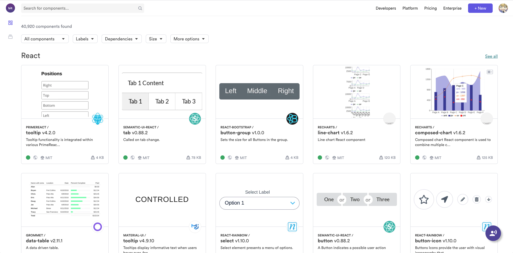

# 正文

> bit的组件管理思想与现在已经存在的组件化思想不太一样,它既不是大库型:类似 Antd、Element等;也不是一次型:完全业务组件,用完一次再也不维护;bit目前国内反响比较平淡,这主要是它的文档以及工作模式对于新人或者大型团队来说还是比较不友好的,但对于中小型规模的团队来说,可以作参考甚至进行试验;本文主要是从市面上已有的博文以及官网文档中吸收灵感,再结合现有的例子,以本机做`bit server`,进行试验;本文是一篇试验日志;

## bit 是什么

我认为bit是代码开发过程中的文件模块管理器;

为什么这么说?

npm就是包管理器,大家也知道迄今为止发在npm源里的包已经非常非常多了,那为什么不继续去使用它呢?

首先,发布在npm中的包要求还是比较高的,需要有对应的webpack配置文件,Babel,TypeScript,Sass/Less,甚至单元测试,代码规范,Readme.md文档等;因为要保证这个组件包可以用在多种环境,那市面上也有封装好的组件开发脚手架啊(比如umi提供的umi-build),为什么不使用呢?

那就要说明一下bit的思想以及不同点;

### bit的思想

bit维护了组件包以及模块之间的关联关系,可以按照入口文件以及`import`,`require`等语法进行分析,从现有的库中直接提取组件以及相关联的的模块代码;但这不意味着 `CV` ,可以仔细思考以下

以下是官网提出的特点:

主要特点：

* 从现有的库或项目中提取要直接共享的组件。
* 通过与项目的其余部分分开构建和测试每个组件，验证组件的独立性。
* 从任何使用共享组件的应用程序中更改其源代码。
* 在本地修改的基础上获取组件中已发布的更改。
* 直接从使用应用程序中回馈对组件所做的更改。
* 自动将每个组件包装为npm软件包。
* 分发离散的组件，而不是单个大型软件包。
* 根据组件依赖性的变化自动进行组件版本控制。
* 与领先的框架和工具一起使用：React，Vue，Angular，Mocha，Jest。
* 与Git，NPM和Yarn一起使用。

也就是说它和`npm`或者`yarn`不太一致,更像git;

### 适用的场景

这里进行举例,分析在哪些场景下bit会有价值:

#### 直接组件复用

一般情况下都是如果两个项目同时会用到一个业务组件,比如一个封装了特性功能的`select`,这时候之前的最简单的使用方式是 `Ctrl C & Ctrl V`,而且还需要确认是否有关联其他代码,如果有,还需要进行导出,而使用bit就将这一过程变成了

```()
// A项目
$ bit init //bit初始化

$ bit add XXX // 增加一个组件的暂存版本
$ bit tag XXX 1.0.0 or bit tag XXX // 创建该组件的锁定版本,并打上相关的版本号,如果没有输入版本号,则默认PATCH+1
$ bit export XXX // 导出该组件到远程服务器上

// B项目

$ bit init
$ bit import XXX

// 源码进行导入使用即可
```

#### 定制修改

也就是如果B项目现在不仅仅满足于组件原本的功能,比如要在`select`中开启搜索,之前不管是用`npm`或者是 `CV`,碰到这种,都需要去修改源码;

而使用了bit之后:

```()
// B项目,开始对组件进行修改
$ bit import XXX
// 修改之后
$ bit add XXX
$ bit tag
$ bit export

// A项目,组件更新时
$ bit import avatar --merge
```

也就是如官网所示的:



这里也可以思考一下,为啥连命令都和`git`基本一致,除了`import`和`export`;

#### 大型库改造,升级与拆分

这种情况下社区还是有很多方案的,比如说 `lerna`;


也可以对比下bit的命令行,bit还是比较简洁一点的;

还有区别在于bit不需要再次处理组件之间的依赖,而 `lerna` 需要手动处理,且目录结构是有强要求的;

### 关键是依赖分析

这里就不过多描述了,感兴趣的可以去看看babel的处理,这里其实本质都是一样的,(词法+语法分析);

### 组件规范改造

为什么需要改造?

这里就是上面所说的依赖分析了,为了让bit在依赖分析的时候不会出错,组件还是得要做好出口收敛以及相对纯净的,如果涉及到工具函数引用,可以把工具函数也当做包导出,再引入使用;

### bit.dev

这是官方在线上的资源仓库



可以对比下与npm的不同,当然,之所以bit可以有预览效果是因为有配置,且需要编写入口例子;

这里确实会增强组件的可读性以及增加可维护性;相比干巴巴的文字,图像的意义会大很多.

当然,社区版本是不提供这些功能的,只有一个 `bit cli` ,可以使用.

而搭私服的意义也在于此,可以自己选择要做到什么地步;

## 后记

目前 web 项目中模块耦合度较高,没办法直接进行拆分,这里也涉及到工作量的问题.后面考虑先做业务模块的解耦吧,要不到处都是一团乱麻.
