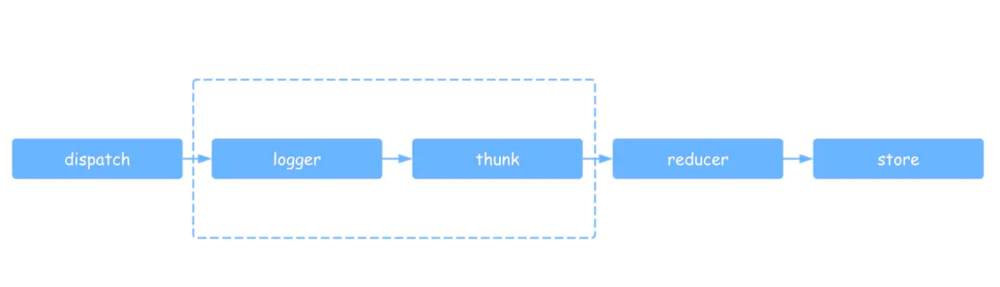

# 正文

## redux

React有props和state:

props意味着父级分发下来的属性
state意味着组件内部可以自行管理的状态，并且整个React没有数据向上回溯的能力，这就是react的单向数据流

这就意味着如果是一个数据状态非常复杂的应用，更多的时候发现React根本无法让两个组件互相交流，使用对方的数据，react的通过层级传递数据的这种方法是非常难受的，这个时候，迫切需要一个机制，把所有的state集中到组件顶部，能够灵活的将所有state各取所需的分发给所有的组件，是的，这就是redux

既然我们要存取状态，那么肯定要有getter和setter，此外当状态发生改变时，我们得进行广播，通知组件状态发生了变更。这不就和redux的三个API：getState、dispatch、subscribe对应上了吗。我们用几句代码勾勒出store的大致形状：

### react-redux

connect接收mapStateToProps、mapDispatchToProps两个方法，然后返回一个高阶函数，这个高阶函数接收一个组件，返回一个高阶组件（其实就是给传入的组件增加一些属性和功能）connect根据传入的map，将state和dispatch(action)挂载子组件的props上，我们直接放出connect的实现代码，寥寥几行，并不复杂：

```()
export function connect(mapStateToProps, mapDispatchToProps) {
    return function(Component) {
        class Connect extends React.Component {
            componentDidMount() {
                //从context获取store并订阅更新
                this.context.store.subscribe(this.handleStoreChange.bind(this));
            }
            handleStoreChange() {
                // 触发更新
                // 触发的方法有多种,这里为了简洁起见,直接forceUpdate强制更新,读者也可以通过setState来触发子组件更新
                this.forceUpdate()
            }
            render() {
                return (
                    <Component
                        // 传入该组件的props,需要由connect这个高阶组件原样传回原组件
                        { ...this.props }
                        // 根据mapStateToProps把state挂到this.props上
                        { ...mapStateToProps(this.context.store.getState()) }
                        // 根据mapDispatchToProps把dispatch(action)挂到this.props上
                        { ...mapDispatchToProps(this.context.store.dispatch) }
                    />
                )
            }
        }
        //接收context的固定写法
        Connect.contextTypes = {
            store: PropTypes.object
        }
        return Connect
    }
}
```

### 如何实现每个中间件串联执行

_dispatch = compose.apply(undefined, chain)，使用了一个compose函数，调用之后就可以将所有中间件串联起来，那么compose又是如何实现的呢？

```()
function compose() {
  for (var _len = arguments.length, funcs = Array(_len), _key = 0; _key < _len; _key++) {
    funcs[_key] = arguments[_key];
  }

  if (funcs.length === 0) {
    return function (arg) {
      return arg;
    };
  }

  if (funcs.length === 1) {
    return funcs[0];
  }

  return funcs.reduce(function (a, b) {
    return function () {
      return a(b.apply(undefined, arguments));
    };
  });
}
```

其实 compose 函数做的事就是把 var a = fn1(fn2(fn3(fn4(x)))) 这种嵌套的调用方式改成 var a = compose(fn1,fn2,fn3,fn4)(x) 的方式调用。
redux 的 compose 实现很简洁，用了数组的 reduce 方法

### redux Middleware实现

所谓中间件，我们可以理解为拦截器，用于对某些过程进行拦截和处理，且中间件之间能够串联使用。在redux中，我们中间件拦截的是dispatch提交到reducer这个过程，从而增强dispatch的功能。



#### 模块化

```()
// 打印日志中间件
function patchStoreToAddLogging(store) {
    let next = store.dispatch    //此处也可以写成匿名函数
    store.dispatch = function dispatchAndLog(action) {
        let result = next(action)
        console.log('next state', store.getState())()
        return result
    }
}  

// 监控错误中间件
function patchStoreToAddCrashReporting(store) {
    //这里取到的dispatch已经是被上一个中间件包装过的dispatch, 从而实现中间件串联
    let next = store.dispatch
    store.dispatch = function dispatchAndReportErrors(action) {
        try {
            return next(action)
        } catch (err) {
            console.error('捕获一个异常!', err)
            throw err
        }
    }
}
```

通过在方法内获取上一个中间件包装过的store.dispatch实现链式调用。然后我们就能通过调用这些中间件方法，分别使用、组合这些中间件。

#### applyMiddleware

改造一下中间件，使其返回新的dispatch而不是替换原dispatch

```()
function logger(store) {
    let next = store.dispatch

    // 我们之前的做法(在方法内直接替换dispatch):
    // store.dispatch = function dispatchAndLog(action) {
    //         ...
    // }
  
    return function dispatchAndLog(action) {
        let result = next(action)
        console.log('next state', store.getState())
        return result;
    }
}
```
