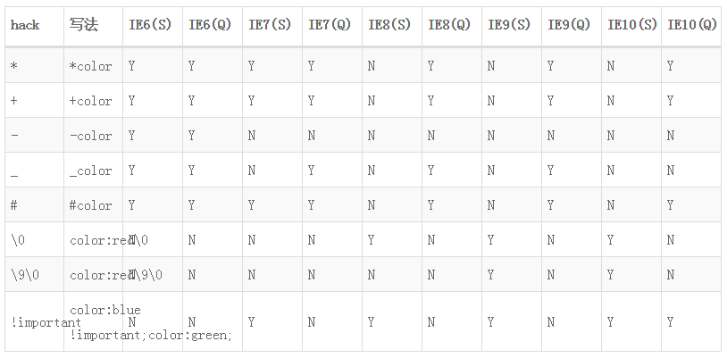

# 知识点汇总

<!-- TOC -->

- [知识点汇总](#知识点汇总)
    - [HTML5新特性，语义化](#html5新特性语义化)
        - [DTD](#dtd)
        - [SGML,HTML,XML](#sgmlhtmlxml)
        - [DOC类型](#doc类型)
        - [HTML5 与之前的版本区别](#html5-与之前的版本区别)
        - [HTML5与HTML4.01之间的差异](#html5与html401之间的差异)
        - [HTML5 新特性](#html5-新特性)
        - [HTML的语义化](#html的语义化)
    - [浏览器的标准模式和怪异模式](#浏览器的标准模式和怪异模式)
        - [浏览器模式](#浏览器模式)
        - [文档模式](#文档模式)
        - [兼容模式](#兼容模式)
        - [js的严格模式](#js的严格模式)
    - [使用data-*的好处](#使用data-的好处)
    - [meta标签](#meta标签)
        - [meta viewport原理](#meta-viewport原理)
    - [HTML5废弃的元素](#html5废弃的元素)
        - [表现性元素](#表现性元素)
        - [框架类元素](#框架类元素)
        - [属性值](#属性值)
    - [浏览器内核](#浏览器内核)
    - [浏览器兼容写法](#浏览器兼容写法)
        - [CSS hack和filter原理](#css-hack和filter原理)
        - [IE条件注释](#ie条件注释)
        - [!important 关键字](#important-关键字)
        - [属性过滤器（较为常用的hack方法）](#属性过滤器较为常用的hack方法)
        - [更多hack写法](#更多hack写法)
    - [CSS兼容方案](#css兼容方案)
        - [a标签css顺序](#a标签css顺序)
        - [24位的png图片](#24位的png图片)
        - [透明度](#透明度)
        - [IE6双边距](#ie6双边距)
    - [js兼容](#js兼容)
    - [css js放置位置和原因](#css-js放置位置和原因)
    - [渐进式渲染](#渐进式渲染)
    - [html模板语言](#html模板语言)
    - [离线存储](#离线存储)

<!-- /TOC -->

## HTML5新特性，语义化

### DTD

Document type Definition指为了程序间的数据交换而建立的关于标识符的一套语法规则

### SGML,HTML,XML

* SGML 即Standard Globalized Markup Language 是用来定义标准的标记语言，简单的说，就是定义文档的元语言。
* HTML 是基于SGML的超链接语言，可以用于创建Web页面。在DTD内部定义了标签的规则，DTD就是使用SGML 语言创建的。
* XML 是从SGML 衍生而来的，它主要处理互联网方面的需求，HTML 有很多限制，XML 是SGML 的子集，可用于表示数据。

### DOC类型

创建HTML页面时:

```
<!DOCTYPE HTML PUBLIC "-//W3C//DTD HTML 4.01//EN" "http://www.w3.org/TR/html4/strict.dtd">
```

这句代码简单的介绍了HTML 版本号，有了Doctype，就引入了对应的DTD（定义了HTML文档的组织结构），在页面中添加的所有标签才会是合法的，简单的说DTD 就是定义HTML的语法规则。
即使在没有引入DTD的情况下，很多浏览器也可以识别HTML元素，因为它们自身包含对HTML 元素的定义，这就是为什么很多开发人员没有感受到DTD 的存在。

### HTML5 与之前的版本区别

HTML5不是基于SGML 语言的，因此不需要DTD ，它是一种全新的标记语言，有自己的解析规则，HTML5的语法规则与之前版本有很大的差别，可以称的上是一种全新的语言。
HTML5 的Doctype 非常简单：

```
<!DOCTYPE html>
```

### HTML5与HTML4.01之间的差异

在 HTML 4.01 中有三种 <!DOCTYPE> 声明。在 HTML5 中只有一种：

* HTML 4.01 Strict 该 DTD 包含所有 HTML 元素和属性，但不包括展示性的和弃用的元素（比如 font）。不允许框架集（Framesets）。
* HTML 4.01 Transitional,该 DTD 包含所有 HTML 元素和属性，包括展示性的和弃用的元素（比如 font）。不允许框架集（Framesets）。
* HTML 4.01 Frameset,该 DTD 等同于 HTML 4.01 Transitional，但允许框架集内容。

### HTML5 新特性

1. 理解新的页面结构语义
HTML 旧版本并没有标准的文档定义规则，比如如何定义文档Header或Footer等，很多人都在使用div来修饰一些CSS ，常常会导致不一致性。
HTML5 定义标准tag如Header,Footer,nav,FlipCaption等。这些标签可使得标记语言更有意义。
注意： 这些标签不提供特殊的渲染功能，仅仅使的HTML 文档结构更具有意义。

2. 新的输入属性
之前为了获得不同的UI元素，如DatePicker,range Picker,color Picker等，会使用不同的类库。
HTML5 为输入元素引入了新属性“type”，看以下示例：
```
<input type="number" name="MyNuberElement" id="MyNumberElement" />
<input type="range" name="MyRangeElement" id="MyRangeElement"/>
<input type="color" id="MyColorElement" name="MyColorElement" />
<input type="date" id="MyDateElement" name="MyDateElement" />
<input type="time" id="MyTimeElement" name="MyTimeElement"/>

placeholder

HTML5的表单验证属性
```

3. Audio,video等多媒体支持

4. drag,drop,geolocation,本地存储localStorage,web worker

### HTML的语义化

（1）HTML语义化让页面的内容结构化，结构更清晰，便于对浏览器、搜索引擎解析；
（2）即使在没有样式CSS的情况下也能以一种文档格式显示，并且是容易阅读的；
（3）搜索引擎的爬虫也依赖于HTML标记来确定上下文和各个关键字的权重，有利于SEO；
（4）使阅读源代码的人更容易将网站分块，便于阅读、维护和理解。

## 浏览器的标准模式和怪异模式

所谓的标准模式是指，浏览器按W3C标准解析执行代码；怪异模式则是使用浏览器自己的方式解析执行代码，因为不同浏览器解析执行的方式不一样，所以我们称之为怪异模式。浏览器解析时到底使用标准模式还是怪异模式，与你网页中的DTD声明直接相关，DTD声明定义了标准文档的类型（标准模式解析）文档类型，会使浏览器使用相应的方式加载网页并显示，忽略DTD声明,将使网页进入怪异模式(quirks mode)。

如果你的网页代码不含有任何声明，那么浏览器就会采用怪异模式解析，便是如果你的网页代码含有DTD声明，浏览器就会按你所声明的标准解析。

标准模式中IE6不认识!important声明，IE7、IE8、Firefox、Chrome等浏览器认识；而在怪异模式中，IE6/7/8都不认识!important声明，这只是区别的一种，还有很多其它区别。所以，要想写出跨浏览器CSS，你最好采用标准模式。

document对象有个属性compatMode,它有两个值:

* BackCompat    对应quirks mode
* CSS1Compat    对应strict mode

最大的异同点是对于盒模型中内容的width和height的计算方式不同

### 浏览器模式

IE11改名为“用户代理字符串”。就是用来设置navigator.userAgent和navigator.appVersion.

它唯一需要注意的是，在不同的IE版本中，它与文档模式的关系可不相同。

IE89中，倘若浏览器模式被设置为Internet Explorer7，那么文档模式的只能设置为7,6,5；

IE11中，用户代理字符串设置和文档模式可谓是没有半毛钱关系。

### 文档模式

文档模式用于设置浏览器的渲染模式和对应的JS引擎特性.

对于以Webkit、Molliza等作为内核的浏览器来说，DOM树的解析、渲染，JS的API等主要与内核版本挂钩；而对于IE浏览器而言，这些从IE6开始就跟文档模式挂钩了。

1. 怪异模式
IE6789的是IE5.5的文档模式，IE10+和Chrome等浏览器是W3C规范的怪异模式。

2. 标准模式 (非怪异模式)
W3C标准的文档模式，但各浏览器的实现阶段不尽相同。

3. 准标准模式 (有限怪异模式)
由于该模式离W3C标准仍然有一段距离，因此被称作准标准模式（或有限怪异模式）。IE6、7的标准模式实际上就是准标准模式，而IE8+才有实质上的标准模式

### 兼容模式

在兼容模式中，页面以宽松的向后兼容的方式显示，模拟老式浏览器的行为以防止站点无法工作。当DTD没有定义时,即开启兼容也称混杂模式.

### js的严格模式

ECMASript5最早引入了"严格模式",通过严格模式,可以在函数内部选择进行较为严格的全局或局部的错误条件检测.使用严格模式的好处就是可以提早知道代码中存在的错误.为未来的规范定义做铺垫.

将"use strict"放在脚本文件的第一行，则整个脚本都将以"严格模式"运行。

将"use strict"放在函数体的第一行，则整个函数以"严格模式"运行。

## 使用data-*的好处

data-* 属性用于存储私有页面后应用的自定义数据。
data-* 属性可以在所有的 HTML 元素中嵌入数据。
自定义的数据可以让页面拥有更好的交互体验（不需要使用 Ajax 或去服务端查询数据）。
通过HTML5的规范之后,可以根据element的dataset属性,直接获取数据.

data-* 属性是 HTML5 新增的。

## meta标签

`<meta>` 元素可提供有关页面的元信息（meta-information），比如针对搜索引擎和更新频度的描述和关键词。
`<meta>` 标签位于文档的头部，不包含任何内容。`<meta>` 标签的属性定义了与文档相关联的名称/值对。

meta标签根据属性的不同，可分为两大部分：http-equiv 和 name 属性。

* http-equiv：相当于http的文件头作用，它可以向浏览器传回一些有用的信息，以帮助浏览器正确地显示网页内容。
* name属性：主要用于描述网页，与之对应的属性值为content，content中的内容主要是便于浏览器，搜索引擎等机器人识别，等等。

常用的有viewport,charset,lang;

viewport content 参数：

* width viewport 宽度(数值/device-width)
* height viewport 高度(数值/device-height)
* initial-scale 初始缩放比例
* maximum-scale 最大缩放比例
* minimum-scale 最小缩放比例
* user-scalable 是否允许用户缩放(yes/no)

### meta viewport原理

桌面上视口宽度等于浏览器宽度，但在手机上有所不同。

1. 布局视口
手机上为了容纳为桌面浏览器设计的网站，默认布局视口宽度远大于屏幕宽度，为了让用户看到网站全貌，它会缩小网站

2. 视觉视口
屏幕的可视区域，即物理像素尺寸

3. 理想视口
当网站是为手机准备的时候使用。通过meta来声明。早期iPhone理想视口为320x480px

所以，在没有缩放的情况下，屏幕的CSS像素宽度其实是指理想视口的宽度，而meta标签：

```
<meta name="viewport" content="width=device-width,minimum-scale=1.0,maximum-scale=1.0,user-scalable=no"/>
```

指定了布局视口=理想视口，并且禁止缩放。所以添上width=device-width的 viewport meta后页面变大了（一开始页面内容小得看不清），实际上是布局视口变小了。


## HTML5废弃的元素

### 表现性元素

* basefont
* big
* center
* font
* s
* strike
* tt
* u

### 框架类元素

* frame
* frameset
* noframes

### 属性值

* align
* body标签上的link、vlink、alink、text属性
* bgcolor
* height和width
* iframe元素上的scrolling属性
* valign
* hspace和vspace
* table标签上的cellpadding、cellspacing和border属性
* header标签上的profile属性
* 链接标签a上的target属性
* img和iframe元素的longdesc属性

## 浏览器内核

Trident(ie内核);

Gecko(Firefox内核);

Webkit(chrome内核,safari内核);

Blink(chrome新内核);

## 浏览器兼容写法

### CSS hack和filter原理

利用浏览器自身的bug来实现特定浏览器的样式
利用浏览器对CSS的完善度来实现，例如某些CSS规则或语法的支持程度，原理类似目前我们经常使用的 -webkit-　之类的属性；

### IE条件注释

IE的条件注释仅仅针对IE浏览器，对其他浏览器无效；例如下面的语法：

```
<!-- [if IE]>
  		//你想要执行的代码
<![endif]-->
<!-- [if lt IE 8]>
  			//你想要执行的代码
<![endif]-->
<!-- [if ! IE 8]>
  		//你想要执行的代码
<![endif]-->
```

### !important 关键字

!important 在css中是声明拥有最高优先级，也就是说，不管css的其他优先级，只要!important出现，他的优先级就最高！遨游1.6及更低版本、IE6及更低版本浏览器不能识别它。尽管这个!important 很实用，但是非到必要的时刻，不要使用它！

### 属性过滤器（较为常用的hack方法）

针对不同的IE浏览器，可以使用不同的字符来让特定的版本的IE浏览器进行样式控制。

字符 | 例子 | 说明
---------|----------|---------
 _ | _color:red | ie6识别
 * | *color:red | ie6/7可以识别
 \9 | color:red\9 | ie8以下可以识别

### 更多hack写法



## CSS兼容方案

### a标签css顺序

link -> visited -> hover -> active

### 24位的png图片

IE6不支持透明咋办？使用png透明图片呗，但是需要注意的是24位的PNG图片在IE6是不支持的，解决方案有两种：

* 使用8位的PNG图片
* 为IE6准备一套特殊的图片

### 透明度

```
opacity: 0.8; //通用
filter: alpha(opacity=80); //IE
filter:progid:DXImageTransform.Microsoft.Alpha(style=0,opacity=80); //IE6的写法
```

### IE6双边距

行内属性设置了块级属性（display: block;）后，会产生双倍边距。
解决方案是在添加一个 display: inline; 或者 display: table;

## js兼容

ie监听方法:attachEvent()和detachEvent();

普通监听方法:addEventListener()和removeEventListener();

## css js放置位置和原因

浏览器本身是多线程的:

* javascript引擎线程
* 界面渲染线程
* 浏览器事件触发线程
* Http请求线程

而JS运行在浏览器中，是单线程的，每个浏览器页面就是一个JS线程。

当我们在浏览器的地址栏里输入一个url地址，访问一个新页面时候，页面展示的快慢就是由一个单线程所控制，这个线程叫做UI线程，UI线程会根据页面里资源（资源是html文件、图片、css等）书写的先后顺序，它会按照资源的类型发起http请求来获取资源，当http请求处理完毕也就意味着资源加载结束。

但是碰到javascript文件则不同，它的加载过程被分为两步，第一步和加载css文件和图片一样，就是执行一个http请求下载外部的js文件，但是javascript完成http操作后并不意味操作完毕，UI线程就会通知javascript引擎线程来执行它，如果javascript代码执行时间过长，那么用户就会明显感觉到页面的延迟。

为什么浏览器不能把javascript代码的加载过程拆分为下载和执行两个并行的过程，这样就可以充分利用时间完成http请求，这样不是就能提升页面的加载效率了吗？答案当然是否定的。

因为javascript是一个图灵完备的编程语言，js代码是有智力的，它除了可以完成逻辑性的工作，还可以通过操作页面元素来改变页面的UI渲染，如果我们忽略javascript对网页UI界面渲染的影响，让它下载和运行是分开的（也可以理解为js代码可以延迟执行），结果会造成页面展示的混乱，或多次重绘。很显然，这样的做法是不合适的，因此，js脚本的下载和执行必须是一个完整的操作，是不能被割裂的。

## 渐进式渲染

对渲染进行分割 从具体的使用的场景, 不同的 Level 实际上对应不同的页面内容.

论坛是一个比较清晰的例子, 想象一个论坛:
网页的静态部分

* HTML 固定的内容, 比如导航栏和底部
* 页面首屏的内容, 比如一个论坛的话题
* 页面首屏看不到的内容, 比如话题下面多少回复
* 切换路由才会显示的页面, 比如导航的另一个页面

对于这样的情况, 显然有若干种可行的渲染分割的方案

全在客户端渲染

1, 2, 3 在服务端渲染, 4 等到用户点击从浏览器抓
1, 2 在服务器渲染, 评论由客户端加载
只有 1 在服务端渲染, 动态的数据全部由客户端抓取.
而这些方案对于服务端来说, 性能的开销各不相同, 形成一个梯度,
而最后一种情况, 服务端预编译页面就好了, 几乎没有渲染负担.
根据实际的场景, 可以有更多 Level 可以设计.. 只是没这么简单罢了.

## html模板语言

通过重新定义html片段规则,解析之后,生成可被浏览器所识别的html片段,就是html模板语言.

## 离线存储

在线情况下，浏览器发现html头部有manifest属性，它会请求manifest文件，如果是第一次访问app，那么浏览器就会根据manifest文件的内容下载相应的资源并且进行离线存储。如果已经访问过app并且资源已经离线存储了，那么浏览器就会使用离线的资源加载页面，然后浏览器会对比新的manifest文件与旧的manifest文件，如果文件没有发生改变，就不做任何操作，如果文件改变了，那么就会重新下载文件中的资源并进行离线存储。
离线情况下，浏览器就直接使用离线存储的资源。

1. oncached:当离线资源存储完成之后触发这个事件，这个是文档的说法，我在Chrome上面测试的时候并没有触发这个事件。

2. onchecking:当浏览器对离线存储资源进行更新检查的时候会触发这个事件

3. ondownloading:当浏览器开始下载离线资源的时候会触发这个事件

4. onprogress:当浏览器在下载每一个资源的时候会触发这个事件，每下载一个资源就会触发一次。

5. onupdateready:当浏览器对离线资源更新完成之后会触发这个事件

6. onnoupdate:当浏览器检查更新之后发现没有资源更新的时候触发这个事件