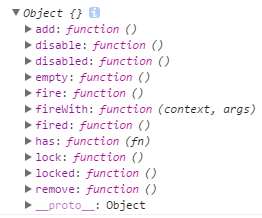
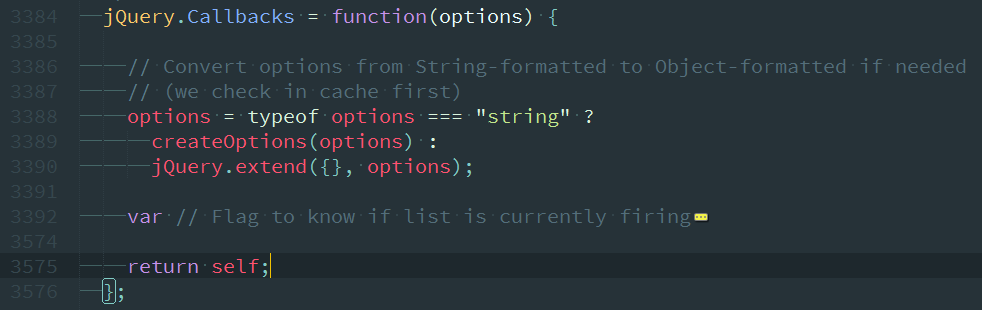
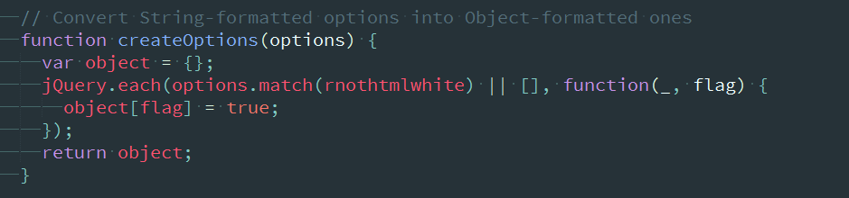
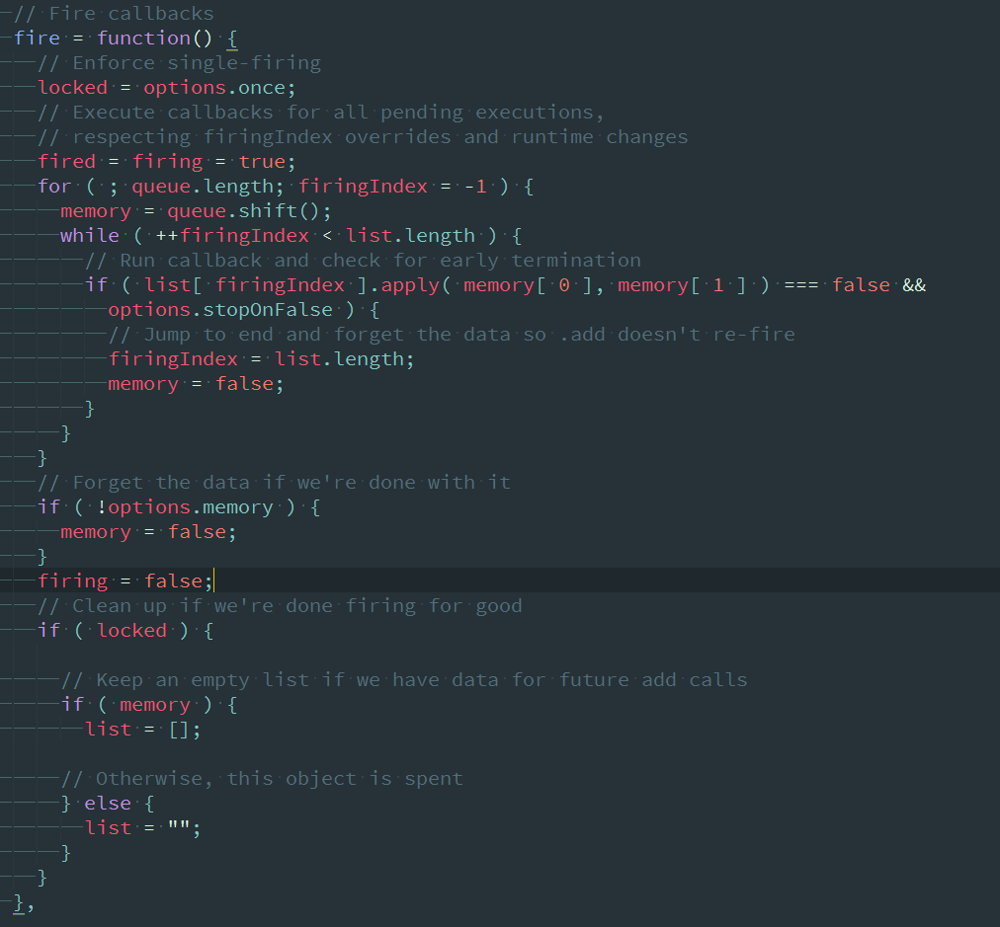

# jQuery与zepto的callbacks

> 一个多用途的回调列表对象，提供了强大的的方式来管理回调函数列表。
$.Callbacks()的内部提供了jQuery的$.ajax() 和 $.Deferred() 基本功能组件。它可以用来作为类似基础定义的新组件的功能。
$.Callbacks() 支持的方法，包括 callbacks.add(),callbacks.remove(), callbacks.fire() and callbacks.disable().

# jQuery.Callbacks——demo
还是先从全局开始看，`jQuery.Callbacks`函数有一个可选参数，参数的结构为用空格标记分割的标志可选列表，用来改变回调列表中的行为（比如$(Callbacks('unique stopOnFalse'))）,可用的flags：
* once：确保这个回调列表只执行一次（像一个递延Deferred）
* memory：保持以前的值和将添加到这个列表的后面的最新的值立即执行调用任何回调（像一个递延Deferred）
* unique：确保一次只能添加一个回调
* stopOnFalse：当一个回调返回false时中断调用
而默认情况下，回调列表将像事件的回调列表中可以多次触发。callbacks类似栈，每次使用fire时，从一开始先加入回调列表的开始执行

**$.Callbacks('once')**
```
var callbacks = $.Callbacks("once");
callbacks.add(fn1);
callbacks.fire("foo");
callbacks.add(fn2);
callbacks.fire("bar");
callbacks.remove(fn2);
callbacks.fire("foobar");
// foo(只执行了第一行的fire)
```

**$.Callbacks('memory')**
```
var callbacks = $.Callbacks("memory");
callbacks.add(fn1);
callbacks.fire("foo");
callbacks.add(fn2);
callbacks.fire("bar");
callbacks.remove(fn2);
callbacks.fire("foobar");
// foo
// fn2 says:foo
// bar
// fn2 says:foo
// foobar
```

**$.Callbacks('unique')**
```
var callbacks = $.Callbacks('unique');
callbacks.add(fn1);
callbacks.fire("foo");
callbacks.add(fn1);
callbacks.add(fn2);
callbacks.fire("bar");
callbacks.remove(fn2);
callbacks.fire("foobar");
// foo
// bar
// fn2 says:bar
// foobar
```

**$.Callbacks('stopOnFalse')**
```
function fn1( value ){
  console.log( value );
  return false;
}

function fn2( value ){
  fn1("fn2 says:" + value);
  return false;
}

var callbacks = $.Callbacks( "stopOnFalse");
callbacks.add( fn1 );
callbacks.fire( "foo" );
callbacks.add( fn2 );
callbacks.fire( "bar" );
callbacks.remove( fn2 );
callbacks.fire( "foobar" );
// foo
// bar
// foobar
```

也可以传入用空格分割的可选列表值
**$.Callbacks('unique memory')**
```
function fn1( value ){
    console.log( value );
    return false;
}

function fn2( value ){
    fn1("fn2 says:" + value);
    return false;
}

var callbacks = $.Callbacks( "unique memory stopOnFalse" );
callbacks.add( fn1 );
callbacks.fire( "foo" );
callbacks.add( fn1 ); // repeat addition
callbacks.add( fn2 );
callbacks.fire( "bar" );
callbacks.add( fn2 );
callbacks.fire( "baz" );
callbacks.remove( fn2 );
callbacks.fire( "foobar" );
// foo
// bar
// baz
// foobar
```
以上的例子基本上都能在jQueryAPI文档里找到，无需赘述。

# jQuery.Callbacks详解
首先打印一下，可以看到返回了一个object：

可以用上面的例子来测试这些方法。

可以看到，源码里该对象主要是个函数，会返回self对象，而传入的options参数（string）则会被`createOptions()`所处理

返回一个处理过的对象。
Callbacks中内置了一个fire函数，用于执行回调列表，

其中`list[firingIndex].apply(memory[0],memory[1])`执行回调。

# demo
比如
