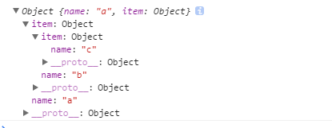

# jquery和zepto的扩展方法extend

> 总结下jQuery(3.1.1)和zepto(1.1.6)到底是如何来开放接口，使之可以进行扩展，两者都会有类型判断，本文使用简单的类型判断，暂不考虑兼容。

## 类型判断
```
var class2type = {},toString = class2type.toString,$={};
//判断类型
function type(obj) {
  return obj == null ? String(obj) : class2type[toString.call(obj)] || "object"
}
//对象
function isObject(obj) {
  return type(obj) == "object"
}
//字面量对象
function isPlainObject(obj) {
  return isObject(obj) && !isWindow(obj) && Object.getPrototypeOf(obj) == Object.prototype
}
function isArray(arr){
  return Array.isArray(arr) || arr instanceof Array
}
```

## zepto.extend

zepto中的扩展，我们可以看到，首先是定义了一个extend函数，这个在内部使用的函数有三个参数**target,source,deep**。target是将被扩展的对象，source是扩展的对象，deep代表是否深度扩展。那么就直接看第三个参数了。
我们可以看到，在extend函数中，即使使用了深度扩展，也会通过递归函数来重新扩展，最后都会是`targte[key]=source[key]`,而区别是：
```
//test1
var test1 = {
  name:"a",
  item:{
    name:"b",
    nickname:"c"
  }
};

//简单扩展
extend(test1,{name:"a",item:{name:"b",item:{name:"c"}}});
console.log(test1);
```


可以看到，在没有使用deep时，会直接扩展对象的第一层属性，并直接覆盖。但如果使用了deep：
```
//深度扩展
extend(test1,{name:"a",item:{name:"b",item:{name:"c"}}},true);
console.log(test1);
```


现在扩展对象时就不会修改原对象中不对应的值。
然后是**$.extend**,这个是可以在外部使用的扩展函数，直接在$对象上定义的，zepto的插件扩展可以不需要通过$.extend扩展到zepto对象里，因为zepto的`dom.__proto__ = $.fn,zepto.Z.prototype = $.fn`，且返回的是**$**。所以我们可以看见在zepto其他的模块里，给zepto添加动态方法时，是这样直接扩展的:

回到**$.extend**函数，这里在内部使用arguments,所以该函数是不限参数的，如果想深度扩展，只需要把首个参数设为true。首先是简单扩展的：
```
var test2 = $.extend(test1,{name:"a",item:{name:"b",item:{name:"c"}}},{name:"d"});
console.log(test2);
```


深度扩展：
```
var test2 = $.extend(true,test1,{name:"a",item:{name:"b",item:{name:"c"}}},{name:"d",item:{name:"e"}});
console.log(test2);
```


## jQuery.extend 和jQuery.fn.extend

看jQuery的扩展，得益jQuery返回的是一个真实的jQuery对象，其内部使用**jQuery.fn**来划分了作用域，所以扩展上，因为this的不同，如果扩展jQuery对象，extend是直接扩展在jQuery本身上的，而fn.extend是扩展在jQuery.prototype原型对象上。而实现函数其实是一样的。

在jQuery中使用扩展时，如果除了第一个参数的boolean值之外，参数的长度等于内部定义的长度，都会扩展到jQuery自身，而zepto想要扩展到自身，可以将zepto对象设为第一个参数

jQuery在循环里加入了`if ((options = arguments[i]) != null)`所以当给null或undefined赋值时，直接返回扩展对象，而且因为上面的arguments长度判断，不会扩展到jQuery上去。而zepto则直接报错`target[key] = source[key]`。
zepto:


jQuery:


jQuery中的extend语法与上面的zepto相同，在zepto里，最后对如果没有**__proto__**做了兼容：


在jQuery中$.extend()与$.fn.extend()是不同也相同的，在上面的源码里我们也看到了，`jQuery.extend = jQuery.fn.extend`,只是因为两个函数的this值指向不同，所以能够使用的场景也不同，可以大致分为动态和静态。在使用jQuery的过程中，jQuery的最外层匿名函数里会执行，返回一个jQuery对象，并与$一起绑在window上，所以引入文件之后已经存在，而动态指的是jQuery.fn.init(selector,context);所以需要先初始化再使用相应方法。

## 小结
这里将一些琐碎的知识点归纳了一下，事实上，zepto的扩展与jQuery的扩展在使用的方法上看起来一样，但jQuery更细。了解两者的区别能够在需要兼容zepto和jQuery时不会犯未知错误，也对扩展插件有更好的帮助。本文使用demo（有源码注释）：<a href="http://sandbox.runjs.cn/show/2pebtxsq">jQuery与zepto的extend</a>
