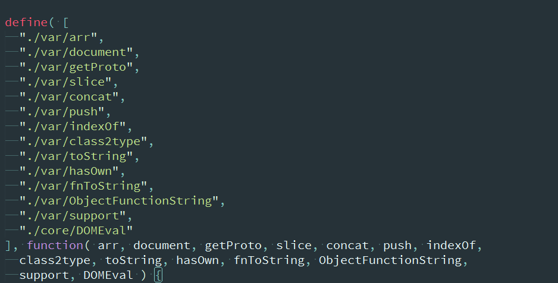
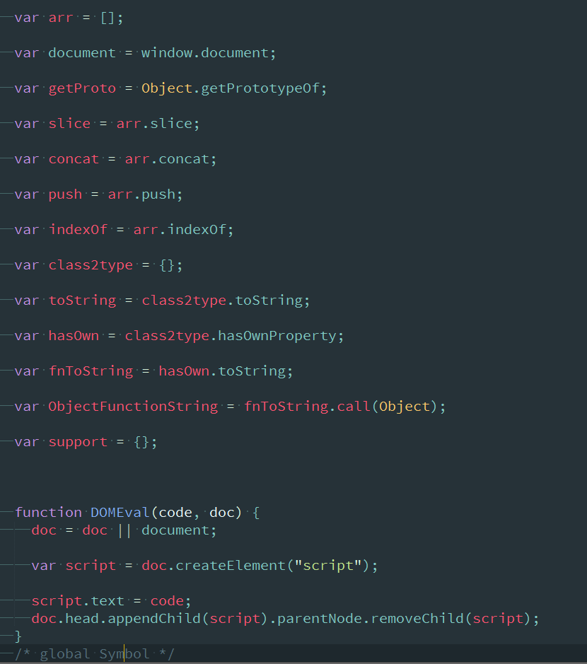

## 正文
首先，在core模块，也就是jquery的核心层里，先是AMD的加载模块，载入jquery对象中使用的全局变量

载入页面之后就是

其中的**DOMEval**模块，参数是code，用于载入外部脚本，并会自动移除节点。
然后就是
```
jQuery = function( selector, context ) {
  return new jQuery.fn.init( selector, context );
}
```
里面放入了init这个初始函数，看init.js,一共115line，

然后就是extend，分为两种，jQuery.extend是静态方法，在jQuery还未实例化的时候就可以使用，而jQuery.fn.extend则是将方法放入原型链中，两种方法说不上好坏，不过要是可以在扩展时加入不可扩展的判定，可能会更好，不过这个想法很业务。明天分析下zepto，然后写个总和的博文看看。
