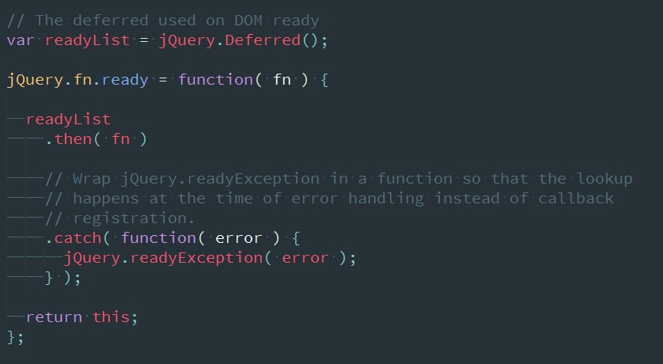
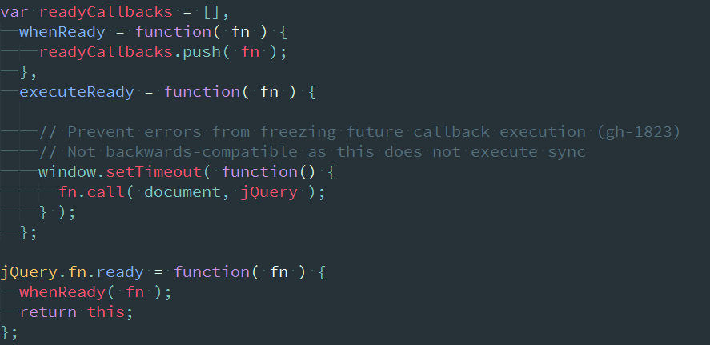

# ready重写

> jQuery的init方法中，如果选择符是个函数，则会先初始化页面，再开始调用，本质是回调。在事件模块中是最重要的一个函数，而jQuery3.1.1也给出了两个版本，分别是不用deferred和使用deferred来实现的。

# 两种ready方法的区别
通过对比我们也可以发现，两者其实本质上仍然是一样的，不同在于，如果使用deferred模块，则不需要再自己建设队列来用。
之前对于deferred的学习，会知道其应该是一个回调队列，而no-deferred版本里重新建立了一个队列：

可以看出，扩展到原型链上的ready方法，都得等ready处理函数完成之后，再顺序执行传入的函数。
在主要的ready方法里，一个是用deferred的resolveWith发布事件，一个是执行了whenReady函数来产生回调事件。
