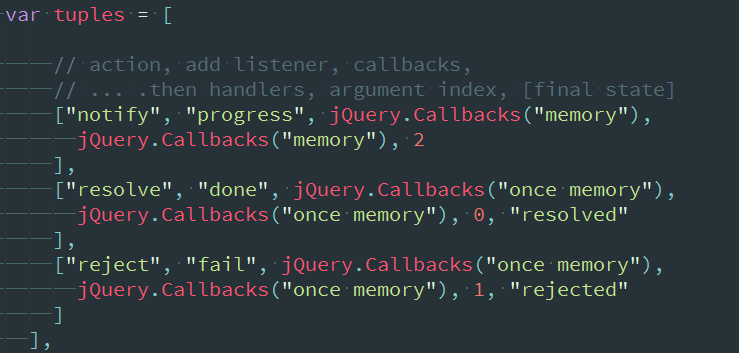

# deferred详解

> deferred对象与callbacks密不可分，而callbacks也是从deferred中分离出去的

# api以及使用
首先从deferred公共的接口来看：
* jQuery.Deferred:一个构造函数，返回一个链式实用对象方法来注册多个回调，回调队列，调用回调队列，并转达任何同步或异步函数的成功或失败状态。
* deferred.always():当Deferred（延迟）对象解决或拒绝时，调用添加处理程序
* deferred.done():当Deferred（延时）对象解决时，调用添加处理程序
* deferred.fail():当Deferred（延时）对象拒绝时，调用添加处理程序
* *deferred.isRejected():1.7已禁用*
* *deferred.isResolved():1.7已禁用*
* deferred.notify():根据给定的args参数调用Deferred（延迟）对象上进行中的回调
* deferred.notifyWith():根据给定的上下文（context）和args递延调用Deferred（延迟）对象上进行中的回调（progressCallbacks）
* *deferred.pipe():1.8开始，使用then()代替它*
* deferred.progress():当Deferred对象生成进度通知时，调用添加处理程序
* deferred.reject():拒绝Deferred对象，并根据给定的args参数调用任何失败回调函数
* deferred.rejectWith():拒绝Deferred对象，并根据给定的context和args参数调用任何失败回调函数
* deferred.resolve():解决Deferred对象，并根据给定的args参数调用任何完成回调函数
* deferred.resolveWith():解决Deferred对象，并根据给定的context和args参数调用任何完成回调函数
* deferred.state():确定一个Deferred对象的当前状态
* deferred.then():当Deferred对象解决，拒绝或仍在进行中时，调用添加处理程序
* deferred.catch():当回调中出现错误时，会跳到此处
* jQuery.when():提供一种方法来执行一个或多个对象的回调函数，Deferred对象通畅表示异步事件。
* .promise():返回一个Promise对象用来观察当某种类型的所有行动绑定到集合，排队与否还是已经完成

举例子：
```
function Defer(){
  var defer = $.Deferred();
  setTimeout(function(){
    var num = Math.ceil(Math.random()*10);
    if(num<=5){
      defer.resolve(num)
    }else{
      defer.reject('数字大于5');
    }
  },1000);
  return defer;
}

Defer().then(function(value){
  console.log("输出"+value);
},function(value){
  console.error(value);
})
```
将resolve当成ajax的success，将reject当成ajax的error，那么我们就可以发现，如果有一个延时操作，则通过then的处理，我们可以顺序的执行*success*或*error*，参数刚好是Defer()中使用**resolve**和**reject**来传递的。
稍微改一下
```
Defer().done(function(){
  console.log("输出"+value);
}).fail(function(){
  console.error(value);
})
```
可以发现，与上面其实是一样的，而使用notify则是：
```
function Defer(){
  var defer = $.Deferred();
  var num = Math.ceil(Math.random()*10);
  defer.notify(defer.state());
  setTimeout(function(){
    if(num<=5){
      defer.resolve(num)
    }else{
      defer.reject('数字大于5');
    }
  },1000);
  return defer;
}

Defer().progress(function(state){
  console.debug(state);
}).done(function(value){
  console.debug(value);
}).fail(function(value){
  console.error(value);
}).done(function(value){
  console.debug(value);
});
```
也因此，在看到源码时

就可以知道，tuples创建了三个**$.Callbacks**对象，分别表示处理中，成功，失败。
