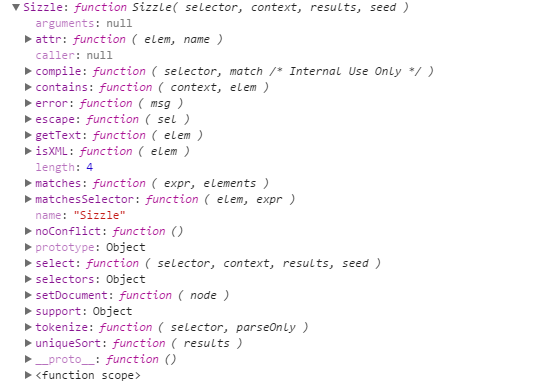

# Sizzle详解

# 正文
首先我们知道，新的规范里（ES5）中已经有了dom的扩展，而主要的扩展就是SelectorsAPI于HTML5，在这之前。jQuery就针对不同浏览器开始通过CSS选择符查询DOM文档取得元素的引用，SelectorsAPI Level1的核心是：querySelector() and querySelectorAll()。支持SelectorsAPI Level 1的浏览器有IE8+,Firefox3.5+,Chrome和Opera10+。而Selectors API Level 2为Elment类型新增了一个方法matchesSelector(),该方法接收一个参数，即CSS选择符，如果调用元素与该选择符匹配，返回true；否则返回false.

# sizzle（2.3.3）
sizzle是可单独使用的，先看下大概是什么：

然后再看官方的API：

可以看到公共的API会有三种使用形式:
* Sizzle(String selector[,DOMNode context[,Array results]])
使用querySelectorAll(如果可用)，返回数组或类数组的对象。
* Sizzle.matchesSelector(DOMElement element,String selector)
使用matchesSelector,传入element和css选择符。返回boolean类型的值，
* Sizzle.matches(String selector,Array<DOMElement> elements)
元素过滤器，返回给定的选择器匹配的元素数组

可以看到在源码中，后面的两种方法其实用的都是Sizzle的方法。
Sizzle具体分析看注释好的源码。
然后是高效选择器的优化

1. 多用ID选择器，总是从#id选择器来继承
**特征性**：在选择器的右边尽可能使用“tag.class”类型的选择符，在选择器的左边直接使用标签选择符或类选择符
```
//优化前
$("div.data .gonzalez");
//优化后
$(".data td.gonzalez");
```
**避免过度约束**：减轻层级
**一个会被在多处地方成功匹配的选择器可能会消耗更多的性能**
2. 少直接使用Class选择器
在class前面使用tag，可以用到getElementByTagName().
jQuery中的class选择器在IE中会遍历所有的DOM节点。尽量避免使用class选择器，也不要用tag来修饰ID。不要用ID来修饰ID
3. 多用父子关系，少用嵌套关系
4. 缓存jQuery对象
也就是先存储jQuery对象，再使用它来处理问题。
