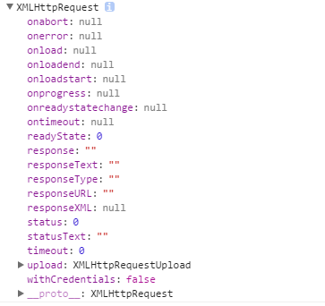
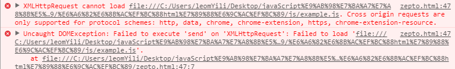
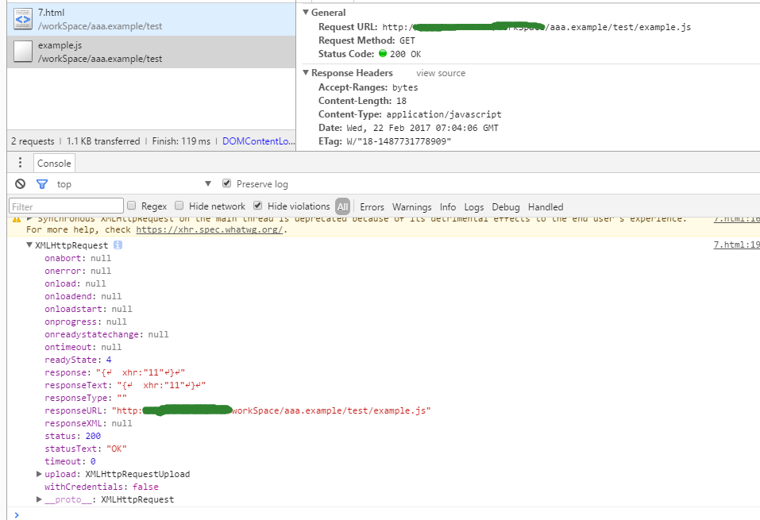
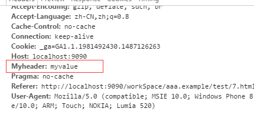
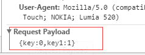
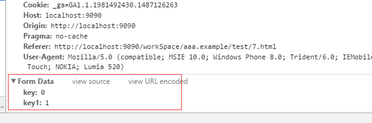

# 正文

> 学习JavaScript就不得不提到Ajax，从2005年开始，Ajax技术就开始席卷整个Web世界。作为一个前端来说，大部分时间中都是使用的库中封装好的ajax模块(jQuery),即使已使用到滚瓜烂熟，也不一定就能说明白，Ajax到底是什么，它是怎么实现的，所以这几章作为开年来的复习篇章，将之前的阅读笔记进行整合。

# XMLHttpRequest对象
将Ajax具象化，可以看出其就是无需刷新页面而可以从服务器端取得数据的一种技术，所以微软率先引入了*XMLHttpRequest*。在IE7+以及现代浏览器中都可以直接获取该对象。

从中我们可以看到，自`readyState`上面都是静态函数。而readyState表示了请求的状态:
* value=0,open()方法还未被调用
* value=1,send()方法还未被调用
* value=2,send()方法已经被调用，响应头和响应状态已经返回
* value=3,响应体下载中，responseText中已经获取了部分数据
* value=4,请求完成，整个请求过程已经完毕。
其它的属性可以从<a href="https://developer.mozilla.org/zh-CN/docs/Web/API/XMLHttpRequest">MDN</a>中了解。

## open()和send()
作为客户端来说，首先需要建立请求：
```
xhr.open("get","example.json",false,"","");
// example.json的内容
// {xhr:"11"}
```
特意将所有参数都补全了，`open()`方法中一共有五个参数，分别是
* method:请求所使用的HTTP方法，例如"GET","POST"
* url:该请求索要访问的URL
* async:一个可选的布尔值参数，默认为true，意味着是否执行异步操作，如果值为false，则send()方法不会返回任何东西，直到接受到了服务器的返回数据
* user:用户名，可选参数，默认参数为空
* password:密码，可选参数，默认参数为空

可对照上面介绍的`readyState`,会发现其值已变为1了。

然后发送请求:
```
xhr.send("test");
```
这里的`send()`中，唯一的参数代表着作为请求主体发送的数据，如果不需要通过请求主体发送数据，则必须传入null。

现在我们就得到了第一次请求的结果了，

可以看到`XMLHttpRequest`报错了，一共两条，对应`open()`和`send()`，因为open中的url所填写的是本地文件的路径，在chrome中并不支持通过xhr对象直接访问本地资源，而在火狐中，可以得到正确的请求完成结果：

因为火狐浏览器支持直接访问本地资源，所以接下来的操作可以在火狐中或者配置一个本地的服务器环境就可以看到`send()`之后的结果了。当然，这里的报错请求也是需要做处理的，但先来把整个流程跑完，再开始这一部分的修改。


当修改之后，我们可以看到错误信息没有了，在成功之后，xhr的`readyState`变为了4，同时，我们可以看到，xhr中的其他属性值也发生了变化，`response`和`responseText`的值正好是我们放在*example.json*中的数据。记下属性简介：
* responseText:作为响应主体被返回的文本
* responseXML:如果响应的内容类型是"text/xml"或"application/xml",这个属性将保存包含响应数据的XML DOM文档
* status:响应的HTTP状态
* statusText:HTTP状态的说明

因为当`XMLHttpRequest`抛出异常时（比如说上面的请求本地文件），`readyState`仍然会为4，所以这时候，检查status就很有必要了。
```
var xhr = new XMLHttpRequest(),el = document.getElementById("write");

try{
  xhr.open("get","example.json",true);
  xhr.send(null);
}catch(err){
  console.log(err);
}

el.innerHTML= "当前HTTP状态为:"+xhr.status+";内容为"+xhr.responseText;
if( (xhr.status >= 200 && xhr.status < 300) || xhr.status == 304 ){
  alert("请求成功");
}else{
  alert("请求失败");
}
```
`status`就是HTTP状态码，通常1字头代表着消息，2字头代表着成功，3字头代表重定向中，4字头代表请求错误，5（6）字头代表服务器错误。像404和503就是经常出错的代表字符。
而`readyState`有`onreadystatechange()`方法，来监听它的变化，所以上述可改为
```
xhr.onreadystatechange = function() {
  if( (xhr.status >= 200 && xhr.status < 300) || xhr.status == 304 ){
    alert("请求成功");
  }else{
    alert("请求失败");
  }
};
try{
  xhr.open("get","example.json",true);
  xhr.send(null);
}catch(err){
  console.log(err);
}
```
在open之前指定`onreadystatechange`可以确保跨浏览器兼容性。
另外，在接收到响应之前还可以调用abort()方法来取消异步请求。
```
try{
  xhr.open("get","example.json",true);
  xhr.abort();
  xhr.send(null);
}catch(err){
  console.log(err);
}
```

## HTTP头部信息
每个HTTP请求和响应都会带有相应的头部信息，默认情况下，在发送XHR请求的同时，还会发送下列头部信息：
* Accept:浏览器能够处理的内容类型
* Accept-Charset:浏览器能够显示的字符集
* Accept-Encoding:浏览器能够处理的压缩编码
* Accept-Language:浏览器当前设置的语言
* Connetcion:浏览器与服务器之间连接的类型
* Cookie:当前页面设置的任何Cookie
* Host:发出请求的页面所在的域
* Referer:发出请求的页面的URL
* User-Agent:浏览器的用户代理字符串
使用`setRequestHeader()`可以设置自定义的请求头部信息。这个方法接受两个参数:头部字段的名称和头部字段的值：
```
xhr.open("get","example.json",true);
xhr.setRequestHeader("Myheader","myvalue");
xhr.send(null);
```


当然，如果调用XHR对象的`getResponseHeader(key)`之后，就能取得对应key的响应头部信息，而`getAllResponseHeaders()`方法则可以取得一个包含所有头部信息的长字符串。

request header是请求头部，而response header是响应头部，xhr中没有getRequestHeader()方法，也没有setResponseHeader方法，说明了请求和响应的分离与统一，对于详细的头部信息说明，有兴趣的可以看下<a href="https://www.w3.org/Protocols/rfc2616/rfc2616-sec14.html">w3c提供的Header Field Definitions</a>

## GET，POST
这是我们日常开发所最高频次使用的请求类型，两者都是与服务器端做通信时，用于查询信息或存储信息，实质与定义有关，与使用无关；首先是GET：
```
xhr.open("get","example.json?value=1",true);
```
这里可以看出，get方式实质上是接在url*?*之后的字符串，当然，最好进行编码`encodeURLComponent()`，以确保查询字符串格式良好，可以有效预防乱码问题。

然后是POST:
```
xhr.open("post","example.json",true);
xhr.send("{key:0,key1=1}");
```


可以看到，两者的传递信息的方式并不相同，相比较而言，使用post方式可以不限格式的提交数据，而get受限于url的格式问题。
url长度理论上没有长度限制，但因为各种浏览器所支持的url长度不同，特别是老版本的ie，限制是2083字节，而post因为走的header部分，且在form时，可以与表单数据一起提交，所以数据量取决于服务器的处理能力。至于安全问题么，只能说在现在这个时代里，客户端所发出来的东西都需要经过层层校验来确认安全性，而get和post与之没有太多的关系。
模拟form表单提交:

```
xhr.open("post","example.json",true);
xhr.setRequestHeader("Content-Type","application/x-www-form-urlencoded");
xhr.send("key=0&key1=1}");
```


# XMLHttpRequest 2级

## FormData
作为表单而言，序列化是使用很频繁的，jQuery里也有相应的函数实现（serialize()）,而如果使用*FormData*：
```
xhr.open("post","example.json",true);
var form = document.getElementById("user-info");
xhr.send(new FormData(form));
```
就可以不必明确的在XHR对象上设置请求头部。

## 超时设定
*timeout*表示请求在等待响应多少毫秒之后就会终止。在给timeout设置一个数值后，如果在规定的时间内浏览器还没有收到响应，那么就会触发timeout事件，进而会调用`ontimeout()`回调。

## overrideMimeType()
该方法用于重写XHR响应的MIME类型。在重写服务器返回的MIME类型上比较有用，可以指定返回的MIME类型进行处理，需要放在`send()`之前。

# 跨域
通常情况下，如果直接访问与包含XHR对象的页面不同域的资源时，是无法访问的，但是，有时又需要与外部域的资源进行交互，所以，`CORS(Cross-Origin Resource Sharing,跨域资源共享)`就可以解决这个问题。其就是使用自定义的HTTP头部让浏览器与服务器进行沟通，从而决定请求或响应是否成功。更详细的内容可以去看下大神的博客<a href="http://www.ruanyifeng.com/blog/2016/04/cors.html">跨域资源共享 CORS 详解(阮一峰)</a>
因为整个CORS过程其实是浏览器能够自动的对于跨域的请求附加头信息，所以，只要服务器实现了CORS接口，那么，就已经可以进行跨域。然后主要看下从客户端可以直接请求跨域的资源的方法

## 图像Ping
作为``来说，平常自然会与它频繁的打交道，而``可以从任何地址中获取图像信息，所以，可以通过这种方式，再加上Image对象的`onload()`和`onerror()`方法，单向的向服务器发送请求：
```
var img = new Image();
img.onload = img.onerror = function(){
  console.debug("ok");
}
img.src = "http://url?params=1";
```
这样就可以发送简单的GET请求，但问题也很明显，拿不到服务器返回的响应文本，而且只能发送GET请求。

## JSONP
作为使用频次非常高的一种方式，其一般的表现形式都是：
```
callback({"name":"test"})
```
由回调函数和数据组成，其中的数据就是`callback()`的参数，那么就可以知道，如果我们将请求当成`<script>`标签的url时，就可以在请求完成之后，直接运行这个回调函数了，首先来个例子，单纯的通过`<script>`获取数据。
```
function jsonp1(response){
  console.debug(response);
}

var script = document.createElement("script");
script.src = "http://url?callback=jsonp1";

document.body.insertBefore(script,document.body.firstChild);
```
当载入页面时，因为插入之后立即执行了`jsonp1()`,所以就可以拿到response的值了，也就是服务器返回的数据。但是要确认jsonp请求是否失败并不容易，当归纳到zepto和jQuery时再详细的介绍这一方法。

# 小结
本文归纳了之前在工作和学习中一小部分的笔记，并且通过阅读书籍《JavaScript高级程序设计》,将AJAX初步介绍了下，之后的zepto和jQuery的AJAX部分才算是实际应用部分，更新只能在有空的时间了，开年确实时间宝贵啊。
