# 正文

> 之前归纳了ajax技术的基础知识,汗颜的是这两篇本应该在年初补上的,但因为种种原因,并没有补上.不过还好最近有空,所以开始整理之前的日记.共分为两篇:对于zepto ajax代码的实现解析;对于jQuery ajax代码的实现解析;

# 变量定义
关于基础部分的知识,有兴趣的可以查看<a href="http://www.cnblogs.com/leomYili/p/6472327.html">Ajax的实现及使用-原生对象</a>.
这里整理的是自己在阅读zepto的ajax实现源码时的一些感悟.

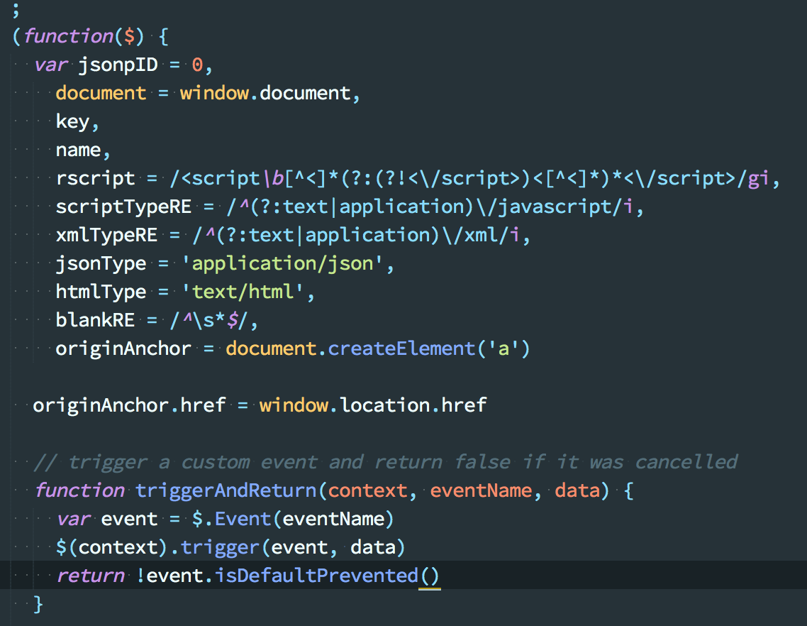

这是开头的局部变量,其中可以大概了解作用的,除了正则表达式之外,`originAnchor`这个对象,就蛮有意思的,其在内部缓存了当前浏览器访问地址.在下面的函数里,应当是用来验证信息的.

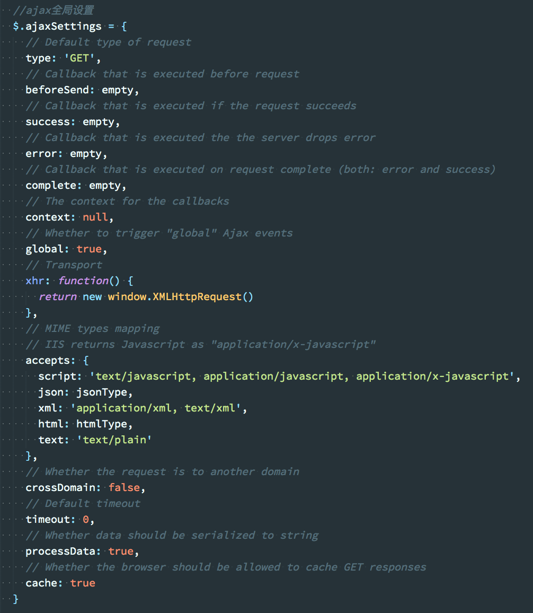
全局的参数大概就是这样,最关键的应当是其中定义的xhr对象,直接返回`XMLHttpRequest`对象,当然,这里没有做兼容.
在源码里还有个
```
$.active = 0;
```
大致上,所有的基础参数就是这么多了

# 入口
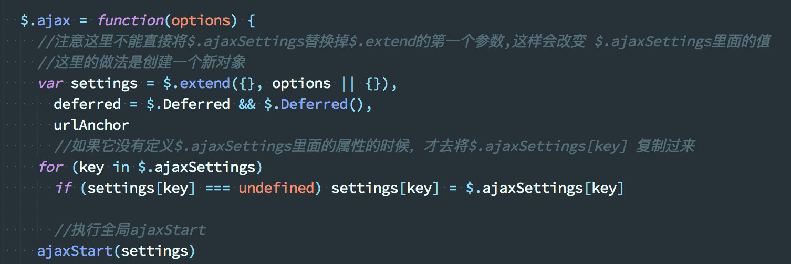
这里对于参数做了处理,保证每次的参数都会是一个局部变量,不会影响外部的原始参数.
`deferred`这个参数应当是用来执行promise的相关操作,而不是用回调来实现.

真正的开始是
```
ajaxStart(settings);

function ajaxStart(settings) {
    if (settings.global && $.active++ === 0) triggerGlobal(settings, null, 'ajaxStart')
}
```
这里用active做判断,只有当active=0时,`$.active++ === 0`才成立.

然后如果没有修改默认配置的global,则开始执行
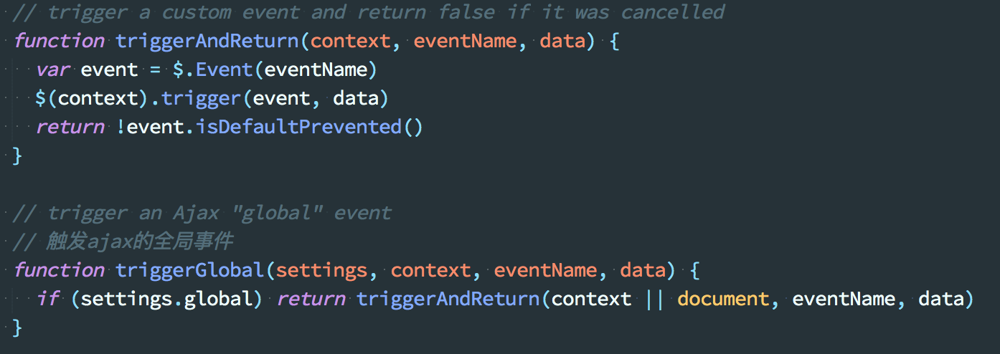
这两个函数.
用于触发全局事件,这就相当于是留了一个钩子,用于扩展ajax的功能.
使用类似:
```
$(document).on('ajaxBeforeSend', function(e, xhr, options){
  // dosomething
})
```
继续执行
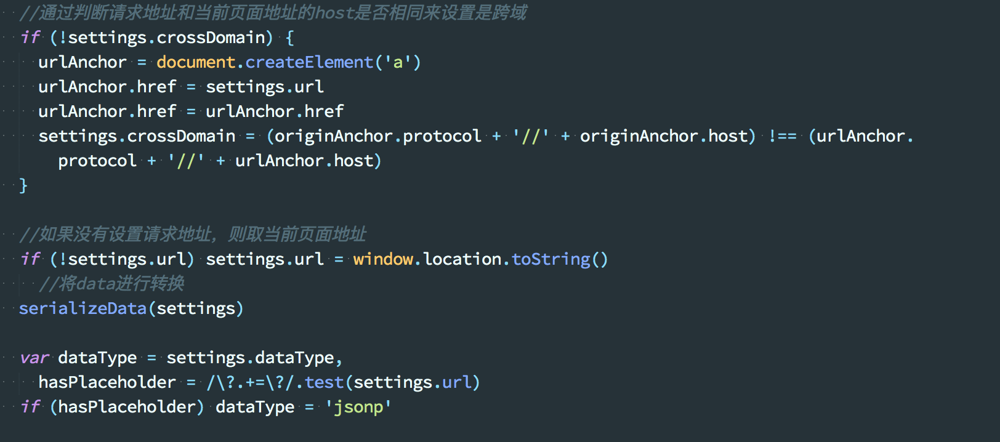
这里除了判断是否是跨域,
还通过`serializeData()`函数进行参数序列化,如果类型是get,则
```
options.url = appendQuery(options.url, options.data), options.data = undefined
```
url会加上拼接而成的字符串,参数设置为:
```
{
    name:"test"
}
```
就会变成类似
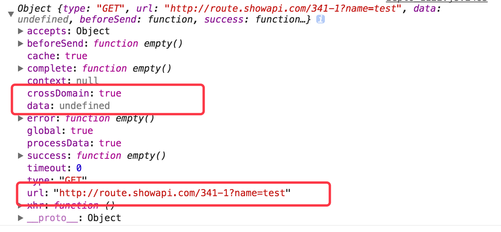

转换方法主要是
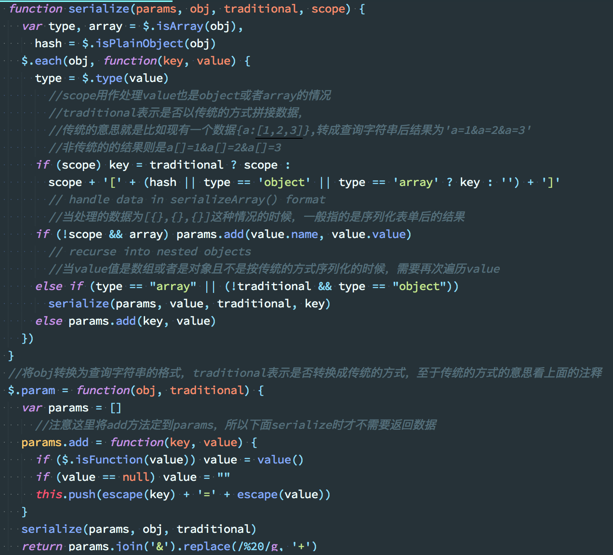
可以看到最主要的还是`params.add()`,用于将对象转为字符串,这里的traditional我确实没有怎么用到过这种参数结构,暂且不表.
最后的返回,通过array的join,转为以`&`分割的字符串.
而在`settings.cache`为false或者该请求是一个jsonp的情况下,给其url加上时间戳.

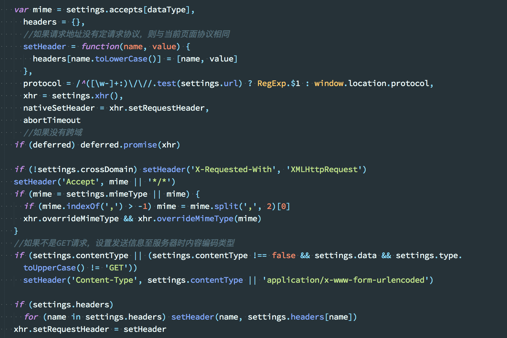
这里就是设置各种头部信息的地方,当然,如果没有传任何参数,则会默认使用当前页面的头部信息,并在最后传递给
```
xhr.setRequestHeader = setHeader
```
接下来就是$.ajax方法的核心
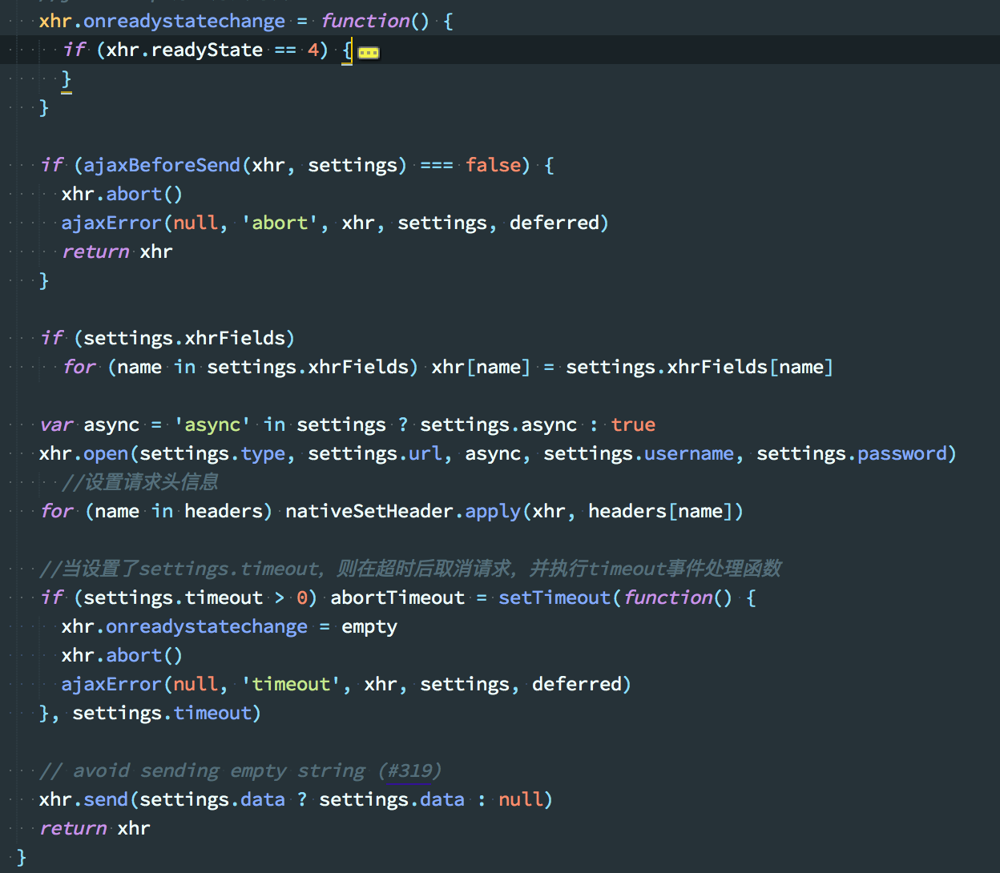
可以看到,仍然使用了xhr对象的`onreadystatechange()`方法,监听请求发送的情况,当然,在发送请求之前,如果想结束该请求,那么可以在settings的`beforeSend()`回调中返回false.
在对于status状态码进行判断时,多加了一个
```
(xhr.status == 0 && protocol == 'file:')
```
这里主要对于本地文件进行了处理.
因为返回的是xhr对象,所以我们可以直接使用abort方法来取消ajax请求,但`onreadystatechange()`同样会一直执行下去,所以如果不想继续执行函数需要加入自己的判定条件,而对于timeout来说,更是要在回调中拿到事件类型,再决定执行事件.
当然这里也对返回的数据进行了解析,如果不符合相应的dataType,则会报错,触发`parsererror`全局事件.

# 常用回调
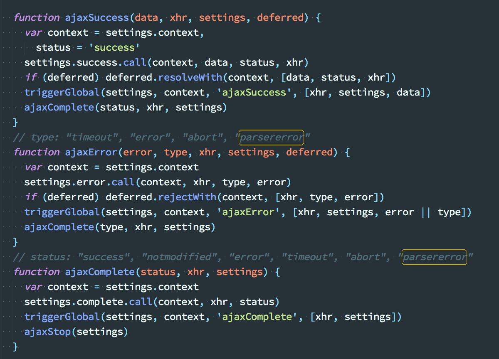
这里就是常用的回调方法,可以看到,不仅触发了相应的全局事件,而且将请求处理信息返回给了用户.
可以看到,常见的执行顺序,就如同官方文档中的差不多
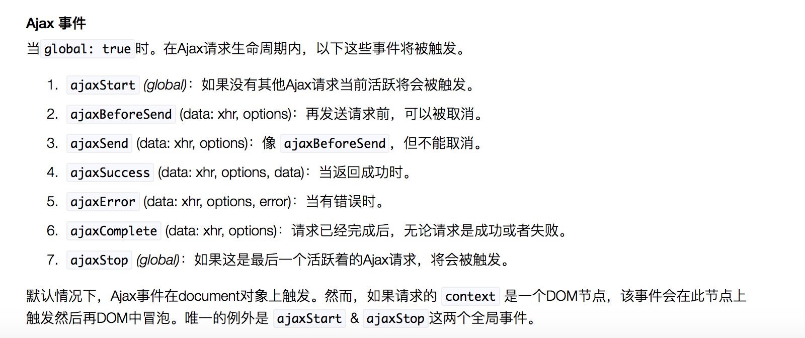

# jsonp
对于zepto中的jsonp方法,首先
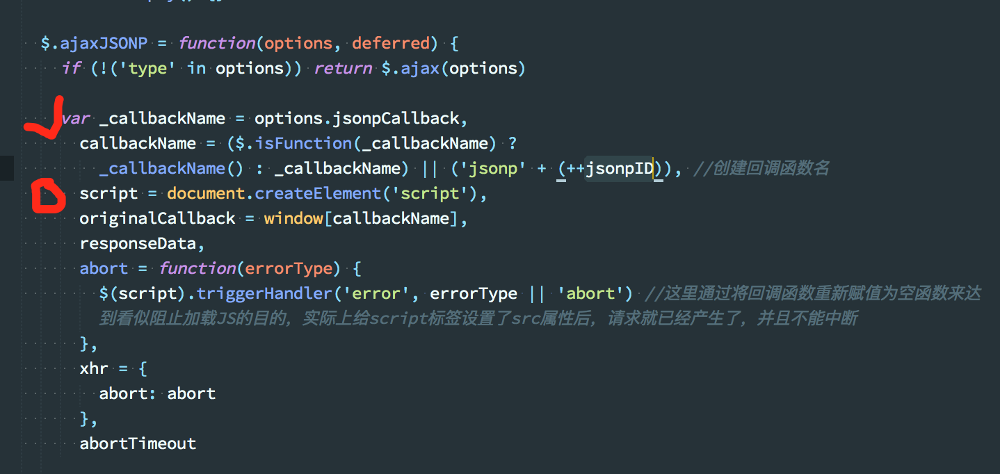
可以看到,仍然是通过`<script>`标签的方式,动态引入,但这种方法缺点也很明显
首先就是无法阻止,因为当载入标签的时候,请求就已经发送出去了,还有无法确定请求是否失败.

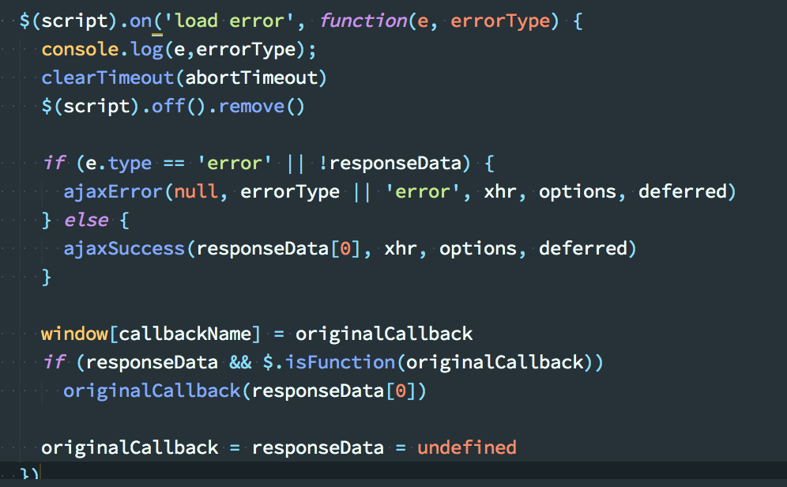
```
script.src = options.url.replace(/\?(.+)=\?/, '?$1=' + callbackName)
document.head.appendChild(script)
```
这里把设定的函数名替换到url中去,在新增的script标签里,就能开始请求,而通过对于`load,error`两个事件的监听,来判断jsonp是否执行成功,以文件是否加载完毕的方式来检测jsonp的执行情况.

至于其他,比如`$.get`,`$.post`等,都是使用`$.ajax`的一种快捷方式,就不加说明了

# 小结,
本文记录了我在阅读zepto关于ajax的源码时,所产生的思考,当然,不一定都对.仅做记录,不断改进!

