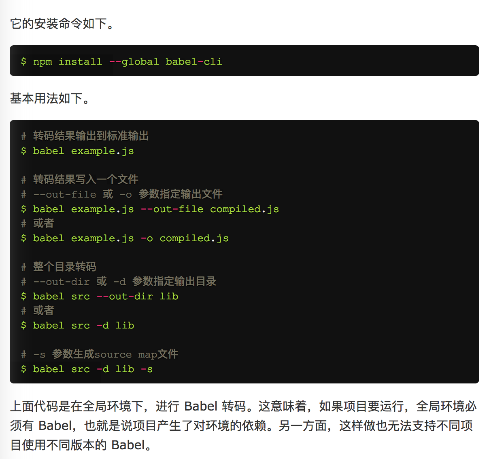
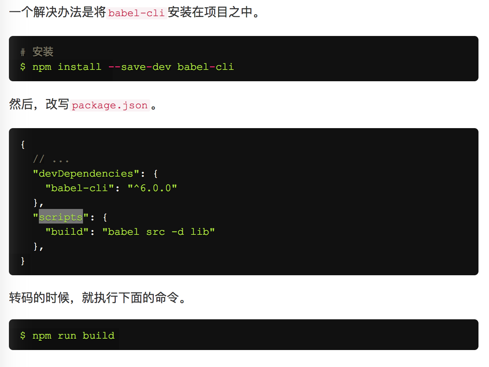
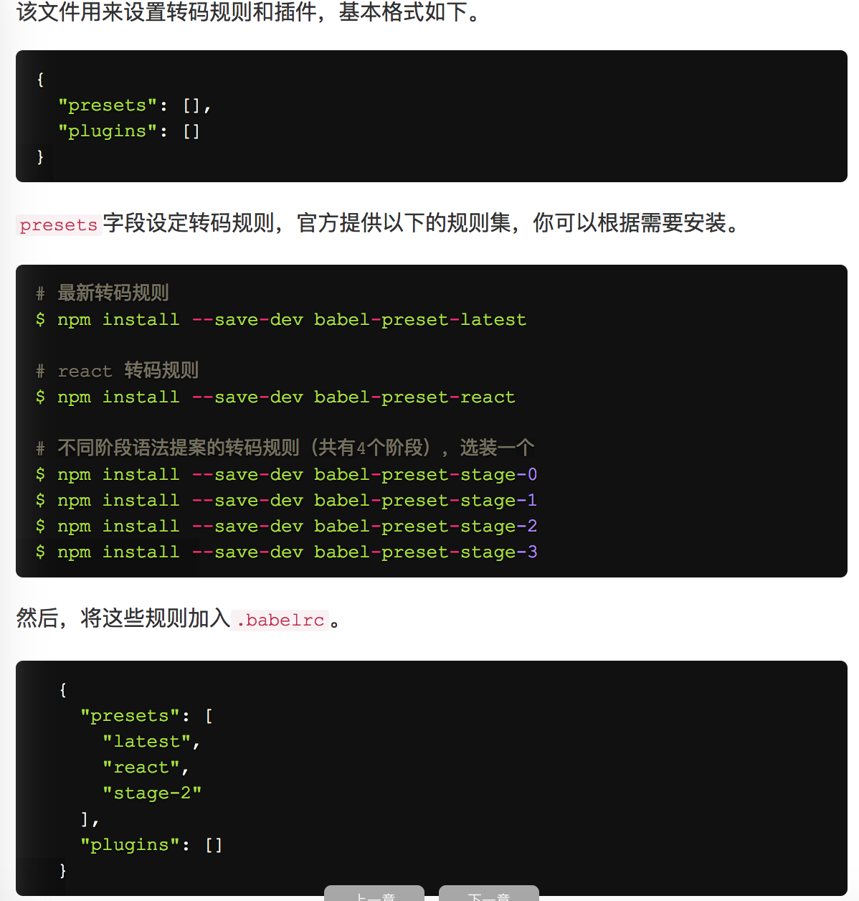

# 正文

> 对于ECMAScript的第六个版本的学习与总结,该版本提供了之前ECMAScript5中所没有实现的一些十分有必要的功能.例如class,let等之前较为模糊的定义,也在该版进行了汇总,本文来源于<a href="http://es6.ruanyifeng.com/">http://es6.ruanyifeng.com/</a>.

# babel的使用


除了上述的命令之外,在

中必须要先配置好转码规则
每个转码规则所对应的插件可以在<a href="http://babeljs.cn/docs/plugins/">babel-Presets</a>中查到.

# let 和 const 命令

let解决了在花括号体中定义的变量会在外部有效的问题
```
for(let i=0;i<10;i++){}

console.log(i);
```
如果这里的定义是var,则i就应该是10,而如果使用let,则正常显示为undefined.

而且,for循环还有一个特别之处，就是设置循环变量的那部分是一个父作用域，而循环体内部是一个单独的子作用域。
```
for (let i = 0; i < 3; i++) {
  let i = 'abc';
  console.log(i);// 执行3次,abc
}
```

## let不存在变量提升
事实上,有许许多多的面试题的出现的知识点就是变量提升所带来的一系列问题,因为JavaScript的变量会提升解析顺序,所以会产生各种各样额外的问题
```
console.log(x);// ReferenceError
let x= 0;

console.log(y);// undefined
var y = 0;
```

## 暂时性死区
只要块级作用域内存在let命令，它所声明的变量就“绑定”（binding）这个区域，不再受外部的影响。如果区块中存在let和const命令，这个区块对这些命令声明的变量，从一开始就形成了封闭作用域。凡是在声明之前就使用这些变量，就会报错。

如果typeof在有let变量声明之前对变量进行判断,则只能得到`ReferenceError`,作为对比,如果typeof一个没有let命令的环境下的变量,则会`undefined`


## 不允许重复声明
如果在同一个作用域里,重复声明同一个变量,则会报错

## ES6的块级作用域
ES6允许块级作用域嵌套
```
{{{{{let insane = 'Hello World'}}}}};
```
块级作用域的出现，实际上使得获得广泛应用的立即执行函数表达式（IIFE）不再必要了。
```
// IIFE 写法
(function () {
  var tmp = ...;
  ...
})();

// 块级作用域写法
{
  let tmp = ...;
  ...
}
```

## 块级作用域中的函数
es6的函数可以在作用域中声明了,ES6将其当为新的变量来解析,类似let

## const
其声明的是一个只读的常量,一旦声明，常量的值就不能改变。
const声明的变量不得改变值，这意味着，const一旦声明变量，就必须立即初始化，不能留到以后赋值。
const的作用域与let命令相同：只在声明所在的块级作用域内有效

const实际上保证的，并不是变量的值不得改动，而是变量指向的那个内存地址不得改动。对于简单类型的数据（数值、字符串、布尔值），值就保存在变量指向的那个内存地址，因此等同于常量。但对于复合类型的数据（主要是对象和数组），变量指向的内存地址，保存的只是一个指针，const只能保证这个指针是固定的，至于它指向的数据结构是不是可变的，就完全不能控制了。因此，将一个对象声明为常量必须非常小心。

如果真的想将对象冻结，应该使用Object.freeze方法。
```
const foo = Object.freeze();
```
除了将对象本身冻结，对象的属性也应该冻结。下面是一个将对象彻底冻结的函数。
```
var constantize = (obj) => {
  Object.freeze(obj);
  Object.keys(obj).forEach( (key, i) => {
    if ( typeof obj[key] === 'object' ) {
      constantize( obj[key] );
    }
  });
};
```

## 声明方法
ES5 只有两种声明变量的方法：var命令和function命令。ES6除了添加let和const命令，后面章节还会提到，另外两种声明变量的方法：import命令和class命令。所以，ES6 一共有6种声明变量的方法。

## 顶层对象变量
ES6为了改变这一点，一方面规定，为了保持兼容性，var命令和function命令声明的全局变量，依旧是顶层对象的属性；另一方面规定，let命令、const命令、class命令声明的全局变量，不属于顶层对象的属性。也就是说，从ES6开始，全局变量将逐步与顶层对象的属性脱钩。

# 变量的解构赋值

## 数组的解构赋值
```
let [a, b, c] = [1, 2, 3];
```
本质上，这种写法属于“模式匹配”，只要等号两边的模式相同，左边的变量就会被赋予对应的值。下面是一些使用嵌套数组进行解构的例子。
```
let [foo, [[bar], baz]] = [1, [[2], 3]];
foo // 1
bar // 2
baz // 3

let [ , , third] = ["foo", "bar", "baz"];
third // "baz"

let [x, , y] = [1, 2, 3];
x // 1
y // 3

let [head, ...tail] = [1, 2, 3, 4];
head // 1
tail // [2, 3, 4]

let [x, y, ...z] = ['a'];
x // "a"
y // undefined
z // []
```
如果解构不成功，变量的值就等于undefined。
另一种情况是不完全解构，即等号左边的模式，只匹配一部分的等号右边的数组。这种情况下，解构依然可以成功。

如果等号的右边不是数组（或者严格地说，不是可遍历的结构，参见《Iterator》一章），那么将会报错。
```
// 报错
let [foo] = 1;
let [foo] = false;
let [foo] = NaN;
let [foo] = undefined;
let [foo] = null;
let [foo] = {};
```

解构赋值允许指定默认值。
```
let [foo = true] = [];
foo // true

let [x, y = 'b'] = ['a']; // x='a', y='b'
let [x, y = 'b'] = ['a', undefined]; // x='a', y='b'
```
ES6 内部使用严格相等运算符（===），判断一个位置是否有值。所以，如果一个数组成员不严格等于undefined，默认值是不会生效的。
如果默认值是一个表达式，那么这个表达式是惰性求值的，即只有在用到的时候，才会求值。

默认值可以引用解构赋值的其他变量，但该变量必须已经声明。
```
let [x = 1, y = x] = [];     // x=1; y=1
let [x = 1, y = x] = [2];    // x=2; y=2
let [x = 1, y = x] = [1, 2]; // x=1; y=2
let [x = y, y = 1] = [];     // ReferenceError
```

## 变量的解构赋值
```
let { foo, bar } = { foo: "aaa", bar: "bbb" };
foo // "aaa"
bar // "bbb"
```
对象的解构与数组有一个重要的不同。数组的元素是按次序排列的，变量的取值由它的位置决定；而对象的属性没有次序，变量必须与属性同名，才能取到正确的值。

如果变量名与属性名不一致，必须写成下面这样。
```
var { foo: baz } = { foo: 'aaa', bar: 'bbb' };
baz // "aaa"

let obj = { first: 'hello', last: 'world' };
let { first: f, last: l } = obj;
f // 'hello'
l // 'world'
```
对象的解构赋值的内部机制，是先找到同名属性，然后再赋给对应的变量。真正被赋值的是后者，而不是前者。

# 字符串的扩展

## 字符的 Unicode 表示法
```
'\z' === 'z'  // true
'\172' === 'z' // true
'\x7A' === 'z' // true
'\u007A' === 'z' // true
'\u{7A}' === 'z' // true
```

## 字符串的遍历器接口
```
for (let codePoint of 'foo') {
  console.log(codePoint)
}
// "f"
// "o"
// "o"
```

## includes(), startsWith(), endsWith()
传统上，JavaScript只有indexOf方法，可以用来确定一个字符串是否包含在另一个字符串中。ES6又提供了三种新方法。
includes()：返回布尔值，表示是否找到了参数字符串。
startsWith()：返回布尔值，表示参数字符串是否在源字符串的头部。
endsWith()：返回布尔值，表示参数字符串是否在源字符串的尾部。
```
var s = 'Hello world!';

s.startsWith('Hello') // true
s.endsWith('!') // true
s.includes('o') // true
```
这三个方法都支持第二个参数，表示开始搜索的位置。
```
var s = 'Hello world!';

s.startsWith('world', 6) // true
s.endsWith('Hello', 5) // true
s.includes('Hello', 6) // false
```

## 模板字符串
```
$('#result').append(`
  There are <b>${basket.count}</b> items
   in your basket, <em>${basket.onSale}</em>
  are on sale!
`);
```
模板字符串（template string）是增强版的字符串，用反引号（`）标识。它可以当作普通字符串使用，也可以用来定义多行字符串，或者在字符串中嵌入变量。

## 字符串的正则方法
字符串对象共有4个方法，可以使用正则表达式：match()、replace()、search()和split()。

ES6 将这4个方法，在语言内部全部调用RegExp的实例方法，从而做到所有与正则相关的方法，全都定义在RegExp对象上。

String.prototype.match 调用 RegExp.prototype[Symbol.match]
String.prototype.replace 调用 RegExp.prototype[Symbol.replace]
String.prototype.search 调用 RegExp.prototype[Symbol.search]
String.prototype.split 调用 RegExp.prototype[Symbol.split]

## number
ES6 在Number对象上，新提供了Number.isFinite()和Number.isNaN()两个方法。
Number.isFinite()用来检查一个数值是否为有限的（finite）。
Number.isNaN()用来检查一个值是否为NaN。
ES6 将全局方法parseInt()和parseFloat()，移植到Number对象上面，行为完全保持不变。
```
// ES5的写法
parseInt('12.34') // 12
parseFloat('123.45#') // 123.45

// ES6的写法
Number.parseInt('12.34') // 12
Number.parseFloat('123.45#') // 123.45
```
Number.isInteger()用来判断一个值是否为整数。需要注意的是，在 JavaScript 内部，整数和浮点数是同样的储存方法，所以3和3.0被视为同一个值。


## 指数运算符
ES2016 新增了一个指数运算符（**）。
```
2 ** 2 // 4
2 ** 3 // 8
```
指数运算符可以与等号结合，形成一个新的赋值运算符（**=）。
```
let a = 1.5;
a **= 2;
// 等同于 a = a * a;

let b = 4;
b **= 3;
// 等同于 b = b * b * b;
```

## Integer 数据类型
JavaScript 所有数字都保存成64位浮点数，这决定了整数的精确程度只能到53个二进制位。大于这个范围的整数，JavaScript 是无法精确表示的，这使得 JavaScript 不适合进行科学和金融方面的精确计算。

现在有一个提案，引入了新的数据类型 Integer（整数），来解决这个问题。整数类型的数据只用来表示整数，没有位数的限制，任何位数的整数都可以精确表示。

为了与 Number 类型区别，Integer 类型的数据必须使用后缀n表示。
JavaScript 原生提供Integer对象，用来生成 Integer 类型的数值。转换规则基本与Number()一致。
```
Integer(123) // 123n
Integer('123') // 123n
Integer(false) // 0n
Integer(true) // 1n
```

# 函数

## 函数参数的默认值
ES6 允许为函数的参数设置默认值，即直接写在参数定义的后面。
```
function log(x, y = 'World') {
  console.log(x, y);
}

log('Hello') // Hello World
log('Hello', 'China') // Hello China
log('Hello', '') // Hello
```
参数变量是默认声明的，所以不能用let或const再次声明。
```
function foo(x = 5) {
  let x = 1; // error
  const x = 2; // error
}
```
使用参数默认值时，函数不能有同名参数。
```
function foo(x, x, y = 1) {
  // ...
}
```
另外，一个容易忽略的地方是，参数默认值不是传值的，而是每次都重新计算默认值表达式的值。也就是说，参数默认值是惰性求值的。

## rest 参数
ES6 引入 rest 参数（形式为...变量名），用于获取函数的多余参数，这样就不需要使用arguments对象了。rest 参数搭配的变量是一个数组，该变量将多余的参数放入数组中。
```
function add(...values) {
  let sum = 0;

  for (var val of values) {
    sum += val;
  }

  return sum;
}

add(2, 5, 3) // 10
```
注意，rest 参数之后不能再有其他参数（即只能是最后一个参数），否则会报错。

## 严格模式
从 ES5 开始，函数内部可以设定为严格模式。
ES2016 做了一点修改，规定只要函数参数使用了默认值、解构赋值、或者扩展运算符，那么函数内部就不能显式设定为严格模式，否则会报错。
这样规定的原因是，函数内部的严格模式，同时适用于函数体和函数参数。但是，函数执行的时候，先执行函数参数，然后再执行函数体。这样就有一个不合理的地方，只有从函数体之中，才能知道参数是否应该以严格模式执行，但是参数却应该先于函数体执行。

## name 属性

需要注意的是，ES6 对这个属性的行为做出了一些修改。如果将一个匿名函数赋值给一个变量，ES5 的name属性，会返回空字符串，而 ES6 的name属性会返回实际的函数名。

如果将一个具名函数赋值给一个变量，则 ES5 和 ES6 的name属性都返回这个具名函数原本的名字。

## 箭头函数
一定会有一个返回值的函数定义方式,简化了之前ES5的return something的写法
```
var f = v => v;
var f = function(v) {
  return v;
};
```
如果箭头函数不需要参数或需要多个参数，就使用一个圆括号代表参数部分。
```
var f = () => 5;
// 等同于
var f = function () { return 5 };

var sum = (num1, num2) => num1 + num2;
// 等同于
var sum = function(num1, num2) {
  return num1 + num2;
};
```
如果箭头函数的代码块部分多于一条语句，就要使用大括号将它们括起来，并且使用return语句返回。
```
var sum = (num1, num2) => { return num1 + num2; }
```
由于大括号被解释为代码块，所以如果箭头函数直接返回一个对象，必须在对象外面加上括号。
只有当为一行时需要加括号,其余情况都不需要加括号.
```
var getTempItem = id => ({ id: id, name: "Temp" });
```

箭头函数的一个用处是简化回调函数。
```
// 正常函数写法
[1,2,3].map(function (x) {
  return x * x;
});

// 箭头函数写法
[1,2,3].map(x => x * x);
```

使用注意点:
箭头函数有几个使用注意点。

（1）函数体内的this对象，就是定义时所在的对象，而不是使用时所在的对象。

（2）不可以当作构造函数，也就是说，不可以使用new命令，否则会抛出一个错误。

（3）不可以使用arguments对象，该对象在函数体内不存在。如果要用，可以用 rest 参数代替。

（4）不可以使用yield命令，因此箭头函数不能用作 Generator 函数。

上面四点中，第一点尤其值得注意。this对象的指向是可变的，但是在箭头函数中，它是固定的。
```
function foo() {
  setTimeout(() => {
    console.log('id:', this.id);
  }, 100);
}

var id = 21;

foo.call({ id: 42 });
// id: 42
```

箭头函数可以让setTimeout里面的this，绑定定义时所在的作用域，而不是指向运行时所在的作用域。下面是另一个例子。
```
function Timer() {
  this.s1 = 0;
  this.s2 = 0;
  // 箭头函数
  setInterval(() => this.s1++, 1000);
  // 普通函数
  setInterval(function () {
    this.s2++;
  }, 1000);
}

var timer = new Timer();

setTimeout(() => console.log('s1: ', timer.s1), 3100);
setTimeout(() => console.log('s2: ', timer.s2), 3100);
// s1: 3
// s2: 0
```
长期以来，JavaScript 语言的this对象一直是一个令人头痛的问题，在对象方法中使用this，必须非常小心。箭头函数”绑定”this，很大程度上解决了这个困扰。

this指向的固定化，并不是因为箭头函数内部有绑定this的机制，实际原因是箭头函数根本没有自己的this，导致内部的this就是外层代码块的this。正是因为它没有this，所以也就不能用作构造函数。
```
// ES6
function foo() {
  setTimeout(() => {
    console.log('id:', this.id);
  }, 100);
}

// ES5
function foo() {
  var _this = this;

  setTimeout(function () {
    console.log('id:', _this.id);
  }, 100);
}
```
除了this，以下三个变量在箭头函数之中也是不存在的，指向外层函数的对应变量：arguments、super、new.target。
另外，由于箭头函数没有自己的this，所以当然也就不能用call()、apply()、bind()这些方法去改变this的指向。

### 函数的绑定this
函数绑定运算符是并排的两个冒号（::），双冒号左边是一个对象，右边是一个函数。该运算符会自动将左边的对象，作为上下文环境（即this对象），绑定到右边的函数上面。
```
foo::bar;
// 等同于
bar.bind(foo);

foo::bar(...arguments);
// 等同于
bar.apply(foo, arguments);

const hasOwnProperty = Object.prototype.hasOwnProperty;
function hasOwn(obj, key) {
  return obj::hasOwnProperty(key);
}
```

### 尾调用优化
就是指某个函数的最后一步是调用另一个函数。
我们知道，函数调用会在内存形成一个“调用记录”，又称“调用帧”（call frame），保存调用位置和内部变量等信息。如果在函数A的内部调用函数B，那么在A的调用帧上方，还会形成一个B的调用帧。等到B运行结束，将结果返回到A，B的调用帧才会消失。如果函数B内部还调用函数C，那就还有一个C的调用帧，以此类推。所有的调用帧，就形成一个“调用栈”（call stack）。

尾调用由于是函数的最后一步操作，所以不需要保留外层函数的调用帧，因为调用位置、内部变量等信息都不会再用到了，只要直接用内层函数的调用帧，取代外层函数的调用帧就可以了。

ES6 中只要使用尾递归，就不会发生栈溢出，相对节省内存。

### 函数参数的尾逗号
```
function clownsEverywhere(
  param1,
  param2,
) { /* ... */ }

clownsEverywhere(
  'foo',
  'bar',
);
```

# 数组

## 扩展运算符
扩展运算符（spread）是三个点（...）。它好比 rest 参数的逆运算，将一个数组转为用逗号分隔的参数序列。
```
console.log(...[1, 2, 3])
// 1 2 3

console.log(1, ...[2, 3, 4], 5)
// 1 2 3 4 5

[...document.querySelectorAll('div')]
// [<div>, <div>, <div>]
```

该运算符主要用于函数调用。
```
function push(array, ...items) {
  array.push(...items);
}

function add(x, y) {
  return x + y;
}

var numbers = [4, 38];
add(...numbers) // 42
```
主要就是定义一个不知道具体长度的参数序列

### 替代数组的 apply 方法
```
// ES5 的写法
function f(x, y, z) {
  // ...
}
var args = [0, 1, 2];
f.apply(null, args);

// ES6的写法
function f(x, y, z) {
  // ...
}
var args = [0, 1, 2];
f(...args);

// ES5 的写法
Math.max.apply(null, [14, 3, 77])

// ES6 的写法
Math.max(...[14, 3, 77])

// 等同于
Math.max(14, 3, 77);
```

### 扩展运算符的应用

1. 合并数组
```
// ES5
[1, 2].concat(more)
// ES6
[1, 2, ...more]

var arr1 = ['a', 'b'];
var arr2 = ['c'];
var arr3 = ['d', 'e'];

// ES5的合并数组
arr1.concat(arr2, arr3);
// [ 'a', 'b', 'c', 'd', 'e' ]

// ES6的合并数组
[...arr1, ...arr2, ...arr3]
// [ 'a', 'b', 'c', 'd', 'e' ]
```

2. 与解构赋值结合
```
const [first, ...rest] = [1, 2, 3, 4, 5];
first // 1
rest  // [2, 3, 4, 5]

const [first, ...rest] = [];
first // undefined
rest  // []

const [first, ...rest] = ["foo"];
first  // "foo"
rest   // []
```

3. 函数的返回值
JavaScript的函数只能返回一个值，如果需要返回多个值，只能返回数组或对象。扩展运算符提供了解决这个问题的一种变通方法。
```
var dateFields = readDateFields(database);
var d = new Date(...dateFields);
```

4. 字符串
```
[...'hello']
// [ "h", "e", "l", "l", "o" ]
```

## Array.from()
Array.from方法用于将两类对象转为真正的数组：类似数组的对象（array-like object）和可遍历（iterable）的对象（包括ES6新增的数据结构Set和Map）。

下面是一个类似数组的对象，Array.from将它转为真正的数组。
```
let arrayLike = {
    '0': 'a',
    '1': 'b',
    '2': 'c',
    length: 3
};

// ES5的写法
var arr1 = [].slice.call(arrayLike); // ['a', 'b', 'c']

// ES6的写法
let arr2 = Array.from(arrayLike); // ['a', 'b', 'c']

// NodeList对象
let ps = document.querySelectorAll('p');
Array.from(ps).forEach(function (p) {
  console.log(p);
});

// arguments对象
function foo() {
  var args = Array.from(arguments);
  // ...
}
```

如果参数是一个真正的数组，Array.from会返回一个一模一样的新数组。
扩展运算符背后调用的是遍历器接口（Symbol.iterator），如果一个对象没有部署这个接口，就无法转换。Array.from方法还支持类似数组的对象。所谓类似数组的对象，本质特征只有一点，即必须有length属性。因此，任何有length属性的对象，都可以通过Array.from方法转为数组，而此时扩展运算符就无法转换。
对于还没有部署该方法的浏览器，可以用Array.prototype.slice方法替代。
```
const toArray = (() =>
  Array.from ? Array.from : obj => [].slice.call(obj)
)();
```
Array.from还可以接受第二个参数，作用类似于数组的map方法，用来对每个元素进行处理，将处理后的值放入返回的数组。
```
Array.from(arrayLike, x => x * x);
// 等同于
Array.from(arrayLike).map(x => x * x);

Array.from([1, 2, 3], (x) => x * x)
// [1, 4, 9]
```

## Array.of()
Array.of方法用于将一组值，转换为数组。
```
Array.of(3, 11, 8) // [3,11,8]
Array.of(3) // [3]
Array.of(3).length // 1
```
这个方法的主要目的，是弥补数组构造函数Array()的不足。因为参数个数的不同，会导致Array()的行为有差异。
```
Array() // []
Array(3) // [, , ,]
Array(3, 11, 8) // [3, 11, 8]
```
Array.of方法可以用下面的代码模拟实现。
```
function ArrayOf(){
  return [].slice.call(arguments);
}
```

## 数组实例的 find() 和 findIndex() 和 fill()
数组实例的find方法，用于找出第一个符合条件的数组成员。它的参数是一个回调函数，所有数组成员依次执行该回调函数，直到找出第一个返回值为true的成员，然后返回该成员。如果没有符合条件的成员，则返回undefined。
数组实例的findIndex方法的用法与find方法非常类似，返回第一个符合条件的数组成员的位置，如果所有成员都不符合条件，则返回-1。
fill方法使用给定值，填充一个数组。
```
['a', 'b', 'c'].fill(7)
// [7, 7, 7]

new Array(3).fill(7)
// [7, 7, 7]
```

## 数组实例的 entries()，keys() 和 values()
ES6 提供三个新的方法——entries()，keys()和values()——用于遍历数组。它们都返回一个遍历器对象，可以用for...of循环进行遍历，唯一的区别是keys()是对键名的遍历、values()是对键值的遍历，entries()是对键值对的遍历。
```
for (let index of ['a', 'b'].keys()) {
  console.log(index);
}
// 0
// 1

for (let elem of ['a', 'b'].values()) {
  console.log(elem);
}
// 'a'
// 'b'

for (let [index, elem] of ['a', 'b'].entries()) {
  console.log(index, elem);
}
// 0 "a"
// 1 "b"
```
如果不使用for...of循环，可以手动调用遍历器对象的next方法，进行遍历。
```
let letter = ['a', 'b', 'c'];
let entries = letter.entries();
console.log(entries.next().value); // [0, 'a']
console.log(entries.next().value); // [1, 'b']
console.log(entries.next().value); // [2, 'c']
```

## 数组实例的 includes()
Array.prototype.includes方法返回一个布尔值，表示某个数组是否包含给定的值，与字符串的includes方法类似。ES2016 引入了该方法。解决了之前indexof判断不准的问题.

## 数组的空位
数组的空位指，数组的某一个位置没有任何值。
注意，空位不是undefined，一个位置的值等于undefined，依然是有值的。空位是没有任何值，in运算符可以说明这一点。
ES6 则是明确将空位转为undefined。
由于空位的处理规则非常不统一，所以建议避免出现空位。

# 对象的扩展

## 属性的简洁表示法
ES6 允许直接写入变量和函数，作为对象的属性和方法。这样的书写更加简洁。
```
var foo = 'bar';
var baz = {foo};
baz // {foo: "bar"}

// 等同于
var baz = {foo: foo};
```
上面代码表明，ES6 允许在对象之中，直接写变量。这时，属性名为变量名, 属性值为变量的值。

除了属性简写，方法也可以简写。
```
var o = {
  method() {
    return "Hello!";
  }
};

// 等同于

var o = {
  method: function() {
    return "Hello!";
  }
};
```

注意，简洁写法的属性名总是字符串，这会导致一些看上去比较奇怪的结果。
```
var obj = {
  class () {}
};

// 等同于

var obj = {
  'class': function() {}
};
```
简写意味着键就是传入的值的名称.

## 属性名表达式
如果使用字面量方式定义对象（使用大括号），在 ES5 中只能使用方法一（标识符）定义属性。
```
var obj = {
  foo: true,
  abc: 123
};
```
ES6 允许字面量定义对象时，用方法二（表达式）作为对象的属性名，即把表达式放在方括号内。
```
let propKey = 'foo';

let obj = {
  [propKey]: true,
  ['a' + 'bc']: 123
};

var lastWord = 'last word';

var a = {
  'first word': 'hello',
  [lastWord]: 'world'
};

a['first word'] // "hello"
a[lastWord] // "world"
a['last word'] // "world"
```
注意，属性名表达式与简洁表示法，不能同时使用，会报错。
```
// 报错
var foo = 'bar';
var bar = 'abc';
var baz = { [foo] };

// 正确
var foo = 'bar';
var baz = { [foo]: 'abc'};
```
注意，属性名表达式如果是一个对象，默认情况下会自动将对象转为字符串[object Object]，这一点要特别小心。
```
const keyA = {a: 1};
const keyB = {b: 2};

const myObject = {
  [keyA]: 'valueA',
  [keyB]: 'valueB'
};

myObject // Object {[object Object]: "valueB"}
```
## 方法的 name 属性
如果对象的方法使用了取值函数（getter）和存值函数（setter），则name属性不是在该方法上面，而是该方法的属性的描述对象的get和set属性上面，返回值是方法名前加上get和set。
```
const obj = {
  get foo() {},
  set foo(x) {}
};

obj.foo.name
// TypeError: Cannot read property 'name' of undefined

const descriptor = Object.getOwnPropertyDescriptor(obj, 'foo');

descriptor.get.name // "get foo"
descriptor.set.name // "set foo"
```
有两种特殊情况：bind方法创造的函数，name属性返回bound加上原函数的名字；Function构造函数创造的函数，name属性返回anonymous。
```
(new Function()).name // "anonymous"

var doSomething = function() {
  // ...
};
doSomething.bind().name // "bound doSomething"
```
如果对象的方法是一个 Symbol 值，那么name属性返回的是这个 Symbol 值的描述。
```
const key1 = Symbol('description');
const key2 = Symbol();
let obj = {
  [key1]() {},
  [key2]() {},
};
obj[key1].name // "[description]"
obj[key2].name // ""
```

## Object.is()
ES6提出“Same-value equality”（同值相等）算法，用来解决这个问题。Object.is就是部署这个算法的新方法。它用来比较两个值是否严格相等，与严格比较运算符（===）的行为基本一致
不同之处只有两个：一是+0不等于-0，二是NaN等于自身。
```
+0 === -0 //true
NaN === NaN // false

Object.is(+0, -0) // false
Object.is(NaN, NaN) // true
```

## Object.assign()
Object.assign方法用于对象的合并，将源对象（source）的所有可枚举属性，复制到目标对象（target）。
```
var target = { a: 1 };

var source1 = { b: 2 };
var source2 = { c: 3 };

Object.assign(target, source1, source2);
target // {a:1, b:2, c:3}
Object.assign方法的第一个参数是目标对象，后面的参数都是源对象。
```
注意，如果目标对象与源对象有同名属性，或多个源对象有同名属性，则后面的属性会覆盖前面的属性。
如果只有一个参数，Object.assign会直接返回该参数。
如果该参数不是对象，则会先转成对象，然后返回。
由于undefined和null无法转成对象，所以如果它们作为参数，就会报错

如果非对象参数出现在源对象的位置（即非首参数），那么处理规则有所不同。首先，这些参数都会转成对象，如果无法转成对象，就会跳过。这意味着，如果undefined和null不在首参数，就不会报错。

Object.assign方法实行的是浅拷贝，而不是深拷贝。也就是说，如果源对象某个属性的值是对象，那么目标对象拷贝得到的是这个对象的引用。

个人感觉仍然需要扩展方法来实现.

## 属性的可枚举性
对象的每个属性都有一个描述对象（Descriptor），用来控制该属性的行为。Object.getOwnPropertyDescriptor方法可以获取该属性的描述对象。
```
let obj = { foo: 123 };
Object.getOwnPropertyDescriptor(obj, 'foo')
//  {
//    value: 123,
//    writable: true,
//    enumerable: true,
//    configurable: true
//  }
```
描述对象的enumerable属性，称为”可枚举性“，如果该属性为false，就表示某些操作会忽略当前属性。
ES6规定，所有Class的原型的方法都是不可枚举的。
总的来说，操作中引入继承的属性会让问题复杂化，大多数时候，我们只关心对象自身的属性。所以，尽量不要用for...in循环，而用Object.keys()代替。

## 属性的遍历
ES6 一共有5种方法可以遍历对象的属性。

（1）for...in

for...in循环遍历对象自身的和继承的可枚举属性（不含 Symbol 属性）。

（2）Object.keys(obj)

Object.keys返回一个数组，包括对象自身的（不含继承的）所有可枚举属性（不含 Symbol 属性）。

（3）Object.getOwnPropertyNames(obj)

Object.getOwnPropertyNames返回一个数组，包含对象自身的所有属性（不含 Symbol 属性，但是包括不可枚举属性）。

（4）Object.getOwnPropertySymbols(obj)

Object.getOwnPropertySymbols返回一个数组，包含对象自身的所有 Symbol 属性。

（5）Reflect.ownKeys(obj)

Reflect.ownKeys返回一个数组，包含对象自身的所有属性，不管属性名是 Symbol 或字符串，也不管是否可枚举。

以上的5种方法遍历对象的属性，都遵守同样的属性遍历的次序规则。

首先遍历所有属性名为数值的属性，按照数字排序。
其次遍历所有属性名为字符串的属性，按照生成时间排序。
最后遍历所有属性名为 Symbol 值的属性，按照生成时间排序。

## __proto__属性，Object.setPrototypeOf()，Object.getPrototypeOf()
该属性没有写入 ES6 的正文，而是写入了附录，原因是__proto__前后的双下划线，说明它本质上是一个内部属性，而不是一个正式的对外的 API，只是由于浏览器广泛支持，才被加入了 ES6。标准明确规定，只有浏览器必须部署这个属性，其他运行环境不一定需要部署，而且新的代码最好认为这个属性是不存在的。因此，无论从语义的角度，还是从兼容性的角度，都不要使用这个属性，而是使用下面的Object.setPrototypeOf()（写操作）、Object.getPrototypeOf()（读操作）、Object.create()（生成操作）代替。
在实现上，__proto__调用的是Object.prototype.__proto__，具体实现如下。
```
Object.defineProperty(Object.prototype, '__proto__', {
  get() {
    let _thisObj = Object(this);
    return Object.getPrototypeOf(_thisObj);
  },
  set(proto) {
    if (this === undefined || this === null) {
      throw new TypeError();
    }
    if (!isObject(this)) {
      return undefined;
    }
    if (!isObject(proto)) {
      return undefined;
    }
    let status = Reflect.setPrototypeOf(this, proto);
    if (!status) {
      throw new TypeError();
    }
  },
});
function isObject(value) {
  return Object(value) === value;
}
```
如果一个对象本身部署了__proto__属性，则该属性的值就是对象的原型。

### Object.setPrototypeOf()
Object.setPrototypeOf方法的作用与__proto__相同，用来设置一个对象的prototype对象，返回参数对象本身。它是 ES6 正式推荐的设置原型对象的方法。

### Object.getPrototypeOf()
```
function Rectangle() {
  // ...
}

var rec = new Rectangle();

Object.getPrototypeOf(rec) === Rectangle.prototype
// true

Object.setPrototypeOf(rec, Object.prototype);
Object.getPrototypeOf(rec) === Rectangle.prototype
// false
```

# Symbol
ES6 引入了一种新的原始数据类型Symbol，表示独一无二的值。它是 JavaScript 语言的第七种数据类型，前六种是：undefined、null、布尔值（Boolean）、字符串（String）、数值（Number）、对象（Object）。
Symbol 值通过Symbol函数生成。这就是说，对象的属性名现在可以有两种类型，一种是原来就有的字符串，另一种就是新增的 Symbol 类型。凡是属性名属于 Symbol 类型，就都是独一无二的，可以保证不会与其他属性名产生冲突。
注意，Symbol函数前不能使用new命令，否则会报错。这是因为生成的 Symbol 是一个原始类型的值，不是对象。也就是说，由于 Symbol 值不是对象，所以不能添加属性。基本上，它是一种类似于字符串的数据类型。

Symbol函数可以接受一个字符串作为参数，表示对 Symbol 实例的描述，主要是为了在控制台显示，或者转为字符串时，比较容易区分。
```
var s1 = Symbol('foo');
var s2 = Symbol('bar');

s1 // Symbol(foo)
s2 // Symbol(bar)

s1.toString() // "Symbol(foo)"
s2.toString() // "Symbol(bar)"
```
如果 Symbol 的参数是一个对象，就会调用该对象的toString方法，将其转为字符串，然后才生成一个 Symbol 值。
注意，Symbol函数的参数只是表示对当前 Symbol 值的描述，因此相同参数的Symbol函数的返回值是不相等的。
Symbol 值不能与其他类型的值进行运算，会报错。
但是，Symbol 值可以显式转为字符串。
另外，Symbol 值也可以转为布尔值，但是不能转为数值。

## 作为属性名的 Symbol
由于每一个 Symbol 值都是不相等的，这意味着 Symbol 值可以作为标识符，用于对象的属性名，就能保证不会出现同名的属性。这对于一个对象由多个模块构成的情况非常有用，能防止某一个键被不小心改写或覆盖。
```
var mySymbol = Symbol();

// 第一种写法
var a = {};
a[mySymbol] = 'Hello!';

// 第二种写法
var a = {
  [mySymbol]: 'Hello!'
};

// 第三种写法
var a = {};
Object.defineProperty(a, mySymbol, { value: 'Hello!' });

// 以上写法都得到同样结果
a[mySymbol] // "Hello!"
```
注意，Symbol 值作为对象属性名时，不能用点运算符。
```
var mySymbol = Symbol();
var a = {};

a.mySymbol = 'Hello!';
a[mySymbol] // undefined
a['mySymbol'] // "Hello!"
```
同理，在对象的内部，使用 Symbol 值定义属性时，Symbol 值必须放在方括号之中

## 实例：消除魔术字符串
魔术字符串指的是，在代码之中多次出现、与代码形成强耦合的某一个具体的字符串或者数值。风格良好的代码，应该尽量消除魔术字符串，改由含义清晰的变量代替。
```
function getArea(shape, options) {
  var area = 0;

  switch (shape) {
    case 'Triangle': // 魔术字符串
      area = .5 * options.width * options.height;
      break;
    /* ... more code ... */
  }

  return area;
}

getArea('Triangle', { width: 100, height: 100 }); // 魔术字符串
```
如果仔细分析，可以发现shapeType.triangle等于哪个值并不重要，只要确保不会跟其他shapeType属性的值冲突即可。因此，这里就很适合改用 Symbol 值。
```
const shapeType = {
  triangle: Symbol()
};
```
上面代码中，除了将shapeType.triangle的值设为一个Symbol，其他地方都不用修改。

## 属性名的遍历
Symbol 作为属性名，该属性不会出现在for...in、for...of循环中，也不会被Object.keys()、Object.getOwnPropertyNames()、JSON.stringify()返回。但是，它也不是私有属性，有一个Object.getOwnPropertySymbols方法，可以获取指定对象的所有 Symbol 属性名。
```
Object.getOwnPropertySymbols方法返回一个数组，成员是当前对象的所有用作属性名的 Symbol 值。

var obj = {};
var a = Symbol('a');
var b = Symbol('b');

obj[a] = 'Hello';
obj[b] = 'World';

var objectSymbols = Object.getOwnPropertySymbols(obj);

objectSymbols
// [Symbol(a), Symbol(b)]
```

## Symbol.for()，Symbol.keyFor()
有时，我们希望重新使用同一个Symbol值，Symbol.for方法可以做到这一点。它接受一个字符串作为参数，然后搜索有没有以该参数作为名称的Symbol值。如果有，就返回这个Symbol值，否则就新建并返回一个以该字符串为名称的Symbol值。
```
var s1 = Symbol.for('foo');
var s2 = Symbol.for('foo');

s1 === s2 // true
```
上面代码中，s1和s2都是 Symbol 值，但是它们都是同样参数的Symbol.for方法生成的，所以实际上是同一个值。

Symbol.for()与Symbol()这两种写法，都会生成新的Symbol。它们的区别是，前者会被登记在全局环境中供搜索，后者不会。Symbol.for()不会每次调用就返回一个新的 Symbol 类型的值，而是会先检查给定的key是否已经存在，如果不存在才会新建一个值。比如，如果你调用Symbol.for("cat")30次，每次都会返回同一个 Symbol 值，但是调用Symbol("cat")30次，会返回30个不同的Symbol值。
```
Symbol.for("bar") === Symbol.for("bar")
// true

Symbol("bar") === Symbol("bar")
// false
```

Symbol.keyFor方法返回一个已登记的 Symbol 类型值的key。
```
var s1 = Symbol.for("foo");
Symbol.keyFor(s1) // "foo"

var s2 = Symbol("foo");
Symbol.keyFor(s2) // undefined
```
需要注意的是，Symbol.for为Symbol值登记的名字，是全局环境的，可以在不同的 iframe 或 service worker 中取到同一个值。

## 内置的Symbol值

### Symbol.hasInstance
对象的Symbol.hasInstance属性，指向一个内部方法。当其他对象使用instanceof运算符，判断是否为该对象的实例时，会调用这个方法。比如，foo instanceof Foo在语言内部，实际调用的是Foo[Symbol.hasInstance](foo)。
```
class MyClass {
  [Symbol.hasInstance](foo) {
    return foo instanceof Array;
  }
}
[1, 2, 3] instanceof new MyClass() // true
```
上面代码中，MyClass是一个类，new MyClass()会返回一个实例。该实例的Symbol.hasInstance方法，会在进行instanceof运算时自动调用，判断左侧的运算子是否为Array的实例。

### Symbol.isConcatSpreadable
对象的Symbol.isConcatSpreadable属性等于一个布尔值，表示该对象使用Array.prototype.concat()时，是否可以展开。

```
let arr1 = ['c', 'd'];
['a', 'b'].concat(arr1, 'e') // ['a', 'b', 'c', 'd', 'e']
arr1[Symbol.isConcatSpreadable] // undefined
let arr2 = ['c', 'd'];
arr2[Symbol.isConcatSpreadable] = false;
['a', 'b'].concat(arr2, 'e') // ['a', 'b', ['c','d'], 'e']
```

上面代码说明，数组的默认行为是可以展开。Symbol.isConcatSpreadable属性等于true或undefined，都有这个效果。
类似数组的对象也可以展开，但它的Symbol.isConcatSpreadable属性默认为false，必须手动打开。

```
let obj = {length: 2, 0: 'c', 1: 'd'};
['a', 'b'].concat(obj, 'e') // ['a', 'b', obj, 'e']

obj[Symbol.isConcatSpreadable] = true;
['a', 'b'].concat(obj, 'e') // ['a', 'b', 'c', 'd', 'e']
```

对于一个类来说，Symbol.isConcatSpreadable属性必须写成实例的属性。不写时,默认为true

### Symbol.species
对象的Symbol.species属性，指向当前对象的构造函数。创造实例时，默认会调用这个方法，即使用这个属性返回的函数当作构造函数，来创造新的实例对象。

### Symbol.match
对象的Symbol.match属性，指向一个函数。当执行str.match(myObject)时，如果该属性存在，会调用它，返回该方法的返回值。
```
String.prototype.match(regexp)
// 等同于
regexp[Symbol.match](this)

class MyMatcher {
  [Symbol.match](string) {
    return 'hello world'.indexOf(string);
  }
}

'e'.match(new MyMatcher()) // 1
```

### Symbol.replace
对象的Symbol.replace属性，指向一个方法，当该对象被String.prototype.replace方法调用时，会返回该方法的返回值。

```
String.prototype.replace(searchValue, replaceValue)
// 等同于
searchValue[Symbol.replace](this, replaceValue)
```

### Symbol.search
对象的Symbol.search属性，指向一个方法，当该对象被String.prototype.search方法调用时，会返回该方法的返回值。

```
String.prototype.search(regexp)
// 等同于
regexp[Symbol.search](this)

class MySearch {
  constructor(value) {
    this.value = value;
  }
  [Symbol.search](string) {
    return string.indexOf(this.value);
  }
}
'foobar'.search(new MySearch('foo')) // 0
```

### Symbol.split
对象的Symbol.split属性，指向一个方法，当该对象被String.prototype.split方法调用时，会返回该方法的返回值。

```
String.prototype.split(separator, limit)
// 等同于
separator[Symbol.split](this, limit)
```

### Symbol.iterator
对象的Symbol.iterator属性，指向该对象的默认遍历器方法。

```
var myIterable = {};
myIterable[Symbol.iterator] = function* () {
  yield 1;
  yield 2;
  yield 3;
};

[...myIterable] // [1, 2, 3]
```

对象进行for...of循环时，会调用Symbol.iterator方法，返回该对象的默认遍历器

### Symbol.toPrimitive
对象的Symbol.toPrimitive属性，指向一个方法。该对象被转为原始类型的值时，会调用这个方法，返回该对象对应的原始类型值。

Symbol.toPrimitive被调用时，会接受一个字符串参数，表示当前运算的模式，一共有三种模式。

Number：该场合需要转成数值
String：该场合需要转成字符串
Default：该场合可以转成数值，也可以转成字符串

```
let obj = {
  [Symbol.toPrimitive](hint) {
    switch (hint) {
      case 'number':
        return 123;
      case 'string':
        return 'str';
      case 'default':
        return 'default';
      default:
        throw new Error();
     }
   }
};

2 * obj // 246
3 + obj // '3default'
obj == 'default' // true
String(obj) // 'str'
```

### Symbol.toStringTag
对象的Symbol.toStringTag属性，指向一个方法。在该对象上面调用Object.prototype.toString方法时，如果这个属性存在，它的返回值会出现在toString方法返回的字符串之中，表示对象的类型。也就是说，这个属性可以用来定制[object Object]或[object Array]中object后面的那个字符串。

```
// 例一
({[Symbol.toStringTag]: 'Foo'}.toString())
// "[object Foo]"

// 例二
class Collection {
  get [Symbol.toStringTag]() {
    return 'xxx';
  }
}
var x = new Collection();
Object.prototype.toString.call(x) // "[object xxx]"
```

也就是说之前用来判断类型的函数,在es6中如果修改过了,则得到的结构也不同

### Symbol.unscopables
对象的Symbol.unscopables属性，指向一个对象。该对象指定了使用with关键字时，哪些属性会被with环境排除。

Array.prototype[Symbol.unscopables]
// {
//   copyWithin: true,
//   entries: true,
//   fill: true,
//   find: true,
//   findIndex: true,
//   includes: true,
//   keys: true
// }

Object.keys(Array.prototype[Symbol.unscopables])
// ['copyWithin', 'entries', 'fill', 'find', 'findIndex', 'includes', 'keys'

# Set和Map数据结构

## Set
ES6 提供了新的数据结构 Set。它类似于数组，但是成员的值都是唯一的，没有重复的值。

Set 本身是一个构造函数，用来生成 Set 数据结构。
```
const s = new Set();

[2, 3, 5, 4, 5, 2, 2].forEach(x => s.add(x));

for (let i of s) {
  console.log(i);
}
// 2 3 5 4
```
上面代码中，也展示了一种去除数组重复成员的方法。
```
// 去除数组的重复成员
[...new Set(array)]
```
向Set加入值的时候，不会发生类型转换，所以5和"5"是两个不同的值。Set内部判断两个值是否不同，使用的算法叫做“Same-value equality”，它类似于精确相等运算符（===），主要的区别是NaN等于自身，而精确相等运算符认为NaN不等于自身。

在 Set 内部，两个NaN是相等。
另外，两个对象总是不相等的。

### Set 实例的属性和方法
Set 结构的实例有以下属性。
* Set.prototype.constructor：构造函数，默认就是Set函数。
* Set.prototype.size：返回Set实例的成员总数。(该size类似于length,从1开始);

Set 实例的方法分为两大类：操作方法（用于操作数据）和遍历方法（用于遍历成员）。下面先介绍四个操作方法。
* add(value)：添加某个值，返回Set结构本身。
* delete(value)：删除某个值，返回一个布尔值，表示删除是否成功。
* has(value)：返回一个布尔值，表示该值是否为Set的成员。
* clear()：清除所有成员，没有返回值。

下面是一个对比，看看在判断是否包括一个键上面，Object结构和Set结构的写法不同。
```
// 对象的写法
const properties = {
  'width': 1,
  'height': 1
};

if (properties[someName]) {
  // do something
}

// Set的写法
const properties = new Set();

properties.add('width');
properties.add('height');

if (properties.has(someName)) {
  // do something
}
```
Array.from方法可以将 Set 结构转为数组。
```
const items = new Set([1, 2, 3, 4, 5]);
const array = Array.from(items);
```

### 遍历操作
Set 结构的实例有四个遍历方法，可以用于遍历成员。

* keys()：返回键名的遍历器
* values()：返回键值的遍历器
* entries()：返回键值对的遍历器
* forEach()：使用回调函数遍历每个成员

keys方法、values方法、entries方法返回的都是遍历器对象。由于 Set 结构没有键名，只有键值（或者说键名和键值是同一个值），所以keys方法和values方法的行为完全一致。
```
let set = new Set(['red', 'green', 'blue']);

for (let item of set.keys()) {
  console.log(item);
}
// red
// green
// blue

for (let item of set.values()) {
  console.log(item);
}
// red
// green
// blue

for (let item of set.entries()) {
  console.log(item);
}
// ["red", "red"]
// ["green", "green"]
// ["blue", "blue"]
```
Set 结构的实例默认可遍历，它的默认遍历器生成函数就是它的values方法。
```
Set.prototype[Symbol.iterator] === Set.prototype.values
// true
```
这意味着，可以省略values方法，直接用for...of循环遍历 Set。
```
let set = new Set(['red', 'green', 'blue']);

for (let x of set) {
  console.log(x);
}
// red
// green
// blue
```

Set结构的实例的forEach方法，用于对每个成员执行某种操作，没有返回值。
```
let set = new Set([1, 2, 3]);
set.forEach((value, key) => console.log(value * 2) )
// 2
// 4
// 6
```
上面代码说明，forEach方法的参数就是一个处理函数。该函数的参数依次为键值、键名、集合本身（上例省略了该参数）。另外，forEach方法还可以有第二个参数，表示绑定的this对象。

## WeakSet
WeakSet 结构与 Set 类似，也是不重复的值的集合。但是，它与 Set 有两个区别。

首先，WeakSet 的成员只能是对象，而不能是其他类型的值。
其次，WeakSet 中的对象都是弱引用，即垃圾回收机制不考虑 WeakSet 对该对象的引用，也就是说，如果其他对象都不再引用该对象，那么垃圾回收机制会自动回收该对象所占用的内存，不考虑该对象还存在于 WeakSet 之中。
由于上面这个特点，WeakSet 的成员是不适合引用的，因为它会随时消失。另外，由于 WeakSet 内部有多少个成员，取决于垃圾回收机制有没有运行，运行前后很可能成员个数是不一样的，而垃圾回收机制何时运行是不可预测的，因此 ES6 规定 WeakSet 不可遍历。

### 语法
WeakSet 是一个构造函数，可以使用new命令，创建 WeakSet 数据结构。
作为构造函数，WeakSet 可以接受一个数组或类似数组的对象作为参数。（实际上，任何具有 Iterable 接口的对象，都可以作为 WeakSet 的参数。）该数组的所有成员，都会自动成为 WeakSet 实例对象的成员。
注意，是a数组的成员成为 WeakSet 的成员，而不是a数组本身。这意味着，数组的成员只能是对象。
```
const a = [[1, 2], [3, 4]];
const ws = new WeakSet(a);
// WeakSet {[1, 2], [3, 4]}

const b = [3, 4];
const ws = new WeakSet(b);
// Uncaught TypeError: Invalid value used in weak set(…)
```

WeakSet 结构有以下三个方法。

WeakSet.prototype.add(value)：向 WeakSet 实例添加一个新成员。
WeakSet.prototype.delete(value)：清除 WeakSet 实例的指定成员。
WeakSet.prototype.has(value)：返回一个布尔值，表示某个值是否在 WeakSet 实例之中。
```
const ws = new WeakSet();
const obj = {};
const foo = {};

ws.add(window);
ws.add(obj);

ws.has(window); // true
ws.has(foo);    // false

ws.delete(window);
ws.has(window);    // false
```
WeakSet没有size属性，没有办法遍历它的成员
WeakSet 的一个用处，是储存 DOM 节点，而不用担心这些节点从文档移除时，会引发内存泄漏。

## Map
JavaScript 的对象（Object），本质上是键值对的集合（Hash 结构），但是传统上只能用字符串当作键。这给它的使用带来了很大的限制。
为了解决这个问题，ES6 提供了 Map 数据结构。它类似于对象，也是键值对的集合，但是“键”的范围不限于字符串，各种类型的值（包括对象）都可以当作键。也就是说，Object 结构提供了“字符串—值”的对应，Map结构提供了“值—值”的对应，是一种更完善的 Hash 结构实现。如果你需要“键值对”的数据结构，Map 比 Object 更合适。
```
const m = new Map();
const o = {p: 'Hello World'};

m.set(o, 'content')
m.get(o) // "content"

m.has(o) // true
m.delete(o) // true
m.has(o) // false
```
作为构造函数，Map 也可以接受一个数组作为参数。该数组的成员是一个个表示键值对的数组。
```
const map = new Map([
  ['name', '张三'],
  ['title', 'Author']
]);

map.size // 2
map.has('name') // true
map.get('name') // "张三"
map.has('title') // true
map.get('title') // "Author"
```

任何具有 Iterator 接口、且每个成员都是一个双元素的数组的数据结构（详见《Iterator》一章）都可以当作Map构造函数的参数。这就是说，Set和Map都可以用来生成新的 Map。
如果对同一个键多次赋值，后面的值将覆盖前面的值。
如果读取一个未知的键，则返回undefined。
注意，只有对同一个对象的引用，Map 结构才将其视为同一个键。这一点要非常小心。

由上可知，Map 的键实际上是跟内存地址绑定的，只要内存地址不一样，就视为两个键。这就解决了同名属性碰撞（clash）的问题，我们扩展别人的库的时候，如果使用对象作为键名，就不用担心自己的属性与原作者的属性同名。

如果 Map 的键是一个简单类型的值（数字、字符串、布尔值），则只要两个值严格相等，Map 将其视为一个键，包括0和-0，布尔值true和字符串true则是两个不同的键。另外，undefined和null也是两个不同的键。虽然NaN不严格相等于自身，但 Map 将其视为同一个键。

### 实例的属性和操作方法
1. size属性
size属性返回 Map 结构的成员总数。
```
const map = new Map();
map.set('foo', true);
map.set('bar', false);

map.size // 2
```
2. set(key, value)
set方法设置键名key对应的键值为value，然后返回整个 Map 结构。如果key已经有值，则键值会被更新，否则就新生成该键。
```
const m = new Map();

m.set('edition', 6)        // 键是字符串
m.set(262, 'standard')     // 键是数值
m.set(undefined, 'nah')    // 键是 undefined
```
3. get(key)
get方法读取key对应的键值，如果找不到key，返回undefined。
```
const m = new Map();

const hello = function() {console.log('hello');};
m.set(hello, 'Hello ES6!') // 键是函数

m.get(hello)  // Hello ES6!
```
4. has(key)
has方法返回一个布尔值，表示某个键是否在当前 Map 对象之中。
```
const m = new Map();

m.set('edition', 6);
m.set(262, 'standard');
m.set(undefined, 'nah');

m.has('edition')     // true
m.has('years')       // false
m.has(262)           // true
m.has(undefined)     // true
```
5. delete(key)
delete方法删除某个键，返回true。如果删除失败，返回false。
```
const m = new Map();
m.set(undefined, 'nah');
m.has(undefined)     // true

m.delete(undefined)
m.has(undefined)       // false
```
6. clear()
clear方法清除所有成员，没有返回值。
```
let map = new Map();
map.set('foo', true);
map.set('bar', false);

map.size // 2
map.clear()
map.size // 0
```

### 遍历方法
Map 结构原生提供三个遍历器生成函数和一个遍历方法。

* keys()：返回键名的遍历器。
* values()：返回键值的遍历器。
* entries()：返回所有成员的遍历器。
* forEach()：遍历 Map 的所有成员。
需要特别注意的是，Map 的遍历顺序就是插入顺序。
```
const map = new Map([
  ['F', 'no'],
  ['T',  'yes'],
]);

for (let key of map.keys()) {
  console.log(key);
}
// "F"
// "T"

for (let value of map.values()) {
  console.log(value);
}
// "no"
// "yes"

for (let item of map.entries()) {
  console.log(item[0], item[1]);
}
// "F" "no"
// "T" "yes"

// 或者
for (let [key, value] of map.entries()) {
  console.log(key, value);
}
// "F" "no"
// "T" "yes"

// 等同于使用map.entries()
for (let [key, value] of map) {
  console.log(key, value);
}
// "F" "no"
// "T" "yes"
```
Map 结构转为数组结构，比较快速的方法是使用扩展运算符（...）。
```
const map = new Map([
  [1, 'one'],
  [2, 'two'],
  [3, 'three'],
]);

[...map.keys()]
// [1, 2, 3]

[...map.values()]
// ['one', 'two', 'three']

[...map.entries()]
// [[1,'one'], [2, 'two'], [3, 'three']]

[...map]
// [[1,'one'], [2, 'two'], [3, 'three']]
```
结合数组的map方法、filter方法，可以实现 Map 的遍历和过滤（Map 本身没有map和filter方法）。
此外，Map 还有一个forEach方法，与数组的forEach方法类似，也可以实现遍历。
```
map.forEach(function(value, key, map) {
  console.log("Key: %s, Value: %s", key, value);
});
```
forEach方法还可以接受第二个参数，用来绑定this。
```
const reporter = {
  report: function(key, value) {
    console.log("Key: %s, Value: %s", key, value);
  }
};

map.forEach(function(value, key, map) {
  this.report(key, value);
}, reporter);
上面代码中，forEach方法的回调函数的this，就指向reporter。
```

## WeakMap
WeakMap结构与Map结构类似，也是用于生成键值对的集合。

WeakMap与Map的区别有两点。
* 首先，WeakMap只接受对象作为键名（null除外），不接受其他类型的值作为键名。
* 其次，WeakMap的键名所指向的对象，不计入垃圾回收机制。

WeakMap的设计目的在于，有时我们想在某个对象上面存放一些数据，但是这会形成对于这个对象的引用。请看下面的例子。
一旦不再需要这两个对象，我们就必须手动删除这个引用，否则垃圾回收机制就不会释放e1和e2占用的内存。

WeakMap 就是为了解决这个问题而诞生的，它的键名所引用的对象都是弱引用，即垃圾回收机制不将该引用考虑在内。因此，只要所引用的对象的其他引用都被清除，垃圾回收机制就会释放该对象所占用的内存。也就是说，一旦不再需要，WeakMap 里面的键名对象和所对应的键值对会自动消失，不用手动删除引用。

基本上，如果你要往对象上添加数据，又不想干扰垃圾回收机制，就可以使用 WeakMap。一个典型应用场景是，在网页的 DOM 元素上添加数据，就可以使用WeakMap结构。当该 DOM 元素被清除，其所对应的WeakMap记录就会自动被移除。

WeakMap 弱引用的只是键名，而不是键值。键值依然是正常引用。
```
const wm = new WeakMap();
let key = {};
let obj = {foo: 1};

wm.set(key, obj);
obj = null;
wm.get(key)
// Object {foo: 1}
```
上面代码中，键值obj是正常引用。所以，即使在 WeakMap 外部消除了obj的引用，WeakMap 内部的引用依然存在。

WeakMap 与 Map 在 API 上的区别主要是两个，一是没有遍历操作（即没有key()、values()和entries()方法），也没有size属性。因为没有办法列出所有键名，某个键名是否存在完全不可预测，跟垃圾回收机制是否运行相关。这一刻可以取到键名，下一刻垃圾回收机制突然运行了，这个键名就没了，为了防止出现不确定性，就统一规定不能取到键名。二是无法清空，即不支持clear方法。因此，WeakMap只有四个方法可用：get()、set()、has()、delete()。

### WeakMap 的用途
```
let myElement = document.getElementById('logo');
let myWeakmap = new WeakMap();

myWeakmap.set(myElement, {timesClicked: 0});

myElement.addEventListener('click', function() {
  let logoData = myWeakmap.get(myElement);
  logoData.timesClicked++;
}, false);
```
上面代码中，myElement是一个 DOM 节点，每当发生click事件，就更新一下状态。我们将这个状态作为键值放在 WeakMap 里，对应的键名就是myElement。一旦这个 DOM 节点删除，该状态就会自动消失，不存在内存泄漏风险。

进一步说，注册监听事件的listener对象，就很合适用 WeakMap 实现。
```
const listener = new WeakMap();

listener.set(element1, handler1);
listener.set(element2, handler2);

element1.addEventListener('click', listener.get(element1), false);
element2.addEventListener('click', listener.get(element2), false);
```
上面代码中，监听函数放在 WeakMap 里面。一旦 DOM 对象消失，跟它绑定的监听函数也会自动消失。

# Proxy
Proxy 用于修改某些操作的默认行为，等同于在语言层面做出修改，所以属于一种“元编程”（meta programming），即对编程语言进行编程。

Proxy 可以理解成，在目标对象之前架设一层“拦截”，外界对该对象的访问，都必须先通过这层拦截，因此提供了一种机制，可以对外界的访问进行过滤和改写。Proxy 这个词的原意是代理，用在这里表示由它来“代理”某些操作，可以译为“代理器”。

```
var obj = new Proxy({}, {
  get: function (target, key, receiver) {
    console.log(`getting ${key}!`);
    return Reflect.get(target, key, receiver);
  },
  set: function (target, key, value, receiver) {
    console.log(`setting ${key}!`);
    return Reflect.set(target, key, value, receiver);
  }
});
obj.count = 1
//  setting count!
++obj.count
//  getting count!
//  setting count!
//  2
```

ES6 原生提供 Proxy 构造函数，用来生成 Proxy 实例。
```
var proxy = new Proxy(target, handler);
```
Proxy 对象的所有用法，都是上面这种形式，不同的只是handler参数的写法。其中，new Proxy()表示生成一个Proxy实例，target参数表示所要拦截的目标对象，handler参数也是一个对象，用来定制拦截行为。

注意，要使得Proxy起作用，必须针对Proxy实例（上例是proxy对象）进行操作，而不是针对目标对象（上例是空对象）进行操作。

如果handler没有设置任何拦截，那就等同于直接通向原对象。

如果handler没有设置任何拦截，那就等同于直接通向原对象。
```
var target = {};
var handler = {};
var proxy = new Proxy(target, handler);
proxy.a = 'b';
target.a // "b"
```
上面代码中，handler是一个空对象，没有任何拦截效果，访问proxy就等同于访问target。

Proxy 实例也可以作为其他对象的原型对象。
```
var proxy = new Proxy({}, {
  get: function(target, property) {
    return 35;
  }
});

let obj = Object.create(proxy);
obj.time // 35
```

同一个拦截器函数，可以设置拦截多个操作。
```
var handler = {
  get: function(target, name) {
    if (name === 'prototype') {
      return Object.prototype;
    }
    return 'Hello, ' + name;
  },

  apply: function(target, thisBinding, args) {
    return args[0];
  },

  construct: function(target, args) {
    return {value: args[1]};
  }
};

var fproxy = new Proxy(function(x, y) {
  return x + y;
}, handler);

fproxy(1, 2) // 1
new fproxy(1,2) // {value: 2}
fproxy.prototype === Object.prototype // true
fproxy.foo // "Hello, foo"
```
下面是 Proxy 支持的拦截操作一览。

对于可以设置、但没有设置拦截的操作，则直接落在目标对象上，按照原先的方式产生结果。

（1）get(target, propKey, receiver)

拦截对象属性的读取，比如proxy.foo和proxy['foo']。

最后一个参数receiver是一个对象，可选，参见下面Reflect.get的部分。

（2）set(target, propKey, value, receiver)

拦截对象属性的设置，比如proxy.foo = v或proxy['foo'] = v，返回一个布尔值。

（3）has(target, propKey)

拦截propKey in proxy的操作，返回一个布尔值。

（4）deleteProperty(target, propKey)

拦截delete proxy[propKey]的操作，返回一个布尔值。

（5）ownKeys(target)

拦截Object.getOwnPropertyNames(proxy)、Object.getOwnPropertySymbols(proxy)、Object.keys(proxy)，返回一个数组。该方法返回目标对象所有自身的属性的属性名，而Object.keys()的返回结果仅包括目标对象自身的可遍历属性。

（6）getOwnPropertyDescriptor(target, propKey)

拦截Object.getOwnPropertyDescriptor(proxy, propKey)，返回属性的描述对象。

（7）defineProperty(target, propKey, propDesc)

拦截Object.defineProperty(proxy, propKey, propDesc）、Object.defineProperties(proxy, propDescs)，返回一个布尔值。

（8）preventExtensions(target)

拦截Object.preventExtensions(proxy)，返回一个布尔值。

（9）getPrototypeOf(target)

拦截Object.getPrototypeOf(proxy)，返回一个对象。

（10）isExtensible(target)

拦截Object.isExtensible(proxy)，返回一个布尔值。

（11）setPrototypeOf(target, proto)

拦截Object.setPrototypeOf(proxy, proto)，返回一个布尔值。

如果目标对象是函数，那么还有两种额外操作可以拦截。

（12）apply(target, object, args)

拦截 Proxy 实例作为函数调用的操作，比如proxy(...args)、proxy.call(object, ...args)、proxy.apply(...)。

（13）construct(target, args)

拦截 Proxy 实例作为构造函数调用的操作，比如new proxy(...args)。

## Proxy.revocable()
Proxy.revocable方法返回一个可取消的 Proxy 实例。
```
let target = {};
let handler = {};

let {proxy, revoke} = Proxy.revocable(target, handler);

proxy.foo = 123;
proxy.foo // 123

revoke();
proxy.foo // TypeError: Revoked
```
Proxy.revocable方法返回一个对象，该对象的proxy属性是Proxy实例，revoke属性是一个函数，可以取消Proxy实例。上面代码中，当执行revoke函数之后，再访问Proxy实例，就会抛出一个错误。

Proxy.revocable的一个使用场景是，目标对象不允许直接访问，必须通过代理访问，一旦访问结束，就收回代理权，不允许再次访问。

## this问题
虽然 Proxy 可以代理针对目标对象的访问，但它不是目标对象的透明代理，即不做任何拦截的情况下，也无法保证与目标对象的行为一致。主要原因就是在 Proxy 代理的情况下，目标对象内部的this关键字会指向 Proxy 代理。
下面是一个例子，由于this指向的变化，导致 Proxy 无法代理目标对象。
```
const _name = new WeakMap();

class Person {
  constructor(name) {
    _name.set(this, name);
  }
  get name() {
    return _name.get(this);
  }
}

const jane = new Person('Jane');
jane.name // 'Jane'

const proxy = new Proxy(jane, {});
proxy.name // undefined
```

# Reflect
Reflect对象与Proxy对象一样，也是 ES6 为了操作对象而提供的新 API。Reflect对象的设计目的有这样几个。

（1） 将Object对象的一些明显属于语言内部的方法（比如Object.defineProperty），放到Reflect对象上。现阶段，某些方法同时在Object和Reflect对象上部署，未来的新方法将只部署在Reflect对象上。也就是说，从Reflect对象上可以拿到语言内部的方法。

（2） 修改某些Object方法的返回结果，让其变得更合理。比如，Object.defineProperty(obj, name, desc)在无法定义属性时，会抛出一个错误，而Reflect.defineProperty(obj, name, desc)则会返回false。
```
// 老写法
try {
  Object.defineProperty(target, property, attributes);
  // success
} catch (e) {
  // failure
}

// 新写法
if (Reflect.defineProperty(target, property, attributes)) {
  // success
} else {
  // failure
}
```

（3） 让Object操作都变成函数行为。某些Object操作是命令式，比如name in obj和delete obj[name]，而Reflect.has(obj, name)和Reflect.deleteProperty(obj, name)让它们变成了函数行为。

（4） Reflect对象的方法与Proxy对象的方法一一对应，只要是Proxy对象的方法，就能在Reflect对象上找到对应的方法。这就让Proxy对象可以方便地调用对应的Reflect方法，完成默认行为，作为修改行为的基础。也就是说，不管Proxy怎么修改默认行为，你总可以在Reflect上获取默认行为。

## 静态方法
Reflect对象一共有13个静态方法。

* Reflect.apply(target,thisArg,args)
* Reflect.construct(target,args)
* Reflect.get(target,name,receiver)
* Reflect.set(target,name,value,receiver)
* Reflect.defineProperty(target,name,desc)
* Reflect.deleteProperty(target,name)
* Reflect.has(target,name)
* Reflect.ownKeys(target)
* Reflect.isExtensible(target)
* Reflect.preventExtensions(target)
* Reflect.getOwnPropertyDescriptor(target, name)
* Reflect.getPrototypeOf(target)
* Reflect.setPrototypeOf(target, prototype)
上面这些方法的作用，大部分与Object对象的同名方法的作用都是相同的，而且它与Proxy对象的方法是一一对应的。

# Promise 对象
Promise 是异步编程的一种解决方案，比传统的解决方案——回调函数和事件——更合理和更强大。它由社区最早提出和实现，ES6 将其写进了语言标准，统一了用法，原生提供了Promise对象。

所谓Promise，简单说就是一个容器，里面保存着某个未来才会结束的事件（通常是一个异步操作）的结果。从语法上说，Promise 是一个对象，从它可以获取异步操作的消息。Promise 提供统一的 API，各种异步操作都可以用同样的方法进行处理。

Promise对象有以下两个特点。

（1）对象的状态不受外界影响。Promise对象代表一个异步操作，有三种状态：Pending（进行中）、Fulfilled（已成功）和Rejected（已失败）。只有异步操作的结果，可以决定当前是哪一种状态，任何其他操作都无法改变这个状态。这也是Promise这个名字的由来，它的英语意思就是“承诺”，表示其他手段无法改变。

（2）一旦状态改变，就不会再变，任何时候都可以得到这个结果。Promise对象的状态改变，只有两种可能：从Pending变为Fulfiled和从Pending变为Rejected。只要这两种情况发生，状态就凝固了，不会再变了，会一直保持这个结果，这时就称为 Resolved（已定型）。如果改变已经发生了，你再对Promise对象添加回调函数，也会立即得到这个结果。这与事件（Event）完全不同，事件的特点是，如果你错过了它，再去监听，是得不到结果的。

注意，为了行文方便，本章后面的Resolved统一只指Fulfilled状态，不包含Rejected状态。

有了Promise对象，就可以将异步操作以同步操作的流程表达出来，避免了层层嵌套的回调函数。此外，Promise对象提供统一的接口，使得控制异步操作更加容易。

Promise也有一些缺点。首先，无法取消Promise，一旦新建它就会立即执行，无法中途取消。其次，如果不设置回调函数，Promise内部抛出的错误，不会反应到外部。第三，当处于Pending状态时，无法得知目前进展到哪一个阶段（刚刚开始还是即将完成）。

如果某些事件不断地反复发生，一般来说，使用 Stream 模式是比部署Promise更好的选择。

## 基本用法
ES6 规定，Promise对象是一个构造函数，用来生成Promise实例。

下面代码创造了一个Promise实例。
```
var promise = new Promise(function(resolve, reject) {
  // ... some code

  if (/* 异步操作成功 */){
    resolve(value);
  } else {
    reject(error);
  }
});
```
Promise构造函数接受一个函数作为参数，该函数的两个参数分别是resolve和reject。它们是两个函数，由 JavaScript 引擎提供，不用自己部署。

resolve函数的作用是，将Promise对象的状态从“未完成”变为“成功”（即从 Pending 变为 Resolved），在异步操作成功时调用，并将异步操作的结果，作为参数传递出去；reject函数的作用是，将Promise对象的状态从“未完成”变为“失败”（即从 Pending 变为 Rejected），在异步操作失败时调用，并将异步操作报出的错误，作为参数传递出去。

Promise实例生成以后，可以用then方法分别指定Resolved状态和Rejected状态的回调函数。
```
promise.then(function(value) {
  // success
}, function(error) {
  // failure
});
```
then方法可以接受两个回调函数作为参数。第一个回调函数是Promise对象的状态变为Resolved时调用，第二个回调函数是Promise对象的状态变为Rejected时调用。其中，第二个函数是可选的，不一定要提供。这两个函数都接受Promise对象传出的值作为参数。
Promise 新建后就会立即执行
```
let promise = new Promise(function(resolve, reject) {
  console.log('Promise');
  resolve();
});

promise.then(function() {
  console.log('Resolved.');
});

console.log('Hi!');

// Promise
// Hi!
// Resolved
```
这里十分类似之前es5的使用setTimeout(0),将函数加入队列中,当顺序执行完之后,再执行队列中的函数.

下面是异步加载图片的例子。
```
function loadImageAsync(url) {
  return new Promise(function(resolve, reject) {
    var image = new Image();

    image.onload = function() {
      resolve(image);
    };

    image.onerror = function() {
      reject(new Error('Could not load image at ' + url));
    };

    image.src = url;
  });
}
上面代码中，使用Promise包装了一个图片加载的异步操作。如果加载成功，就调用resolve方法，否则就调用reject方法。
```

如果调用resolve函数和reject函数时带有参数，那么它们的参数会被传递给回调函数。reject函数的参数通常是Error对象的实例，表示抛出的错误；resolve函数的参数除了正常的值以外，还可能是另一个 Promise 实例，比如像下面这样。
```
var p1 = new Promise(function (resolve, reject) {
  // ...
});

var p2 = new Promise(function (resolve, reject) {
  // ...
  resolve(p1);
})
```
上面代码中，p1和p2都是 Promise 的实例，但是p2的resolve方法将p1作为参数，即一个异步操作的结果是返回另一个异步操作。

注意，这时p1的状态就会传递给p2，也就是说，p1的状态决定了p2的状态。如果p1的状态是Pending，那么p2的回调函数就会等待p1的状态改变；如果p1的状态已经是Resolved或者Rejected，那么p2的回调函数将会立刻执行。
调用resolve或reject并不会终结 Promise 的参数函数的执行。

```
new Promise((resolve, reject) => {
  resolve(1);
  console.log(2);
}).then(r => {
  console.log(r);
});
// 2
// 1
```
上面代码中，调用resolve(1)以后，后面的console.log(2)还是会执行，并且会首先打印出来。这是因为立即 resolved 的 Promise 是在本轮事件循环的末尾执行，总是晚于本轮循环的同步任务。

一般来说，调用resolve或reject以后，Promise 的使命就完成了，后继操作应该放到then方法里面，而不应该直接写在resolve或reject的后面。所以，最好在它们前面加上return语句，这样就不会有意外。
```
new Promise((resolve, reject) => {
  return resolve(1);
  // 后面的语句不会执行
  console.log(2);
})
```

## Promise.prototype.then()
Promise 实例具有then方法，也就是说，then方法是定义在原型对象Promise.prototype上的。它的作用是为 Promise 实例添加状态改变时的回调函数。前面说过，then方法的第一个参数是Resolved状态的回调函数，第二个参数（可选）是Rejected状态的回调函数。

then方法返回的是一个新的Promise实例（注意，不是原来那个Promise实例）。因此可以采用链式写法，即then方法后面再调用另一个then方法。
```
getJSON("/posts.json").then(function(json) {
  return json.post;
}).then(function(post) {
  // ...
});
```
上面的代码使用then方法，依次指定了两个回调函数。第一个回调函数完成以后，会将返回结果作为参数，传入第二个回调函数。

采用链式的then，可以指定一组按照次序调用的回调函数。这时，前一个回调函数，有可能返回的还是一个Promise对象（即有异步操作），这时后一个回调函数，就会等待该Promise对象的状态发生变化，才会被调用。
如果采用箭头函数，上面的代码可以写得更简洁。
```
getJSON("/post/1.json").then(
  post => getJSON(post.commentURL)
).then(
  comments => console.log("Resolved: ", comments),
  err => console.log("Rejected: ", err)
);
```

## Promise.prototype.catch()
Promise.prototype.catch方法是.then(null, rejection)的别名，用于指定发生错误时的回调函数。
```
getJSON('/posts.json').then(function(posts) {
  // ...
}).catch(function(error) {
  // 处理 getJSON 和 前一个回调函数运行时发生的错误
  console.log('发生错误！', error);
});
```
上面代码中，getJSON方法返回一个 Promise 对象，如果该对象状态变为Resolved，则会调用then方法指定的回调函数；如果异步操作抛出错误，状态就会变为Rejected，就会调用catch方法指定的回调函数，处理这个错误。另外，then方法指定的回调函数，如果运行中抛出错误，也会被catch方法捕获。
下面是一个例子。
```
var promise = new Promise(function(resolve, reject) {
  throw new Error('test');
});
promise.catch(function(error) {
  console.log(error);
});
// Error: test
```
上面代码中，promise抛出一个错误，就被catch方法指定的回调函数捕获

可以发现reject方法的作用，等同于抛出错误。

如果Promise状态已经变成Resolved，再抛出错误是无效的。
Promise 对象的错误具有“冒泡”性质，会一直向后传递，直到被捕获为止。也就是说，错误总是会被下一个catch语句捕获。
```
getJSON('/post/1.json').then(function(post) {
  return getJSON(post.commentURL);
}).then(function(comments) {
  // some code
}).catch(function(error) {
  // 处理前面三个Promise产生的错误
});
```

一般来说，不要在then方法里面定义Reject状态的回调函数（即then的第二个参数），总是使用catch方法。
跟传统的try/catch代码块不同的是，如果没有使用catch方法指定错误处理的回调函数，Promise对象抛出的错误不会传递到外层代码，即不会有任何反应。
```
var someAsyncThing = function() {
  return new Promise(function(resolve, reject) {
    // 下面一行会报错，因为x没有声明
    resolve(x + 2);
  });
};

someAsyncThing().then(function() {
  console.log('everything is great');
});
```
上面代码中，someAsyncThing函数产生的 Promise 对象会报错，但是由于没有指定catch方法，这个错误不会被捕获，也不会传递到外层代码。正常情况下，运行后不会有任何输出，但是浏览器此时会打印出错误“ReferenceError: x is not defined”，不过不会终止脚本执行，如果这个脚本放在服务器执行，退出码就是0（即表示执行成功）。

## Promise.all()
Promise.all方法用于将多个 Promise 实例，包装成一个新的 Promise 实例。
```
var p = Promise.all([p1, p2, p3]);
```
上面代码中，Promise.all方法接受一个数组作为参数，p1、p2、p3都是 Promise 实例，如果不是，就会先调用下面讲到的Promise.resolve方法，将参数转为 Promise 实例，再进一步处理。（Promise.all方法的参数可以不是数组，但必须具有 Iterator 接口，且返回的每个成员都是 Promise 实例。）

p的状态由p1、p2、p3决定，分成两种情况。

（1）只有p1、p2、p3的状态都变成fulfilled，p的状态才会变成fulfilled，此时p1、p2、p3的返回值组成一个数组，传递给p的回调函数。

（2）只要p1、p2、p3之中有一个被rejected，p的状态就变成rejected，此时第一个被reject的实例的返回值，会传递给p的回调函数。
下面是一个具体的例子。
```
// 生成一个Promise对象的数组
var promises = [2, 3, 5, 7, 11, 13].map(function (id) {
  return getJSON('/post/' + id + ".json");
});

Promise.all(promises).then(function (posts) {
  // ...
}).catch(function(reason){
  // ...
});
```
上面代码中，promises是包含6个 Promise 实例的数组，只有这6个实例的状态都变成fulfilled，或者其中有一个变为rejected，才会调用Promise.all方法后面的回调函数。

注意，如果作为参数的 Promise 实例，自己定义了catch方法，那么它一旦被rejected，并不会触发Promise.all()的catch方法。
```
const p1 = new Promise((resolve, reject) => {
  resolve('hello');
})
.then(result => result)
.catch(e => e);

const p2 = new Promise((resolve, reject) => {
  throw new Error('报错了');
})
.then(result => result)
.catch(e => e);

Promise.all([p1, p2])
.then(result => console.log(result))
.catch(e => console.log(e));
// ["hello", Error: 报错了]
```
上面代码中，p1会resolved，p2首先会rejected，但是p2有自己的catch方法，该方法返回的是一个新的 Promise 实例，p2指向的实际上是这个实例。该实例执行完catch方法后，也会变成resolved，导致Promise.all()方法参数里面的两个实例都会resolved，因此会调用then方法指定的回调函数，而不会调用catch方法指定的回调函数。

如果p2没有自己的catch方法，就会调用Promise.all()的catch方法。

## Promise.race()
Promise.race方法同样是将多个Promise实例，包装成一个新的Promise实例。

var p = Promise.race([p1, p2, p3]);
上面代码中，只要p1、p2、p3之中有一个实例率先改变状态，p的状态就跟着改变。那个率先改变的 Promise 实例的返回值，就传递给p的回调函数。

Promise.race方法的参数与Promise.all方法一样，如果不是 Promise 实例，就会先调用下面讲到的Promise.resolve方法，将参数转为 Promise 实例，再进一步处理。
```
const p = Promise.race([
  fetch('/resource-that-may-take-a-while'),
  new Promise(function (resolve, reject) {
    setTimeout(() => reject(new Error('request timeout')), 5000)
  })
]);
p.then(response => console.log(response));
p.catch(error => console.log(error));
```
上面代码中，如果5秒之内fetch方法无法返回结果，变量p的状态就会变为rejected，从而触发catch方法指定的回调函数。

## Promise.resolve()
有时需要将现有对象转为Promise对象，Promise.resolve方法就起到这个作用。
```
var jsPromise = Promise.resolve($.ajax('/whatever.json'));
上面代码将jQuery生成的deferred对象，转为一个新的Promise对象。
```
Promise.resolve等价于下面的写法。
```
Promise.resolve('foo')
// 等价于
new Promise(resolve => resolve('foo'))
```
Promise.resolve方法的参数分成四种情况。

（1）参数是一个Promise实例
如果参数是Promise实例，那么Promise.resolve将不做任何修改、原封不动地返回这个实例。

（2）参数是一个thenable对象
thenable对象指的是具有then方法的对象，比如下面这个对象。
```
let thenable = {
  then: function(resolve, reject) {
    resolve(42);
  }
};
```
Promise.resolve方法会将这个对象转为Promise对象，然后就立即执行thenable对象的then方法。

（3）参数不是具有then方法的对象，或根本就不是对象
如果参数是一个原始值，或者是一个不具有then方法的对象，则Promise.resolve方法返回一个新的Promise对象，状态为Resolved。
```
var p = Promise.resolve('Hello');

p.then(function (s){
  console.log(s)
});
```
// Hello
上面代码生成一个新的Promise对象的实例p。由于字符串Hello不属于异步操作（判断方法是字符串对象不具有then方法），返回Promise实例的状态从一生成就是Resolved，所以回调函数会立即执行。Promise.resolve方法的参数，会同时传给回调函数。

（4）不带有任何参数
Promise.resolve方法允许调用时不带参数，直接返回一个Resolved状态的Promise对象。

所以，如果希望得到一个Promise对象，比较方便的方法就是直接调用Promise.resolve方法。
```
var p = Promise.resolve();

p.then(function () {
  // ...
});
```
上面代码的变量p就是一个Promise对象。

需要注意的是，立即resolve的Promise对象，是在本轮“事件循环”（event loop）的结束时，而不是在下一轮“事件循环”的开始时。

```
setTimeout(function () {
  console.log('three');
}, 0);

Promise.resolve().then(function () {
  console.log('two');
});

console.log('one');

// one
// two
// three
```

## Promise.reject()
Promise.reject(reason)方法也会返回一个新的 Promise 实例，该实例的状态为rejected。
```
var p = Promise.reject('出错了');
// 等同于
var p = new Promise((resolve, reject) => reject('出错了'))

p.then(null, function (s) {
  console.log(s)
});
// 出错了
```
上面代码生成一个Promise对象的实例p，状态为rejected，回调函数会立即执行。

注意，Promise.reject()方法的参数，会原封不动地作为reject的理由，变成后续方法的参数。这一点与Promise.resolve方法不一致。
```
const thenable = {
  then(resolve, reject) {
    reject('出错了');
  }
};

Promise.reject(thenable)
.catch(e => {
  console.log(e === thenable)
})
// true
```
上面代码中，Promise.reject方法的参数是一个thenable对象，执行以后，后面catch方法的参数不是reject抛出的“出错了”这个字符串，而是thenable对象.

# Iterator 和 for...of 循环

## Iterator（遍历器）的概念
JavaScript 原有的表示“集合”的数据结构，主要是数组（Array）和对象（Object），ES6 又添加了Map和Set。这样就有了四种数据集合，用户还可以组合使用它们，定义自己的数据结构，比如数组的成员是Map，Map的成员是对象。这样就需要一种统一的接口机制，来处理所有不同的数据结构。

遍历器（Iterator）就是这样一种机制。它是一种接口，为各种不同的数据结构提供统一的访问机制。任何数据结构只要部署Iterator接口，就可以完成遍历操作（即依次处理该数据结构的所有成员）。

Iterator 的作用有三个：一是为各种数据结构，提供一个统一的、简便的访问接口；二是使得数据结构的成员能够按某种次序排列；三是ES6创造了一种新的遍历命令for...of循环，Iterator接口主要供for...of消费。

Iterator 的遍历过程是这样的。

（1）创建一个指针对象，指向当前数据结构的起始位置。也就是说，遍历器对象本质上，就是一个指针对象。

（2）第一次调用指针对象的next方法，可以将指针指向数据结构的第一个成员。

（3）第二次调用指针对象的next方法，指针就指向数据结构的第二个成员。

（4）不断调用指针对象的next方法，直到它指向数据结构的结束位置。

每一次调用next方法，都会返回数据结构的当前成员的信息。具体来说，就是返回一个包含value和done两个属性的对象。其中，value属性是当前成员的值，done属性是一个布尔值，表示遍历是否结束。

next方法返回一个对象，表示当前数据成员的信息。这个对象具有value和done两个属性，value属性返回当前位置的成员，done属性是一个布尔值，表示遍历是否结束，即是否还有必要再一次调用next方法。

总之，调用指针对象的next方法，就可以遍历事先给定的数据结构。

对于遍历器对象来说，done: false和value: undefined属性都是可以省略的，因此上面的makeIterator函数可以简写成下面的形式。
```
function makeIterator(array) {
  var nextIndex = 0;
  return {
    next: function() {
      return nextIndex < array.length ?
        {value: array[nextIndex++]} :
        {done: true};
    }
  };
}
```

## 默认 Iterator 接口
一种数据结构只要部署了 Iterator 接口，我们就称这种数据结构是”可遍历的“（iterable）。

ES6 规定，默认的 Iterator 接口部署在数据结构的Symbol.iterator属性，或者说，一个数据结构只要具有Symbol.iterator属性，就可以认为是“可遍历的”（iterable）。Symbol.iterator属性本身是一个函数，就是当前数据结构默认的遍历器生成函数。执行这个函数，就会返回一个遍历器。至于属性名Symbol.iterator，它是一个表达式，返回Symbol对象的iterator属性，这是一个预定义好的、类型为 Symbol 的特殊值，所以要放在方括号内（参见 Symbol 一章）。
```
const obj = {
  [Symbol.iterator] : function () {
    return {
      next: function () {
        return {
          value: 1,
          done: true
        };
      }
    };
  }
};
```
上面代码中，对象obj是可遍历的（iterable），因为具有Symbol.iterator属性。执行这个属性，会返回一个遍历器对象。该对象的根本特征就是具有next方法。每次调用next方法，都会返回一个代表当前成员的信息对象，具有value和done两个属性。

ES6 的有些数据结构原生具备 Iterator 接口（比如数组），即不用任何处理，就可以被for...of循环遍历。原因在于，这些数据结构原生部署了Symbol.iterator属性（详见下文），另外一些数据结构没有（比如对象）。凡是部署了Symbol.iterator属性的数据结构，就称为部署了遍历器接口。调用这个接口，就会返回一个遍历器对象。

原生具备 Iterator 接口的数据结构如下。

* Array
* Map
* Set
*String
* TypedArray
* 函数的 arguments 对象
* NodeList 对象

下面的例子是数组的Symbol.iterator属性。
```
let arr = ['a', 'b', 'c'];
let iter = arr[Symbol.iterator]();

iter.next() // { value: 'a', done: false }
iter.next() // { value: 'b', done: false }
iter.next() // { value: 'c', done: false }
iter.next() // { value: undefined, done: true }
```
上面代码中，变量arr是一个数组，原生就具有遍历器接口，部署在arr的Symbol.iterator属性上面。所以，调用这个属性，就得到遍历器对象。

对于原生部署 Iterator 接口的数据结构，不用自己写遍历器生成函数，for...of循环会自动遍历它们。除此之外，其他数据结构（主要是对象）的 Iterator 接口，都需要自己在Symbol.iterator属性上面部署，这样才会被for...of循环遍历。

对象（Object）之所以没有默认部署 Iterator 接口，是因为对象的哪个属性先遍历，哪个属性后遍历是不确定的，需要开发者手动指定。本质上，遍历器是一种线性处理，对于任何非线性的数据结构，部署遍历器接口，就等于部署一种线性转换。不过，严格地说，对象部署遍历器接口并不是很必要，因为这时对象实际上被当作 Map 结构使用，ES5 没有 Map 结构，而 ES6 原生提供了。

对于类似数组的对象（存在数值键名和length属性），部署 Iterator 接口，有一个简便方法，就是Symbol.iterator方法直接引用数组的 Iterator 接口。
```
NodeList.prototype[Symbol.iterator] = Array.prototype[Symbol.iterator];
// 或者
NodeList.prototype[Symbol.iterator] = [][Symbol.iterator];

[...document.querySelectorAll('div')] // 可以执行了
```
NodeList 对象是类似数组的对象，本来就具有遍历接口，可以直接遍历。上面代码中，我们将它的遍历接口改成数组的Symbol.iterator属性，可以看到没有任何影响。
```
let iterable = {
  0: 'a',
  1: 'b',
  2: 'c',
  length: 3,
  [Symbol.iterator]: Array.prototype[Symbol.iterator]
};
for (let item of iterable) {
  console.log(item); // 'a', 'b', 'c'
}
```

注意，普通对象部署数组的Symbol.iterator方法，并无效果。

如果Symbol.iterator方法对应的不是遍历器生成函数（即会返回一个遍历器对象），解释引擎将会报错。
```
var obj = {};

obj[Symbol.iterator] = () => 1;

[...obj] // TypeError: [] is not a function
```
有了遍历器接口，数据结构就可以用for...of循环遍历（详见下文），也可以使用while循环遍历。
```
var $iterator = ITERABLE[Symbol.iterator]();
var $result = $iterator.next();
while (!$result.done) {
  var x = $result.value;
  // ...
  $result = $iterator.next();
}
```

## 调用 Iterator 接口的场合
有一些场合会默认调用 Iterator 接口（即Symbol.iterator方法），除了下文会介绍的for...of循环，还有几个别的场合。

（1）解构赋值

对数组和 Set 结构进行解构赋值时，会默认调用Symbol.iterator方法。
```
let set = new Set().add('a').add('b').add('c');

let [x,y] = set;
// x='a'; y='b'

let [first, ...rest] = set;
// first='a'; rest=['b','c'];
```

（2）扩展运算符

扩展运算符（...）也会调用默认的 Iterator 接口。
```
// 例一
var str = 'hello';
[...str] //  ['h','e','l','l','o']

// 例二
let arr = ['b', 'c'];
['a', ...arr, 'd']
// ['a', 'b', 'c', 'd']
```
上面代码的扩展运算符内部就调用 Iterator 接口。
实际上，这提供了一种简便机制，可以将任何部署了 Iterator 接口的数据结构，转为数组。也就是说，只要某个数据结构部署了 Iterator 接口，就可以对它使用扩展运算符，将其转为数组。
```
let arr = [...iterable];
```

（3）yield*

yield*后面跟的是一个可遍历的结构，它会调用该结构的遍历器接口。
```
let generator = function* () {
  yield 1;
  yield* [2,3,4];
  yield 5;
};

var iterator = generator();

iterator.next() // { value: 1, done: false }
iterator.next() // { value: 2, done: false }
iterator.next() // { value: 3, done: false }
iterator.next() // { value: 4, done: false }
iterator.next() // { value: 5, done: false }
iterator.next() // { value: undefined, done: true }
```

（4）其他场合
由于数组的遍历会调用遍历器接口，所以任何接受数组作为参数的场合，其实都调用了遍历器接口。

## 字符串的 Iterator 接口
字符串是一个类似数组的对象，也原生具有 Iterator 接口。
```
var someString = "hi";
typeof someString[Symbol.iterator]
// "function"

var iterator = someString[Symbol.iterator]();

iterator.next()  // { value: "h", done: false }
iterator.next()  // { value: "i", done: false }
iterator.next()  // { value: undefined, done: true }
```
上面代码中，调用Symbol.iterator方法返回一个遍历器对象，在这个遍历器上可以调用next方法，实现对于字符串的遍历。

可以覆盖原生的Symbol.iterator方法，达到修改遍历器行为的目的。
```
var str = new String("hi");

[...str] // ["h", "i"]

str[Symbol.iterator] = function() {
  return {
    next: function() {
      if (this._first) {
        this._first = false;
        return { value: "bye", done: false };
      } else {
        return { done: true };
      }
    },
    _first: true
  };
};

[...str] // ["bye"]
str // "hi"
```
上面代码中，字符串str的Symbol.iterator方法被修改了，所以扩展运算符（...）返回的值变成了bye，而字符串本身还是hi。

## 遍历器对象的return()，throw()
遍历器对象除了具有next方法，还可以具有return方法和throw方法。如果你自己写遍历器对象生成函数，那么next方法是必须部署的，return方法和throw方法是否部署是可选的。
return方法的使用场合是，如果for...of循环提前退出（通常是因为出错，或者有break语句或continue语句），就会调用return方法。如果一个对象在完成遍历前，需要清理或释放资源，就可以部署return方法。

注意，return方法必须返回一个对象，这是 Generator 规格决定的。

throw方法主要是配合 Generator 函数使用，一般的遍历器对象用不到这个方法

## for...of循环
ES6 借鉴 C++、Java、C# 和 Python 语言，引入了for...of循环，作为遍历所有数据结构的统一的方法。

一个数据结构只要部署了Symbol.iterator属性，就被视为具有iterator接口，就可以用for...of循环遍历它的成员。也就是说，for...of循环内部调用的是数据结构的Symbol.iterator方法。

for...of循环可以使用的范围包括数组、Set 和 Map 结构、某些类似数组的对象（比如arguments对象、DOM NodeList 对象）、后文的 Generator 对象，以及字符串

for...of循环可以代替数组实例的forEach方法。

const arr = ['red', 'green', 'blue'];

arr.forEach(function (element, index) {
  console.log(element); // red green blue
  console.log(index);   // 0 1 2
});
JavaScript 原有的for...in循环，只能获得对象的键名，不能直接获取键值。ES6 提供for...of循环，允许遍历获得键值。

对于字符串来说，for...of循环还有一个特点，就是会正确识别32位 UTF-16 字符。

并不是所有类似数组的对象都具有 Iterator 接口，一个简便的解决方法，就是使用Array.from方法将其转为数组。
```
let arrayLike = { length: 2, 0: 'a', 1: 'b' };

// 报错
for (let x of arrayLike) {
  console.log(x);
}

// 正确
for (let x of Array.from(arrayLike)) {
  console.log(x);
}
```

对于普通的对象，for...of结构不能直接使用，会报错，必须部署了 Iterator 接口后才能使用。但是，这样情况下，for...in循环依然可以用来遍历键名。
```
let es6 = {
  edition: 6,
  committee: "TC39",
  standard: "ECMA-262"
};

for (let e in es6) {
  console.log(e);
}
// edition
// committee
// standard

for (let e of es6) {
  console.log(e);
}
// TypeError: es6[Symbol.iterator] is not a function
```
上面代码表示，对于普通的对象，for...in循环可以遍历键名，for...of循环会报错。

for...of循环相比上面几种做法，有一些显著的优点。
* 有着同for...in一样的简洁语法，但是没有for...in那些缺点。
* 不同于forEach方法，它可以与break、continue和return配合使用。
* 提供了遍历所有数据结构的统一操作接口。

# Generator 函数的语法
Generator 函数是 ES6 提供的一种异步编程解决方案，语法行为与传统函数完全不同。

Generator 函数有多种理解角度。从语法上，首先可以把它理解成，Generator 函数是一个状态机，封装了多个内部状态。

执行 Generator 函数会返回一个遍历器对象，也就是说，Generator 函数除了状态机，还是一个遍历器对象生成函数。返回的遍历器对象，可以依次遍历 Generator 函数内部的每一个状态。

形式上，Generator 函数是一个普通函数，但是有两个特征。一是，function关键字与函数名之间有一个星号；二是，函数体内部使用yield表达式，定义不同的内部状态（yield在英语里的意思就是“产出”）。
```
function* helloWorldGenerator() {
  yield 'hello';
  yield 'world';
  return 'ending';
}

var hw = helloWorldGenerator();
```
上面代码定义了一个 Generator 函数helloWorldGenerator，它内部有两个yield表达式（hello和world），即该函数有三个状态：hello，world 和 return 语句（结束执行）。

然后，Generator 函数的调用方法与普通函数一样，也是在函数名后面加上一对圆括号。不同的是，调用 Generator 函数后，该函数并不执行，返回的也不是函数运行结果，而是一个指向内部状态的指针对象，也就是上一章介绍的遍历器对象（Iterator Object）。

下一步，必须调用遍历器对象的next方法，使得指针移向下一个状态。也就是说，每次调用next方法，内部指针就从函数头部或上一次停下来的地方开始执行，直到遇到下一个yield表达式（或return语句）为止。换言之，Generator 函数是分段执行的，yield表达式是暂停执行的标记，而next方法可以恢复执行。
```
hw.next()
// { value: 'hello', done: false }

hw.next()
// { value: 'world', done: false }

hw.next()
// { value: 'ending', done: true }

hw.next()
// { value: undefined, done: true }
```
总结一下，调用 Generator 函数，返回一个遍历器对象，代表 Generator 函数的内部指针。以后，每次调用遍历器对象的next方法，就会返回一个有着value和done两个属性的对象。value属性表示当前的内部状态的值，是yield表达式后面那个表达式的值；done属性是一个布尔值，表示是否遍历结束。

ES6 没有规定，function关键字与函数名之间的星号，写在哪个位置。这导致下面的写法都能通过。
```
function * foo(x, y) { ··· }
function *foo(x, y) { ··· }
function* foo(x, y) { ··· }
function*foo(x, y) { ··· }
```
由于 Generator 函数仍然是普通函数，所以一般的写法是上面的第三种，即星号紧跟在function关键字后面。本书也采用这种写法。

由于 Generator 函数返回的遍历器对象，只有调用next方法才会遍历下一个内部状态，所以其实提供了一种可以暂停执行的函数。yield表达式就是暂停标志。

遍历器对象的next方法的运行逻辑如下。

（1）遇到yield表达式，就暂停执行后面的操作，并将紧跟在yield后面的那个表达式的值，作为返回的对象的value属性值。

（2）下一次调用next方法时，再继续往下执行，直到遇到下一个yield表达式。

（3）如果没有再遇到新的yield表达式，就一直运行到函数结束，直到return语句为止，并将return语句后面的表达式的值，作为返回的对象的value属性值。

（4）如果该函数没有return语句，则返回的对象的value属性值为undefined。

需要注意的是，yield表达式后面的表达式，只有当调用next方法、内部指针指向该语句时才会执行，因此等于为 JavaScript 提供了手动的“惰性求值”（Lazy Evaluation）的语法功能。

yield表达式与return语句既有相似之处，也有区别。相似之处在于，都能返回紧跟在语句后面的那个表达式的值。区别在于每次遇到yield，函数暂停执行，下一次再从该位置继续向后执行，而return语句不具备位置记忆的功能。一个函数里面，只能执行一次（或者说一个）return语句，但是可以执行多次（或者说多个）yield表达式。正常函数只能返回一个值，因为只能执行一次return；Generator 函数可以返回一系列的值，因为可以有任意多个yield。从另一个角度看，也可以说 Generator 生成了一系列的值，这也就是它的名称的来历

Generator 函数可以不用yield表达式，这时就变成了一个单纯的暂缓执行函数。
```
function* f() {
  console.log('执行了！')
}

var generator = f();

setTimeout(function () {
  generator.next()
}, 2000);
```
上面代码中，函数f如果是普通函数，在为变量generator赋值时就会执行。但是，函数f是一个 Generator 函数，就变成只有调用next方法时，函数f才会执行。

另外需要注意，yield表达式只能用在 Generator 函数里面，用在其他地方都会报错。
```
(function (){
  yield 1;
})()
// SyntaxError: Unexpected number
```
上面代码在一个普通函数中使用yield表达式，结果产生一个句法错误。

任意一个对象的Symbol.iterator方法，等于该对象的遍历器生成函数，调用该函数会返回该对象的一个遍历器对象。

由于 Generator 函数就是遍历器生成函数，因此可以把 Generator 赋值给对象的Symbol.iterator属性，从而使得该对象具有 Iterator 接口。
```
var myIterable = {};
myIterable[Symbol.iterator] = function* () {
  yield 1;
  yield 2;
  yield 3;
};

[...myIterable] // [1, 2, 3]
```
上面代码中，Generator 函数赋值给Symbol.iterator属性，从而使得myIterable对象具有了 Iterator 接口，可以被...运算符遍历了。

## next 方法的参数
yield表达式本身没有返回值，或者说总是返回undefined。next方法可以带一个参数，该参数就会被当作上一个yield表达式的返回值。
这个功能有很重要的语法意义。Generator 函数从暂停状态到恢复运行，它的上下文状态（context）是不变的。通过next方法的参数，就有办法在 Generator 函数开始运行之后，继续向函数体内部注入值。也就是说，可以在 Generator 函数运行的不同阶段，从外部向内部注入不同的值，从而调整函数行为。
```
function* foo(x) {
  var y = 2 * (yield (x + 1));
  var z = yield (y / 3);
  return (x + y + z);
}

var a = foo(5);
a.next() // Object{value:6, done:false}
a.next() // Object{value:NaN, done:false}
a.next() // Object{value:NaN, done:true}

var b = foo(5);
b.next() // { value:6, done:false }
b.next(12) // { value:8, done:false }
b.next(13) // { value:42, done:true }
```
上面代码中，第二次运行next方法的时候不带参数，导致y的值等于2 * undefined（即NaN），除以3以后还是NaN，因此返回对象的value属性也等于NaN。第三次运行Next方法的时候不带参数，所以z等于undefined，返回对象的value属性等于5 + NaN + undefined，即NaN。

如果向next方法提供参数，返回结果就完全不一样了。上面代码第一次调用b的next方法时，返回x+1的值6；第二次调用next方法，将上一次yield表达式的值设为12，因此y等于24，返回y / 3的值8；第三次调用next方法，将上一次yield表达式的值设为13，因此z等于13，这时x等于5，y等于24，所以return语句的值等于42。

注意，由于next方法的参数表示上一个yield表达式的返回值，所以在第一次使用next方法时，传递参数是无效的。V8 引擎直接忽略第一次使用next方法时的参数，只有从第二次使用next方法开始，参数才是有效的。从语义上讲，第一个next方法用来启动遍历器对象，所以不用带有参数。

这里的yield是暂缓函数.

如果想要第一次调用next方法时，就能够输入值，可以在 Generator 函数外面再包一层。
```
function wrapper(generatorFunction) {
  return function (...args) {
    let generatorObject = generatorFunction(...args);
    generatorObject.next();
    return generatorObject;
  };
}

const wrapped = wrapper(function* () {
  console.log(`First input: ${yield}`);
  return 'DONE';
});

wrapped().next('hello!')
// First input: hello!
```
上面代码中，Generator 函数如果不用wrapper先包一层，是无法第一次调用next方法，就输入参数的。
再看一个通过next方法的参数，向 Generator 函数内部输入值的例子。
```
function* dataConsumer() {
  console.log('Started');
  console.log(`1. ${yield}`);
  console.log(`2. ${yield}`);
  return 'result';
}

let genObj = dataConsumer();
genObj.next();
// Started
genObj.next('a')
// 1. a
genObj.next('b')
// 2. b
```

## for...of 循环
for...of循环可以自动遍历 Generator 函数时生成的Iterator对象，且此时不再需要调用next方法。
```
function *foo() {
  yield 1;
  yield 2;
  yield 3;
  yield 4;
  yield 5;
  return 6;
}

for (let v of foo()) {
  console.log(v);
}
// 1 2 3 4 5
```
上面代码使用for...of循环，依次显示5个yield表达式的值。这里需要注意，一旦next方法的返回对象的done属性为true，for...of循环就会中止，且不包含该返回对象，所以上面代码的return语句返回的6，不包括在for...of循环之中。

利用for...of循环，可以写出遍历任意对象（object）的方法。原生的 JavaScript 对象没有遍历接口，无法使用for...of循环，通过 Generator 函数为它加上这个接口，就可以用了。
```
function* objectEntries(obj) {
  let propKeys = Reflect.ownKeys(obj);

  for (let propKey of propKeys) {
    yield [propKey, obj[propKey]];
  }
}

let jane = { first: 'Jane', last: 'Doe' };

for (let [key, value] of objectEntries(jane)) {
  console.log(`${key}: ${value}`);
}
// first: Jane
// last: Doe
```
上面代码中，对象jane原生不具备 Iterator 接口，无法用for...of遍历。这时，我们通过 Generator 函数objectEntries为它加上遍历器接口，就可以用for...of遍历了。加上遍历器接口的另一种写法是，将 Generator 函数加到对象的Symbol.iterator属性上面。
```
jane[Symbol.iterator] = objectEntries;

for (let [key, value] of jane) {
  console.log(`${key}: ${value}`);
}
// first: Jane
// last: Doe
```
除了for...of循环以外，扩展运算符（...）、解构赋值和Array.from方法内部调用的，都是遍历器接口。这意味着，它们都可以将 Generator 函数返回的 Iterator 对象，作为参数。

## Generator.prototype.throw()
Generator 函数返回的遍历器对象，都有一个throw方法，可以在函数体外抛出错误，然后在 Generator 函数体内捕获。
```
var g = function* () {
  try {
    yield;
  } catch (e) {
    console.log('内部捕获', e);
  }
};

var i = g();
i.next();

try {
  i.throw('a');
  i.throw('b');
} catch (e) {
  console.log('外部捕获', e);
}
// 内部捕获 a
// 外部捕获 b
```
throw方法可以接受一个参数，该参数会被catch语句接收，建议抛出Error对象的实例。
```
var g = function* () {
  try {
    yield;
  } catch (e) {
    console.log(e);
  }
};

var i = g();
i.next();
i.throw(new Error('出错了！'));
// Error: 出错了！(…)
注意，不要混淆遍历器对象的throw方法和全局的throw命令。上面代码的错误，是用遍历器对象的throw方法抛出的，而不是用throw命令抛出的。后者只能被函数体外的catch语句捕获。
```
如果 Generator 函数内部和外部，都没有部署try...catch代码块，那么程序将报错，直接中断执行。
```
var gen = function* gen(){
  yield console.log('hello');
  yield console.log('world');
}

var g = gen();
g.next();
g.throw();
// hello
// Uncaught undefined
```
上面代码中，g.throw抛出错误以后，没有任何try...catch代码块可以捕获这个错误，导致程序报错，中断执行。

throw方法被捕获以后，会附带执行下一条yield表达式。也就是说，会附带执行一次next方法。
```
var gen = function* gen(){
  try {
    yield console.log('a');
  } catch (e) {
    // ...
  }
  yield console.log('b');
  yield console.log('c');
}

var g = gen();
g.next() // a
g.throw() // b
g.next() // c
```
上面代码中，g.throw方法被捕获以后，自动执行了一次next方法，所以会打印b。另外，也可以看到，只要 Generator 函数内部部署了try...catch代码块，那么遍历器的throw方法抛出的错误，不影响下一次遍历。

另外，throw命令与g.throw方法是无关的，两者互不影响。
一旦 Generator 执行过程中抛出错误，且没有被内部捕获，就不会再执行下去了。如果此后还调用next方法，将返回一个value属性等于undefined、done属性等于true的对象，即 JavaScript 引擎认为这个 Generator 已经运行结束了。

## Generator.prototype.return()
Generator函数返回的遍历器对象，还有一个return方法，可以返回给定的值，并且终结遍历Generator函数。
```
function* gen() {
  yield 1;
  yield 2;
  yield 3;
}

var g = gen();

g.next()        // { value: 1, done: false }
g.return('foo') // { value: "foo", done: true }
g.next()        // { value: undefined, done: true }
```
上面代码中，遍历器对象g调用return方法后，返回值的value属性就是return方法的参数foo。并且，Generator函数的遍历就终止了，返回值的done属性为true，以后再调用next方法，done属性总是返回true。

如果return方法调用时，不提供参数，则返回值的value属性为undefined。
```
function* gen() {
  yield 1;
  yield 2;
  yield 3;
}

var g = gen();

g.next()        // { value: 1, done: false }
g.return() // { value: undefined, done: true }
```
如果 Generator 函数内部有try...finally代码块，那么return方法会推迟到finally代码块执行完再执行。
```
function* numbers () {
  yield 1;
  try {
    yield 2;
    yield 3;
  } finally {
    yield 4;
    yield 5;
  }
  yield 6;
}
var g = numbers();
g.next() // { value: 1, done: false }
g.next() // { value: 2, done: false }
g.return(7) // { value: 4, done: false }
g.next() // { value: 5, done: false }
g.next() // { value: 7, done: true }
```

## yield* 表达式
用来在一个 Generator 函数里面执行另一个 Generator 函数。
```
function* bar() {
  yield 'x';
  yield* foo();
  yield 'y';
}

// 等同于
function* bar() {
  yield 'x';
  yield 'a';
  yield 'b';
  yield 'y';
}

// 等同于
function* bar() {
  yield 'x';
  for (let v of foo()) {
    yield v;
  }
  yield 'y';
}

for (let v of bar()){
  console.log(v);
}
// "x"
// "a"
// "b"
// "y"
```

## 作为对象属性的Generator函数
如果一个对象的属性是 Generator 函数，可以简写成下面的形式。

let obj = {
  * myGeneratorMethod() {
    ···
  }
};
上面代码中，myGeneratorMethod属性前面有一个星号，表示这个属性是一个 Generator 函数。

它的完整形式如下，与上面的写法是等价的。

let obj = {
  myGeneratorMethod: function* () {
    // ···
  }
};
## Generator 函数的this
Generator 函数总是返回一个遍历器，ES6 规定这个遍历器是 Generator 函数的实例，也继承了 Generator 函数的prototype对象上的方法。
```
function* g() {}

g.prototype.hello = function () {
  return 'hi!';
};

let obj = g();

obj instanceof g // true
obj.hello() // 'hi!'
```
上面代码表明，Generator 函数g返回的遍历器obj，是g的实例，而且继承了g.prototype。但是，如果把g当作普通的构造函数，并不会生效，因为g返回的总是遍历器对象，而不是this对象。
```
function* g() {
  this.a = 11;
}

let obj = g();
obj.a // undefined
```
上面代码中，Generator函数g在this对象上面添加了一个属性a，但是obj对象拿不到这个属性。

Generator函数也不能跟new命令一起用，会报错。

## Generator 与状态机
Generator 是实现状态机的最佳结构。比如，下面的clock函数就是一个状态机。
```
var ticking = true;
var clock = function() {
  if (ticking)
    console.log('Tick!');
  else
    console.log('Tock!');
  ticking = !ticking;
}
```
上面代码的clock函数一共有两种状态（Tick和Tock），每运行一次，就改变一次状态。这个函数如果用 Generator 实现，就是下面这样。
```
var clock = function* () {
  while (true) {
    console.log('Tick!');
    yield;
    console.log('Tock!');
    yield;
  }
};
```
上面的 Generator 实现与 ES5 实现对比，可以看到少了用来保存状态的外部变量ticking，这样就更简洁，更安全（状态不会被非法篡改）、更符合函数式编程的思想，在写法上也更优雅。Generator 之所以可以不用外部变量保存状态，是因为它本身就包含了一个状态信息，即目前是否处于暂停态。

# Generator 函数的异步应用

ES6 诞生以前，异步编程的方法，大概有下面四种。

回调函数
事件监听
发布/订阅
Promise 对象
Generator 函数将 JavaScript 异步编程带入了一个全新的阶段。

所谓"异步"，简单说就是一个任务不是连续完成的，可以理解成该任务被人为分成两段，先执行第一段，然后转而执行其他任务，等做好了准备，再回过头执行第二段。

比如，有一个任务是读取文件进行处理，任务的第一段是向操作系统发出请求，要求读取文件。然后，程序执行其他任务，等到操作系统返回文件，再接着执行任务的第二段（处理文件）。这种不连续的执行，就叫做异步。

相应地，连续的执行就叫做同步。由于是连续执行，不能插入其他任务，所以操作系统从硬盘读取文件的这段时间，程序只能干等着。

JavaScript 语言对异步编程的实现，就是回调函数。所谓回调函数，就是把任务的第二段单独写在一个函数里面，等到重新执行这个任务的时候，就直接调用这个函数。回调函数的英语名字callback，直译过来就是"重新调用"。

回调函数本身并没有问题，它的问题出现在多个回调函数嵌套。假定读取A文件之后，再读取B文件，代码如下。
```
fs.readFile(fileA, 'utf-8', function (err, data) {
  fs.readFile(fileB, 'utf-8', function (err, data) {
    // ...
  });
});
```
不难想象，如果依次读取两个以上的文件，就会出现多重嵌套。代码不是纵向发展，而是横向发展，很快就会乱成一团，无法管理。因为多个异步操作形成了强耦合，只要有一个操作需要修改，它的上层回调函数和下层回调函数，可能都要跟着修改。这种情况就称为"回调函数地狱"（callback hell）。

Promise 对象就是为了解决这个问题而提出的。它不是新的语法功能，而是一种新的写法，允许将回调函数的嵌套，改成链式调用。采用 Promise，连续读取多个文件，写法如下。

可以看到，Promise 的写法只是回调函数的改进，使用then方法以后，异步任务的两段执行看得更清楚了，除此以外，并无新意。

Promise 的最大问题是代码冗余，原来的任务被 Promise 包装了一下，不管什么操作，一眼看去都是一堆then，原来的语义变得很不清楚。

传统的编程语言，早有异步编程的解决方案（其实是多任务的解决方案）。其中有一种叫做"协程"（coroutine），意思是多个线程互相协作，完成异步任务。

协程有点像函数，又有点像线程。它的运行流程大致如下。

第一步，协程A开始执行。
第二步，协程A执行到一半，进入暂停，执行权转移到协程B。
第三步，（一段时间后）协程B交还执行权。
第四步，协程A恢复执行。
上面流程的协程A，就是异步任务，因为它分成两段（或多段）执行。

举例来说，读取文件的协程写法如下。
```
function* asyncJob() {
  // ...其他代码
  var f = yield readFile(fileA);
  // ...其他代码
}
```
上面代码的函数asyncJob是一个协程，它的奥妙就在其中的yield命令。它表示执行到此处，执行权将交给其他协程。也就是说，yield命令是异步两个阶段的分界线.

协程遇到yield命令就暂停，等到执行权返回，再从暂停的地方继续往后执行。它的最大优点，就是代码的写法非常像同步操作，如果去除yield命令，简直一模一样。

整个 Generator 函数就是一个封装的异步任务，或者说是异步任务的容器。异步操作需要暂停的地方，都用yield语句注明。Generator 函数的执行方法如下.

```
function* gen(x) {
  var y = yield x + 2;
  return y;
}

var g = gen(1);
g.next() // { value: 3, done: false }
g.next() // { value: undefined, done: true }
上面代码中，调用 Generator 函数，会返回一个内部指针（即遍历器）g。这是 Generator 函数不同于普通函数的另一个地方，即执行它不会返回结果，返回的是指针对象。调用指针g的next方法，会移动内部指针（即执行异步任务的第一段），指向第一个遇到的yield语句，上例是执行到x + 2为止。
```

换言之，next方法的作用是分阶段执行Generator函数。每次调用next方法，会返回一个对象，表示当前阶段的信息（value属性和done属性）。value属性是yield语句后面表达式的值，表示当前阶段的值；done属性是一个布尔值，表示 Generator 函数是否执行完毕，即是否还有下一个阶段。

## Generator 函数的数据交换和错误处理
Generator 函数可以暂停执行和恢复执行，这是它能封装异步任务的根本原因。除此之外，它还有两个特性，使它可以作为异步编程的完整解决方案：函数体内外的数据交换和错误处理机制。

next返回值的value属性，是 Generator 函数向外输出数据；next方法还可以接受参数，向 Generator 函数体内输入数据。

```
function* gen(x){
  var y = yield x + 2;
  return y;
}

var g = gen(1);
g.next() // { value: 3, done: false }
g.next(2) // { value: 2, done: true }
```

上面代码中，第一next方法的value属性，返回表达式x + 2的值3。第二个next方法带有参数2，这个参数可以传入 Generator 函数，作为上个阶段异步任务的返回结果，被函数体内的变量y接收。因此，这一步的value属性，返回的就是2（变量y的值）。

Generator 函数内部还可以部署错误处理代码，捕获函数体外抛出的错误。
```
function* gen(x){
  try {
    var y = yield x + 2;
  } catch (e){
    console.log(e);
  }
  return y;
}

var g = gen(1);
g.next();
g.throw('出错了');
// 出错了
```
上面代码的最后一行，Generator 函数体外，使用指针对象的throw方法抛出的错误，可以被函数体内的try...catch代码块捕获。这意味着，出错的代码与处理错误的代码，实现了时间和空间上的分离，这对于异步编程无疑是很重要的。

## Thunk 函数
Thunk 函数是自动执行 Generator 函数的一种方法。
编译器的“传名调用”实现，往往是将参数放到一个临时函数之中，再将这个临时函数传入函数体。这个临时函数就叫做 Thunk 函数。
```
function f(m) {
  return m * 2;
}

f(x + 5);

// 等同于

var thunk = function () {
  return x + 5;
};

function f(thunk) {
  return thunk() * 2;
}
```
上面代码中，函数f的参数x + 5被一个函数替换了。凡是用到原参数的地方，对Thunk函数求值即可。

这就是 Thunk 函数的定义，它是“传名调用”的一种实现策略，用来替换某个表达式。

## JavaScript 语言的 Thunk 函数
JavaScript 语言是传值调用，它的 Thunk 函数含义有所不同。在 JavaScript 语言中，Thunk 函数替换的不是表达式，而是多参数函数，将其替换成一个只接受回调函数作为参数的**单参数函数**。

# async 函数
ES2017 标准引入了 async 函数，使得异步操作变得更加方便。

async 函数是什么？一句话，它就是 Generator 函数的语法糖。

前文有一个 Generator 函数，依次读取两个文件。
```
var fs = require('fs');

var readFile = function (fileName) {
  return new Promise(function (resolve, reject) {
    fs.readFile(fileName, function(error, data) {
      if (error) return reject(error);
      resolve(data);
    });
  });
};

var gen = function* () {
  var f1 = yield readFile('/etc/fstab');
  var f2 = yield readFile('/etc/shells');
  console.log(f1.toString());
  console.log(f2.toString());
};
```
写成async函数，就是下面这样。
```
var asyncReadFile = async function () {
  var f1 = await readFile('/etc/fstab');
  var f2 = await readFile('/etc/shells');
  console.log(f1.toString());
  console.log(f2.toString());
};
```
一比较就会发现，async函数就是将 Generator 函数的星号（*）替换成async，将yield替换成await，仅此而已。

async函数对 Generator 函数的改进，体现在以下四点。

（1）内置执行器。

Generator 函数的执行必须靠执行器，所以才有了co模块，而async函数自带执行器。也就是说，async函数的执行，与普通函数一模一样，只要一行。
```
asyncReadFile();
```
上面的代码调用了asyncReadFile函数，然后它就会自动执行，输出最后结果。这完全不像 Generator 函数，需要调用next方法，或者用co模块，才能真正执行，得到最后结果。

（2）更好的语义。

async和await，比起星号和yield，语义更清楚了。async表示函数里有异步操作，await表示紧跟在后面的表达式需要等待结果。

（3）更广的适用性。

co模块约定，yield命令后面只能是 Thunk 函数或 Promise 对象，而async函数的await命令后面，可以是Promise 对象和原始类型的值（数值、字符串和布尔值，但这时等同于同步操作）。

（4）返回值是 Promise。

async函数的返回值是 Promise 对象，这比 Generator 函数的返回值是 Iterator 对象方便多了。你可以用then方法指定下一步的操作。

进一步说，async函数完全可以看作多个异步操作，包装成的一个 Promise 对象，而await命令就是内部then命令的语法糖。

# Class 的基本语法
ES6 提供了更接近传统语言的写法，引入了 Class（类）这个概念，作为对象的模板。通过class关键字，可以定义类。

基本上，ES6 的class可以看作只是一个语法糖，它的绝大部分功能，ES5 都可以做到，新的class写法只是让对象原型的写法更加清晰、更像面向对象编程的语法而已。上面的代码用 ES6 的class改写，就是下面这样。
```
//定义类
class Point {
  constructor(x, y) {
    this.x = x;
    this.y = y;
  }

  toString() {
    return '(' + this.x + ', ' + this.y + ')';
  }
}
```
上面代码定义了一个“类”，可以看到里面有一个constructor方法，这就是构造方法，而this关键字则代表实例对象。也就是说，ES5 的构造函数Point，对应 ES6 的Point类的构造方法。

Point类除了构造方法，还定义了一个toString方法。注意，定义“类”的方法的时候，前面不需要加上function这个关键字，直接把函数定义放进去了就可以了。另外，方法之间不需要逗号分隔，加了会报错。

ES6 的类，完全可以看作构造函数的另一种写法。
```
class Point {
  // ...
}

typeof Point // "function"
Point === Point.prototype.constructor // true
```
上面代码表明，类的数据类型就是函数，类本身就指向构造函数。

使用的时候，也是直接对类使用new命令，跟构造函数的用法完全一致。
```
class Bar {
  doStuff() {
    console.log('stuff');
  }
}

var b = new Bar();
b.doStuff() // "stuff"
```
构造函数的prototype属性，在 ES6 的“类”上面继续存在。事实上，类的所有方法都定义在类的prototype属性上面。

```
class Point {
  constructor() {
    // ...
  }

  toString() {
    // ...
  }

  toValue() {
    // ...
  }
}

// 等同于

Point.prototype = {
  constructor() {},
  toString() {},
  toValue() {},
};
```

在类的实例上面调用方法，其实就是调用原型上的方法。
```
class B {}
let b = new B();

b.constructor === B.prototype.constructor // true
```
上面代码中，b是B类的实例，它的constructor方法就是B类原型的constructor方法。

由于类的方法都定义在prototype对象上面，所以类的新方法可以添加在prototype对象上面。Object.assign方法可以很方便地一次向类添加多个方法。
```
class Point {
  constructor(){
    // ...
  }
}

Object.assign(Point.prototype, {
  toString(){},
  toValue(){}
});
```
prototype对象的constructor属性，直接指向“类”的本身，这与 ES5 的行为是一致的。
```
Point.prototype.constructor === Point // true
```
另外，类的内部所有定义的方法，都是不可枚举的（non-enumerable）。

类的属性名，可以采用表达式。
```
let methodName = 'getArea';

class Square {
  constructor(length) {
    // ...
  }

  [methodName]() {
    // ...
  }
}
```
上面代码中，Square类的方法名getArea，是从表达式得到的。

## 严格模式
类和模块的内部，默认就是严格模式，所以不需要使用use strict指定运行模式。只要你的代码写在类或模块之中，就只有严格模式可用。

考虑到未来所有的代码，其实都是运行在模块之中，所以 ES6 实际上把整个语言升级到了严格模式。

## constructor 方法
constructor方法是类的默认方法，通过new命令生成对象实例时，自动调用该方法。一个类必须有constructor方法，如果没有显式定义，一个空的constructor方法会被默认添加。

上面代码中，定义了一个空的类Point，JavaScript 引擎会自动为它添加一个空的constructor方法。

constructor方法默认返回实例对象（即this），完全可以指定返回另外一个对象。
```
class Foo {
  constructor() {
    return Object.create(null);
  }
}

new Foo() instanceof Foo
// false
```
上面代码中，constructor函数返回一个全新的对象，结果导致实例对象不是Foo类的实例。
constructor方法默认返回实例对象（即this），完全可以指定返回另外一个对象。
```
class Foo {
  constructor() {
    return Object.create(null);
  }
}

new Foo() instanceof Foo
// false
```
上面代码中，constructor函数返回一个全新的对象，结果导致实例对象不是Foo类的实例。

类必须使用new调用，否则会报错。这是它跟普通构造函数的一个主要区别，后者不用new也可以执行。
```
class Foo {
  constructor() {
    return Object.create(null);
  }
}

Foo()
// TypeError: Class constructor Foo cannot be invoked without 'new'
```

## 类的实例对象
生成类的实例对象的写法，与 ES5 完全一样，也是使用new命令。前面说过，如果忘记加上new，像函数那样调用Class，将会报错。
```
class Point {
  // ...
}

// 报错
var point = Point(2, 3);

// 正确
var point = new Point(2, 3);
```

与 ES5 一样，实例的属性除非显式定义在其本身（即定义在this对象上），否则都是定义在原型上（即定义在class上）。

与 ES5 一样，类的所有实例共享一个原型对象。
```
var p1 = new Point(2,3);
var p2 = new Point(3,2);

p1.__proto__ === p2.__proto__
//true
```
上面代码中，p1和p2都是Point的实例，它们的原型都是Point.prototype，所以**__proto__**属性是相等的。

这也意味着，可以通过实例的**__proto__**属性为“类”添加方法。

**__proto__** 并不是语言本身的特性，这是各大厂商具体实现时添加的私有属性，虽然目前很多现代浏览器的JS引擎中都提供了这个私有属性，但依旧不建议在生产中使用该属性，避免对环境产生依赖。生产环境中，我们可以使用 Object.getPrototypeOf 方法来获取实例对象的原型，然后再来为原型添加方法/属性。

使用实例的__proto__属性改写原型，必须相当谨慎，不推荐使用，因为这会改变“类”的原始定义，影响到所有实例。

## Class 表达式
与函数一样，类也可以使用表达式的形式定义。
```
const MyClass = class Me {
  getClassName() {
    return Me.name;
  }
};
```
上面代码使用表达式定义了一个类。需要注意的是，这个类的名字是MyClass而不是Me，Me只在 Class 的内部代码可用，指代当前类。
```
let inst = new MyClass();
inst.getClassName() // Me
Me.name // ReferenceError: Me is not defined
```
上面代码表示，Me只在 Class 内部有定义。

如果类的内部没用到的话，可以省略Me，也就是可以写成下面的形式。
```
const MyClass = class { /* ... */ };
```

采用 Class 表达式，可以写出立即执行的 Class。
```
let person = new class {
  constructor(name) {
    this.name = name;
  }

  sayName() {
    console.log(this.name);
  }
}('张三');

person.sayName(); // "张三"
```
上面代码中，person是一个立即执行的类的实例。

## 不存在变量提升
类不存在变量提升（hoist），这一点与 ES5 完全不同。
```
new Foo(); // ReferenceError
class Foo {}
```
上面代码中，Foo类使用在前，定义在后，这样会报错，因为 ES6 不会把类的声明提升到代码头部。这种规定的原因与下文要提到的继承有关，必须保证子类在父类之后定义。
```
{
  let Foo = class {};
  class Bar extends Foo {
  }
}
```
上面的代码不会报错，因为Bar继承Foo的时候，Foo已经有定义了。但是，如果存在class的提升，上面代码就会报错，因为class会被提升到代码头部，而let命令是不提升的，所以导致Bar继承Foo的时候，Foo还没有定义。

## 私有方法
私有方法是常见需求，但 ES6 不提供，只能通过变通方法模拟实现。

一种做法是在命名上加以区别。
```
class Widget {

  // 公有方法
  foo (baz) {
    this._bar(baz);
  }

  // 私有方法
  _bar(baz) {
    return this.snaf = baz;
  }

  // ...
}
```
上面代码中，_bar方法前面的下划线，表示这是一个只限于内部使用的私有方法。但是，这种命名是不保险的，在类的外部，还是可以调用到这个方法。

另一种方法就是索性将私有方法移出模块，因为模块内部的所有方法都是对外可见的。
```
class Widget {
  foo (baz) {
    bar.call(this, baz);
  }

  // ...
}

function bar(baz) {
  return this.snaf = baz;
}
```
上面代码中，foo是公有方法，内部调用了bar.call(this, baz)。这使得bar实际上成为了当前模块的私有方法。

还有一种方法是利用Symbol值的唯一性，将私有方法的名字命名为一个Symbol值。
```
const bar = Symbol('bar');
const snaf = Symbol('snaf');

export default class myClass{

  // 公有方法
  foo(baz) {
    this[bar](baz);
  }

  // 私有方法
  [bar](baz) {
    return this[snaf] = baz;
  }

  // ...
};
```
上面代码中，bar和snaf都是Symbol值，导致第三方无法获取到它们，因此达到了私有方法和私有属性的效果。

## 私有属性
与私有方法一样，ES6 不支持私有属性。目前，有一个提案，为class加了私有属性。方法是在属性名之前，使用#表示。
```
class Point {
  #x;

  constructor(x = 0) {
    #x = +x; // 写成 this.#x 亦可
  }

  get x() { return #x }
  set x(value) { #x = +value }
}
```
上面代码中，#x就表示私有属性x，在Point类之外是读取不到这个属性的。还可以看到，私有属性与实例的属性是可以同名的（比如，#x与get x()）。

私有属性可以指定初始值，在构造函数执行时进行初始化。
```
class Point {
  #x = 0;
  constructor() {
    #x; // 0
  }
}
```
之所以要引入一个新的前缀#表示私有属性，而没有采用private关键字，是因为 JavaScript 是一门动态语言，使用独立的符号似乎是唯一的可靠方法，能够准确地区分一种属性是否为私有属性。另外，Ruby 语言使用@表示私有属性，ES6 没有用这个符号而使用#，是因为@已经被留给了 Decorator。

## this 的指向
类的方法内部如果含有this，它默认指向类的实例。但是，必须非常小心，一旦单独使用该方法，很可能报错。
```
class Logger {
  printName(name = 'there') {
    this.print(`Hello ${name}`);
  }

  print(text) {
    console.log(text);
  }
}

const logger = new Logger();
const { printName } = logger; // 这里使用解构赋值,
printName(); // TypeError: Cannot read property 'print' of undefined
```
上面代码中，printName方法中的this，默认指向Logger类的实例。但是，如果将这个方法提取出来单独使用，this会指向该方法运行时所在的环境，因为找不到print方法而导致报错。

一个比较简单的解决方法是，在构造方法中绑定this，这样就不会找不到print方法了。
```
class Logger {
  constructor() {
    this.printName = this.printName.bind(this);
  }

  // ...
}
另一种解决方法是使用箭头函数。

class Logger {
  constructor() {
    this.printName = (name = 'there') => {
      this.print(`Hello ${name}`);
    };
  }

  // ...
}
```

## name 属性
由于本质上，ES6 的类只是 ES5 的构造函数的一层包装，所以函数的许多特性都被Class继承，包括name属性。

class Point {}
Point.name // "Point"
name属性总是返回紧跟在class关键字后面的类名。

## Class 的取值函数（getter）和存值函数（setter）
与 ES5 一样，在“类”的内部可以使用get和set关键字，对某个属性设置存值函数和取值函数，拦截该属性的存取行为。

上面代码中，prop属性有对应的存值函数和取值函数，因此赋值和读取行为都被自定义了。

存值函数和取值函数是设置在属性的 Descriptor 对象上的。
```
class CustomHTMLElement {
  constructor(element) {
    this.element = element;
  }

  get html() {
    return this.element.innerHTML;
  }

  set html(value) {
    this.element.innerHTML = value;
  }
}

var descriptor = Object.getOwnPropertyDescriptor(
  CustomHTMLElement.prototype, "html"
);

"get" in descriptor  // true
"set" in descriptor  // true
```
上面代码中，存值函数和取值函数是定义在html属性的描述对象上面，这与 ES5 完全一致。

## Class 的 Generator 方法
如果某个方法之前加上星号（*），就表示该方法是一个 Generator 函数。
```
class Foo {
  constructor(...args) {
    this.args = args;
  }
  * [Symbol.iterator]() {
    for (let arg of this.args) {
      yield arg;
    }
  }
}

for (let x of new Foo('hello', 'world')) {
  console.log(x);
}
// hello
// world
```
上面代码中，Foo类的Symbol.iterator方法前有一个星号，表示该方法是一个 Generator 函数。Symbol.iterator方法返回一个Foo类的默认遍历器，for...of循环会自动调用这个遍历器。

## Class 的静态方法
类相当于实例的原型，所有在类中定义的方法，都会被实例继承。如果在一个方法前，加上static关键字，就表示该方法不会被实例继承，而是直接通过类来调用，这就称为“静态方法”。

class Foo {
  static classMethod() {
    return 'hello';
  }
}

Foo.classMethod() // 'hello'

var foo = new Foo();
foo.classMethod()
// TypeError: foo.classMethod is not a function
上面代码中，Foo类的classMethod方法前有static关键字，表明该方法是一个静态方法，可以直接在Foo类上调用（Foo.classMethod()），而不是在Foo类的实例上调用。如果在实例上调用静态方法，会抛出一个错误，表示不存在该方法。

注意，如果静态方法包含this关键字，这个this指的是类，而不是实例。
```
class Foo {
  static bar () {
    this.baz();
  }
  static baz () {
    console.log('hello');
  }
  baz () {
    console.log('world');
  }
}

Foo.bar() // hello
```
上面代码中，静态方法bar调用了this.baz，这里的this指的是Foo类，而不是Foo的实例，等同于调用Foo.baz。另外，从这个例子还可以看出，静态方法可以与非静态方法重名。

父类的静态方法，可以被子类继承。
```
class Foo {
  static classMethod() {
    return 'hello';
  }
}

class Bar extends Foo {
}

Bar.classMethod() // 'hello'
```
上面代码中，父类Foo有一个静态方法，子类Bar可以调用这个方法。

静态方法也是可以从super对象上调用的。
```
class Foo {
  static classMethod() {
    return 'hello';
  }
}

class Bar extends Foo {
  static classMethod() {
    return super.classMethod() + ', too';
  }
}

Bar.classMethod() // "hello, too"
```

## Class 的静态属性和实例属性
静态属性指的是 Class 本身的属性，即Class.propName，而不是定义在实例对象（this）上的属性。
```
class Foo {
}

Foo.prop = 1;
Foo.prop // 1
上面的写法为Foo类定义了一个静态属性prop。
```
目前，只有这种写法可行，因为 ES6 明确规定，Class 内部只有静态方法，没有静态属性。

```
// 以下两种写法都无效
class Foo {
  // 写法一
  prop: 2

  // 写法二
  static prop: 2
}

Foo.prop // undefined
```

## new.target属性
new是从构造函数生成实例的命令。ES6 为new命令引入了一个new.target属性，该属性一般用在构造函数之中，返回new命令作用于的那个构造函数。如果构造函数不是通过new命令调用的，new.target会返回undefined，因此这个属性可以用来确定构造函数是怎么调用的。
```
function Person(name) {
  if (new.target !== undefined) {
    this.name = name;
  } else {
    throw new Error('必须使用new生成实例');
  }
}

// 另一种写法
function Person(name) {
  if (new.target === Person) {
    this.name = name;
  } else {
    throw new Error('必须使用 new 生成实例');
  }
}

var person = new Person('张三'); // 正确
var notAPerson = Person.call(person, '张三');  // 报错
```
上面代码确保构造函数只能通过new命令调用。

Class 内部调用new.target，返回当前 Class。
```
class Rectangle {
  constructor(length, width) {
    console.log(new.target === Rectangle);
    this.length = length;
    this.width = width;
  }
}

var obj = new Rectangle(3, 4); // 输出 true
```
需要注意的是，子类继承父类时，new.target会返回子类。
```
class Rectangle {
  constructor(length, width) {
    console.log(new.target === Rectangle);
    // ...
  }
}

class Square extends Rectangle {
  constructor(length) {
    super(length, length);
  }
}

var obj = new Square(3); // 输出 false
```
上面代码中，new.target会返回子类。

利用这个特点，可以写出不能独立使用、必须继承后才能使用的类。
```
class Shape {
  constructor() {
    if (new.target === Shape) {
      throw new Error('本类不能实例化');
    }
  }
}

class Rectangle extends Shape {
  constructor(length, width) {
    super();
    // ...
  }
}
var x = new Shape();  // 报错
var y = new Rectangle(3, 4);  // 正确
```
上面代码中，Shape类不能被实例化，只能用于继承。

注意，在函数外部，使用new.target会报错.

# Class 的继承