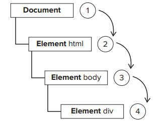

# JavaScript事件详解-原生事件基础（一）

> JavaScript与HTML之间的交互是通过事件实现的。事件，就是文档或浏览器窗口中发生的一些特定的交互瞬间，通过监听特定事件的发生，你能响应相关的操作。

# 事件流
主要是当时的IE团队提出的事件流逝是事件冒泡流，而Netscape提出的是事件捕获流,
可以使用DOM2级定义的*addEventListener()*方法来处理在冒泡或者捕获阶段调用事件处理程序。

## 事件冒泡
即事件开始时由最具体的元素（文档中嵌套最深的节点）接收，然后逐级向上传播到较为不具体的节点。


## 事件捕获
即最外层的元素更早接收到事件，而最具体的元素应该最后接收到事件。事件捕获的用意在于在事件到达预定目标之前捕获它。


## DOM事件流
而“DOM2级事件”规定的事件流包括三个阶段：事件捕获阶段，处于目标阶段和事件冒泡阶段。首先发生的是事件捕获，然后是实际的目标接收到事件，最后一个阶段是冒泡阶段。


addEventListener函数接收三个参数，要处理的事件名、作为事件处理程序的函数和一个布尔值，最后的布尔值如果是true，表示在不回阶段调用事件处理程序；如果是false，表示在冒泡阶段调用事件处理程序。

事件捕获：
```
//html
<!DOCTYPE html>
<html>
<head>
  <title></title>
</head>
<body>
  <div class="a">
    <div class="b">
      <button class="c">click</button>
    </div>
  </div>
</body>
</html>

var $body = document.querySelector("body"),
    $a = document.querySelector(".a"),
    $b = document.querySelector(".b"),
    $c = document.querySelector(".c");

$body.addEventListener("click",function(){
  console.log(this);
},true);
$a.addEventListener("click",function(){
  console.log(this);
},true);
$b.addEventListener("click",function(){
  console.log(this);
},true);
$c.addEventListener("click",function(){
  console.log(this);
},true);
```
单击button，则


事件冒泡：
```
$body.addEventListener("click",function(){
  console.log(this);
},false);
$a.addEventListener("click",function(){
  console.log(this);
},false);
$b.addEventListener("click",function(){
  console.log(this);
},false);
$c.addEventListener("click",function(){
  console.log(this);
},false);
```
单击button，则


上述代码在IE9和其他现代浏览器都支持(<a href="http://sandbox.runjs.cn/show/gqrwxmqi">测试页</a>)。IE8及更早版本不支持DOM事件流只有事件冒泡。所以我们有两个阶段可以在目标对象上操作事件，但为了兼容性考虑，一般用冒泡的情况比较多。

# 事件处理程序
事件是用户或浏览器自身执行的某种动作，而响应某个事件的函数就叫做**事件处理程序（或事件侦听器）**。

## HTML事件处理程序
即内联式处理函数，以"on"开头：
```
<button onclick="alert(this)"></button>
```

虽然方便，但有很大问题，首先，存在时差问题，因为用户可能会在HTML元素一出现在页面上就触发相应的事件，但当时的事件处理程序有可能尚不具备执行条件；另一个缺点是：这样扩展事件处理程序的作用域链在不同浏览器会导致不同结果；而最后的缺点则是HTML与JavaScript代码紧密耦合，如果要更换事件处理程序，就要改动两个地方。

## DOM0级事件处理程序
通过JavaScript指定事件处理程序的传统方式，就是将一个函数赋值给一个事件处理程序属性。
每个元素（包括window和docuemnt）都有自己的事件处理程序属性，这些属性通常全部小写：
```
var btn = document.getElementById('myBtn');
btn.onclick = function(){
  alert("Clicked");
}
```
以这种方式添加的事件处理程序会在事件流的冒泡阶段被处理。

## DOM2级事件处理程序
“DOM2级事件”定义了两个方法，用于处理指定和删除事件处理程序的操作：addEventListener()和removeEventListener()。所有DOM节点中都包含这两个方法，在上面的事件捕获和冒泡有用到。使用DOM2级方法添加事件处理程序的主要好处是可以添加多个事件处理程序。

## IE事件处理程序
IE实现的方法是:attachEvent()和detachEvent()。这两个方法接收相同的两个参数：事件处理程序名称与事件处理程序函数。通过attachEvent()添加的事件处理程序都会被添加到冒泡阶段：
```
var btn = document.getElementById("myBtn");
btn.attachEvent("onclick",function(){
  alert("Clicked");
})
```
这里的参数中表行为的是onclick而非DOM的addEventListener()方法中的click，在IE中使用attachEvent()与使用DOM0级方法的主要区别在于事件处理程序的作用域，在使用DOM0级方法的情况下，事件处理程序会在其所属元素的作用域内运行；在使用attachEvent()方法的情况下，事件处理程序会在全局作用域中运行，因此this等于window
```
var btn = document.getElementById("myBtn");
btn.attachEvent('onclick',function(){
  alert(this === window);// true
});
```

# 事件对象
在触发DOM上的某个事件时，会产生一个事件对象event，所有浏览器都支持event对象，但支持方式不同。

## DOM中的事件对象
event对象包含与创建它的特定事件有关的属性和方法。触发的事件类型不一样，可用的属性和方法也不一样。不过，所有事件都有下表的成员属性。

| 属性／方法 | 类型 | 读／写  | 说明|
| :----: |:----:| :----: | :----: |
| bubbles | boolean | 只读 | 表明事件是否冒泡|
| cancelable | boolean | 只读 | 表明是否可以取消事件的默认行为|
| currentTarget | element | 只读 | 其事件处理程序当前正在处理事件的那个元素|
| defaultPrevented | boolean | 只读 | 为true表示已经调用了preventDefault()DOM3新增|
| datail | integer | 只读 | 与事件相关的细节信息|
| eventPhase | integer | 只读 | 调用事件处理程序的阶段：1表示捕获阶段，2表示处于目标 3表示冒泡阶段 |
| preventDefault() | function | 只读 | 取消事件的默认行为。如果cancelable是true，则可以使用这个方法 |
| stopImmediatePropagation() | function | 只读 | 取消事件的进一步捕获或冒泡，同时阻止任何事件处理程序被调用（DOM3级新增） |
| stopPropagation() | function | 只读 | 取消事件的进一步捕获或冒泡，如果bubbles为true，则可以使用这个方法 |
| target | element | 只读 | 事件的目标 |
| isTrusted | boolean | 只读 | 返回一个布尔值，表明当前事件是否是由用户行为触发，还是由一个脚本生成的 |
| type | string | 只读 | 被触发的事件的类型 |
| view | AbstractView | 只读 | 与事件关联的抽象视图。等同于发生事件的window对象 |

更详细的文档可以看 <a href="https://developer.mozilla.org/zh-CN/docs/Web/API/Event">这里</a>

在事件处理程序内部，对象this始终等于currentTarget的值，而target则只包含事件的实际目标。如果直接将事件处理程序指定给了目标元素，则this，currentTarget和target包含相同的值。

根据event所拥有的属性，就可以更加细致的操作事件。在w3c的这篇<a href="https://www.w3.org/TR/DOM-Level-3-Events/#event-types">Events</a>中，我们可以知道哪些事件可以冒泡.
首先是冒泡事件，如果只需要在具体节点触发，而不冒泡到包裹层中，则可以使用与冒泡行为相关的一系列属性，举例：
```
<div class="a">
  <a href="http://www.cnblogs.com"></a>
</div>
```

在这个div中，如果div和a都有监听点击事件，那么在点击a标签的时候（默认事件流在已过捕获阶段），会先触发a的点击事件，然后是div的点击事件，最后是a标签的默认事件。如果不想冒泡，也就是说点击a时只触发a的点击事件，则可以使用stopPropagation()方法：
```
var $a = document.querySelector("a");
$a.addEventListener("click",function(event){
  if(event.bubbles){
    event.stopPropagation();
  }
});
```

也可以在处理程序里直接删除节点，也能阻止冒泡。
当然，有时我们不希望跳转页面，而是执行自定义的脚本，那就可以使用preventDefault()方法：
```
var $a = document.querySelector("a");
$a.addEventListener("click",function(event){
  if(event.bubbles){
    event.preventDefault();
    // do something
  }
});
```

有时我们可能会接手他人的代码，在不了解具体代码的情况下，如果只是单个独立事件需要修改，则可以在运行老的js代码之前，使用stopPropagation()方法。
```
$a.addEventListener('click',function(event){
  event.preventDefault();
  event.stopImmediatePropagation();
  // do something
})

$a.addEventListener("click",function(event){
  alert("这是a标签");
});
```

当然，冒泡并不是说是一件坏事，因为场景很多变，在某些场景下，冒泡也是很有用的，比如说事件代理（delegation）。
有时我们需要对生成的节点附加操作，event总是需要先找到element，再进行注册，才可以进行事件监听，那么对于这些生成的节点来说，当然可以在生成之后再次对该节点重新注册事件。但如果是生成了同一个标记的节点呢？
那么我们不仅需要把之前注册的事件remove，还需要重新绑定之前的标记，否则会二次触发。这时候事件代理
就可以解决这一类问题。根据DOM事件流，我们可以知道，在节点冒泡时，可以一直往上冒泡，所以，我们完全可以把事件代理给点击节点的父节点来做，根据event.target属性,我们可以知道**指向触发事件的对象**到底是谁，也因此，不用再使用繁琐的重新注册事件，就可以直接操作子元素。像jQuery，Zepto中都有关于事件代理的处理方法，后篇会继续涉及到。

```
$div.addEventListener("click",function(event){
  alert("这是外层");
  if(event.target) {
    event.target.style.visibility = 'hidden';
  }
});
```

冒泡也会有副作用，mouseout事件会导致离开内部节点时提前触发，为此，jQuery自定义了mouseenter和mouseleave事件，Zepto也有相应的事件。
*只有在事件处理程序执行期间，event对象才会存在；一旦事件处理程序执行完成，event对象就会被销毁(闭包)*

## IE中的事件对象
在IE中访问event，特别是IE6～8尤其注意，在使用DOM0级方法添加事件处理程序时，event对象作为window对象的一个属性存在。
```
var btn = document.getElementById('a');
btn.onclick = function(){
  var event = window.event;
  alert(event.type); //"click"
}
```

而IE中的event对象都会包含下表的属性和方法：

| 属性／方法 | 类型 | 读／写 | 说明 |
|:----:|:----:|:----:|:----:|
| cancelBubble | Boolean | 读／写 | 默认值为false，但将其设置为true就可以取消事件冒泡（与DOM中的stopPropagation()方法的作用相同） |
| returnValue | Boolean | 读／写 | 默认值为false，但将其设置为false就可以取消事件的默认行为（与DOM中的preventDefault()方法的作用相同） |
| srcElement | Element | 只读 | 事件的目标（与DOM中的target属性相同） |
| type | String | 只读 | 被触发的事件的类型 |

## 事件类型
不表

# 事件模拟
结合jQuery和Zepto源码总结。

部分用例：<a href="http://sandbox.runjs.cn/show/p9umvgvx">event</a>
