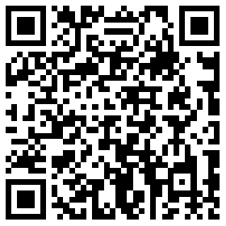
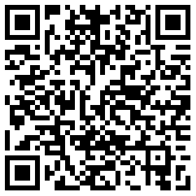

# 正文

> 本文讲解的Zepto版本是1.2.0，在该版本中的event模块与1.1.6基本一致。

# zepto的event

可以结合上一篇<a href="http://www.cnblogs.com/leomYili/p/6051527.html">JavaScript事件详解-原生事件基础（一）</a>综合考虑
源码暂且不表，github里还有中文网站都能下到最新版的zepto。整个event模块不长，274行，我们可以看到，整个event模块，事件绑定核心就是on和off，还有一个trigger用来触发，类观察者模式，可以先看看汤姆大叔的<a href="http://www.cnblogs.com/TomXu/archive/2012/03/02/2355128.html">深入理解JavaScript系列（32）：设计模式之观察者模式</a>，其余皆为实现的处理函数。
首先来个demo：
```
$("#btn").on("click",function(event){
  console.log(event);
})
```

一个简单的click事件监听示例。
根据event模块中对于事件的使用来看：


# on为开始（add）


可以看到，绑定函数有五个参数:

* event:事件类型，可以通过空格的字符串方式添加("click mousedown")，或者事件类型为键，函数为值的方式({click:function(),mousedown:function()})。
* selector:事件委托的节点选择器，可不传
* data:事件处理程序中的event.data属性
* callback:事件处理程序的回调函数
* one:绑定事件后，只触发一次回调

根据参数，我们可以很轻易的将**on**分为几部分（上图所示）:

1. 递归序列，处理event为键值对的情况
2. 简写方式，如果只是简单的事件和回调的话（$("#btn").on("click",function(){})）,one参数不参与简写形式，有单独的one()方法。
3. 循环zepto对象，因为这里的$this是zepto.init之后生成的对象，这里对于one和selector进行了autoRemove（只触发一次回调），delegetor（事件代理），然后是add（事件注册）

autoRemove,如果one为true，也就是只想使用一次，那么使用remove，并通过apply，给callback设立event对象；
而delegator中，如果selector是绑定元素的子节点，zepto以event.target为目标元素，判断是否触发节点的父级和传入的selector一致，上下文是遍历之后的节点。然后创建一个该事件对象的副本（createProxy），返回compatible()函数处理的event，当然，最后都会通过add()来进行注册:

首先是zid，zepto里面有个handlers对象，用于存放处理过的事件对象，_zid初始值为1，每次会按照值存入handlers，并且修改event对象中的_zid,每次存入的是一次绑定的所有事件:

因为每次使用$()创建的zepto对象都是新的，用handlers建立队列才能更好的进行管理。
之后就是对于以空白字符形式(/\s/)进行分割的字符串的处理,内部创建了*handle*，注意其parse方法是内部方法，而不是Date.parse()。

前面也说过，冒泡事件会有副作用，**mouseover**和**mouseout**，如果只是简单的节点，没有问题，但有了子节点之后。原先监听父节点的事件，会在鼠标移过去时再次触发。这是由于监听的是整个父节点，而移动到子节点时，子节点并没有事件，所以向上冒泡所造成的bug，而在DOM3级中，新定义了两个不冒泡的事件：mouseenter,mouseleave，使用这两个事件，可以解决这一问题。而在zepto中，使用了relatedTarget属性，并使用contains判断触发的节点在不属于移出（mouseover），移入（mouseout）时，才执行回调。且对不支持mouseenter和mouseleave事件的情况进行了兼容。

然后就是调用**addEventListener**，开始监听，这里没有做IE的兼容。事件句柄随着handler插入handles中，为之后的remove做准备。这里的proxy是对于event的扩充，也是添加了当return false时，调用
preventDefault()和stopPropagation()。

# off移除


可以看出来，和on是对应的写法，同样可以分三部分，只不过这里的功能是移除监听而已。

就直接到了remove，这里主要做的就是根据传入的event和selector，用findHandlers进行查找，然后删除handlers中对应的事件，同时调用**removeEventListener**来移除事件处理程序。

# $.Event自定义事件


这里使用的是createEvent()和initEvent()，这里的事件类型如果不是specialEvents中定义的MouseEvents，就会变成默认*Events*（DOM3）。
看下自定义的事件对象：


可以发现，因为使用compatible()封装了一下event，所以会有zepto新增的属性，以及我们传入的props属性。

# trigger触发

我们知道，DOM3级中提供的触发事件的api是dispatchEvent()(低版本IE中是fireEvent()),而zepto这里也是一样：


可以看出，对于参数event为对象时进行了处理，意味着可以直接使用trigger创建+触发，支持**dispatchEvent**的情况下，会直接触发，如果不是DOM节点，则使用triggerHandler()来触发。

# triggerHandler触发


可以看出，如果节点在之前绑定了其他事件处理程序且使用过stopImmdiatePropagation()，则也不会再触发自定义事件。
demo：


# $.proxy

这其实是个独立的函数，在add()函数中使用的proxy，是handler.proxy()函数，与这个无关。这个函数起到的作用很类似extend，只不过它扩展的是上下文（执行环境）。
我倒是觉得，最关键的就是
```
fn.apply(fn.apply(context, args ? args.concat(slice.call(arguments)) : arguments))

$.proxy.apply(null,args);
```
# 自模拟click事件

zepto实际是为了能在手机上轻量级的使用而创造的，为了使用上的不卡顿，手机上不能用click事件，有延时，原因不多说了，写个小demo，可以看看pc和手机的点击事件耗时区别：
<a href="http://sandbox.runjs.cn/show/4vzj8ni6">touch和click demo</a>


如果pc端，最好用chrome，没大考虑兼容。用开发者工具也能模拟touch事件。
所以zepto提供了touch模块，我先自己模拟了下tap事件，连着又自定义了一些事件：
<a href="http://sandbox.runjs.cn/show/n8sf6ovt">touch和tap demo</a>

我的思路是，touch事件触发的很快，那么就用touch事件来模拟click，以touchstart和touchend为开始和结束，只考虑了单指的情况，touch事件本身就有：
* touches：表示当前跟踪的触摸操作的touch对象的数组。
* targetTouches：特定于事件目标的touch对象的数组。
* changeTouches：表示自上次触摸以来发生了什么改变的touch对象的数组。
这三个数组里会包含下列属性：
* clientX：触摸目标在视口中的x坐标。
* clientY：触摸目标在视口中的y坐标。
* identifier：标识触摸的唯一ID。
* pageX：触摸目标在页面中的x坐标。
* pageY：触摸目标在页面中的y坐标。
* screenX：触摸目标在屏幕中的x坐标。
* screenY：触摸目标在屏幕中的y坐标。
* target：触摸的DOM节点目标。
在touchstart中可以使用touches，而在touchend里则没有touches数组信息了，用changeTouches来获取触摸结束时的信息。我主要使用了pageX和pageY，判断在250ms之下的情况里，如果手指在一个点上（我设了14px大小的范围，）touchstart加touchend都触发了，则为一次tap事件，还是用了creatEvent，所以返回的是一个自定义的tap事件

我没有把touch的属性填入自定义的事件里，就一层，所以也没考虑冒不冒泡了，后面可以完善下，tap倒是还好，dbltap稍稍耗了点时间。

# zepto的touch模块

整个touch模块也很简单，还是先从入口开始：

可以看到zepto新增了这些事件，并做了简写的处理，整个部分最重要的是给document绑定了**touch**,**MSpointer**,**pointer**,**MSGestureEvent**的触摸事件，不过上面的

来看，应该有setTimeout，下面的cancelAll()中也有使用clearTimeout。
先看touch事件，其他的反正是兼容。
zepto定义的局部变量touch中有四个值，x1,x2,y1,y2，应该是用来记录第一个触发的点和第二个触发的点，果然在监听touchmove事件的回调里，使用了两个点来计算偏移，不过这里是将途中所有偏移量都与初始值进行比较，然后汇总。
在touchend中，对于swipe(滑动)和tap(点击)进行了处理，因为deltaX和deltaY需要在30*30的范围内才会被触发，但是它的偏移量是move移动的总和，所以在触发时容错率低，也就是不好点出来，相比较其他操作而言。
在touchcancel的处理中，清除所有延迟操作。
同时其整个操作其实是绑定在了document上，所以使用时如果有其他的touch事件也绑定在了doucment上，并且取消了冒泡事件，则之后的所有操作都会失效。

# touch的点透

专门写了下demo来测试点透问题，<a href="http://sandbox.runjs.cn/show/wbkvcnjy">点透事件的发生</a>。这里也是之前的click300ms的延时带来的问题，如果最上层始终存在还好，就怕是点击消失的情况，那么如果上层用的是touch事件，下层是a标签，input或者绑定了click事件的节点，则也会被触发，只能说zepto的touch事件还需要我们自己来扩充和完善。
在通过对javaScript事件的详细学习之后，还是有很多途径去解决这个问题的，比如：
1. preventDefault()，来取消touchstart和touchend的默认事件。
2. 给两层之间加透明的中间层，用于阻止300ms之后的click传递到下层中。
3. pointer-events:none;该css3属性可以取消节点上的所有click事件。可惜浏览器支持不良好
4. fastclick,老早就想读下fastclick如何实现的，正好阅读一下。

# fastclick

使用十分简单，只要`FastClick.attach(document.body);`就好，在github上也介绍了另两种方法，可以不使用fastClick来快速点击。
;具体的可以直接去它的github地址看<a href="https://github.com/ftlabs/fastclick">https://github.com/ftlabs/fastclick</a>。
我修改了下之前的例子，新增了一个<a href="http://sandbox.runjs.cn/show/dbypaxqz">点击事件的例子</a>，可以看出，基本比touchend慢1ms。而且使用了click事件，所以也不存在点透事件。

同样从入口进入，在代码内部，先实例化FastClick()，它有两个参数：layer和options，layer也就是我们之前传的**document.body**,
在FastClick()函数中，可以先找到


相当于document.body上的节点的click，touch事件的监听都会被FastClick内部的事件给处理掉，如果layer上有onclick事件，同样会被oldOnClick复写。

在pc上不用多说，绑定操作的节点肯定先通过对click的监听来处理，


这里的trackingClick应该是如果之前页面中的touchend被UI事件阻塞（可以简单模拟下，也就是出现字符被选中的情况），重新置空它。
而在手机上，最先触发的操作必定是touchstart和touchmove，touchend。


这里的**targetElement**很重要，其实是上面提过的event的target，实际触摸的节点目标，这个属性会在接下来的move，end中用来判断是否中间换过节点，并在sendClick中用来真实的触发事件


返回touchstart中，兼容先不看，这里对于初始节点也做了存储，`touchStartX,touchStartY`。
而接下来的对于double-tap的处理，其实需要看需求，如果是默认值，那么200ms内的第二次点击会禁止触发其默认事件`event.preventDefault()`，在手机上就无法触发双击事件。

然后就是touchmove，这里倒是很短，只是对于targetElement做了个判断，是否是同一个触摸节点。


在touchend中，同样略过兼容不看，不过我倒是又学到了一个原生api，`document.elementFromPoint`,传入x，y来找到节点，只是认识了一下，实不实用不表。


其实一共有三种方式来操作fastclick内部自定义的事件，不过当targetTagName=label时，这里focus了一下，把这里的触发放到了needsClick中而已，而在这两块中，可以知道，如果给className中加入`needsFocus`和`needsClick`,则会中断fastclick，使用原生事件：

* needsFocus：第一个判断事件从touchstart到touchend是否超过100ms，则将targetElement置空，其实就是回归原来的方法，取消fastclick的事件。然后就是focus事件

这里使用了setSelectionRange(length,length)，先选中文本。

有兴趣的可以去MDN看，不过我测试了一下，上面的例子中有个input，其中确实会有<a href="http://www.cnblogs.com/vajoy/p/5522114.html#!/follow">http://www.cnblogs.com/vajoy/p/5522114.html#!/follow</a>提到的问题，在快速点击时光标会直接移到最后面，而上面传入的参数都是length，自然就跑到了最后面。
再通过sendClick来触发，就会有问题，而且在触发完自定义click之后，

取消了我们点击时带的focus操作，这里我先注释了一下代码，果然，光标先定到末尾，再定到正确位置，虽然上述博主的方法暂缓此问题，但在有些浏览器中仍然存在这一问题，并且实际上仍然是光标定到末尾，再定到正确位置，不如直接不用模拟的focus，作者自己的注释里说的是ios7中有问题，但focus中用的是deviceISIOS,而不是deviceIsIOSWithBadTarget，改这里也能解决问题。

* needsClick：这里首先preventDefault，再使用sendClick，上面稍微介绍了下，这里模拟的都是MouseEvents事件，使用targetElement来触发。

那么为何fastclick不穿透呢，我自然还是找代码中哪里用了**preventDefault**和**stopImmediatePropagation**,在onMouse中，还是防止快速点击而加的阻止操作，实际上阻止点透的仍然是needsClick中的`event.preventDefault()`，去掉之后，页面点击仍然会点透。

# 修改zepto的touch

知道了还是preventDefault()起了作用，我们再回头看touch模块，对比一下fastclick，其实两者的主体层都是差不多的，document和document.body实际在大多数情况下，可点击域都是一样，也就是说两者都绑定到了最外层上（近似），但fastclick提供了layer和options，意味着可以规避风险，而zepto的touch模块则直接绑定到了document之上，至少在使用上，并没有fastclick方便，不过其定义的各种touch动作，很有意义，在上面说过，在zepto解决点透，可以:
```
$("#btn").tap(function(){
  // do something
}).on('touchend',function(e){
  e.preventDefault();
});
```
在读源码时，layer绑定的部分，上面有图，确实会误导。因为实际上onClick是可以不走的，之所以在手机上触发的仍然是click事件，是因为在sendClick里直接使用dispatchEvent()触发了click，所以才会从fastclick定义的this.onClick()中走，其实这一部分可以和zepto一样放入touchend模块里面。
这么看，两个代码的核心其实大致相同，所不同的是fastclick中还加入的tap事件的**focus**方法，如果在zepto的touch中直接加入preventDefault()，则input无法获得焦点，所以可以引入focus事件，从而解决问题


可能会有兼容性的问题，对于blur()和focus()写完jQuery之后可以加入兼容性的写法。
现在就不会点透了。
还可以把touchstart，touchend操作放到具体的节点上，然后在节点中进行处理，不过这样会改动的比较大。zepto中有个方法$.proxy，放在这里有奇效，上面介绍过。

# 其他
至于说**delegate**,**undelegate**,**live**,**die**这些代理事件，还有**bind**,**unbind**等绑定操作，其实都是on在起作用，不细说。
之后是看看jQuery的事件操作，压力山大。
