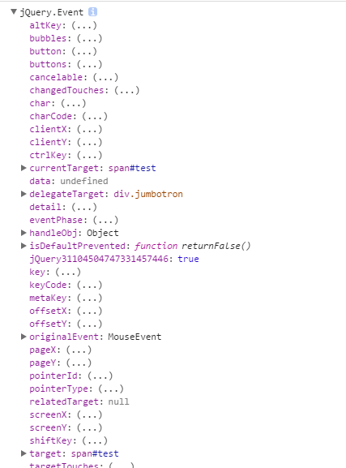

# 正文

> 本文所涉及到的jQuery版本是3.1.1，可以在压缩包中找到event模块

# Dean Edward的addEvent.js

相对于zepto的event模块来说，jQuery的event那真是难读了很多，先从大神Dean Edward的addEvent开始入手吧，地址在<a href="http://dean.edwards.name/weblog/2005/10/add-event/">这里</a>。源码不长

```
function addEvent(element,type,handler){
  if(element.addEventListener){
    element.addEventListener(type,handler,false);
  }else{
    if(!handler.$$guid) handler.$$guid = addEvent.guid++;
    if(!element.events) element.events = {};
    var handlers = element.events[type];
    if(!handlers){
      handlers = element.events[type] = {};
      if(element["on"+type]){
        handlers[0] = element["on"+type];
      }
    }
    handlers[handler.$$guid] = handler;
    element["on"+type]=handleEvent;
  }
}
```

作为主要的addEvent()部分，直接看不支持addEvenetListener的地方，可以看出，其对于事件句柄，**handler**作了处理，新增了$$guid的属性，在remove的时候会很方便。同时，在函数内部，以handlers来简化字节，实质上仍然操作的是element.events，然后使用"onXXX"的方式，来传递handleEvent()绑定事件。

在handleEvent中，

```
function handleEvent(event) {
  var returnValue = true;
  event = event || fixEvent(((this.ownerDocument || this.document || this).parentWindow || window).event);
  var handlers = this.events[event.type];
  for (var i in handlers) {
    this.$$handleEvent = handlers[i];
    // 执行
    if (this.$$handleEvent(event) === false) {
      returnValue = false;
    }
  }
  return returnValue;
};
```

可以看到，把addEvent中处理过的events进行使用，这里的this因为在addEvent()中使用了`element["on"+type]=handleEvent`，所以this在触发操作时变为element，当然，还有修复对象的fixEvent。
在对addEvent的评论中，建议元素分配一个UUID，所有回调放到一个对象中存储，也就是把events给抛开，而使用缓存来存储对应元素的回调列表。

# jQuery的event

如果和上一篇<a href="http://www.cnblogs.com/leomYili/p/6066663.html">JavaScript事件详解-zepto的事件实现（二）</a>相比较而言，在3.1.1版本中，入口推荐用on：

```
$("#btn").on("click",function(event){
  console.log(event);
});
```


可以看到event对象已经发生了变化，相对于zepto生成的一个新的事件对象而言，jQuery的event对象是重新修改的一个内部对象。

# 入口


跟事件绑定有关的入口,可以看出，bind和delegate内部仍然是用的on方法。

如果按上述的例子，那么在给$("#btn")注册click事件时，会通过jQuery.fn.on方法，然后调用jQuery内部的on()函数，

`function on(elem,types,selector,data,fn,one){...}`

elem参数不用说，在调用on()函数时，传了this过去，也就是**$("#btn")**，对外部开放的接口里，只有四个参数types,selector,data,fn。也因此，先从这四个参数入手：
* types，不如说event types更恰当，也就是上面例子中传的'click',可以用空格来分隔，一次传入多个事件类型
* selector，用于事件委托的选择符参数
* data，当一个事件被触发时要传递的data给事件处理函数，在回调的event中会有该属性，以便于使用
* fn，回调，事件句柄
在on()函数里，首先分层：


可以看到，省略的几个判断中，都是对于这些参数做的处理，第一个省略处是对于types的处理，其中对如果types是map类型的值做了处理，再次开始on()函数。
第二个省略处则是对于参数的简略使用，在代码中，可以看到其注释展示的三种情况：
```
// (types,fn)
// (types,selector,fn)
// (types,data,fn)
```
也相当于在使用时，我们可以略去data和selector来简单的完成一次绑定。
而第三处则是对one的判断，也就是在回调中加入了off()，即调用一次回调，立刻off event。
on()只是对于参数的处理，接下来就是使用jQuery.event.add()来再次进行处理。

如果说jQuery.Event是对event对象的校正，那么jQuery.event则是提供了内部方法：


首先是add(elem,types,handler,data,selector):
为什么add才是开始监听，因为只有在这里才能找到addEventListener，DOM0级的onXXX，和DOM2级的addEventListener，IE的attachEvent，来作为切入点。
在函数的初始，首先开始获取`elemData=dataPriv.get(elem)`,从字面意思看，这个应该是内部的缓存，也就是上面对于addEvent()所提到的缓存的回调列表。
作为缓存系统，确实有独到之处。

# cache

本来应该重开一章的，但是重点还是应该放到事件处理上，所以只是结合<a href="http://www.cnblogs.com/aaronjs/p/3370176.html">jQuery 2.0.3 源码分析 数据缓存</a>来说下自己的理解，以及相应的佐证。
首先就是内部的Data()函数，

*（3.1.1版本）*

这里确实不应该，最近一段时间任务蛮多的，也没有仔细读源码，看了一些文章后，先入为主的去找全局缓存去了，找啊找，还是*too young too simple*。对比一下也知道有问题撒。


*（2.1.1版本）*

才发现3.1.1版本中的Data已经没有了cache，之前会将事件存入cache中，只给每个dom节点一个uid来当作钥匙，获取数据，虽然两个版本大体结构都是创建了一个Data类，具有get，set方法，果然好久不打java，把面向对象全还给老师了，但不同的是3.1.1版本中则直接使用：


将其存入dom节点之中，这里看来需要深入理解下了，为什么3.0版本会把数据存入节点中？


我们再回到上文，继续add()。

# jQuery.event.add
现在就可以知道这个elemData从何处获取到事件。

初始状态第一次添加绑定时，所获取到的肯定是个空对象，而第二次再次绑定就可以拿到第一次绑定的行为的值，注意传的参数是**elem**。


然后除了对selector进行处理之外，还给事件句柄添加唯一的guid，看到上图，也知道在之后的处理中，会给elemData这个对象增加两个新的键：events和handle。
其中handle


可以看到这里修改事件句柄，所以addEvenetListener时，回调会从jQuery.event.dispatch中来触发。
这里的handlers仅仅是内部对象，用来建立内部队列。
add()函数剩下的则是根据参数的types的长度(“分隔符为空格”)来修改elemData.events的值，并且在事件初次绑定时，执行addEventListener()


## 这里有个special


可以看到这个对象中存入的其实是一些特殊的事件，每个事件都会有一些定义的属性，用于绑定，或判断.
```
if(!special.setup || special.setup.call(elem,data,namespaces,eventHandle) === false){
  if(elem.addEventListener){
    elem.addEventListener(type,eventHandle);
  }
}
```
进行绑定。
1. special.setup:初始化绑定
2. specia.delegateType : speacial.bindType:事件类型，在handleObj中会传入保存到dom节点里。
3. trigger:内部触发时使用的事件句柄，
4. _default:默认操作兼容
5. handle:只有这四个事件会有handle，同样是触发时的事件句柄
6. noBubble:防止image.load事件冒泡到window.load事件
7. preDispatch:在dispatch中截断，来执行该事件句柄
8. postDispatch:在dispatch内部的事件队列执行完毕之后，来执行该事件句柄
9. add:添加事件绑定
10. remove:解除事件绑定

## 之后就是handleObj
这个内部的对象保存了之后存入events中相应事件的值


可以看到，这里使用了jQuery的extend来扩展，可能存在的handleObjIn作为补充对象。

## 开始调用原生addEventListener进行监听


大部分还是会走原生事件监听方法，这里的handlers很有意思，不同于zepto使用handles作为内部队列，因为jQuery有缓存机制。

```
handlers = events[type] = [];
handlers.delegateCount = 0;
```
从这里可以得出在add内部，handlers引用的是events[type]，并且这个指针有一个`delegateCount`的属性，而在add的最后部分

将其按顺序推入处理列表中。因为只有满足`selector`存在的情况下，delegateCount才会开始增加，所以之后的handlers函数中可以看到相应的处理。
```
jQuery.event.global[type] = true
```
这里倒是不知道什么意思，不过至少记录了所有的监听事件名称

# jQuery.event.dispatch
remove其实和触发的事件流没有什么关系，所以还是以事件触发流程开始分析。
上文的add中，将事件句柄做了一次处理：
```
return typeof jQuery !== "undefined" && jQuery.event,triggered !== e.type ? jQuery.event.dispatch.apply(elem,arguments)
```
可以看到，dispatch一开始就会使用`jQuery.event.fix(nativeEvent)`来进行event对象修正。

## jQuery.event.fix 或者更直接是jQuery.Event()


可以看到，处理之后event就变为jQuery.event，fix只是检查相应对象上，是否有缓存对象，否则就新建一个Event类的实例。
不过3.1.1版本和2.1.1有点区别：

```
this.target = (src.target && src.target.nodeType === 3) ? src.target.parentNode : src.target;
this.currentTarget = src.currentTarget;
this.relatedTarget = src.relatedTarget;
```

修复文字不应该成为触发节点。

## 新增的jQuery.event.addProp()方法


可以看到，3.1版的event对外提供了event对象上所有属性的getter，setter方法

而在jQuery.Event的原型链中，其constructor被指回给了自己

还有相应的阻止冒泡，阻止默认动作的方法
其中**simulate**在8400多行，为`focus(in | out)`提供触发。
而**isSimulated**则处理这两个方法的阻止动作。

重新回到dispatch方法，校准过event之后，在内部定义的变量中，我们可以看到


这里又会去拿elem缓存中对应的事件，这里就是之前add时存入elem节点中的数据。
然后使用jQuery.event.handlers来组建事件队列，

先看事件队列处理完之后

其中：
```
ret = ((jQuery.event.special[handleObj.origType] || {}).handle || handleObj.handler).apply(matched.elem,args);
```
会执行回调函数。

dispatch中简单的逻辑说完了，如果以简单的绑定事件而言，已能够完成功能。但如果仅止于此，那么自然对不起jQuery事件模块的那么多行代码。

# 从全局角度来看jQuery.event

首先，用户通过注册jQuery.on方法开始生成事件，然后是add中`dataPriv.get(elem)`获取或设置缓存
并对handler做处理，并设置唯一的guid，在触发事件dispatch中，首先使用fix方法校准事件，然后生成事件队列。逐个开始执行


## jQuery.event.handlers


可以看到，如果delegeteCount为0，也就是没有委托，中间的处理则直接略过，其中的`cur=event.target`，即触发动作的节点，而在下面，很明显的cur又被指成了elem，返回的handlerQueue其实只是简单的将传入的参数做了个组装。


## 事件委托
简单的事件其实对于队列的要求不高，只要返回之后执行就好，但事件委托则不是这样，之前也介绍了zepto和原生事件里对于事件委托的处理，但jQuery的委托机制又格外不同。

在介绍jQuery.event.add()时的`addEventListener(type,eventHandle)`,所传的事件句柄


重新写个事件委托的例子
```
$(".jumbotron").on("click","#test",function(e){
  console.log("test");
}).on("click",function(e){
  console.log("demo")
})
```

接着上面的handlers事件来讲，当有委托元素，也就是selector不为空时，则进入判断体之中：
```
if(delegateCount && cur.nodeType && !(event.type === "click" && event.button >=1 ))
```
防止火狐中右键或中键点击时，会冒泡到document的click事件，
然后是
```
for(;cur !== this;cur = cur.parentNode || this)
```
cur会不断的往上遍历，去寻找绑定事件的节点，这里通过循环来模仿冒泡机制，

然后查找节点，将回调函数加入到matchedSelectors之中，并返回经过验证的事件队列。
如果按照上面那个例子来说，点击`#test`元素时，所生成的事件队列就是：

而在执行相关的事件时，也会从`test`元素先开始触发回调，然后是`jumbotron`。

也因此，会发现其实都是一样的思路，在委托元素上，都是判断触发的元素是否在绑定的元素之中，再由内而外的开始执行事件。
当然，在执行事件队列时，也要注意，jQuery这里的处理方法

能够使得回调中的this就是selector的节点。
而各种处理兼容性的special事件，则更需要对各个浏览器操作时的差异有足够的理解。

# 小结
这次的阅读不大顺利，中间工作比较忙，自己也确实是比较懒，所以进展比较慢，像模拟事件都没有想好怎么写，不过也确实让自己多想想该怎么归纳知识点，中间很多的思绪和时间都浪费掉了，看来还是单独分小章节写比较适合节奏。
