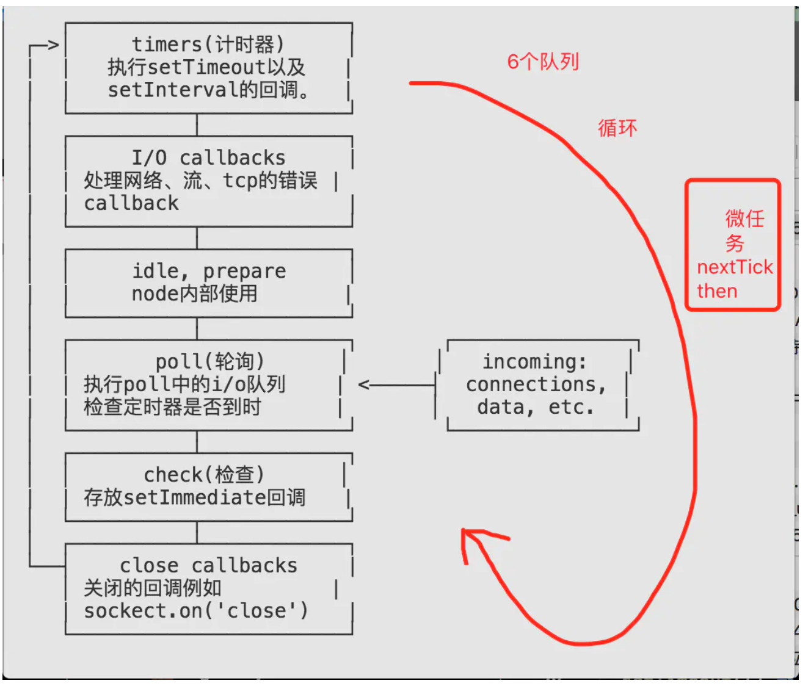

# 正文

> 实际上,在我们平时的编码过程中,最习以为常也最容易忽视的,就是编程的执行顺序,在我们熟悉编程以及使用语言进行编程的过程中,或多或少都会受到很强烈的影响,那么,了解并掌握它就是我们接下来要做的事情

## 什么是eventLoop

具体的操作步骤如下：

从宏任务的头部取出一个任务执行；
执行过程中若遇到微任务则将其添加到微任务的队列中；
宏任务执行完毕后，微任务的队列中是否存在任务，若存在，则挨个儿出去执行，直到执行完毕；
GUI 渲染；
回到步骤 1，直到宏任务执行完毕；

这 4 步构成了一个事件的循环检测机制，即我们所称的eventloop。

整个js这种运行机制又称为Event Loop(事件循环)

## EventLoop又分为浏览器端和node端两种

```()
setTimeout(() => {
    console.log(1)
    Promise.resolve(3).then(data => console.log(data))
}, 0)

setTimeout(() => {
    console.log(2)
}, 0)
//浏览器 1 3 2
//node 1 2 3
```

## 浏览器EventLoop

### 微任务和宏任务

微任务 Promise的then， (MutationObserver)
宏任务 setInterval, setTimeout, setImmediate(ie), MessageChannel

## node端的EventLoop



timers： 定时器setTimeout和seInterval的执行，将callback加入队列中。
pending callbacks： 一些I/O的callback，推迟到下一次循环中执行。
idle, prepare： 内部的一些事件。
poll： 轮循，i/o，回调，fs.readFile()。
check： setImmediate的callback执行。
close callbacks： 一，些关闭的回调函数，如socket。

其实我们需要关心的就是timers、poll、check这三个阶段。下面我们来说一下它们的执行顺序。默认，会从上到下依次执行，如果代码执行到poll后，发现check阶段没有，那就在poll在等待，等待times时间到达后，再清空代码。直到队列发生切换时，就会执行微任务。poll的下一个阶段就是check，如果check队列中有东西的，会先执行check。

setTimeout 和 setImmediate 执行顺序不固定 取决于node的准备时间

setImmediate 设计在poll阶段完成时执行，即check阶段；
setTimeout 设计在poll阶段为空闲时，且设定时间到达后执行；但其在timer阶段执行 其二者的调用顺序取决于当前event loop的上下文，如果他们在异步i/o callback之外调用（在i/o内调用因为下一阶段为check阶段），其执行先后顺序是不确定的,需要看loop的执行前的耗时情况

上图每一个方框都对应一个事件队列,当event loop执行到某个阶段时会将当前阶段对应的队列依次执行。当队列执行完毕或者执行的数量超过上线时,会转入下一个阶段
微任务是在切换对列是执行
