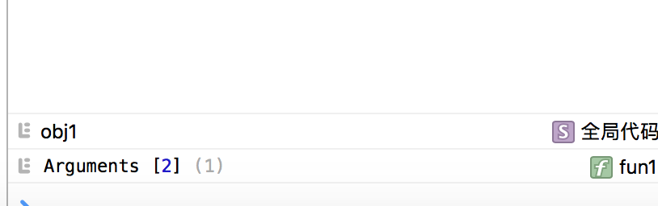

#正文

> 作为日常的知识点的收集和整理

# javaScript函数参数传值的方式
我们都知道,JavaScript的变量包括基本类型和引用类型,5种基本数据类型:
* Undefined
* Null
* Boolean
* Number
* String
一般来说,引用类型的值是保存在内存中的对象.而JavaScript不允许直接访问内存中的位置,所以,操作对象时,实际上操作的是对象的引用而不是实际的对象,因此,如果使用下面的案例:
```
var obj1 = new Object();
var obj2 = obj1;

obj1.name = "test";
alert(obj2.name);// test
```
就是因为引用类型的值在使用时,实际上起到的是指针的作用,最终都会指到同一个地址上,所以,值会出现同步的情况.
不过可以通过下面的一个小例子<a href="http://sandbox.runjs.cn/show/njluuc3o">函数复制</a>
,说明了对象中的基本类型不受引用类型的影响,可以查看之前对于<a href="http://www.cnblogs.com/leomYili/p/6019502.html">jquery和zepto的扩展方法extend</a>的解析来更好的了解值复制的内容.

而传递参数时,都是按值传递的.
我们知道,函数中的参数,传递时,实际上会当做arguments对象中的一个元素.

```
var obj = {};
function func1(obj){
    obj.name = "test"
}
func1(obj);
console.log(obj.name); // test
```
而如果
```
function func1(obj){
    obj = {
        name:"test"
    }
}
```
则obj.name就为`Undefined`了,是因为这里的传参,对于引用类型来说,实际上传参时,传递的是存储空间的地址的副本,如果修改了该副本的指向,那么局部的变量自然就不会影响外部的变量了.

# http协议

首先复习下OSI七层协议,从上到下:
7. 应用层,http,ftp
6. 表示层,数据加密和定义
5. 会话层,维持数据的传输,或者就是数据体
4. 传输层,tcp
3. 网络层,常见设备,路由器,ip
2. 数据链路层,又称网络接口层,最常见设备,网卡
1. 物理层:物理层为设备之间的数据通信提供传输媒体及互连设备，为数据传输提供可靠的环境。物理设备

而http作为应用层中的其中一种协议，即超文本传输协议(Hypertext transfer protocol)。是一种详细规定了浏览器和万维网(WWW = World Wide Web)服务器之间互相通信的规则，通过因特网传送万维网文档的数据传送协议。
HTTP是一个应用层协议，由请求和响应构成，是一个标准的客户端服务器模型。HTTP是一个无状态的协议。

在Internet中所有的传输都是通过TCP/IP进行的。HTTP协议作为TCP/IP模型中应用层的协议也不例外。HTTP协议通常承载于TCP协议之上，有时也承载于TLS或SSL协议层之上，这个时候，就成了我们常说的HTTPS。

http默认的端口号为80,https默认的端口号为443

## 特点
HTTP协议永远都是客户端发起请求，服务器回送响应。这样就限制了使用HTTP协议，无法实现在客户端没有发起请求的时候，服务器将消息推送给客户端。

## 无状态协议：
协议的状态是指下一次传输可以“记住”这次传输信息的能力。
http是不会为了下一次连接而维护这次连接所传输的信息,为了保证服务器内存。
比如客户获得一张网页之后关闭浏览器，然后再一次启动浏览器，再登陆该网站，但是服务器并不知道客户关闭了一次浏览器。

HTTP是一个无状态的面向连接的协议，无状态不代表HTTP不能保持TCP连接
从HTTP/1.1起，默认都开启了Keep-Alive，保持连接特性，简单地说，当一个网页打开完成后，客户端和服务器之间用于传输HTTP数据的TCP连接不会关闭，如果客户端再次访问这个服务器上的网页，会继续使用这一条已经建立的连接。
Keep-Alive不会永久保持连接，它有一个保持时间，可以在不同的服务器软件（如Apache）中设定这个时间。

解决无状态协议:通过cookie,通过session

Cookie和Session有以下明显的不同点：
1）Cookie将状态保存在客户端，Session将状态保存在服务器端；
2）Cookies是服务器在本地机器上存储的小段文本并随每一个请求发送至同一个服务器。Cookie最早在RFC2109中实现，后续RFC2965做了增强。网络服务器用HTTP头向客户端发送cookies，在客户终端，浏览器解析这些cookies并将它们保存为一个本地文件，它会自动将同一服务器的任何请求缚上这些cookies。Session并没有在HTTP的协议中定义；
3）Session是针对每一个用户的，变量的值保存在服务器上，用一个sessionID来区分是哪个用户session变量,这个值是通过用户的浏览器在访问的时候返回给服务器，当客户禁用cookie时，这个值也可能设置为由get来返回给服务器；
4）就安全性来说：当你访问一个使用session 的站点，同时在自己机子上建立一个cookie，建议在服务器端的SESSION机制更安全些。因为它不会任意读取客户存储的信息。

## 工作流程
一次HTTP操作称为一个事务，其工作过程可分为四步：
1）首先客户机与服务器需要建立连接。只要单击某个超级链接，HTTP的工作开始。
2）建立连接后，客户机发送一个请求给服务器，请求方式的格式为：统一资源标识符（URL）、协议版本号，后边是MIME信息包括请求修饰符、客户机信息和可能的内容。
3）服务器接到请求后，给予相应的响应信息，其格式为一个状态行，包括信息的协议版本号、一个成功或错误的代码，后边是MIME信息包括服务器信息、实体信息和可能的内容。
4）客户端接收服务器所返回的信息通过浏览器显示在用户的显示屏上，然后客户机与服务器断开连接。
如果在以上过程中的某一步出现错误，那么产生错误的信息将返回到客户端，有显示屏输出。对于用户来说，这些过程是由HTTP自己完成的，用户只要用鼠标点击，等待信息显示就可以了。

# https
简单讲是HTTP的安全版。即HTTP下加入SSL层，HTTPS的安全基础是SSL.

# javaScript的全局函数
通常意义上来说,全局对象在JavaScript中,属于不存在的对象:所有在全局作用域中定义的属性和方法,最终都是Global对象的属性;

## uri(Uniform Rescource Identifiers)编码
有encodeURI(),encodeURIComponent()方法对于URI进行编码,它们用特殊的UTF-8编码替换所有无效的字符,从而让浏览器能够接受和理解.
* encodeURI()不会对本身属于URI的特殊字符进行编码,例如冒号,正斜杠,问号和井字号进行编码.
* encodeURIComponent()则对整个url进行编码,任何非标准字符都会产生新的符号.

与之相对的是decodeURI()和decodeURIComponent()

## eval()
用来解析传入的JavaScript字符串,相当于一个解析器,可以用来代码注入.

## Global的所有属性
<table><thead><tr><td>属性</td><td>说明</td><td>属性</td><td>说明</td></tr></thead><tbody><tr><td>undefined</td><td>特殊值undefined</td><td>Date</td><td>构造函数Date</td></tr><tr><td>NaN</td><td>特殊值NaN</td><td>RegExp</td><td>构造函数RegExp</td></tr><tr><td>Infinity</td><td>特殊值Infinity</td><td>Error</td><td>构造函数Error</td></tr><tr><td>Object</td><td>构造函数Object</td><td>EvalError</td><td>构造函数EvalError</td></tr><tr><td>Array</td><td>构造函数Array</td><td>RangeError</td><td>构造函数RangeError</td></tr><tr><td>Function</td><td>构造函数Function</td><td>ReferenceError</td><td>构造函数ReferenceError</td></tr><tr><td>Boolean</td><td>构造函数Boolean</td><td>SyntaxError</td><td>构造函数SyntaxError</td></tr><tr><td>String</td><td>构造函数String</td><td>TypeError</td><td>构造函数TypeError</td></tr><tr><td>Number</td><td>构造函数Number</td><td>URIError</td><td>构造函数URIError</td></tr></tbody></table>

## Math
还包括一个公共对象Math,用来存放数学公式和信息.

## Window
因为Global都是被当做window对象的一部分加以实现的,所以,在全局作用域中声明的所有变量和函数,就都成为了window对象的属性.

# 惰性载入函数
针对于每一次载入页面时,可能存在的大量嵌套或者重复判断,并且该函数使用次数不高,使用惰性载入方法,避免内存的不必要消耗.

## 在函数被调用时再处理函数
```
function demo(){
    if(typeof str != undefined){
        if(typeof str == "string"){
            demo = function(){
                return 1;
            }
        }else if(typeof str == "num"){
            demo = function(){
                return 2;
            }
        }
    }else {
        demo = function(){
            throw new Error("没有参数");
        }
    };
    return demo;
}
```
这样,只要该函数,通过判断之后,下次再使用该函数,就直接不用再通过判断了.

## 在声明函数时就指定适当的函数
其实相当于,在开始加载代码时,就自执行一遍函数,直接赋值给函数,实际上,创建个匿名自执行函数就好了.
```
var demo = (function(){
    return function(){};
})();
```

# call和apply
不要忽略其最基本的调用函数的作用

# undefined和void 0
js里所有的void + 表达式,都会返回undefined,而undefined是可以被当成对象来重写的.所以使用void + 表达式就可以避免这个问题

# 声明提升
函数声明会提升到最前面开始执行.当然,作为函数表达式,并不会声明提升

而变量的声明提升则更加奇怪,引擎解释javascript代码的之前会对其进行编译。在编译过程中会查找所有声明，并用合适作用域将他们关联起来。换句话说，在代码执行之前，会对作用域链中所有变量和函数声明先处理完.
总结就是只有声明被提升，而赋值或其他运算会留在原地
```
var name = "world";
(function () {
if (typeof name == 'undefined') {
var name = 'yang';
console.log('Hello ' + name)
} else {
console.log('Hello ' + name)
}
})()
```
而如果在函数的作用域中,则应该为:
```
var name = "world";
(function () {
var name;
if (typeof name == 'undefined') {
var name = 'yang';
console.log('Hello ' + name)
} else {
console.log('Hello ' + name)
}
})()
```