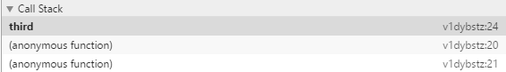
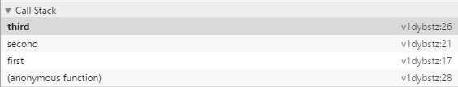
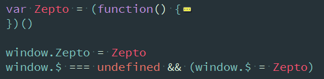

# 函数表达式

> 在编程时，我们可以看到不管是什么类库，jquery也好，zepto也好，都会用到大量的命名函数和匿名函数表达式，本节点就是为了弄懂为何会有这些函数表达式，以及在什么情况下会使用到这些表达式。

在之前，通过对于高级程序设计的学习，定义函数的方式有两种

## 函数声明和函数表达式

首先是函数声明：
```
  //函数声明
  function functionName(arg0,arg1,arg2){}
```
在这里，有个functionName，FireFox、Safari、Chrome和Opera都给函数定义了一个非标准的name属性，而在ie中不支持这个属性。
而关于函数声明，它的一个重要特征就是**函数声明提升**，意思是在执行代码之前会先读取函数声明。这就意味着可以把函数声明放在调用它的语句后面。在使用函数声明时，因为没有被标准化的原因，最好不要在Block（{...}）出现
```
  sayHi();

  function sayHi(){
    alert("Hi!");
  }
```

第二种就是函数表达式，函数表达式有几种不同的语法形式，首先是：
```
  var functionName = function(arg0,arg1,arg2){}
```
这种形式看起来好像是常规的变量赋值语句，即创建一个函数并将它赋值给变量functionName的，就叫做**匿名函数**，匿名函数的name属性是空字符串。

那么，可以看出，在不声明函数名称的情况下，该函数一定是表达式，而如果声明了函数名称的话，则可以通过上下文来区分，如果function是作为复制表达式的一部分的话，那它就是函数表达式，如果function被包含在一个函数体内或处于局域内，则是函数声明。
除了什么时候可以通过变量访问函数这一点区别之外，函数声明与函数表达式的语法其实是等价的。

## 命名函数表达式
对于命名函数表达式来说，首先要明确为什么需要使用这种方式来定义函数表达式，在现代浏览器里，会有调试器，其中可以给我们写的函数取名并显示，所以命名函数可以方便调试时搞清楚调用栈的顺序，这点在判断bug方向上可能会尤其有效
```
  //首先举匿名函数实例
  function first(){
    return second();
  }
  var second = (function(){
    return third();
  })();

  function third(){
    debugger;
  }
  first();
```

一共有三次调用,可以看到调用栈中会有两个未知函数。
```
  function first(){
    return second();
  }
  var second = (function(){
    return function second(){
      return third();
    }
  })();

  function third(){
    debugger;
  }
  first();
```

一共有四次调用，但已经可以看到调用顺序。

而在ie的低版本浏览器中，命名函数表达式是可以访问到的
```
var test = function g(){};
document.write(typeof g);//ie中为function
```

所以可以使用一种方法

## 模仿块级作用域
JavaScript没有块级作用域的概念，因为JavaScript从来都不会告诉我们是否多次声明了同一个变量，所以需要在使用时多加注意。
```
function output(){
  for(var i=0;i<3;i++){
    document.write(i);
  }

  document.write(i);
}
//012 3
```
而使用匿名函数可以来模仿块级作用域：
```
(function(){
  //块级作用域
})();
```
以上代码定义并立即调用了一个匿名函数，将函数声明包含在一对圆括号中，表示它实际上是一个函数表达式。
而之所以不能使用
```
function(){
  //
}();
```
则是因为JavaScript将function关键字当作一个函数声明的开始，而函数声明后面不能跟圆括号，而函数表达式的后面就可以跟圆括号，这些定义在匿名函数中的变量，都会在执行结束时被销毁（没有指向匿名函数的引用）。

zepto


## 没有块级作用域
主要是其它语言的花括号封闭的代码块,都有自己的作用域(在外部无法访问到内部定义的变量),但javaScript则不会有这种结果;

```
if(true){
  var i=0;
}
console.log(i);// 0
```
只有执行环境,而没有块级作用域,是javaScipt的特点(缺点?)

## 闭包
闭包是指有权访问另一个函数作用域中的变量的函数.因为JavaScript的函数内部所定义的变量实际上都处于局部环境中,在函数执行完毕之后就会被销毁,而如果不想让其中的变量销毁,则需要保持对其内部函数的引用.

demo1:如何判断变量被销毁?
```
// 如果每次使用函数,其返回值都一样,则说明该变量是在执行完之后就被销毁了
function demo1(){
  var i=0;
  return i;
}

console.log(demo1());// 0;
console.log(demo1());// 0;

function demo2(){
  var i=0;
  return function(){
    return i++;
  }
};

var a = demo2();
console.log(typeof a);// func
console.log(a());// 0
console.log(a());// 1
```

当然,使用闭包也需要注意,因为javaScript的链式调用,实际上,能够请求到的局部变量的状态始终都是最后一个.
还要注意,闭包的this对象是指执行环境的this,而不是能够访问的函数的this.

## 小结
该章节主要讲述了本人对于函数表达式的相关认知；开始整理一年来的收获与总结。
