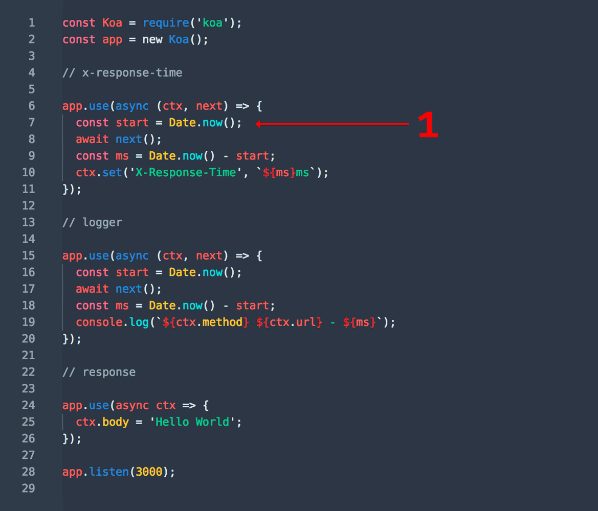

# 正文

## 简介


在koa中，请求响应都放在中间件的第一个参数context对象中了。

再引用Koa中文文档中的一段：

如果您是前端开发人员，您可以将 next(); 之前的任意代码视为“捕获”阶段，这个简易的 gif 说明了 async 函数如何使我们能够恰当地利用堆栈流来实现请求和响应流：



1. 创建一个跟踪响应时间的日期
2. 等待下一个中间件的控制
3. 创建另一个日期跟踪持续时间
4. 等待下一个中间件的控制
5. 将响应主体设置为“Hello World”
6. 计算持续时间
7. 输出日志行
8. 计算响应时间
9. 设置 X-Response-Time 头字段
10. 交给 Koa 处理响应

## 先看看 new Koa() 结果app是什么

```()
// 文件 koa/examples/middleware/app.js
const Koa = require('../../lib/application');

// const Koa = require('koa');
// 这里打个断点
const app = new Koa();
// x-response-time

// 这里打个断点
app.use(async (ctx, next) => {

});
```

## koa 主流程梳理简化

```()
class Emitter{
  // node 内置模块
  constructor(){
  }
}
class Koa extends Emitter{
  constructor(options){
    super();
    options = options || {};
    this.middleware = [];
    this.context = {
      method: 'GET',
      url: '/url',
      body: undefined,
      set: function(key, val){
        console.log('context.set', key, val);
      },
    };
  }
  use(fn){
    this.middleware.push(fn);
    return this;
  }
  listen(){
    const  fnMiddleware = compose(this.middleware);
    const ctx = this.context;
    const handleResponse = () => respond(ctx);
    const onerror = function(){
      console.log('onerror');
    };
    fnMiddleware(ctx).then(handleResponse).catch(onerror);
  }
}
function respond(ctx){
  console.log('handleResponse');
  console.log('response.end', ctx.body);
}
```

重点就在listen函数里的compose这个函数，接下来我们就详细来欣赏下这个函数。

### koa-compose 源码（洋葱模型实现）

通过app.use() 添加了若干函数，但是要把它们串起来执行呀。像上文的gif图一样。

compose函数，传入一个数组，返回一个函数。对入参是不是数组和校验数组每一项是不是函数。

```()
function compose (middleware) {
  if (!Array.isArray(middleware)) throw new TypeError('Middleware stack must be an array!')
  for (const fn of middleware) {
    if (typeof fn !== 'function') throw new TypeError('Middleware must be composed of functions!')
  }

 //  传入对象 context 返回Promise
  return function (context, next) {
    // last called middleware #
    let index = -1
    return dispatch(0)
    function dispatch (i) {
      if (i <= index) return Promise.reject(new Error('next() called multiple times'))
      index = i
      let fn = middleware[i]
      if (i === middleware.length) fn = next
      if (!fn) return Promise.resolve()
      try {
        return Promise.resolve(fn(context, dispatch.bind(null, i + 1)));
      } catch (err) {
        return Promise.reject(err)
      }
    }
  }
}
```

你会发现compose就是类似这样的结构（移除一些判断）。

```()
// 这样就可能更好理解了。
// simpleKoaCompose
const [fn1, fn2, fn3] = this.middleware;
const fnMiddleware = function(context){
    return Promise.resolve(
      fn1(context, function next(){
        return Promise.resolve(
          fn2(context, function next(){
              return Promise.resolve(
                  fn3(context, function next(){
                    return Promise.resolve();
                  })
              )
          })
        )
    })
  );
};
fnMiddleware(ctx).then(handleResponse).catch(onerror);
```

也就是说koa-compose返回的是一个Promise，Promise中取出第一个函数（app.use添加的中间件），传入context和第一个next函数来执行。

第一个next函数里也是返回的是一个Promise，Promise中取出第二个函数（app.use添加的中间件），传入context和第二个next函数来执行。

第二个next函数里也是返回的是一个Promise，Promise中取出第三个函数（app.use添加的中间件），传入context和第三个next函数来执行。

第三个...

以此类推。最后一个中间件中有调用next函数，则返回Promise.resolve。如果没有，则不执行next函数。
这样就把所有中间件串联起来了。这也就是我们常说的洋葱模型。

## 错误处理

仔细看文档，文档中写了三种捕获错误的方式。

1. ctx.onerror 中间件中的错误捕获
2. app.on('error', (err) => {}) 最外层实例事件监听形式，也可以看看例子koajs/examples/errors/app.js 文件
3. app.onerror = (err) => {} 重写onerror自定义形式

也可以看测试用例 onerror

```()
// application.js 文件
class Application extends Emitter {
  // 代码有简化组合
  listen(){
    const  fnMiddleware = compose(this.middleware);
    if (!this.listenerCount('error')) this.on('error', this.onerror);
    const onerror = err => ctx.onerror(err);
    fnMiddleware(ctx).then(handleResponse).catch(onerror);
  }
  onerror(err) {
    // 代码省略
    // ...
  }
}
```

### ctx.onerror

lib/context.js文件中，有一个函数onerror，而且有这么一行代码this.app.emit('error', err, this)。

```()
module.exports = {
  onerror(){
    // delegate
    // app 是在new Koa() 实例
    this.app.emit('error', err, this);
  }
}
app.use(async (ctx, next) => {
  try {
    await next();
  } catch (err) {
    err.status = err.statusCode || err.status || 500;
    throw err;
  }
});
```

try catch 错误或被fnMiddleware(ctx).then(handleResponse).catch(onerror);，这里的onerror是ctx.onerror

而ctx.onerror函数中又调用了this.app.emit('error', err, this)，所以在最外围app.on('error'，err => {})可以捕获中间件链中的错误。
因为koa继承自events模块，所以有'emit'和on等方法）

## koa2 和 koa1 的简单对比

koa1中主要是generator函数。koa2中会自动转换generator函数。

```()
// Koa 将转换
app.use(function *(next) {
  const start = Date.now();
  yield next;
  const ms = Date.now() - start;
  console.log(`${this.method} ${this.url} - ${ms}ms`);
});
```

新的中间件签名
Koa v2 引入了新的中间件签名。

旧签名中间件（v1.x）支持将在 v3 中删除

升级中间件可能需要一些工作。 一个迁移方式是逐个更新它们。

将所有当前的中间件包装在 koa-convert 中
测试
npm outdated 看看哪个 koa 中间件已经过时了
更新一个过时的中间件，使用 koa-convert 删除
测试
重复步骤3-5，直到完成

升级你的代码
您应该开始重构代码，以便轻松迁移到 Koa v2：

各处都是 promises 返回!
不要使用 yield*
不要使用 yield {} 或 yield [].
转换 yield [] 为 yield Promise.all([])
转换 yield {} 为 yield Bluebird.props({})
您也可以重构 Koa 中间件功能之外的逻辑。 创建一个方法像 function* someLogic(ctx) {} 然后在你的中间件中调用 const result = yield someLogic(this). 不使用 this 将有助于迁移到新的中间件签名，所以不使用 this。

应用对象构造函数需要 new

删除 ENV 特定的日志记录行为

对于 test 环境的显式检查从错误处理中删除。

## co 源码

简单来说co，就是把generator自动执行，再返回一个promise。
generator函数这玩意它不自动执行呀，还要一步步调用next()，也就是叫它走一步才走一步。

所以有了async、await函数。

也就是说co需要做的事情，是让generator向async、await函数一样自动执行。

### 模拟实现简版 co（第一版）

```()
// 获取generator的值
function* generatorFunc(){
  const res = yield request();
  console.log(res, 'generatorFunc-res');
}

function coSimple(gen){
  gen = gen();
  console.log(gen, 'gen');

  const ret = gen.next();
  const promise = ret.value;
  promise.then(res => {
    gen.next(res);
  });
}
coSimple(generatorFunc);
// 输出了想要的结果
// {name: "若川"}"generatorFunc-res"
```

### 模拟实现简版 co（第二版）

但是实际上，不会上面那么简单的。有可能是多个yield和传参数的情况。
传参可以通过这如下两行代码来解决。

```()
const args = Array.prototype.slice.call(arguments, 1);
gen = gen.apply(ctx, args);

// 多个yeild，传参情况
function* generatorFunc(suffix = ''){
  const res = yield request();
  console.log(res, 'generatorFunc-res' + suffix);

  const res2 = yield request();
  console.log(res2, 'generatorFunc-res-2' + suffix);
}

function coSimple(gen){
  const ctx = this;
  const args = Array.prototype.slice.call(arguments, 1);
  gen = gen.apply(ctx, args);
  console.log(gen, 'gen');

  const ret = gen.next();
  const promise = ret.value;
  promise.then(res => {
    const ret = gen.next(res);
    const promise = ret.value;
      promise.then(res => {
        gen.next(res);
      });
  });
}

coSimple(generatorFunc, ' 哎呀，我真的是后缀');
```

### 最终来看下co源码

这时来看看co的源码，报错和错误的情况，错误时调用reject，是不是就好理解了一些呢。

```()
function co(gen) {
  var ctx = this;
  var args = slice.call(arguments, 1)

  // we wrap everything in a promise to avoid promise chaining,
  // which leads to memory leak errors.
  // see https://github.com/tj/co/issues/180
  return new Promise(function(resolve, reject) {
    // 把参数传递给gen函数并执行
    if (typeof gen === 'function') gen = gen.apply(ctx, args);
    // 如果不是函数 直接返回
    if (!gen || typeof gen.next !== 'function') return resolve(gen);

    onFulfilled();

    /**
     * @param {Mixed} res
     * @return {Promise}
     * @api private
     */

    function onFulfilled(res) {
      var ret;
      try {
        ret = gen.next(res);
      } catch (e) {
        return reject(e);
      }
      next(ret);
    }

    /**
     * @param {Error} err
     * @return {Promise}
     * @api private
     */

    function onRejected(err) {
      var ret;
      try {
        ret = gen.throw(err);
      } catch (e) {
        return reject(e);
      }
      next(ret);
    }

    /**
     * Get the next value in the generator,
     * return a promise.
     *
     * @param {Object} ret
     * @return {Promise}
     * @api private
     */

    // 反复执行调用自己
    function next(ret) {
      // 检查当前是否为 Generator 函数的最后一步，如果是就返回
      if (ret.done) return resolve(ret.value);
      // 确保返回值是promise对象。
      var value = toPromise.call(ctx, ret.value);
      // 使用 then 方法，为返回值加上回调函数，然后通过 onFulfilled 函数再次调用 next 函数。
      if (value && isPromise(value)) return value.then(onFulfilled, onRejected);
      // 在参数不符合要求的情况下（参数非 Thunk 函数和 Promise 对象），将 Promise 对象的状态改为 rejected，从而终止执行。
      return onRejected(new TypeError('You may only yield a function, promise, generator, array, or object, '
        + 'but the following object was passed: "' + String(ret.value) + '"'));
    }
  });
}
```

## koa与express简单对比

在理念上，Koa 旨在 “修复和替换节点”，而 Express 旨在 “增加节点”。 Koa 使用Promise(JavaScript一种异步手段)和异步功能来摆脱回调地狱的应用程序，并简化错误处理。 它暴露了自己的 ctx.request 和 ctx.response 对象，而不是 node 的 req 和 res 对象。

另一方面，Express 通过附加的属性和方法增加了 node 的 req 和 res 对象，并且包含许多其他 “框架” 功能，如路由和模板，而 Koa 则没有。

因此，Koa 可被视为 node.js 的 http 模块的抽象，其中 Express 是 node.js 的应用程序框架。

因此，如果您想要更接近 node.js 和传统的 node.js 样式编码，那么您可能希望坚持使用Connect/Express 或类似的框架。 如果你想摆脱回调，请使用 Koa。


由于这种不同的理念，其结果是传统的 node.js “中间件”（即“（req，res，next）”的函数）与Koa不兼容。 你的应用基本上要重新改写了。

### Koa 与 Connect/Express 有哪些不同

基于 Promises 的控制流程
没有回调地狱。

通过 try/catch 更好的处理错误。

无需域。

Koa 非常精简
不同于 Connect 和 Express, Koa 不含任何中间件.

不同于 Express, 不提供路由.

不同于 Express, 不提供许多便捷设施。 例如，发送文件.

Koa 更加模块化.

Koa 对中间件的依赖较少
例如, 不使用 “body parsing” 中间件，而是使用 body 解析函数。

Koa 抽象 node 的 request/response
减少攻击。

更好的用户体验。

恰当的流处理。

Koa 路由（第三方库支持）
由于 Express 带有自己的路由，而 Koa 没有任何内置路由，但是有 koa-router 和 koa-route 第三方库可用。同样的, 就像我们在 Express 中有 helmet 保证安全, 对于 koa 我们有 koa-helmet 和一些列的第三方库可用。
