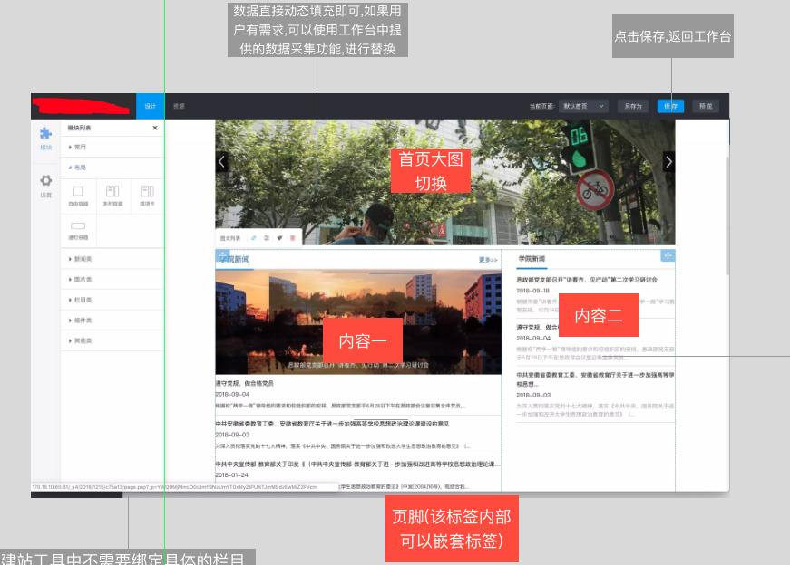

**背景**

> 在初步完成了[在线流程图编辑工具](https://www.cnblogs.com/leomYili/p/7145445.html)之后,又接到了在线搭建页面工具的需求,刚开始其实并不想接项目,因为从历史以及现实原因来看,个性化及动态渲染都是很难解决的痛点,各种H5页面搭建工具的不温不火早已说明了这条路并没有这么好走,但从另一个方面来说,既然有了这样的需求,那也就说明了现实的工作流程确实存在问题,本着解决问题的心态,说不定可以从工具及产生的新式组件部分重新梳理底层开发规范,从而侧面增强我司前端部门的重要程度.人总要有梦想是吧...

# 简介



项目初版部分UI 组件使用了**ant design**加快进度.到目前为止基本解决内部创建页面模板,并发布到用户服务器的流程.

## 目标

通过托拉拽方式快速生成页面模板,进行预览及发布.

## 使用人群分析

普通用户需要所见即碎得的编辑方式,通过简单,学习成本低的操作,比如拖拽页面元素的方式来达到快速生成页面的效果.当然,当页面元素过多时,实际上拖拽的方式,就不如树形结构容易定位和编辑(可参考ps等软件).

而对于运营人员甚至是原模板制作人员来说,除了希望通过操作已有组件进行页面排版之外,还希望可以通过属性配置及方法修改来完成独立业务场景的活动页面.

对于中后台系统开发人员来说,大量的表单页面以及更加复杂的业务流程流转,不仅需要页面搭建工具,甚至做在线的IDE都不为过,当然现阶段版本暂时不需要这种复杂场景.但在考虑整体架构时,仍然需要针对这一情况进行分析.

## 为什么使用可视化搭建工具,而不是自研UI框架?

一方面工具能够提高内部开发效率,更快完成修改及简单制作需求,而自研UI框架的难点在于如何持续投入,对于中小企业而言,盈利才是最终目标,就是对于模板开发人员来说,一个拥有众多样例及解决方案的开源库,在实际工作中也能节省大量的时间.之前内部失败的几个前端UI组件库已经说明了这一点,开发成本,实际用例,问题解决,相关文档都会带来各种各样的问题.

另一方面,业务的大量扩张,各个业务线所要求的人力成本越来越高,逐渐走向恶性循环.从用户角度来说,越来越长的交付时间带来的是体验与质量的大幅下降,阻碍了进一步的发展.

## 结合实际情况

这次的重点其实在于如何提高初级前端开发者的开发效率以及解决运营人员的上线后可维护的问题.那么,从产品形态来说,可以参考**Dreamweaver**的部分界面,比如设计视图与预览视图.这样可减少我司大部分模板开发人员的学习成本.
另外,通过提供部分开放的代码编辑能力,来解决特殊的个性化需求.
这么看来,我一开始想的使用现有前端框架进行改造升级以及推动新的组件开发规范根本不现实.
因此,决定工具本身使用react进行实现,组件部分结合已有的后台模板字符串方式,划分好样式及脚本命名空间,按需加载即可.

# 功能实现

按照上述梳理,得出工具核心功能在于编辑状态下的拖拽布局与组件属性编辑以及预览模式下的解析展示部分.再按照实际情况定义新的组件开发规范,并准备好组件管理系统,就能完成初版目标.
这里的组件仍然采用原始的HTML+js+css的开发方式,所不同则是组件包会经过后台转义以及前台解析按照规则书写的模板字符串,并输出到页面中进行展示.

## 数据结构

在之前的项目中,到后期才发现因为自实现的状态管理工具过于简单且缺乏文档,导致后期接手维护人员的难以修改.正好借着项目的机会,使用与react搭配较好的 redux进行开发.
上个项目采用的扁平化状态树结构在一开始只是为了查找方便,在学习了redux之后,发现范式化的state更加符合复杂的场景,特别是在排序以及关联查询方面.

项目中需要实现组件节点树

及与节点相关联的对应窗口标题的数据


## 设计视图

虽然已很久不用**Dreamweaver**,但确实不得不承认其所见即所得制作页面效果在以前还是很让人惊艳的.

而本项目中就功能程度而言肯定是远远不及的,以H5制作工具,或者各种原型工具来说(最近在用 [xiaopiu.com](https://www.xiaopiu.com/),表单项设计很出彩),都是采用类ps的画布方式.

而在本项目中,因为需要考虑运营人员的使用场景,采用全画布形式最麻烦的地方在于以制作设计图的思维在制作网页,这样会带来制作步骤复杂,且层级较多,页面节点一多各种互相遮盖难以维护.这只是操作上带来的问题,更麻烦的地方在于难以形成规范,这里的规范是制作页面的规范,如果只注重定位而不注重文档流自然布局,则会在区块划分上定义模糊不清,对于现今大多数动态获取数据模板来说,也根本没办法定死位置.
那么,只要搞定设计视图中最麻烦的节点拖拽排序功能,就能完成最基础的设计视图功能.

### 拖拽功能

这里使用了[react-dnd](http://react-dnd.github.io/react-dnd/),API定义及数据处理与DOM分离的方式确实让我大开眼界,内部已使用redux的架构进行设计,核心部分都是纯函数,将DOM操作分离出去,也因此更容易进行扩展,后续会专门整理源码阅读笔记,以供参考.

需要支持平级排序与嵌套排序,包括浮动定位.

在使用Dnd的过程中,需要给视图中可排序以及可嵌套放置的节点都设置类型,类似于唯一标识符,当绑定的DOM节点触发事件之后,会通过之前已包裹完成的高级组件进行传递状态,从而触发自定义的事件.

经过几次的修改,最终确定了定义可嵌套的布局容器以及无法再次嵌套只能排序的展示模块


比较麻烦的处理在于限制拖拽即时排序方法,当有嵌套层级时,过于灵活的直接插入在用于深层级嵌套时反而让使用者无所适从,比如想要做一个第二层级排序操作,但由于使用了即时排序,如果还有内嵌层级,当移动进入时会进行插入操作.当然这一点本身也是因为思虑不周,认为只要鼠标经过容器之上,既然无法判断用户是否需要插入嵌套层级,那么直接做插入处理,但真实对接业务场景却发现有些容器内部因为自身内容过长,导致容易误操作,之后约束了hover事件,采用drop事件用于判断真实嵌套意图或排序.

对于嵌套容器而言,排序时需要根据当前拖动节点与鼠标经过节点的实际经过位置以及之前的排序方式作判断,比如当经过可排序节点50%高度则自动做排序,对于可嵌套放置节点,需要记录移出时方位,当经过该节点之后,再做相应排序规则.

同时,需要定义一个画布级容器用于满足浮动定位需求,当展示型模块进行拖拽操作时,可放置在该容器中用于解决浮动定位排版需求.

### 部分交互操作

还有一个麻烦之处在于设计视图中需要能够支持外部样式表以及外部脚本,那么为了不与工具本身产生冲突,甚至影响到工具操作,这里的设计视图中采用iframe作为展示层.参考react-frame-component,新建一个空白的iframe,在创建完成时手动重写document,前期直接使用`ReactDOM.unstable_renderSubtreeIntoContainer`进行跨节点组件更新,在之后因为多次重复渲染的问题改成为`ReactDOM.createPortal`.

设计视图采用iframe来实现的问题,还在于需要根据上下文进行重构组件,其中画布类容器中的拖拽放大缩小及框选对齐及同时编辑都需要根据iframe 的document重新计算.这里采用之前项目的逻辑,用react的方式进行组件重构即可.

## 属性编辑

依托于强大的状态管理工具,我们将表单项与节点数据进行双向绑定即可达到属性编辑的效果,那么这里只剩下对于展示型模块的属性声明.

### 不是IDE

其实工具本身起到的作用只是将代码以更加通用的方式进行组合,在大部分实施及运营人员没有办法很快速的掌握组件化开发的情况下,也需要通过工程化的手段进行推动.至少通过工具及推出的新式组件开发规范,能够将之间那种低效的人工方式进行优化升级,包括也能够有一定的积累.更别说分离的模式更有利于自动化测试.

重新定义XML文件,用于支持展示型模块的配置需求,这也算是一种声明,效果如下:


同一类型模块可以有多个展示(HTMl结构及独立功能),通用性配置项写在模块主XML中,展示包具体内容结构如下:


css部分会在上传至应用中心之后进行编译,类**css module**方案增加标识符,局部实例采用模板引擎组合的方式,生成不重复的root className 进行包装.

主体结构部分采用html模板字符串方式,定义key-value形式的数据源,在设计视图中根据用户操作表单项进行数据修改,达到实时编辑效果.在内部使用时还需开放局部的源码编辑效果以满足快速修改上线.

而工具内部对应进行节点数据存储,最终拼装完成一个模板页面所需的组件节点树.这里实际上将工具自身实现进行了隐藏,普通模板开发人员或许并不了解其内部组件的实现,但可以按照之前的经验进行模板片段的编写,唯一区别则是需要增加模板字符串的认知及编写.作为过渡方案来说,至少解决了现实成本问题.

### 表单项扩展

表单项描述中增加级联标识符asFor与asForValue,由工具进行判断是否显示当前表单项,同时增加分类标识符classify,用于将过多的表单项进行组合分类展示.对与展示模块开发者来说,只需要声明**type**即可调用.后续通过扩展提供更多类型

### 解析翻译

在通过拖拽及配置的方式完成设计视图之后,只要再解析翻译为预览展示所需的各终端真实内容即可.这里只需翻译为HTML字符串即可.


# 终点or起点

初始的需求到这里基本已完结,除了业务需求之外,我其实仍想探索出如何结合现实情况推动团队的前端工程化发展,如果按照[前端工程——基础篇](https://github.com/fouber/blog/issues/10)的阶段总结,那么我们甚至还在第一阶段挣扎前行.

而在基本完成上述工具之后,我不由的思考,如果以工具作为起点,潜移默化的将高级能力植入到线上项目中去,应当比硬推框架效果更好,同时也能够进行积累.比如这次的页面模板,在以前甚至连最基础的资源压缩都没有做到,而通过新的工具统一进行压缩,既没有增加开发人员的工作量,又达到了效果.通过快捷工具的方式既减轻了使用者的开发压力,又增强了线上项目的实际质量,何乐而不为?更别说工具本身以及所产生的衍生物的价值.

# 架构思考


## 做组合

每个能够延伸下去的业务场景其实都很复杂,如果真按照之前的模式给每一个场景单独开发工具,那么项目周期就太长了.特别是一旦工具内部做交互性功能,比如建站工具中嵌入问卷,或者数据大屏中加入流程流转,不统筹兼顾根本玩不转.

为什么需要做组合?一部分原因当然是为了节省开发人力,另外一部分则是这些场景都有一定的共性:建站中的展示型模块,自定义表单中的表单项,甚至是数据图表以及流程节点,都能变成数据节点进行组装.

每一种工具最终的产物其实都只是代码的组合,所不同的是之前靠人编辑,现在用工具生成.只考虑通用的业务场景,再将其进行归纳,实际上已经解决了大部分的线上开发效率问题.

通过分析可以看到:这些场景都需要一个能够进行托拉拽操作的画布,一个画布构成的最小单元(以下称为节点)来进行排版,一套直观的逻辑辅助编辑工具(这里采用流程图)控制事件,一个可真实渲染的设计视图(编辑状态,生成运行时所需的store),以及对应终端平台的翻译器(预览状态,解析之前生成的store并按规则进行渲染)就能做到组合.

## nodeTree

控制整个应用渲染的页面结构的数据.定义规范基础结构:


对节点树操作的行为由框架直接提供,对拖拽行为进行封装,并提供回调即可.

对于各个场景下所需的展示型模块来说,只需要遵循统一规范,由框架进行抽象即可

## 节点注册

目前看来仍然采用之前的XMl文件定义即可,对于额外的数据信息,比如问卷系统中需要的事件或流程图需要的连线等都通过关联表的形式,进行数据扩展.

## 事件

一部分由全局定义公共事件,比如页面初始化以及节点销毁,关联状态重置.另一部分由模块单独声明,比如问卷中表单项条件跳转,在模块中声明**onChange**事件,由用户通过流程图工具绑定对应节点.这里的触发效果应当由公共事件与模块修改自身属性事件共同扩展.当然,这里不需要做到自定义的程度,只要根据预先设置的规则进行处理即可.

## 能力扩展

这里的能力扩展是为了分离核心功能,当工具需要比如组件树展示,格式刷等额外功能时,通过类似中间件形式增加工具能力,插件可使用内部数据流进行功能扩展

同时在框架中提供预留UI渲染节点:

```
<div id="toolbar" /> <!-- 工具栏节点注入 -->
<div id="artboard" /> <!-- 画布页面注入,注意不能遮挡组件节点,按照规范定义层级 -->
<div id="sidebar" /> <!-- 侧边栏节点注入 -->
```

### 节点能力定义


所有节点皆采用鼠标移动至上方,显示可拖动区域及快捷菜单的方式

# 总结

在这一过程中,既有产物,又能重新梳理组件开发规范,做到由上到下统一整合,避免之前的那种割裂式开发流程,这样即使前端框架或引用的库发生了变换,只要根据规范进行声明即可,在做到这一步的基础上,再谈其它,我想应该就会容易很多.

工具本身也是为了解放前端工程师,毕竟日复一日的业务代码的堆积很容易消耗工作的积极性,没有人天生想一直成为资源池的一部分.通过建立新的基础研发体系,让工程师站在不同的角度看待问题,即使是无聊的业务代码,经过包装,重新声明,附加配置项等步骤之后,也会发现哪里可以复用,哪里写的有问题等之前忽略的信息.我觉得这才最有价值的地方