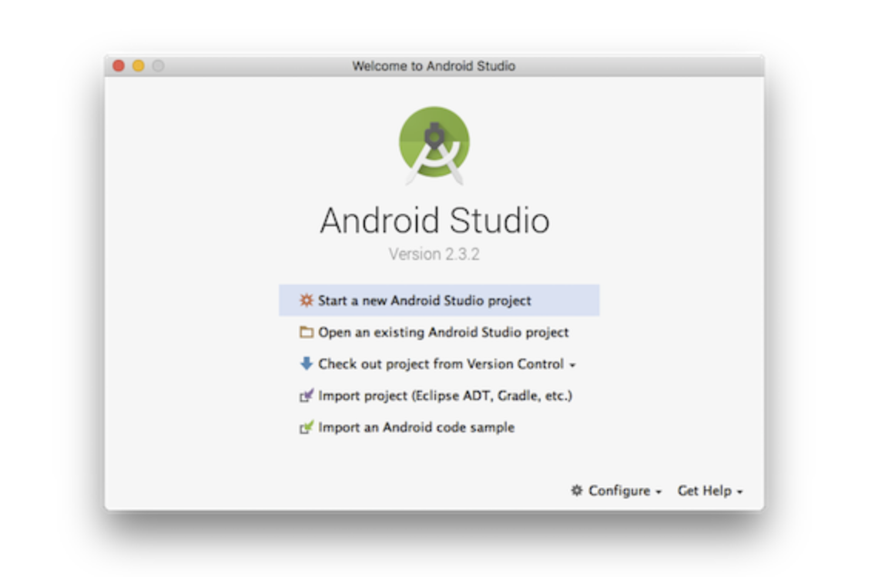

# 正文

## ios 环境配置

> 首先安装依赖有：Node、Watchman、Xcode 和 CocoaPods。

### Node,Watchman

推荐使用 Homebrew 来安装 Node 和 Watchman（如安装较慢可以尝试阿里云的镜像源 <https://developer.aliyun.com/mirror/homebrew>）

### Yarn

这里不知道为什么 react-native init 只会使用 yarn 来安装。所以 yarn 也是必须安装的，推荐还是使用 Homebrew 来安装

### Xcode

这里只能去 apple store 去下载，里面会包含很多的工具，包括 git，最好使用 Xcode 来进行管理，防止之后 git 版本冲突，或者各种奇奇怪怪的报错信息。

### CocoaPods

这个包特别难装，最好跟随教程 <https://www.jianshu.com/p/4ed3645a410a>
把对应的 RVM,Ruby 升级，更换 Ruby 源，安装 CocoaPods，一套流程搞下来，然后再去初始化项目，当然，之后也不是说就没有问题了，主要还是 CocoaPods 库的地址需要翻墙，而且很难下载。

## Android 环境配置

> 首先安装依赖有：Node、Watchman、JDK 和 Android Studio.

### Java Development Kit

React Native 需要 Java Development Kit[JDK] 1.8 (暂不支持 1.9 及更高版本，注意 1.8 版本官方也直接称 8 版本)。你可以在命令行中输入

```()
javac -version
```

来查看当前安装的 JDK 版本。如果版本不合要求，则可以到官网<https://www.oracle.com/java/technologies/javase/javase-jdk8-downloads.html>下载

### Android 开发环境

1. 安装 Android Studio

    首先下载和安装 Android Studio，国内用户可能无法打开官方链接，请自行使用搜索引擎搜索可用的下载链接。安装界面选择"Custom"选项，确保选中了以下几项：

    * Android SDK
    * Android SDK Platform
    * Performance(Intel HAXM)
    * Android Virtual Device

    然后点击“Next”来安装选中的组件。安装完成后，看到欢迎界面时，就可以进行下面的操作了。

2. 安装 Android SDK

    Android Studio 默认会安装最新版本的 Android SDK。目前编辑 React Native应用需要的是 Android 10 (Q) 版本的SDK(注意SDK版本不等于终端系统版本，RN目前支持 android4.1以上设备)。你可以在Android Studio的SDK Manager中选择安装各版本的SDK。可以在Android Studio的欢迎界面中找到SDK Manager。点击“Configure”,然后就能看到“SDK Manager”.
    

    > SDK Manager 还可以在 Android Studio 的 “Preferences”菜单中找到。具体路径是 **Appearance & Behavior -> System Settings -> Android SDK**.

    在 SDK Manager 中选择 “SDK Platforms”选项卡，然后在右下角勾选 “Show Package Details”。展开“Android SDK Build-Tools”选项，确保选中了 React Native所必须的 29.0.2 版本。你可以同时安装多个其他版本。

    最后点击“Apply”来下载和安装这些组件。

3. 配置 ANDROID_HOME 环境变量

    React Native 需要通过环境变量来了解你的 Android SDK 装在什么路径，从而正常进行编译。
    具体的做法是吧下面的命令加入到 shell 的配置文件中。如果你的 shell 是zsh，则配置文件为 ~/.zshrc ,如果是 bash 则为 ~/.bash_profile(可以使用 echo $0 来查看你所使用的 shell)。

## 创建项目

使用 React Native 内建的命令行工具来创建一个名为 "AwesomeProject" 的新项目。这个命令行不需要安装，可以直接用 node 自带的 npx 命令来使用（注意 init 命令默认会创建最新的版本）：

1. 必须要看的注意事项一：0.45 及以上版本需要依赖 boost 等几个很难下载成功的第三方库编译，请务必使用稳定的代理软件并确定其配置对命令行有效。
2. 必须要看的注意事项二：0.60 及以上版本的原生依赖是通过 CocoaPods 集成安装的。CocoaPods 的仓库在国内也很难访问。如果在 CocoaPods 的依赖安装步骤卡很久（命令行停在 Installing CocoaPods dependencies），请务必使用稳定的代理软件并确定其配置对命令行有效。
3. 必须要看的注意事项三：请不要单独使用常见的关键字作为项目名（如 class, native, new, package 等等）。请不要使用与核心模块同名的项目名（如 react, react-native 等）。请不要在目录、文件名中使用中文、空格等特殊符号。

## 编译并运行 React Native 应用(ios 版)

```()
cd AwesomeProject
yarn ios
# 或者
yarn react-native run-ios
```
