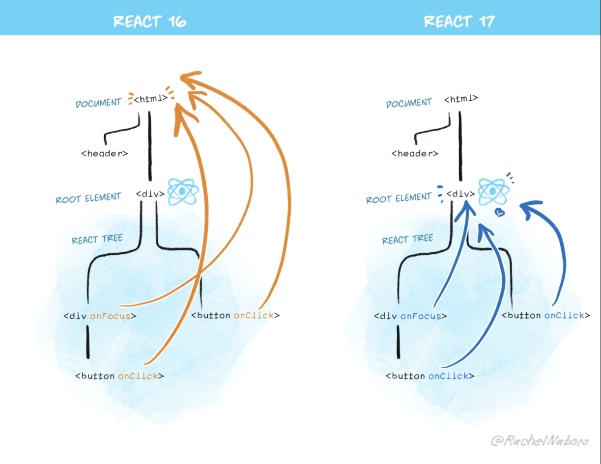

# 正文

## 无新特性

因为 **React 17**,没有增加任何面向开发者的新特性.但是,这个版本会使得 React 自身的升级变得更加容易.

值得特别说明的是, **React 17** 作为后续版本的基石,它让不同版本的 React 相互嵌套变得更加容易.

### 渐进式升级

当 **React 18** 或未来版本来临时,你将有更多选择.首选,当然还是一次性升级整个应用;但还有个可选方案,渐进式升级你的应用.举个例子:
你可能将大部分功能升级至 **React 18**,但保留部分懒加载的对话框或子路由在 **React 17**.

但这并不意味着你必须进行渐进式升级.对于大多数应用来说,一次性升级仍是更多的选择.

### 事件委托的变更

**React 17**中,React不会再将事件处理添加到 document 上,而是将事件处理添加到渲染 React 树的根 DOM 容器中:

```()
const rootNode = document.getElementById('root');
ReactDOM render(<App />,rootNode);
```

在 **React 16** 及之前版本中, React会对大多数事件进行 document.addEventListener() 操作. **React 17**开始会通过调用 `rootNode.addEventListener()` 来代替.



### React17 变更日志

为全新的 JSX 转换器添加 react/jsx-runtime 和 react/jsx-dev-runtime。（@lunaruan 提交于 #18299）
根据原生框架构建组件调用栈。（@sebmarkbage 提交于 #18561）
可以在 context 中设置 displayName 以改善调用栈信息。（@eps1lon 提交于 #18224）
防止 'use strict' 从 UMD 的 bundles 中泄露。（@koba04 提交于 #19614）
停止使用 fb.me 进行重定向。（@cylim 提交于 #19598）

### 其他重大变化

#### 与浏览器对齐

我们对事件系统进行了一些较小的更改:

* 该 onScroll 事件不再冒泡以防止常见的混乱
* React onFocus 和 onBlur event已转为使用幕后的native focusin 和 focusout events, 这与 React 的现有行为更加接近,有时还会提供额外的信息.
* 捕获阶段事件(例如 onClickCapture)现在使用真实的浏览器捕获阶段侦听器.

> 注意:尽管该事件从React 17切换focus到focusin 了幕后，但onFocus请注意，这并未影响冒泡行为。在React中，onFocus事件总是冒泡的，它在React 17中继续冒泡，因为通常它是一个更有用的默认值。

#### 没有事件池

React17从React中移除了"事件池"优化.也就是不需要使用 `e.persist()`相关React事件对象的方法了.

```()
function handleChange(e) {
  setData(data => ({
    ...data,
    // This crashes in React 16 and earlier:
    text: e.target.value
  }));
}
```

这是因为React在旧浏览器中重用了不同事件之间的事件对象以提高性能，并将所有事件字段都设置null在它们之间。

请注意，e.persist()React事件对象仍然可用，但是现在它什么也没做。

#### 效果清除时间

```()
useEffect(() => {
  // This is the effect itself.
  return () => {
    // This is its cleanup.
  };
});
```

大多数副作用（effect）不需要延迟屏幕更新，因此React在屏幕上反映出更新后立即异步运行它们。（在极少数情况下，您需要一种效果来阻止绘制，例如，如果需要获取尺寸和位置，请使用useLayoutEffect。）

此外，React 17 将在运行任何新副作用之前执行所有副作用的清理函数（针对所有组件）。React 16 只对组件内的 effect 保证这种顺序。