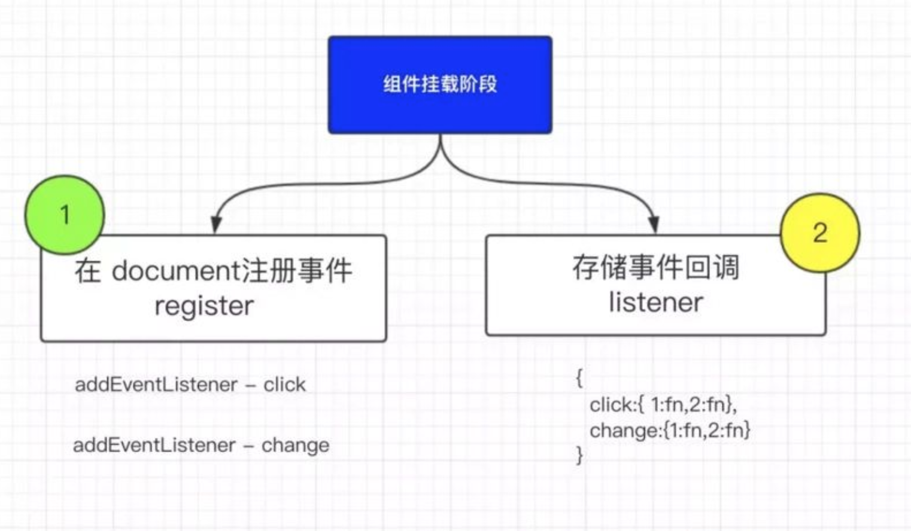
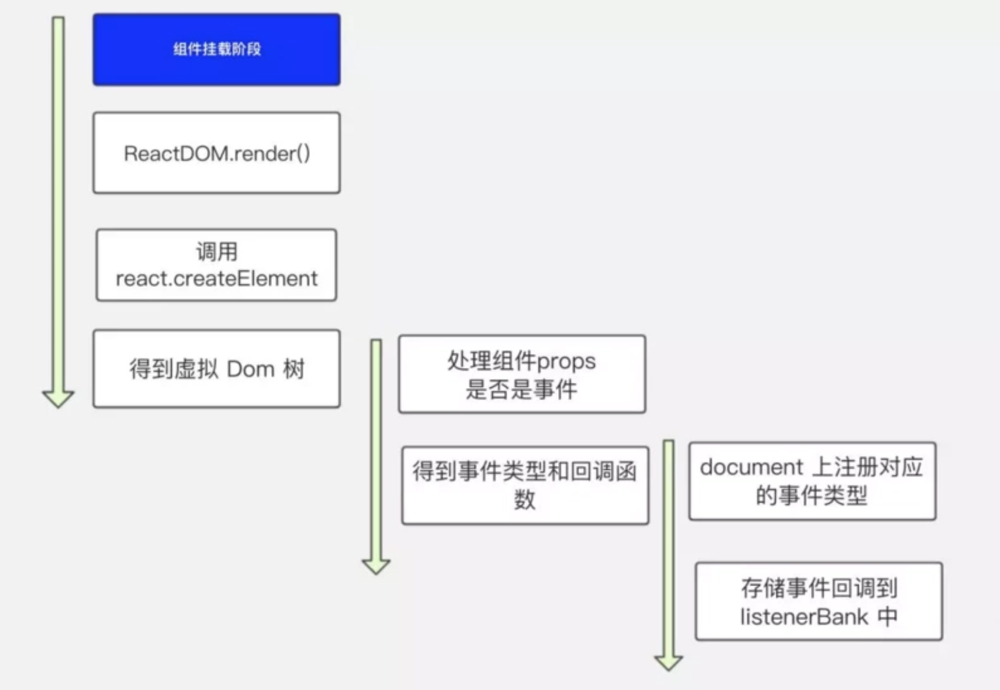
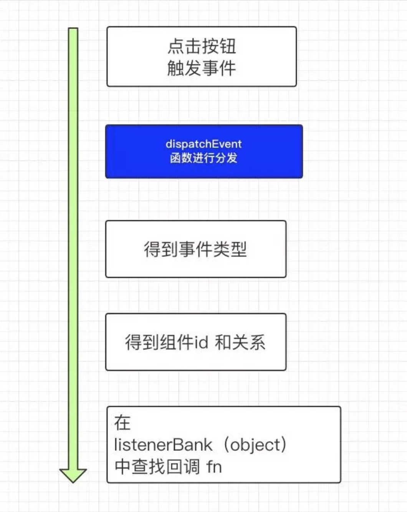
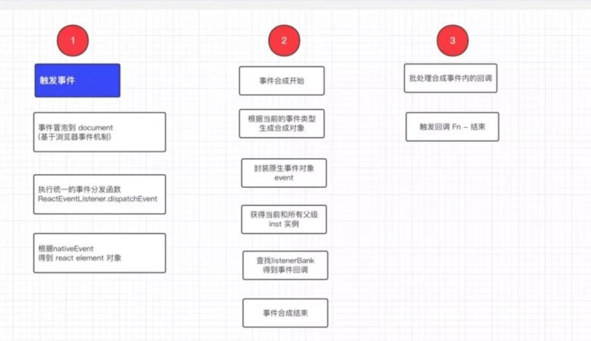

# 正文

## 大纲

主要分为4大块儿，主要是结合源码对 react事件机制的原理 进行分析，希望可以让你对 react事件机制有更清晰的认识和理解。

当然肯定会存在一些表述不清或者理解不够标准的地方，还请各位大神、大佬斧正。

01 - 对事件机制的初步理解和验证

02 - 对于合成的理解

03 - 事件注册机制

04 - 事件执行机制

### 对事件机制的初步理解和验证

#### 表象理解

先回顾下 对react 事件机制基本理解，react自身实现了一套自己的事件机制，包括事件注册、事件的合成、事件冒泡、事件派发等，虽然和原生的是两码事，但也是基于浏览器的事件机制下完成的。

我们都知道react 的所有事件并没有绑定到具体的dom节点上而是绑定在了document 上，然后由统一的事件处理程序来处理，同时也是基于浏览器的事件机制（冒泡），所有节点的事件都会在 document 上触发。

所有的事件根据不同的事件类型都绑定在了 document 上，触发函数统一是 dispatchEvent。

如果一个节点上同时绑定了合成和原生事件，那么禁止冒泡后执行关系是怎样的呢？

其实读到这里答案已经有了。我们现在基于目前的知识去分析下这个关系。

因为合成事件的触发是基于浏览器的事件机制来实现的，通过冒泡机制冒泡到最顶层元素，然后再由 dispatchEvent统一去处理。

* 得出的结论：*

原生事件阻止冒泡肯定会阻止合成事件的触发。

合成事件的阻止冒泡不会影响原生事件。

#### 对于合成的理解

刚听说合成这个词时候，感觉是特别高大上，很有深度，不是很好理解。

当我大概的了解过react事件机制后，略微了解一些皮毛，我觉得合成不单单是事件的合成和处理，从广义上来说还包括：

* 对原生事件的封装

* 对某些原生事件的升级和改造

* 不同浏览器事件兼容的处理

再看下官方说明文档：

SyntheticEvent是react合成事件的基类，定义了合成事件的基础公共属性和方法。

react会根据当前的事件类型来使用不同的合成事件对象，比如鼠标单机事件 - SyntheticMouseEvent，焦点事件-SyntheticFocusEvent等，但是都是继承自SyntheticEvent。

#### 对原生事件的升级和改造

对于有些dom元素事件，我们进行事件绑定之后，react并不是只处理你声明的事件类型，还会额外的增加一些其他的事件，帮助我们提升交互的体验。

#### 浏览器事件的兼容处理

react在给document注册事件的时候也是对兼容性做了处理。

### 事件注册机制

这是 react 事件机制的第三节 - 事件注册，在这里你将了解 react事件的注册过程，以及在这个过程中主要经过了哪些关键步骤，同时结合源码进行验证和增强理解。

在这里并不会说非常细节的内容，而是把大概的流程和原理性的内容进行介绍，做到对整体流程有个认知和理解。

#### 大致流程

react 事件注册过程其实主要做了2件事：事件注册、事件存储。

a. 事件注册 - 组件挂载阶段，根据组件内的声明的事件类型-onclick，onchange 等，给 document 上添加事件 -addEventListener，并指定统一的事件处理程序 dispatchEvent。

b. 事件存储 - 就是把 react 组件内的所有事件统一的存放到一个对象里，缓存起来，为了在触发事件的时候可以查找到对应的方法去执行。



#### 关键步骤

上面大致说了事件注册需要完成的两个目标，那完成目标的过程需要经过哪些关键处理呢？

首先 react 拿到将要挂载的组件的虚拟 dom（其实就是 react element 对象），然后处理 react dom 的 props ，判断属性内是否有声明为事件的属性，比如 onClick,onChange,这个时候得到事件类型 click,change 和对应的事件处理程序 fn，然后执行后面 3步

a. 完成事件注册

b. 将 react dom ，事件类型，处理函数 fn 放入数组存储

c. 组件挂载完成后，处理 b 步骤生成的数组，经过遍历把事件处理函数存储到 listenerBank(一个对象)中



### 事件存储

开始事件的存储，在 react 里所有事件的触发都是通过 dispatchEvent方法统一进行派发的，而不是在注册的时候直接注册声明的回调，来看下如何存储的 。

react 把所有的事件和事件类型以及react 组件进行关联，把这个关系保存在了一个 map里，也就是一个对象里（键值对），然后在事件触发的时候去根据当前的 组件id和 事件类型查找到对应的 事件fn。



大致的流程就是执行完 listenTo（事件注册），然后执行 putListener 方法进行事件存储，所有的事件都会存储到一个对象中 - listenerBank，具体由 EventPluginHub进行管理。

```()
//拿到组件唯一标识 id
    var getDictionaryKey = function getDictionaryKey(inst) {


      return '.' + inst._rootNodeID;


    }


   putListener: function putListener(inst, registrationName, listener) {


    //得到组件 id
        var key = getDictionaryKey(inst);


        //得到listenerBank对象中指定事件类型的对象
        var bankForRegistrationName = listenerBank[registrationName] || (listenerBank[registrationName] = {});


        //存储回调 fn
        bankForRegistrationName[key] = listener;


        //....
  }
```

### 事件执行机制

在事件注册阶段，最终所有的事件和事件类型都会保存到 listenerBank中。

那么在事件触发的过程中上面这个对象有什么用处呢？

其实就是用来查找事件回调

大致流程
事件触发过程总结为主要下面几个步骤：

1.进入统一的事件分发函数(dispatchEvent)

2.结合原生事件找到当前节点对应的ReactDOMComponent对象

3.开始 事件的合成

3.1 根据当前事件类型生成指定的合成对象

3.2 封装原生事件和冒泡机制

3.3 查找当前元素以及他所有父级

3.4 在 listenerBank查找事件回调并合成到 event(合成事件结束)

4.批量处理合成事件内的回调事件（事件触发完成 end）



举个栗子

在说具体的流程前，先看一个栗子，后面的分析也是基于这个栗子

```()
handleFatherClick=(e)=>{
        console.log('father click');
    }

handleChildClick=(e)=>{
    console.log('child click');
}

render(){
    return <div className="box">
                <div className="father" onClick={this.handleFatherClick}> father
                    <div className="child" onClick={this.handleChildClick}> child </div>
                </div>
        </div>
    }
```

看到这个熟悉的代码，我们就已经知道了执行结果。

当我点击 child div 的时候，会同时触发father的事件。

#### 源码解析

1. dispatchEvent 进行事件分发
    进入统一的事件分发函数 (dispatchEvent)。

    当我点击child div 的时候，这个时候浏览器会捕获到这个事件，然后经过冒泡，事件被冒泡到 document 上，交给统一事件处理函数 dispatchEvent 进行处理。（上一文中我们已经说过 document 上已经注册了一个统一的事件处理函数 dispatchEvent）。

2. 查找ReactDOMComponent
    结合原生事件找到当前节点对应的 ReactDOMComponent对象,在原生事件对象内已经保留了对应的 ReactDOMComponent实例的引用，应该是在挂载阶段就已经保存了。

3. 事件合成ing
    事件的合成，冒泡的处理以及事件回调的查找都是在合成阶段完成的。

4. 合成对象的生成
    根据当前事件类型找到对应的合成类，然后进行合成对象的生成。

#### 封装原生事件和冒泡机制

在这一步会把原生事件对象挂到合成对象的自身，同时增加事件的默认行为处理和冒泡机制

```()
/**
 *
 * @param {obj} dispatchConfig 一个配置对象 包含当前的事件依赖 ["topClick"]，冒泡和捕获事件对应的名称 bubbled: "onClick",captured: "onClickCapture"
 * @param {obj} targetInst 组件实例ReactDomComponent
 * @param {obj} nativeEvent 原生事件对象
 * @param {obj} nativeEventTarget  事件源 e.target = div.child
 */
function SyntheticEvent(dispatchConfig, targetInst, nativeEvent, nativeEventTarget) {


    this.dispatchConfig = dispatchConfig;
    this._targetInst = targetInst;
    this.nativeEvent = nativeEvent;//将原生对象保存到 this.nativeEvent
    //此处代码略.....
    var defaultPrevented = nativeEvent.defaultPrevented != null ? nativeEvent.defaultPrevented : nativeEvent.returnValue === false;


    //处理事件的默认行为
    if (defaultPrevented) {
        this.isDefaultPrevented = emptyFunction.thatReturnsTrue;
    } else {
        this.isDefaultPrevented = emptyFunction.thatReturnsFalse;
    }


    //处理事件冒泡 ,thatReturnsFalse 默认返回 false，就是不阻止冒泡
    this.isPropagationStopped = emptyFunction.thatReturnsFalse;
    return this;
}
```

下面是增加的默认行为和冒泡机制的处理方法,其实就是改变了当前合成对象的属性值, 调用了方法后属性值为 true，就会阻止默认行为或者冒泡。

```()
//在合成类原型上增加preventDefault和stopPropagation方法
_assign(SyntheticEvent.prototype, {
    preventDefault: function preventDefault() {
        // ....略


        this.isDefaultPrevented = emptyFunction.thatReturnsTrue;
    },
    stopPropagation: function stopPropagation() {
        //....略


        this.isPropagationStopped = emptyFunction.thatReturnsTrue;
    }
);
```

#### 查找所有父级实例

根据当前节点实例查找他的所有父级实例存入path

```()
/**
 *
 * @param {obj} inst 当前节点实例
 * @param {function} fn 处理方法
 * @param {obj} arg 合成事件对象
 */
function traverseTwoPhase(inst, fn, arg) {
    var path = [];//存放所有实例 ReactDOMComponent


    while (inst) {
        path.push(inst);
        inst = inst._hostParent;//层级关系
    }


    var i;


    for (i = path.length; i-- > 0;) {
        fn(path[i], 'captured', arg);//处理捕获 ，反向处理数组
    }


    for (i = 0; i < path.length; i++) {
        fn(path[i], 'bubbled', arg);//处理冒泡，从0开始处理，我们直接看冒泡
    }
}
```

#### 事件合成结束

在listenerBank查找事件回调并合成到 event。

紧接着上面代码

fn(path[i], 'bubbled', arg);
上面的代码会调用下面这个方法，在 listenerBank中查找到事件回调，并存入合成事件对象。

```()
/**EventPropagators.js
 * 查找事件回调后，把实例和回调保存到合成对象内
 * @param {obj} inst 组件实例
 * @param {string} phase 事件类型
 * @param {obj} event 合成事件对象
 */
function accumulateDirectionalDispatches(inst, phase, event) {
    var listener = listenerAtPhase(inst, event, phase);
    if (listener) {//如果找到了事件回调，则保存起来 （保存在了合成事件对象内）
        event._dispatchListeners = accumulateInto(event._dispatchListeners, listener);//把事件回调进行合并返回一个新数组
        event._dispatchInstances = accumulateInto(event._dispatchInstances, inst);//把组件实例进行合并返回一个新数组
    }
}


/**
 * EventPropagators.js
 * 中间调用方法 拿到实例的回调方法
 * @param {obj} inst  实例
 * @param {obj} event 合成事件对象
 * @param {string} propagationPhase 名称，捕获capture还是冒泡bubbled
 */
function listenerAtPhase(inst, event, propagationPhase) {
    var registrationName = event.dispatchConfig.phasedRegistrationNames[propagationPhase];
    return getListener(inst, registrationName);
}


/**EventPluginHub.js
 * 拿到实例的回调方法
 * @param {obj} inst 组件实例
 * @param {string} registrationName Name of listener (e.g. `onClick`).
 * @return {?function} 返回回调方法
 */
getListener: function getListener(inst, registrationName) {
    var bankForRegistrationName = listenerBank[registrationName];


    if (shouldPreventMouseEvent(registrationName, inst._currentElement.type, inst._currentElement.props)) {
        return null;
    }


    var key = getDictionaryKey(inst);
    return bankForRegistrationName && bankForRegistrationName[key];
}
```

为什么能够查找到的呢？

因为 inst （组件实例）里有_rootNodeID，所以也就有了对应关系。

到这里事件合成对象生成完成，所有的事件回调已保存到了合成对象中。

批量处理事件合成对象
批量处理合成事件对象内的回调方法（事件触发完成 end）。

生成完 合成事件对象后，调用栈回到了我们起初执行的方法内。

