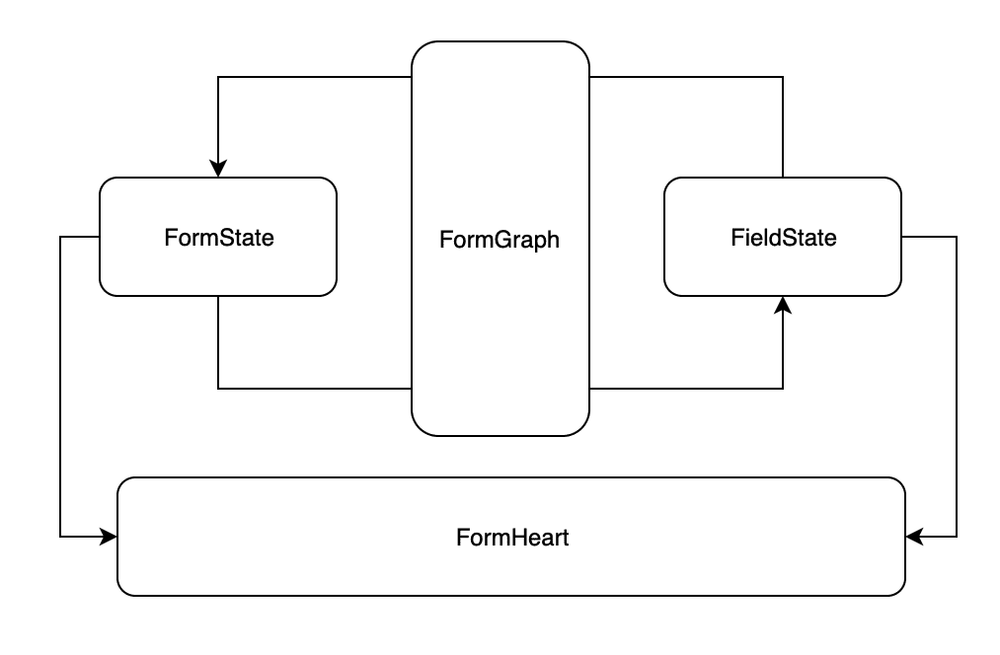
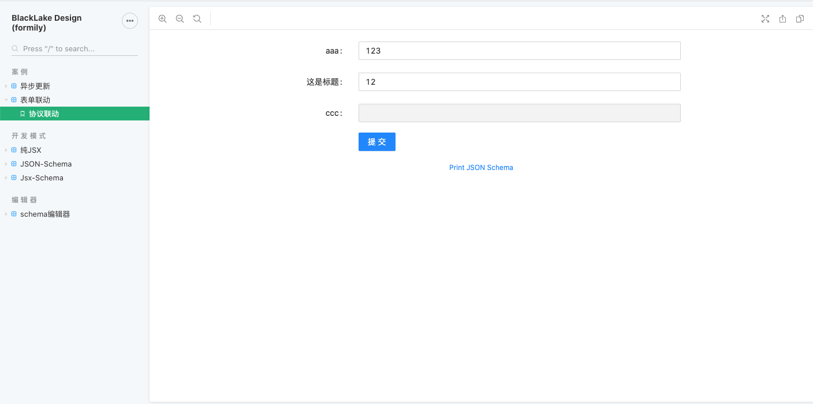
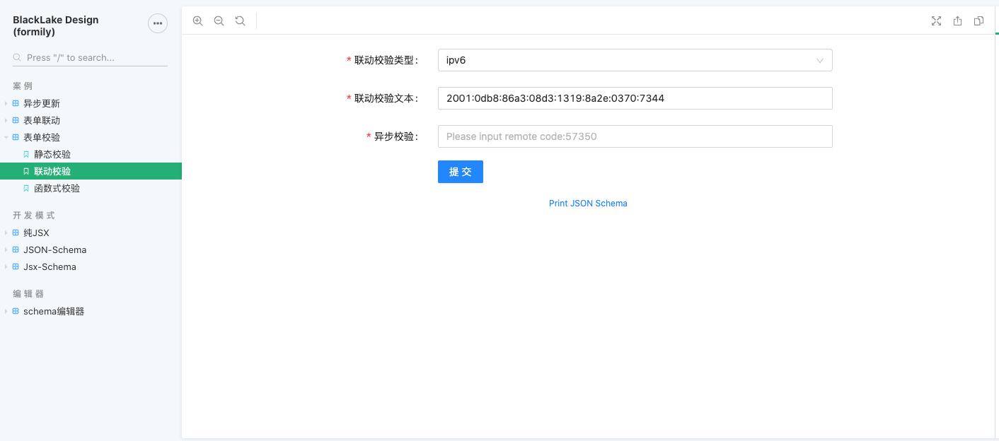
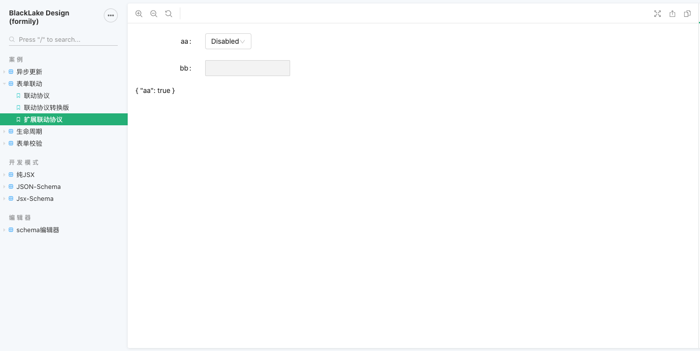
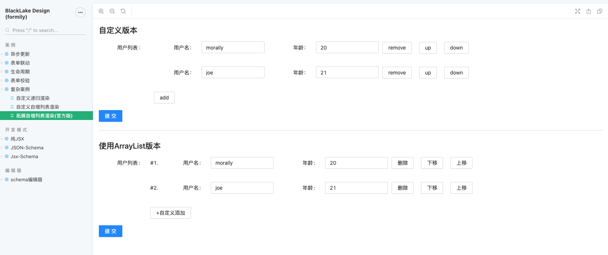
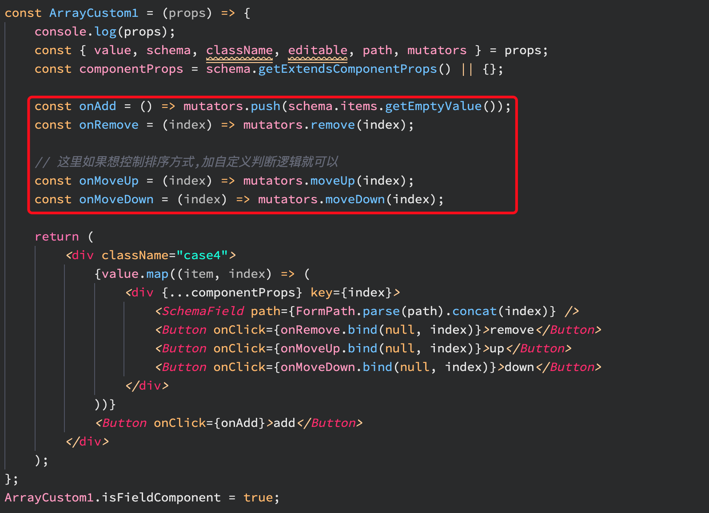

# 正文

> 在解决企业级应用的前端问题中,表单是个无法绕过的大山,正好最近有时间,调研一下 **Formily**-来自阿里巴巴的面向中后台复杂场景的表单解决方案,也是一个表单框架,前身是 **UForm**.主要解决如何更好的管理表单逻辑,更好的保证表单性能,以及展望未来,让非技术人员高效开发表单页面.可以查看相关链接 <https://github.com/alibaba/formily>,目前 issues 已关闭了 419 项,还有 21 项待处理,总的来说应该是有潜力的,先 fork,慢慢读.

> 本篇是简单介绍以及实例的相关笔记,先会用再看源码,相关源码阅读也会放在个人github上,之后会放出链接

> 本文所涉及到的demo均放在github <https://github.com/leomYili/formilyDemo> 上.

> 特点:解决复杂表单问题,跨端,扩展度较好,动态渲染,视图逻辑分离,支持可视化搭建配置,高性能(联动)

> 缺点:学习成本较高,包体积过大,最好根据需求进行选择,需要二次封装

## 本质

构造了一个 **Observable Form Graph**



从官网的介绍来看,使用了 **RxJS**,当然这里只是简略介绍,之后会详细介绍;

### 表达式

```()
setFieldState(
  Subscribe(
    FormLifeCycle, // 表单的生命周期
    Selector(Path) // Path是字段路径,
  ),
  TargetState // 操作具体字段的状态
)
```

从表达式上来看, **Formily** 遵循了 发布订阅者 的设计模式,希望用户不再通过业务逻辑去组装表单,而是通过简单的调用 api,以及路径映射模式更清晰简单的来描述联动的方式,以及在跨终端场景下实现通用表单解决方案.

### 架构

这里可以看出 **Formily** 的野心,也说明了其不是一个简单的类似 rc-form 的项目,而是以框架的方式呈现出来,野心很大.

对于面向复杂场景的企业管理应用以及工具类型的应用来说,也确实更需要一整套的框架来解决研发效率以及后续扩展问题.

而且,采用与 UI 无关的方式来构建核心,做跨终端也比较简单,还是期待下通用组件库吧,目前官方提供的通用库应该还没开发完成,但从兼容`ant-design`以及`fusion-design`等库来说,基础框架是有了.从 api 上来看,与 antd v4 的 form 相似程度还是比较高的.

当然,同出一源,**Formily** 的 API 会更加丰富,学习成本会比 antd 要高.不过 JSON Schema 的使用在一定程度上来说,会比单纯的 UI 描述在可维护性,效率,协作上带来一定的提升,但与之相对的学习成本,反认知都是问题.这里也只是作为其中一种的方案提供出来.主要还是为了之后的动态渲染吧.

### 开发模式

官方提供了三种开发模式,分别针对

-   纯 JSX 开发表单: 用于纯前端 jsx 开发方式,自定义表单项以及复合形态居多.

    ```()
    <Form labelCol={7} wrapperCol={12} onSubmit={console.log}>
        <div style={{ padding: 20, margin: 20, border: '1px solid red' }}>
            Form组件内部可以随便插入UI元素了
        </div>
        <FormItem label="String" name="string" component={Input} />
        <FormButtonGroup offset={7}>
            <Submit>提交</Submit>
        </FormButtonGroup>
    </Form>
    ```

-   JSON Schema 开发表单: 后端动态渲染表单,可视化配置能力.

    ```()
    <SchemaForm
      components={{
        Input
      }}
      labelCol={7}
      wrapperCol={12}
      onSubmit={console.log}
      schema={{
        type: 'object',
        properties: {
          string: {
            type: 'string',
            title: 'String',
            'x-component': 'Input'
          }
        }
      }}
    >
      <FormButtonGroup offset={7}>
        <Submit>提交</Submit>
      </FormButtonGroup>
    </SchemaForm>
    ```

-   JSX Schema 开发表单: 用于后端动态渲染表单的过度形态.(过度形态意味着 schema 与 field 可并存,极大的方便了协作与沟通)

    ```()
    <SchemaForm
        components={{ Input }}
        labelCol={7}
        wrapperCol={12}
        onSubmit={console.log}
    >
        <div style={{ padding: 20, margin: 20, border: '1px solid red' }}>
            这是一个非Field类标签，会被挪到最底部渲染
        </div>
        <Field type="string" title="String" name="string" x-component="Input" />
        <FormButtonGroup offset={7}>
            <Submit>提交</Submit>
        </FormButtonGroup>
    </SchemaForm>
    ```

## Formily 的联动以及生命周期

这里放在一起讲,Formily 提供的 schema 属性与表达式细节请参考文档.

### 联动

这里的联动分为 schema 协议层面简单联动以及 actions/effects 复杂联动.先说简单联动:

#### 联动协议

使用 x-linkages 属性,编辑其结构达到联动配置的效果:

```()
{
  "type": "string",
  "x-linkages": [
    {
      "type": "value:visible",
      "target": "aa",
      "condition": "{{ $self.value === 123 }}"
    }
  ]
}
```

当然,这里的上下文就尤为重要了,通过合法的上下文参数,才能更好的控制表单项进行联动.

目前注入的环境变量:

```()
{
  ...FormProps.expressionScope, //代表SchemaForm属性上通过expressionScope传递下来的上下文
  $value, //代表当前字段的值
  $self, //代表当前字段的状态
  $form, //代表当前表单实例
  $target //代表目标字段状态
}
```

包括内置的联动类型:

-   value:visible，由值变化控制指定字段显示隐藏
-   value:schema，由值变化控制指定字段的 schema
-   value:state，由值变化控制指定字段的状态

可以看出这里的语法是以 `condition` 为核心的,进而控制表单的两大核心属性:props 与 state;
进而满足日常需求,同样提供了可扩展的方法.



#### 生命周期联动

通过对于生命周期的理解,就像 react 提供的 component 的生命周期一样,可以在相应的生命周期里完成各种操作.



详细的内容在生命周期章节细讲

### 理解表单生命周期

通俗来讲,就是因为`formily`使用了 `RxJS`,之后,返回的 `Observer` 对象所带来的能力包括 dispatch 与 notify,可以看出 API 基本保持一致.好处是可以借用 `RxJS` 的 method,对表单的事件做各种操作,相关内容请参考 <https://cn.rx.js.org/class/es6/Observable.js~Observable.html>

虽然会带来学习成本的提高,但相对的,针对复杂系统,使用 `RxJS` 可以保证清晰的业务逻辑以及良好的性能,所以需要权衡利弊.

`formily` 已提供了很多内置的事件类型,可分为全局型生命周期触发事件类型与字段型生命周期触发事件类型.

当然,既然使用 `RxJS`,那么相对应的自定义生命周期的语法也就类似了

#### 自定义生命周期

```()
import SchemaForm, { FormEffectHooks } from '@formily/antd'
const {
  /**
   * Form LifeCycle
   **/
  onFormWillInit$, // 表单预初始化触发
  onFormInit$, // 表单初始化触发
  onFormChange$, // 表单变化时触发
  onFormInputChange$, // 表单事件触发时触发，用于只监控人工操作
  onFormInitialValueChange$, // 表单初始值变化时触发
  onFormReset$, // 表单重置时触发
  onFormSubmit$, // 表单提交时触发
  onFormSubmitStart$, // 表单提交开始时触发
  onFormSubmitEnd$, // 表单提交结束时触发
  onFormMount$, // 表单挂载时触发
  onFormUnmount$, // 表单卸载时触发
  onFormValidateStart$, // 表单校验开始时触发
  onFormValidateEnd$, //表单校验结束时触发
  onFormValuesChange$, // 表单值变化时触发
  /**
   * FormGraph LifeCycle
   **/
  onFormGraphChange$, // 表单观察者树变化时触发
  /**
   * Field LifeCycle
   **/
  onFieldWillInit$, // 字段预初始化时触发
  onFieldInit$, // 字段初始化时触发
  onFieldChange$, // 字段变化时触发
  onFieldMount$, // 字段挂载时触发
  onFieldUnmount$, // 字段卸载时触发
  onFieldInputChange$, // 字段事件触发时触发，用于只监控人工操作
  onFieldValueChange$, // 字段值变化时触发
  onFieldInitialValueChange$ // 字段初始值变化时触发
} = FormEffectHooks
```

更详细的内容可以看 <https://formilyjs.org/#/0yTeT0/aAIRIjiou6>

##### 触发事件

1.在外部环境中,通过全局绑定的 actions 对象触发(通过 actions.dispatch 发送自定义事件)

```()
actions.dispatch('custom_event',payload)
```

2.在 effects 中 const {dispatch} = createFormActions();

```()
dispatch('custom_event',payload)
```

3.在自定义组件中// 在 useFormEffects 函数中

```()
useFormEffects(($, {notify}) => {
  $("onFieldValueChange",'aa').subscribe(()=>{
    notify('custom_event',payload)
  })
})
// 带fieldProps的自定义组件中。from可直接从 props中取得。
const { from } = props;
form.notify('custom_event',payload)
//
// 不带 fieldProps的自定义组件中。需要通过 useField创建from对象
const { form } = useField({});
form.notify('custom_event',payload)
```

##### 消费事件

消费自定义事件和消费系统事件一样。触发事件时参数 payload 中,即为 subscribe 中的传入参数。payload 中如果有 name 属性，则监听时可通过 name 来过滤。

```()
// effects中消费
// 自定义组件内useFormEffects中消费
$('custom_event').subscribe(payload=>{})
$('custom_event','aa').subscribe(payload=>{}) //则payload中必须含有name=aa
```

## actions/effects

这里承接上文的生命周期,提供了除 ref 之外的方式来达到:

-   外部调用组件内部 api 的问题,主要是使用 actions
-   组件内部事件通知外部的问题,同时借助了 `RxJS` 可以方便的处理异步事件流竞态组合问题,主要是使用 effects

这里可以分享两个使用 `RxJS` 进行处理的案例:

```()
const customEvent$ = createEffectHook('CUSTOM_EVENT')
const useMultiDepsEffects = () => {
  const { setFieldState, dispatch } = createFormActions()

  onFormMount$().subscribe(() => {
    setTimeout(() => {
      dispatch('CUSTOM_EVENT', true)
    }, 3000)
  })

  onFieldValueChange$('aa')
    .pipe(combineLatest(customEvent$()))// 使用combineLatest解决生命周期依赖联动的问题
    .subscribe(([{ value, values }, visible]) => {
      setFieldState('bb', state => {
        state.visible = visible
      })
    })
  })

  //借助 merge 操作符对字段初始化和字段值变化的时机进行合流，这样联动发生的时机会在初始化和值变化的时候发生
  merge(onFieldValueChange$('bb'), onFieldInit$('bb')).subscribe(fieldState => {
    if (!fieldState.value) return linkage.hide('cc')
    linkage.show('cc')
    linkage.value('cc', fieldState.value)
  })

}
```

这是一种类似 react-eva 的分布式状态管理解决方案,详情可以参考 <https://github.com/janrywang/react-eva>

## 表单路径系统

路径系统代表了 Form 与 field 之间的关联.

这里可以看看匹配语法:

-   全通配: `"*"`
-   扩展匹配: `"aaa~" or "~" or "aaa~.bbb.cc"`
-   部分通配: `"a.b.*.c.*"`
-   分组通配:

    ```()
    "a.b.*(aa.bb.dd,cc,mm)"
    ```

-   嵌套分组通配:

    ```()
    "a.b.*(aa.bb.*(aa.b,c),cc,mm)"
    or
    "a.b.*(!aa.bb.*(aa.b,c),cc,mm)"
    ```

-   范围通配:

    ```()
    "a.b.*[10:100]"
    or
    "a.b.*[10:]"
    or
    "a.b.*[:100]"
    ```

-   关键字通配: `"a.b.[[cc.uu()sss*\\[1222\\]]]"`

### 案例

这里我觉得比较好用的是字段解耦,对 name 用 ES Deconstruction 语法做解构，需要注意的是，不支持...语法:

```()
<Field
    type="array"
    name="[startDate,endDate]"
    title="已解构日期"
    required
    x-component="DateRangePicker"
/>
```

与自定义的组件配合达到最佳效果

## 传值属性

在 Formily 中，不管是 SchemaForm 组件还是 Form 组件，都支持 3 个传值属性

1.value 受控值属性

    主要用于外部多次渲染同步表单值的场景，但是注意，它不会控制默认值，点击重置按钮的时候值会被置空

2.defaultValue 同步初始值属性

主要用于简单同步默认值场景，限制性较大，只保证第一次渲染生效，重置不会被置空

3.initialValues 异步初始值属性

主要用于异步默认值场景，兼容同步默认值，只要在第 N 次渲染，某个字段还没被设置默认值，第 N+1 次渲染，就可以给其设置默认值

## 表单状态

### FormState

| 状态名        | 描述                                        | 类型                                        | 默认值      |
| ------------- | ------------------------------------------- | ------------------------------------------- | ----------- |
| displayName   | Form 状态标识                               | string                                      | "FormState" |
| modified      | 表单 value 是否发生变化                     | boolean                                     | false       |
| valid         | 表单是否处于合法态                          | boolean                                     | true        |
| invalid       | 表单是否处于非法态，如果校验失败则会为 true | boolean                                     | False       |
| loading       | 表单是否处于加载态                          | boolean                                     | false       |
| validating    | 表单是否处于校验中                          | boolean                                     | false       |
| initialized   | 表单是否已经初始化                          | boolean                                     | false       |
| submitting    | 表单是否正在提交                            | boolean                                     | false       |
| editable      | 表单是否可编辑                              | boolean                                     | false       |
| errors        | 表单错误信息集合                            | Array<{ path: string, messages: string[] }> | []          |
| warnings      | 表单警告信息集合                            | Array<{ path: string, messages: string[] }> | []          |
| values        | 表单值                                      | object                                      | {}          |
| initialValues | 表单初始值                                  | object                                      | {}          |
| mounted       | 表单是否已挂载                              | boolean                                     | false       |
| unmounted     | 表单是否已卸载                              | boolean                                     | false       |
| 扩展状态      | 通过 setFormState 可以直接设置扩展状态      | any                                         |

### FieldState

| 状态名         | 描述                                                                                                         | 类型                 | 默认值       |
| -------------- | ------------------------------------------------------------------------------------------------------------ | -------------------- | ------------ |
| displayName    | Field 状态标识                                                                                               | string               | "FieldState" |
| dataType       | 字段值类型                                                                                                   | "any"                | "array"      | "any" |
| name           | 字段数据路径                                                                                                 | string               |
| path           | 字段节点路径                                                                                                 | string               |
| initialized    | 字段是否已经初始化                                                                                           | boolean              | false        |
| pristine       | 字段 value 是否等于 initialValue                                                                             | boolean              | false        |
| valid          | 字段是否合法                                                                                                 | boolean              | false        |
| invalid        | 字段是否非法                                                                                                 | boolean              | false        |
| touched        | 字段是否被 touch                                                                                             | boolean              | false        |
| visible        | 字段是否显示(如果为 false，字段值不会被提交)                                                                 | boolean              | true         |
| display        | 字段是否 UI 显示(如果为 false，字段值可以被提交)                                                             | boolean              | true         |
| editable       | 字段是否可编辑                                                                                               | boolean              | true         |
| loading        | 字段是否处于加载态                                                                                           | boolean              | false        |
| modified       | 字段的 value 是否变化                                                                                        | boolean              | false        |
| active         | 字段是否被激活(onFocus 触发)                                                                                 | boolean              | false        |
| visited        | 字段是否被 visited(onBlur 触发)                                                                              | boolean              | false        |
| validating     | 字段是否正在校验                                                                                             | boolean              | false        |
| values         | 字段值集合，value 属性相当于是 values[0]，该集合主要来源于组件的 onChange 事件的回调参数                     | any[]                | []           |
| errors         | 字段错误消息集合                                                                                             | string[]             | []           |
| effectErrors   | 人工操作的错误消息集合(在 setFieldState 中设置 errors 会被重定向到设置 effectErrors)                         | string[]             | []           |
| ruleErrors     | 校验规则的错误消息集合                                                                                       | string[]             | []           |
| warnings       | 字段警告信息集合                                                                                             | string[]             | []           |
| effectWarnings | 人工操作的警告信息集合(在 setFieldState 中设置 warnings 会被重定向到设置 effectWarnings)                     | string[]             | []           |
| ruleWarnings   | 校验规则的警告信息集合                                                                                       | string[]             | []           |
| value          | 字段值                                                                                                       | any                  |
| initialValue   | 字段初始值                                                                                                   | any                  |
| rules          | 字段校验规则                                                                                                 | ValidatePatternRules | []           |
| required       | 字段是否必填                                                                                                 | boolean              | false        |
| mounted        | 字段是否已挂载                                                                                               | boolean              | false        |
| unmounted      | 字段是否已卸载                                                                                               | boolean              | false        |
| inputed        | 字段是否主动输入过                                                                                           | true                 |
| props          | 字段扩展 UI 属性(如果是 Schema 模式，props 代表每个 SchemaField 属性，如果是 JSX 模式，则代表 FormItem 属性) | {}                   |
| 扩展状态       | 通过 setFieldState 可以直接设置扩展状态                                                                      | any                  |

## 表单布局

布局各家公司要求都不相同,就不列出来了,比较定制化

## 表单扩展

扩展性是衡量一个框架的重要指标, `formily` 提供了很多的扩展入口:

-   扩展 Form UI 组件:

    ```()
    registerFormComponent(props => {
    	return <div>全局扩展Form组件{props.children}</div>
    })

    const formComponent = props => {
    	return <div>实例级扩展Form组件{props.children}</div>
    }

    <SchemaForm
      formComponent={formComponent}
      components={{ Input }}
      onSubmit={values => {
        console.log(values)
      }}
    />
    ```

-   扩展 FormItem UI 组件

    ```()
    registerFormItemComponent(props => {
    	return <div>全局扩展 FormItem 组件{props.children}</div>
    })

    const formItemComponent = props => {
    	return <div>实例级扩展FormItem组件{props.children}</div>
    }

    <SchemaForm
      formItemComponent={formItemComponent}
      components={{ Input }}
      onSubmit={values => {
        console.log(values)
      }}
    />

    ```

-   扩展 Field 组件
    提供的扩展方式主要有：

    -   SchemaForm 中传入 components 扩展(要求组件满足 value/onChange API)
    -   SchemaForm 中传入 components 组件拥有 isFieldComponent 静态属性，可以拿到 FieldProps, 获取更多内容，则可以通过 useSchemaProps 方法
    -   registerFormField 全局注册扩展组件，要求传入组件名和具体组件，同时，如果针对满足 value/onChange 的组件，需要用 connect 包装，不包装，需要手动同步状态(借助 mutators)
    -   registerFormFields 全局批量注册扩展组件，同时，如果针对满足 value/onChange 的组件，需要用 connect 包装，不包装，需要手动同步状态(借助 mutators)

-   扩展 VirtualField 组件
-   扩展校验模型(规则、文案、模板引擎) `registerValidationMTEngine registerValidationRules setValidationLocale`
-   扩展联动协议

    

-   扩展生命周期
-   扩展 Effect Hook
-   扩展状态(FormState/FieldState/VirtualFieldState)扩展状态的方式主要有以下几种：

    -   直接调用 actions.setFormState/actions.setFieldState 设置状态，这种方式主要在 Form 组件外部调用，在 effects 里消费
    -   使用 useFormState/useFieldState 设置状态，这种方式主要在自定义组件内部使用，使用这两个 API，我们可以将状态挂在 FormGraph 里，这样就能统一走 FormGraph 对其做时间旅行操作

## 性能优化

这是官方提供的方法:

### 大数据场景

推荐使用内置 BigData 数据结构进行包装

```()
import { BigData, SchemaForm } from '@formily/antd'

const specialStructure = new BigData({
  compare(a, b) {
    //你可以定制当前大数据的对比函数，也可以不传，不传则是引用对比
  },
  clone(value) {
    //你可以定制当前大数据的克隆函数，也可以不传，如果不传，拷贝则是引用传递
  }
})

const App = () => (
  <SchemaForm
    initialValues={{ aa: specialStructure.create(BigData) }} //注意要保证create传入的数据是Immutable的数据
    effects={$ => {
      $('onFieldChange', 'bb').subscribe(() => {
        actions.setFieldState('aa', state => {
          state.props.enum = specialStructure.create(BigData) //注意要保证create传入的数据是Immutable的数据
        })
      })
    }}
  />
)
```

主要原因是 Formily 内部会对状态做深度拷贝，同时也做了深度遍历脏检测，这种方式对于用户体验而言是更好了，但是在大数据场景下，就会出现性能问题，借助 BigData 数据结构，我们可以更加定制化的控制脏检查和拷贝算法，保证特殊场景的性能平滑不受影响.

### 多字段批量更新

这种场景主要在联动场景，比如 A 字段要控制 B/C/D/E 等等字段的状态更新，如果控制的字段数量很少，那么相对而言是收益最高的，但是控制的字段数量很多，100+的字段数量，这样做，如果还是以精确渲染思路来的话，相当于会执行 100+的渲染次数，同时 Formily 内部其实还会有一些中间状态，就相当于一次批量更新，会导致 100 * n 的渲染次数，那这样明显是起到了反作用，所以，针对这种场景，我们倒不如直接放开，让表单整树渲染，一次更新，这样对于多字段批量操作场景，性能一下子就上来了。下面是具体的 API 使用方法

```()
onFieldValueChange$('aa').subscribe(() => {
  actions.hostUpdate(() => {
    actions.setFieldState('bb.*', state => {
      state.visible = false
    })
  })
})
```

使用 hostUpdate 包装，可以在当前操作中阻止精确更新策略，在所有字段状态更新完毕之后直接走根组件重渲染策略，从而起到合并渲染的目的.

## 自增列表组件

这里都使用了 ArrayList <https://github.com/alibaba/formily/blob/master/packages/react-shared-components/src/ArrayList.tsx> 作为底层库.

官方提供了两个案例, ArrayTable 与 ArrayCards 有兴趣可以去看看.

这里主要还是想分析一下如何自定义实现一个自增列表组件.

这里使用 **IMutators** API来完成

属性名 | 说明 | 类型 | 默认值
------- | ------- | ------- | -------
change | 改变当前行的值 | change(...values: any[]): any |
focus | 聚焦 |  |
blur | 失焦 |  |
push | 增加一行数据 | (value?: any): any[] |
pop | 弹出最后一行 | change(...values: any[]): any |
insert | 插入一行数据 | (index: number, value: any): any[] |
remove | 删除某一行 | (index: number | string): any
unshift | 插入第一行数据 | (value: any): any[] |
shift | 删除第一行是数据 | (): any[] |
exist | 是否存在某一行 | (index?: number | string): boolean
move | 将指定行数据移动到某一行 | ($from: number, $to: number): any[] |
moveDown | 将某一行往下移 | (index: number): any[] |
moveUp | 将某一行往上移 | (index: number): any[] |
validate | 执行校验 | (opts?: IFormExtendedValidateFieldOptions): Promise

### 案例



可以简单看下代码:



## 结语

formily的思想还是值得借鉴的,不过也正如官网所说,它并不是一个简单的轮子,而是一套解决方案,所以需要权衡利弊,充分考虑到业务场景是否需要这么复杂的一套方案.

当然,真实用到生产环境时,还需要大量的扩展以及与业务结合,所幸这方面formily提供了完备的扩展方式.

但关键还是 `schema` ,这其实是外部的 `DSL` , 它所能起到的作用对于我们目前来说就是承上启下的一个很重要的特性.会让我们不再专门针对业务来写表单,而是通过这种方式达到抽象建模的能力,并为之后的工程化提供了良好的基础.

当不再针对业务去思考问题,而是站在更高的维度去思考前端如何结合业务场景快速提高生产环境的效率,那么才能走的更远.

更多关于这方面的延展,可以参考前端早早聊大会的相关议题 <a href="https://juejin.im/post/6844904114598608904">前端搞搭建</a> 的相关内容.