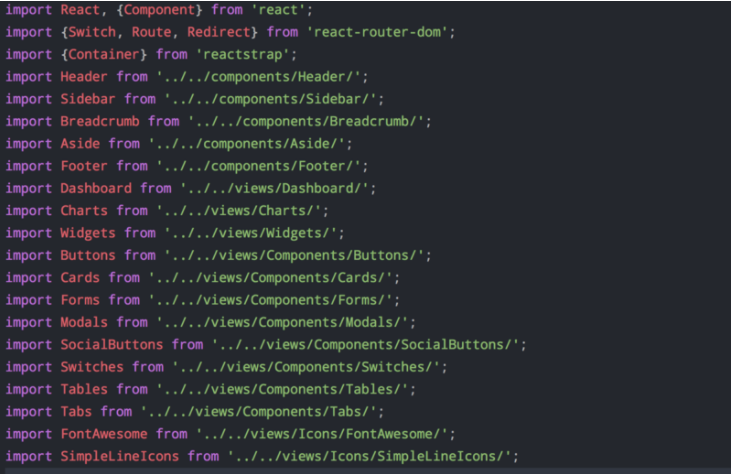
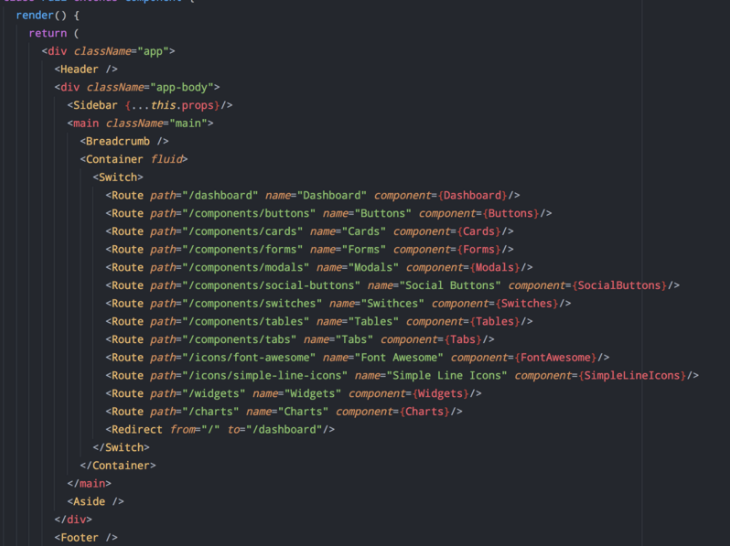
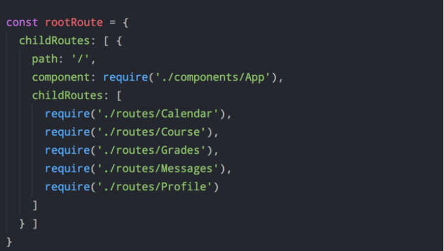

# 正文

> 中文翻译网站：<https://react-router.docschina.org/>; npm 地址：<https://www.npmjs.com/package/react-router>;github 地址：<https://github.com/ReactTraining/react-router>

## 基本用法

安装命令为：

```()
npm install -S react-router
```

使用时，路由器就是 React 的一个组件。

```()
import {Router} from 'react-router';

render(<Router/>,document.getElementById('app'));
```

Router 组件本身只是一个容器，真正的路由要通过 Route 组件定义。

```()
import { Router, Route, hashHistory } from 'react-router';

render((
  <Router history={hashHistory}>
    <Route path="/" component={App}/>
  </Router>
), document.getElementById('app'));
```

上面代码中，用户访问根路由`/`（比如`http://www.example.com/`），组件 APP 就会加载到`document.getElementById('app')`。

你可能还注意到，Router 组件有一个参数 history，它的值 hashHistory 表示，路由的切换由 URL 的 hash 变化决定，即 URL 的#部分发生变化。举例来说，用户访问`http://www.example.com/`，实际会看到的是`http://www.example.com/#/`。

Route 组件定义了 URL 路径与组件的对应关系。你可以同时使用多个 Route 组件。

```()
<Router history={hashHistory}>
  <Route path="/" component={App}/>
  <Route path="/repos" component={Repos}/>
  <Route path="/about" component={About}/>
</Router>
```

### 嵌套路由

Route 组件还可以嵌套。

```()
<Router history={hashHistory}>
  <Route path="/" component={App}>
    <Route path="/repos" component={Repos}/>
    <Route path="/about" component={About}/>
  </Route>
</Router>
```

上面代码中，用户访问`/repos`时，会先加载`App`组件，然后在它的内部再加载`Repos`组件。

```()
<App>
  <Repos/>
</App>
```

App 组件要写成下面的样子。

```()
export default React.createClass({
  render() {
    return <div>
      {this.props.children}
    </div>
  }
})
```

上面代码中，App 组件的 this.props.children 属性就是子组件。

子路由也可以不写在 Router 组件里面，单独传入 Router 组件的 routes 属性。

```()
let routes = <Route path="/" component={App}>
  <Route path="/repos" component={Repos}/>
  <Route path="/about" component={About}/>
</Route>;

<Router routes={routes} history={browserHistory}/>
```

不过一般组件嵌套针对的只是极少数情况，大部分情况下，嵌套路由会增加项目的复杂度，即使可以做到嵌套路由，也需要想好方法如何进行管理（比如构建）。

### path 属性

Route 组件的 path 属性指定路由的匹配规则。这个属性是可以省略的，这样的话，不管路径是否匹配，总是会加载指定组件。

```()
<Route path="inbox" component={Inbox}>
   <Route path="messages/:id" component={Message} />
</Route>
```

当用户访问/inbox/messages/:id 时，会加载下面的组件。

```()
<Inbox>
  <Message/>
</Inbox>
```

如果省略外层 Route 的 path 参数，写成下面的样子。

```()
<Route component={Inbox}>
  <Route path="inbox/messages/:id" component={Message} />
</Route>
```

现在用户访问/inbox/messages/:id 时，组件加载还是原来的样子。

```()
<Inbox>
  <Message/>
</Inbox>
```

### 通配符

path 属性可以使用通配符。

```()
<Route path="/hello/:name">
// 匹配 /hello/michael
// 匹配 /hello/ryan

<Route path="/hello(/:name)">
// 匹配 /hello
// 匹配 /hello/michael
// 匹配 /hello/ryan

<Route path="/files/*.*">
// 匹配 /files/hello.jpg
// 匹配 /files/hello.html

<Route path="/files/*">
// 匹配 /files/
// 匹配 /files/a
// 匹配 /files/a/b

<Route path="/**/*.jpg">
// 匹配 /files/hello.jpg
// 匹配 /files/path/to/file.jpg
```

通配符的规则如下。

```()
（1）:paramName

:paramName匹配URL的一个部分，直到遇到下一个/、?、#为止。这个路径参数可以通过this.props.params.paramName取出。

（2）()

()表示URL的这个部分是可选的。

（3）*

*匹配任意字符，直到模式里面的下一个字符为止。匹配方式是非贪婪模式。

（4） **

** 匹配任意字符，直到下一个/、?、#为止。匹配方式是贪婪模式。
```

path 属性也可以使用相对路径（不以/开头），匹配时就会相对于父组件的路径，可以参考上一节的例子。嵌套路由如果想摆脱这个规则，可以使用绝对路由。

路由匹配规则是从上到下执行，一旦发现匹配，就不再其余的规则了。

```()
<Route path="/comments" ... />
<Route path="/comments" ... />
```

上面代码中，路径/comments 同时匹配两个规则，第二个规则不会生效。

设置路径参数时，需要特别小心这一点。

```()
<Router>
  <Route path="/:userName/:id" component={UserPage}/>
  <Route path="/about/me" component={About}/>
</Router>
```

上面代码中，用户访问/about/me 时，不会触发第二个路由规则，因为它会匹配/:userName/:id 这个规则。因此，带参数的路径一般要写在路由规则的底部。

此外，URL 的查询字符串/foo?bar=baz，可以用 this.props.location.query.bar 获取。

### IndexRoute 组件

用于当根路径为 / 时,没有加载任何子组件.也就是说,APP 组件的 this.props.children,这时是 **undefined**.

因此,通常会采用 **{this.props.children || <Home />}** 这样的写法.这时，Home 明明是 Accounts 和 Statements 的同级组件，却没有写在 Route 中。

IndexRoute 就是解决这个问题，显式指定 Home 是根路由的子组件，即指定默认情况下加载的子组件。你可以把 IndexRoute 想象成某个路径的 index.html。

```()
<Router>
  <Route path="/" component={App}>
    <IndexRoute component={Home}/>
    <Route path="accounts" component={Accounts}/>
    <Route path="statements" component={Statements}/>
  </Route>
</Router>
```

现在，用户访问/的时候，加载的组件结构如下。

```()
<App>
  <Home/>
</App>
```

### Redirect 组件

`<Redirect>`组件用于路由的跳转，即用户访问一个路由，会自动跳转到另一个路由。

```()
<Route path="inbox" component={Inbox}>
  {/* 从 /inbox/messages/:id 跳转到 /messages/:id */}
  ＜Redirect from="messages/:id" to="/messages/:id" />
</Route>
```

现在访问`/inbox/messages/5`，会自动跳转到`/messages/5`。

### IndexRedirect 组件

IndexRedirect 组件用于访问根路由的时候，将用户重定向到某个子组件。

```()
<Route path="/" component={App}>
  ＜IndexRedirect to="/welcome" />
  <Route path="welcome" component={Welcome} />
  <Route path="about" component={About} />
</Route>
```

上面代码中，用户访问根路径时，将自动重定向到子组件 welcome。

### Link 组件(NavLink)

Link 组件用于取代`<a>`元素，生成一个链接，允许用户点击后跳转到另一个路由。它基本上就是`<a>`元素的 React 版本，可以接收 Router 的状态。

```()
render() {
  return <div>
    <ul role="nav">
      <li><Link to="/about">About</Link></li>
      <li><Link to="/repos">Repos</Link></li>
    </ul>
  </div>
}
```

如果希望当前的路由与其他路由有不同样式，这时可以使用 NavLink 组件的 activeStyle 属性。

```()
<Link to="/about" activeStyle={{color: 'red'}}>About</Link>
<Link to="/repos" activeStyle={{color: 'red'}}>Repos</Link>
```

上面代码中，当前页面的链接会红色显示。

以及 NavLink 的特殊 props: activeClassName 给出元素的类处于活动状态时,所展示的样式

更多 NavLink 的属性可以查阅文档.

### history 属性

Router 组件的 history 属性，用来监听浏览器地址栏的变化，并将 URL 解析成一个地址对象，供 React Router 匹配。

history 属性，一共可以设置三种值。

```()
browserHistory
hashHistory
createMemoryHistory
```

如果设为 `hashHistory`,路由将通过 URL 的 hash 部分`(#)`切换,URL 的形式类似 `example.com/#/some/path`。

```()
import { hashHistory } from 'react-router'

render(
  <Router history={hashHistory} routes={routes} />,
  document.getElementById('app')
)
```

如果设为 `browserHistory`，浏览器的路由就不再通过 Hash 完成了，而显示正常的路径`example.com/some/path`，背后调用的是浏览器的`History API`。

```()
import { browserHistory } from 'react-router'

render(
  <Router history={browserHistory} routes={routes} />,
  document.getElementById('app')
)
```

但是，这种情况需要对服务器改造。否则用户直接向服务器请求某个子路由，会显示网页找不到的 404 错误。

如果开发服务器使用的是 webpack-dev-server，加上--history-api-fallback 参数就可以了。

```()
webpack-dev-server --inline --content-base . --history-api-fallback
```

createMemoryHistory 主要用于服务器渲染。它创建一个内存中的 history 对象，不与浏览器 URL 互动。

```()
const history = createMemoryHistory(location)
```

### 表单处理

Link 组件用于正常的用户点击跳转，但是有时还需要表单跳转、点击按钮跳转等操作。这些情况怎么跟 React Router 对接呢？

第一种方法是使用 browserHistory.push

```()
import { browserHistory } from 'react-router'

// ...
  handleSubmit(event) {
    event.preventDefault()
    const userName = event.target.elements[0].value
    const repo = event.target.elements[1].value
    const path = `/repos/${userName}/${repo}`
    browserHistory.push(path)
  },
```

第二种方法是使用 context 对象。

```()
export default React.createClass({

  // ask for `router` from context
  contextTypes: {
    router: React.PropTypes.object
  },

  handleSubmit(event) {
    // ...
    this.context.router.push(path)
  },
})
```

### 路由的钩子

每个路由都有`Enter`和`Leave`钩子，用户进入或离开该路由时触发。

```()
<Route path="about" component={About} />
＜Route path="inbox" component={Inbox}>
  ＜Redirect from="messages/:id" to="/messages/:id" />
</Route>
```

上面的代码中，如果用户离开`/messages/:id`，进入`/about`时，会依次触发以下的钩子。

```()
/messages/:id的onLeave
/inbox的onLeave
/about的onEnter
```

下面是一个例子，使用`onEnter`钩子替代`<Redirect>`组件。

```()
<Route path="inbox" component={Inbox}>
  <Route
    path="messages/:id"
    onEnter={
      ({params}, replace) => replace(`/messages/${params.id}`)
    }
  />
</Route>
```

`onEnter` 钩子还可以用来做认证。

```()
const requireAuth = (nextState, replace) => {
    if (!auth.isAdmin()) {
        // Redirect to Home page if not an Admin
        replace({ pathname: '/' })
    }
}
export const AdminRoutes = () => {
  return (
     <Route path="/admin" component={Admin} onEnter={requireAuth} />
  )
}
```

下面是一个高级应用，当用户离开一个路径的时候，跳出一个提示框，要求用户确认是否离开。

```()
const Home = withRouter(
  React.createClass({
    componentDidMount() {
      this.props.router.setRouteLeaveHook(
        this.props.route,
        this.routerWillLeave
      )
    },

    routerWillLeave(nextLocation) {
      // 返回 false 会继续停留当前页面，
      // 否则，返回一个字符串，会显示给用户，让其自己决定
      if (!this.state.isSaved)
        return '确认要离开？';
    },
  })
)
```

上面代码中，`setRouteLeaveHook`方法为`Leave`钩子指定`routerWillLeave`函数。该方法如果返回 false，将阻止路由的切换，否则就返回一个字符串，提示用户决定是否要切换。

## 路由模块的组织

react-router 功能强大，上手简单，作为官方唯一指定的路由框架已经成为了 react 应用开发中必备的部分，但是由于 react 天生组件化的原因，意味着 react-router 的配置文件中在实际使用中，会难免出现如下不佳场景：

1、路由配置入口文件持续臃肿，文件越引越多


2、路由配置会随着业务嵌套越来越深，团队协作开发时极易产生冲突


3、非 jsx 写法，模块清晰简单，但是会导致路由模块和业务模块耦合，不利于集中管理，同时无法明确表达出母子路由的嵌套关系


> 问题来了：如何既保证路由模块的清晰简单，又能集中管理维护，还能支持嵌套定义和动态加载？

经过前面的分析，我们不难发现 react-router 的路由配置模块会随着业务的深入变得越来越臃肿，其根本原因在于我们将所有的资源和配置信息都写在了一个文件中，这和软件设计中提倡的清晰单一，低耦合高内聚等指导原则是背道而驰的,为此针对路由模块的划分这块进行了重构，改进方式如下：

1. 拆分 routes.js 入口文件
   将路由模块的整体由一个 routes.js 文件拆成若干个彼此间互相独立的子路由模块文件模块的拆分原则可以和业务功能划分一一对应，逐步减少主配置中的内容耦合。

2. 在模块的入口文件 index.js 中完成对各个子模块的引入，如下所示：

   ```()
   import React from 'react';
   import { Route, IndexRedirect } from 'react-router';
   import NotFound from '../components/NotFound';
   import Layout from '../containers/Main';
   import Opportunity from './opportunity';
   import OsManage from './osManage';
   import SalesKit from './salesKit';
   import System from './system';
   import CallManage from './callManage';
   import SalesManage from './salesManage';
   import WorkBoard from './workBoard';
   import UploadOppor from './uploadOppor';

    const routeList = [
        Opportunity,
        UploadOppor,
        OsManage,
        SalesKit,
        System,
        CallManage,
        SalesManage,
        WorkBoard
    ];

    export default (
        <Route path='/' component={Layout} >
            {routeList}
            <Route path='*' component={NotFound} />
        </Route>
    );
    ```

3. 在子路由模块中完成对应具体业务模块的加载，支持同时混合使用同步和异步组件的管理方式

    ```()
    import React from 'react';
    import { Route } from 'react-router';
    import UploadOpportunities from '../containers/opportunity/UploadOpportunities'
    import UploadVisitOpportunity from '../containers/UploadVisitOpportunity'
    import asyncComponent from './asyncComponent'

    // upload_frozen_phone
    const UploadFrozenPhone = asyncComponent(
    () => import(/* webpackChunkName: "upload_frozen_phone" */'../components/uploadFrozenPhone/ UploadFrozenPhone')
    );

    // upload_phone_state
    const UploadPhoneState = asyncComponent(
    () => import(/* webpackChunkName: "upload_phone_state" */'../components/uploadPhoneState/UploadPhoneState')
    );

    export default (
        <Route key='uploadOpportunities'>
            <Route path='upload_opportunity/:type' component={UploadOpportunities} />
            <Route path='upload_visit_opportunity' component={UploadVisitOpportunity} />
            <Route path='frozen_phone' component={UploadFrozenPhone} />
            <Route path='phone_state' component={UploadPhoneState} />
        </Route>
    );
    ```

4. 优势小结：

    这样重构的好处是即使未来随着业务的深入，对应的开发人员也只需要维护自身负责的子路由模块，再在根路由下进行注册即可使用，并且由于子路由模块都从物理文件上进行了隔离，也能最大程度地减少协作冲突，同时，因为维持了jsx的描述型结构，路由的嵌套关系和集中维护等优点依旧能沿用。