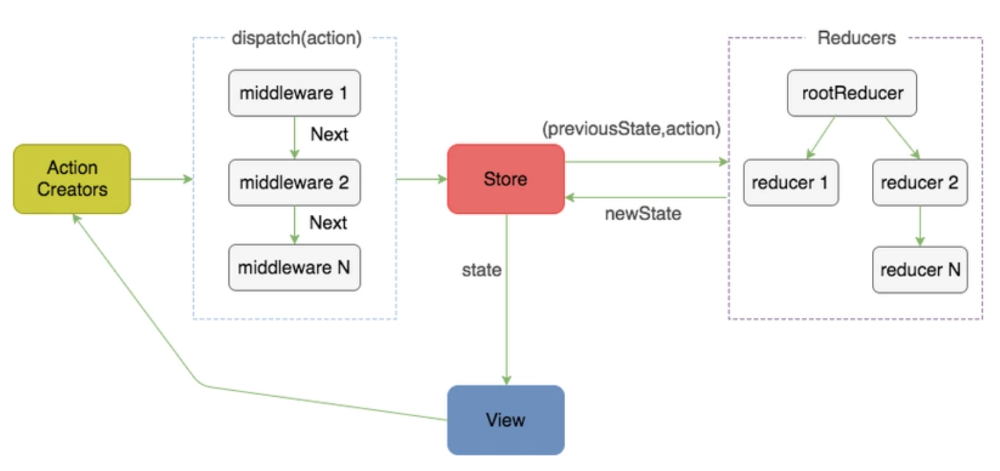
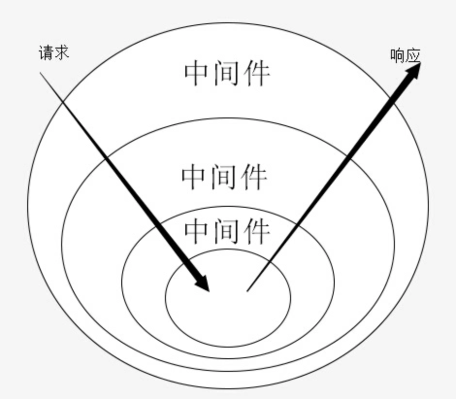
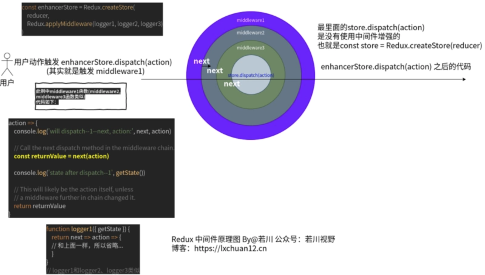

# 正文

> 整理redux相关源码解析知识点以及对应问题

## redux流程

;

可以看到Redux上有好几个方法。分别是：

* __DO_NOT_USE__ActionTypes: {INIT: "@@redux/INITu.v.d.u.6.r", REPLACE: "@@redux/REPLACEg.u.u.7.c", PROBE_UNKNOWN_ACTION: ƒ}
* applyMiddleware: ƒ applyMiddleware() 函数是一个增强器，组合多个中间件，最终增强store.dispatch函数，dispatch时，可以串联执行所有中间件。
* bindActionCreators: ƒ bindActionCreators(actionCreators, dispatch) 生成actions，主要用于其他库，比如react-redux。
* combineReducers: ƒ combineReducers(reducers) 组合多个reducers，返回一个总的reducer函数。
* compose: ƒ compose() 组合多个函数，从右到左，比如：compose(f, g, h) 最终得到这个结果 (...args) => f(g(h(...args))).
* createStore: ƒ createStore(reducer, preloadedState, enhancer) 生成 store 对象

再看store也有几个方法。分别是：

* dispatch: ƒ dispatch(action) 派发动作，也就是把subscribe收集的函数，依次遍历执行
* subscribe: ƒ subscribe(listener) 订阅收集函数存在数组中，等待触发dispatch依次执行。返回一个取消订阅的函数，可以取消订阅监听。
* getState: ƒ getState() 获取存在createStore函数内部闭包的对象。
* replaceReducer: ƒ replaceReducer(nextReducer) 主要用于redux开发者工具，对比当前和上一次操作的异同。有点类似时间穿梭功能。
* Symbol(observable): ƒ observable()

也就是官方文档redux.org.js上的 API。

### redux的createStore

createStore 函数结构是这样的，是不是看起来很简单，最终返回对象store，包含dispatch、subscribe、getState、replaceReducer等方法。

```()
// 省略了若干代码
export default function createStore(reducer, preloadedState, enhancer) {
    // 省略参数校验和替换
    // 当前的 reducer 函数
    let currentReducer = reducer
    // 当前state
    let currentState = preloadedState
    // 当前的监听数组函数
    let currentListeners = []
    // 下一个监听数组函数
    let nextListeners = currentListeners
    // 是否正在dispatch中
    let isDispatching = false
    function ensureCanMutateNextListeners() {
        if (nextListeners === currentListeners) {
        nextListeners = currentListeners.slice()
        }
    }
    function getState() {
        return currentState
    }
    function subscribe(listener) {}
    function dispatch(action) {}
    function replaceReducer(nextReducer) {}
    function observable() {}
    // ActionTypes.INIT @@redux/INITu.v.d.u.6.r
    dispatch({ type: ActionTypes.INIT })
    return {
        dispatch,
        subscribe,
        getState,
        replaceReducer,
        [$$observable]: observable
    }
}
```

### store.dispatch(action)

```()
  function dispatch(action) {
    // 判断action是否是对象，不是则报错
    if (!isPlainObject(action)) {
      throw new Error(
        'Actions must be plain objects. ' +
          'Use custom middleware for async actions.'
      )
    }
    // 判断action.type 是否存在，没有则报错
    if (typeof action.type === 'undefined') {
      throw new Error(
        'Actions may not have an undefined "type" property. ' +
          'Have you misspelled a constant?'
      )
    }
    // 不是则报错
    if (isDispatching) {
      throw new Error('Reducers may not dispatch actions.')
    }

    try {
      isDispatching = true
      currentState = currentReducer(currentState, action)
    } finally {
        // 调用完后置为 false
      isDispatching = false
    }
    //  把 收集的函数拿出来依次调用
    const listeners = (currentListeners = nextListeners)
    for (let i = 0; i < listeners.length; i++) {
      const listener = listeners[i]
      listener()
    }
    // 最终返回 action
    return action
  }
```

```()
var store = Redux.createStore(counter)
```

### store.getState()

```()
function getState() {
    // 判断正在dispatch中，则报错
    if (isDispatching) {
        throw new Error(
        'You may not call store.getState() while the reducer is executing. ' +
            'The reducer has already received the state as an argument. ' +
            'Pass it down from the top reducer instead of reading it from the store.'
        )
    }
    // 返回当前的state
    return currentState
}
```

### store.subscribe(listener)

```()
function subscribe(listener) {
    // 订阅参数校验不是函数报错
    if (typeof listener !== 'function') {
      throw new Error('Expected the listener to be a function.')
    }
    // 正在dispatch中，报错
    if (isDispatching) {
      throw new Error(
        'You may not call store.subscribe() while the reducer is executing. ' +
          'If you would like to be notified after the store has been updated, subscribe from a ' +
          'component and invoke store.getState() in the callback to access the latest state. ' +
          'See https://redux.js.org/api-reference/store#subscribelistener for more details.'
      )
    }
    // 订阅为 true
    let isSubscribed = true

    ensureCanMutateNextListeners()
    nextListeners.push(listener)

    // 返回一个取消订阅的函数
    return function unsubscribe() {
      if (!isSubscribed) {
        return
      }
      // 正在dispatch中，则报错
      if (isDispatching) {
        throw new Error(
          'You may not unsubscribe from a store listener while the reducer is executing. ' +
            'See https://redux.js.org/api-reference/store#subscribelistener for more details.'
        )
      }
      // 订阅为 false
      isSubscribed = false

      ensureCanMutateNextListeners()
    //   找到当前监听函数
      const index = nextListeners.indexOf(listener)
    //   在数组中删除
      nextListeners.splice(index, 1)
      currentListeners = null
    }
  }
```

## Redux 中间件相关源码

### Redux.applyMiddleware(...middlewares)

logger 函数

```()
// examples/js/middlewares.logger.example.js
function logger1({ getState }) {
  return next => action => {
      console.log('will dispatch--1--next, action:', next, action)

      // Call the next dispatch method in the middleware chain.
      const returnValue = next(action)

      console.log('state after dispatch--1', getState())

      // This will likely be the action itself, unless
      // a middleware further in chain changed it.
      return returnValue
  }
}
// 省略 logger2、logger3
```

logger中间件函数做的事情也比较简单，返回两层函数，next就是下一个中间件函数，调用返回结果。

这种也就是我们常说的中间件，面向切面编程（AOP）。



接下来调试，在以下语句打上断点和一些你觉得重要的地方打上断点。

```()
// examples/index.2.redux.applyMiddleware.compose.html
var store = Redux.createStore(counter, Redux.applyMiddleware(logger1, logger2,  logger3))
```

### Redux.applyMiddleware(...middlewares) 源码

```()
// redux/src/applyMiddleware.js
/**
 * ...
 * @param {...Function} middlewares The middleware chain to be applied.
 * @returns {Function} A store enhancer applying the middleware.
 */
export default function applyMiddleware(...middlewares) {
  return createStore => (...args) => {
    const store = createStore(...args)
    let dispatch = () => {
      throw new Error(
        'Dispatching while constructing your middleware is not allowed. ' +
          'Other middleware would not be applied to this dispatch.'
      )
    }

    const middlewareAPI = {
      getState: store.getState,
      dispatch: (...args) => dispatch(...args)
    }
    const chain = middlewares.map(middleware => middleware(middlewareAPI))
    dispatch = compose(...chain)(store.dispatch)

    return {
      ...store,
      dispatch
    }
  }
}
```

### Redux.compose(...functions)

```()
export default function compose(...funcs) {
  if (funcs.length === 0) {
    return arg => arg
  }

  if (funcs.length === 1) {
    return funcs[0]
  }

  return funcs.reduce((a, b) => (...args) => a(b(...args)))
}
```

其实redux源码中注释很清晰了，这个compose函数上方有一堆注释，其中有一句：组合多个函数，从右到左，比如：compose(f, g, h) 最终得到这个结果 (...args) => f(g(h(...args))).

#### compose 函数演化

传入一个数值，计算数值乘以10再加上10，再减去2。

实现起来很简单。

```()
const calc = (num) => num * 10 + 10 - 2;
calc(10); // 108
```

但这样写有个问题，不好扩展，比如我想乘以10时就打印出结果。
为了便于扩展，我们分开写成三个函数。

```()
const multiply = (x) => {
   const result = x * 10;
   console.log(result);
   return result;
};
const add = (y) => y + 10;
const minus = (z) => z - 2;

// 计算结果
console.log(minus(add(multiply(10))));
// 100
// 108
// 这样我们就把三个函数计算结果出来了。
```

再来实现一个相对通用的函数，计算这三个函数的结果。

```()
const compose = (f, g, h) => {
  return function(x){
    return f(g(h(x)));
  }
}
const calc = compose(minus, add, multiply);
console.log(calc(10));
// 100
// 108
```

这样还是有问题，只支持三个函数。我想支持多个函数。
我们了解到数组的reduce方法就能实现这样的功能。
前一个函数

```()
// 我们常用reduce来计算数值数组的总和
[1,2,3,4,5].reduce((pre, item, index, arr) => {
  console.log('(pre, item, index, arr)', pre, item, index, arr);
  // (pre, item, index, arr) 1 2 1 (5) [1, 2, 3, 4, 5]
  // (pre, item, index, arr) 3 3 2 (5) [1, 2, 3, 4, 5]
  // (pre, item, index, arr) 6 4 3 (5) [1, 2, 3, 4, 5]
  // (pre, item, index, arr) 10 5 4 (5) [1, 2, 3, 4, 5]
  return pre + item;
});
// 15
```

而Redux.compose(...functions)其实就是这样，只不过中间件是返回双层函数罢了。

所以返回的是next函数，他们串起来执行了，形成了中间件的洋葱模型。
人们都说一图胜千言。我画了一个相对简单的redux中间件原理图。



## Redux.combineReducers(reducers)

combineReducers函数简单来说就是合并多个reducer为一个函数combination。

```()
export default function combineReducers(reducers) {
  const reducerKeys = Object.keys(reducers)
  const finalReducers = {}
  for (let i = 0; i < reducerKeys.length; i++) {
    const key = reducerKeys[i]

    // 省略一些开发环境判断的代码...

    if (typeof reducers[key] === 'function') {
      finalReducers[key] = reducers[key]
    }
  }

  // 经过一些处理后得到最后的finalReducerKeys
  const finalReducerKeys = Object.keys(finalReducers)

  // 省略一些开发环境判断的代码...

  return function combination(state = {}, action) {
    // ... 省略开发环境的一些判断

   // 用 hasChanged变量 记录前后 state 是否已经修改
    let hasChanged = false
    // 声明对象来存储下一次的state
    const nextState = {}
    //遍历 finalReducerKeys
    for (let i = 0; i < finalReducerKeys.length; i++) {
      const key = finalReducerKeys[i]
      const reducer = finalReducers[key]
      const previousStateForKey = state[key]
      // 执行 reducer
      const nextStateForKey = reducer(previousStateForKey, action)

      // 省略容错代码 ...

      nextState[key] = nextStateForKey
      // 两次 key 对比 不相等则发生改变
      hasChanged = hasChanged || nextStateForKey !== previousStateForKey
    }
    // 最后的 keys 数组对比 不相等则发生改变
    hasChanged =
      hasChanged || finalReducerKeys.length !== Object.keys(state).length
    return hasChanged ? nextState : state
  }
}
```

## Redux.bindActionCreators(actionCreators, dispatch)

```()
function bindActionCreator(actionCreator, dispatch) {
  return function() {
    return dispatch(actionCreator.apply(this, arguments))
  }
}

export default function bindActionCreators(actionCreators, dispatch) {
  if (typeof actionCreators === 'function') {
    return bindActionCreator(actionCreators, dispatch)
  }

  // ... 省略一些容错判断

  const boundActionCreators = {}
  for (const key in actionCreators) {
    const actionCreator = actionCreators[key]
    if (typeof actionCreator === 'function') {
      boundActionCreators[key] = bindActionCreator(actionCreator, dispatch)
    }
  }
  return boundActionCreators
}
```

## vuex 和 redux 简单对比

### 源码实现形式

从源码实现上来看，vuex源码主要使用了构造函数，而redux则是多用函数式编程、闭包。

### 耦合度

vuex 与 vue 强耦合，脱离了vue则无法使用。而redux跟react没有关系，所以它可以使用于小程序或者jQuery等。如果需要和react使用，还需要结合react-redux库。

### 扩展

vuex实现扩展则是使用插件形式，而redux是中间件的形式。redux的中间件则是AOP（面向切面编程），redux中Redux.applyMiddleware()其实也是一个增强函数，所以也可以用户来实现增强器，所以redux生态比较繁荣。

