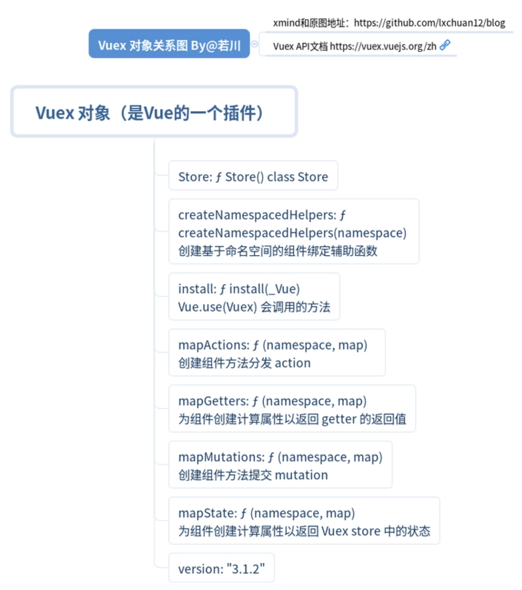

# 正文

## vuex 原理

简单说明下 vuex 原理

```()
<template>
<div>
  count {{$store.state.count}}
</div>
</template>
```

每个组件（也就是Vue实例）在beforeCreate的生命周期中都混入（Vue.mixin）同一个Store实例 作为属性 $store，
也就是为啥可以通过 `this.$store.dispatch` 等调用方法的原因。

最后显示在模板里的
`$store.state.count`
源码是这样的。

```()
class Store{
  get state () {
    return this._vm._data.$$state
  }
}
```

其实就是：
vm.$store._vm._data.$$state.count
其中vm.$store._vm._data.$$state 是 响应式的。
怎么实现响应式的？其实就是new Vue()

这里的 state 就是 用户定义的 state。
这里的 computed 就是处理后的用户定义的 getters。
而 class Store上的一些函数（API）主要都是围绕修改vm.$store._vm._data.$$state和computed(getter)服务的。

### Vue.use 安装



根据断点调试，来看下Vue.use的源码。

```()
function initUse (Vue) {
  Vue.use = function (plugin) {
    var installedPlugins = (this._installedPlugins || (this._installedPlugins = []));
    // 如果已经存在，则直接返回this也就是Vue
    if (installedPlugins.indexOf(plugin) > -1) {
      return this
    }

    // additional parameters
    var args = toArray(arguments, 1);
    // 把 this（也就是Vue）作为数组的第一项
    args.unshift(this);
    // 如果插件的install属性是函数,调用它
    if (typeof plugin.install === 'function') {
      plugin.install.apply(plugin, args);
    } else if (typeof plugin === 'function') {
      // 如果插件是函数,则调用它
      // apply(null) 严格模式下 plugin 插件函数的 this 就是 null
      plugin.apply(null, args);
    }
    // 添加到已安装的插件
    installedPlugins.push(plugin);
    return this
  };
}
```

### install 函数

```()
export function install (_Vue) {
  // Vue 已经存在并且相等，说明已经Vuex.use过
  if (Vue && _Vue === Vue) {
    // 省略代码：非生产环境报错，vuex已经安装
    return
  }
  Vue = _Vue
  applyMixin(Vue)
}
```

### applyMixin 函数

```()
export default function (Vue) {
  // Vue 版本号
  const version = Number(Vue.version.split('.')[0])
  if (version >= 2) {
    // 合并选项后 beforeCreate 是数组里函数的形式  [ƒ,  ƒ]
    // 最后调用循环遍历这个数组，调用这些函数，这是一种函数与函数合并的解决方案。
    // 假设是我们自己来设计，会是什么方案呢。
    Vue.mixin({ beforeCreate: vuexInit })
  } else {
    // 省略1.x的版本代码 ...
  }

  /**
   * Vuex init hook, injected into each instances init hooks list.
   */
  function vuexInit () {
    const options = this.$options
    // store injection
    // store 注入到每一个Vue的实例中
    if (options.store) {
      this.$store = typeof options.store === 'function'
        ? options.store()
        : options.store
    } else if (options.parent && options.parent.$store) {
      this.$store = options.parent.$store
    }
  }
}
```

### Vuex.Store 构造函数

```()
export class Store {
  constructor (options = {}) {
    // 这个构造函数比较长，这里省略，后文分开细述
  }
}

if (!Vue && typeof window !== 'undefined' && window.Vue) {
  install(window.Vue)
}
```

如果是 cdn script 方式引入vuex插件，则自动安装vuex插件，不需要用Vue.use(Vuex)来安装。

```()
// asset 函数实现
export function assert (condition, msg) {
  if (!condition) throw new Error(`[vuex] ${msg}`)
}

if (process.env.NODE_ENV !== 'production') {
  // 可能有读者会问：为啥不用 console.assert，console.assert 函数报错不会阻止后续代码执行
  assert(Vue, `must call Vue.use(Vuex) before creating a store instance.`)
  assert(typeof Promise !== 'undefined', `vuex requires a Promise polyfill in this browser.`)
  assert(this instanceof Store, `store must be called with the new operator.`)
}
```

条件断言：不满足直接抛出错误

1. 必须使用 Vue.use(Vuex) 创建 store 实例。
2. 当前环境不支持Promise，报错：vuex 需要 Promise polyfill。
3. Store 函数必须使用 new 操作符调用。

```()
const {
  // 插件默认是空数组
  plugins = [],
  // 严格模式默认是false
  strict = false
} = options
```

从用户定义的new Vuex.Store(options)
取出plugins和strict参数。

```()
// store internal state
// store 实例对象 内部的 state
this._committing = false
// 用来存放处理后的用户自定义的actoins
this._actions = Object.create(null)
// 用来存放 actions 订阅
this._actionSubscribers = []
// 用来存放处理后的用户自定义的mutations
this._mutations = Object.create(null)
// 用来存放处理后的用户自定义的 getters
this._wrappedGetters = Object.create(null)
// 模块收集器，构造模块树形结构
this._modules = new ModuleCollection(options)
// 用于存储模块命名空间的关系
this._modulesNamespaceMap = Object.create(null)
// 订阅
this._subscribers = []
// 用于使用 $watch 观测 getters
this._watcherVM = new Vue()
// 用来存放生成的本地 getters 的缓存
this._makeLocalGettersCache = Object.create(null)
```

声明Store实例对象一些内部变量。用于存放处理后用户自定义的actions、mutations、getters等变量。

提一下 Object.create(null) 和 {} 的区别。前者没有原型链，后者有。

```()
即 `Object.create(null).__proto__`是 `undefined`
`({}).__proto__` 是 `Object.prototype`
```

```()
// bind commit and dispatch to self
const store = this
const { dispatch, commit } = this
this.dispatch = function boundDispatch (type, payload) {
  return dispatch.call(store, type, payload)
}
this.commit = function boundCommit (type, payload, options) {
  return commit.call(store, type, payload, options)
}
```

给自己 绑定 commit 和 dispatch

为何要这样绑定 ?
说明调用 commit 和 dispach 的 this 不一定是 store 实例
这是确保这两个函数里的 this 是 store 实例

### class ModuleCollection

收集模块，构造模块树结构。

注册根模块 参数 rawRootModule 也就是 Vuex.Store 的 options 参数
未加工过的模块（用户自定义的），根模块

```()
export default class ModuleCollection {
  constructor (rawRootModule) {
    // register root module (Vuex.Store options)
    this.register([], rawRootModule, false)
  }
}

/**
  * 注册模块
  * @param {Array} path 路径
  * @param {Object} rawModule 原始未加工的模块
  * @param {Boolean} runtime runtime 默认是 true
  */
register (path, rawModule, runtime = true) {
  // 非生产环境 断言判断用户自定义的模块是否符合要求
  if (process.env.NODE_ENV !== 'production') {
    assertRawModule(path, rawModule)
  }

  const newModule = new Module(rawModule, runtime)
  if (path.length === 0) {
    this.root = newModule
  } else {
    const parent = this.get(path.slice(0, -1))
    parent.addChild(path[path.length - 1], newModule)
  }

  // register nested modules
  // 递归注册子模块
  if (rawModule.modules) {
    forEachValue(rawModule.modules, (rawChildModule, key) => {
      this.register(path.concat(key), rawChildModule, runtime)
    })
  }
}
```

### 遍历注册 mutation

```()
/**
 * 注册 mutation
 * @param {Object} store 对象
 * @param {String} type 类型
 * @param {Function} handler 用户自定义的函数
 * @param {Object} local local 对象
 */
function registerMutation (store, type, handler, local) {
  // 收集的所有的mutations找对应的mutation函数，没有就赋值空数组
  const entry = store._mutations[type] || (store._mutations[type] = [])
  // 最后 mutation
  entry.push(function wrappedMutationHandler (payload) {
    /**
     * mutations: {
     *    pushProductToCart (state, { id }) {
     *        console.log(state);
     *    }
     * }
     * 也就是为什么用户定义的 mutation 第一个参数是state的原因，第二个参数是payload参数
     */
    handler.call(store, local.state, payload)
  })
}
```

