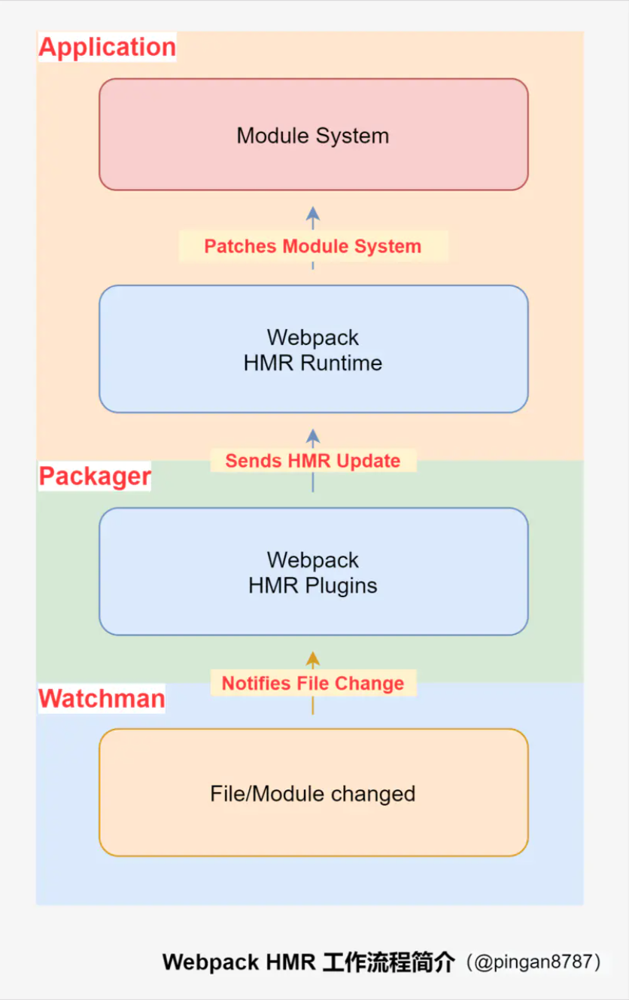
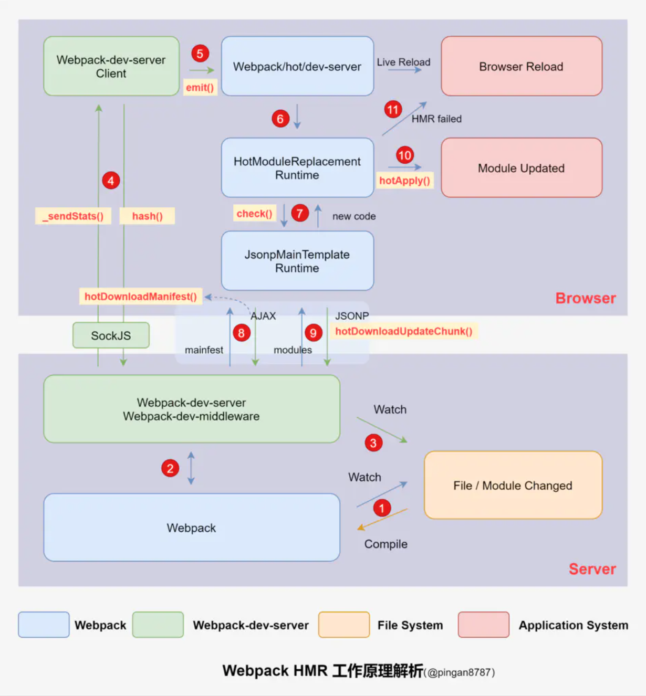
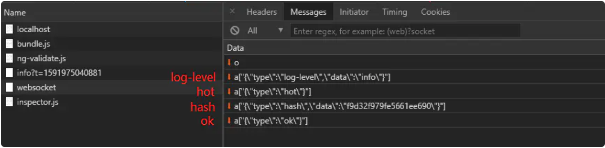
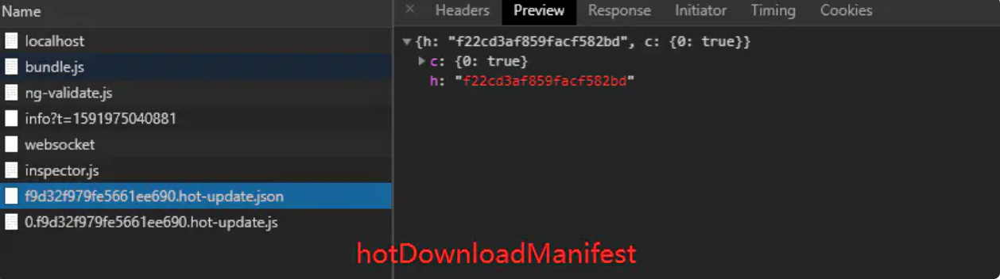
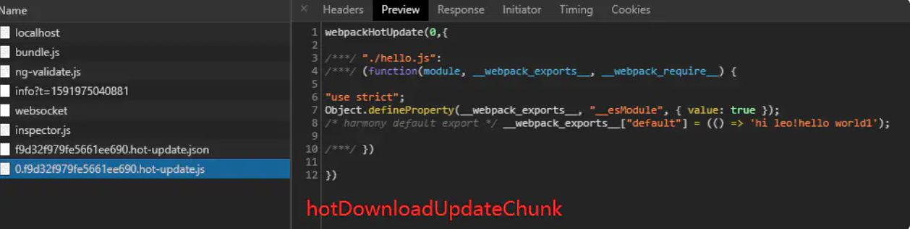

# 正文

## HMR介绍

Hot Module Replacement（以下简称：HMR 模块热替换）是 Webpack 提供的一个非常有用的功能，它允许在 JavaScript 运行时更新各种模块，而无需完全刷新。

当我们修改代码并保存后，Webpack 将对代码重新打包，HMR 会在应用程序运行过程中替换、添加或删除模块，而无需重新加载整个页面。HMR 主要通过以下几种方式，来显著加快开发速度：

* 保留在完全重新加载页面时丢失的应用程序状态；
* 只更新变更内容，以节省宝贵的开发时间；
* 调整样式更加快速 - 几乎相当于在浏览器调试器中更改样式。

需要注意：HMR 不适用于生产环境，这意味着它应当只在开发环境使用。

## HMR使用方式

### 1. 方式一：使用 devServer

#### 1.1 设置 devServer 选项

只需要在 webpack.config.js 中添加 devServer 选项，并设置 hot 值为 true ，并使用HotModuleReplacementPlugin 和 NamedModulesPlugin （可选）两个 Plugins ：

```()
// webpack.config.js

const path = require('path')
const webpack = require('webpack')
module.exports = {
 entry: './index.js',
 output: {
  filename: 'bundle.js',
  path: path.join(__dirname, '/')
 },
+ devServer: {
+  hot: true,   // 启动模块热更新 HMR
+   open: true,  // 开启自动打开浏览器页面
+ },
  plugins: [
+   new webpack.NamedModulesPlugin(),
+   new webpack.HotModuleReplacementPlugin()
  ]
}
```

#### 1.2 添加 scripts

然后在 package.json 中为 scripts 命令即可：

```()
// package.json

{
  // ...
  "scripts": {
+    "start": "webpack-dev-server"
  },
  // ...
}
```

### 2. 方式二、使用命令行参数

另一种是通过添加 --hot 参数来实现。添加 --hot 参数后，devServer 会告诉 Webpack 自动引入 HotModuleReplacementPlugin ，而不需要我们手动引入。另外常常也搭配 --open 来自动打开浏览器到页面。这里移除掉前面添加的两个 Plugins ：

```()
// webpack.config.js

const path = require('path')
const webpack = require('webpack')
module.exports = {
 // ...
- plugins: [
-   new webpack.NamedModulesPlugin(),
-   new webpack.HotModuleReplacementPlugin()
- ]
}
```

然后修改 package.json 文件中的 scripts 配置：

```()
// package.json

{
  // ...
  "scripts": {
-    "start": "webpack-dev-server"
+    "start": "webpack-dev-server --hot --open"
  },
  // ...
}
```

### 3. 简单示例

基于上述配置，我们简单实现一个场景： index.js 文件中导入 hello.js 模块，当 hello.js 模块发生变化时， index.js 将更新模块。

模块代码如下实现：

```()
// hello.js
export default () => 'hi leo!';

// index.js
import hello from './hello.js'
const div = document.createElement('div');
div.innerHTML = hello();

document.body.appendChild(div);
```

然后在 index.html 中导入打包后的 JS 文件，并执行 npm start 运行项目：

```()
<!DOCTYPE html>
<html lang="en">
<head>
    <meta charset="UTF-8">
</head>
<body>
    <div>了不起的 Webpack HMR 学习指南</div>
    <script src="bundle.js"></script>
</body>
</html>
```

### 4. 实现监听更新

当我们通过 HotModuleReplacementPlugin  插件启用了 HMR，则它的接口将被暴露在全局 module.hot  属性下面。通常，可以先检查这个接口是否可访问，然后再开始使用它。举个例子，你可以这样 accept  一个更新的模块：

```()
if (module.hot) {
  module.hot.accept('./library.js', function() {
    // 使用更新过的 library 模块执行某些操作...
  })
}
```

回到上面示例，我们测试更新模块的功能。
这时我们修改 index.js 代码，来监听 hello.js 模块中的更新：

```()
import hello from './hello.js';
const div = document.createElement('div');
div.innerHTML = hello();
document.body.appendChild(div);

+ if (module.hot) {
+   module.hot.accept('./hello.js', function() {
+     console.log('现在在更新 hello 模块了~');
+     div.innerHTML = hello();
+   })
+ }
```

然后修改 hello.js 文件内容，测试效果：

```()
- export default () => 'hi leo!';
+ export default () => 'hi leo! hello world';
```

当我们保存代码时，控制台输出 "现在在更新 hello模块了~" ，并且页面中 "hi leo!" 也更新为 "hi leo! hello world" ，证明我们监听到文件更新了。

### 5. devServer 常用配置和技巧

#### 5.1 常用配置

根据目录结构的不同，contentBase、openPage 参数要配置合适的值，否则运行时应该不会立刻访问到你的首页。 同时要注意你的 publicPath，静态资源打包后生成的路径是一个需要思考的点，取决于你的目录结构。

```()
devServer: {
    contentBase: path.join(__dirname, 'static'),    // 告诉服务器从哪里提供内容(默认当前工作目录)
    openPage: 'views/index.html',  // 指定默认启动浏览器时打开的页面
    index: 'views/index.html',  // 指定首页位置
    watchContentBase: true, // contentBase下文件变动将reload页面(默认false)
    host: 'localhost', // 默认localhost,想外部可访问用'0.0.0.0'
    port: 8080, // 默认8080
    inline: true, // 可以监控js变化
    hot: true, // 热启动
    open: true, // 启动时自动打开浏览器（指定打开chrome，open: 'Google Chrome'）
    compress: true, // 一切服务都启用gzip 压缩
    disableHostCheck: true, // true：不进行host检查
    quiet: false,
    https: false,
    clientLogLevel: 'none',
    stats: { // 设置控制台的提示信息
        chunks: false,
        children: false,
        modules: false,
        entrypoints: false, // 是否输出入口信息
        warnings: false,
        performance: false, // 是否输出webpack建议（如文件体积大小）
    },
    historyApiFallback: {
        disableDotRule: true,
    },
    watchOptions: {
        ignored: /node_modules/, // 略过node_modules目录
    },
    proxy: { // 接口代理（这段配置更推荐：写到package.json，再引入到这里）
        "/api-dev": {
            "target": "http://api.test.xxx.com",
            "secure": false,
            "changeOrigin": true,
            "pathRewrite": { // 将url上的某段重写（例如此处是将 api-dev 替换成了空）
            "^/api-dev": ""
            }
        }
    },
    before(app) { },
}
```

#### 5.2 技巧1：文件形式输出 dev-server 代码

dev-server 输出的代码通常在内存中，但也可以写入硬盘，产出实体文件：

```()
devServer:{
  writeToDisk: true,
}
```

通常可以用于代理映射文件调试，编译时会产出许多带 hash 的 js 文件，不带 hash 的文件同样也是实时编译的。

#### 5.3 技巧2：默认使用本地 IP 启动服务

有的时候，启动服务时，想要默认使用本地的 ip 地址打开：

```()
devServer:{
  disableHostCheck: true, // true：不进行host检查
  // useLocalIp: true, // 建议不在这里配置
  // host: '0.0.0.0', // 建议不在这里配置
}
```

同时还需要将 host 配置为 0.0.0.0，这个配置建议在 scripts 命令中追加，而非在配置中写死，否则将来不想要这种方式往回改折腾，取巧一点，配个新命令：

```()
"dev-ip": "yarn run dev --host 0.0.0.0 --useLocalIp"
```

#### 5.4 技巧3：指定启动的调试域名

有时启动的时候希望是指定的调试域名，例如：local.test.baidu.com：

```()
devServer:{
    open: true,
    public: 'local.test.baidu.com:8080', // 需要带上端口
    port: 8080,
}

```

同时需要将 127.0.0.1 修改为指定的 host，可以借助 iHost 等工具去修改，各个工具大同小异，格式如下：

`127.0.0.1 local.test.baidu.com`

服务启动后将自动打开 local.test.baidu.com:8080 访问

#### 5.5 技巧4：启动 gzip 压缩

```()
devServer:{
  compress: true,
}
```

## 三、HMR 基本原理介绍

从前面介绍中，我们知道：HMR 主要功能是会在应用程序运行过程中替换、添加或删除模块，而无需重新加载整个页面。
那么，Webpack 编译源码所产生的文件变化在编译时，替换模块实现在运行时，两者如何联系起来？



接下来开始 HMR 工作流程分析：

1. 当 Webpack（Watchman） 监听到项目中的文件/模块代码发生变化后，将变化通知 Webpack 中的构建工具（Packager）即 HMR Plugin；
2. 然后经过 HMR Plugin 处理后，将结果发送到应用程序（Application）的运行时框架（HMR Runtime）；
3. 最后由 HMR Runtime 将这些发生变化的文件/模块更新（新增/删除或替换）到模块系统中。

其中，HMR Runtime 是构建工具在编译时注入的，通过统一的 Module ID 将编译时的文件与运行时的模块对应起来，并且对外提供一系列 API 供应用层框架（如 React）调用。

## 四、HMR 完整原理和源码分析

通过上一节内容，我们大概知道 HMR 简单工作流程，那么或许你现在可能还有很多疑惑：文件更新是什么通知 HMR Plugin？HMR Plugin 怎么发送更新到 HMR Runtime？等等问题。
那么接下来我们开始详细结合源码分析整个 HMR 模块热更新流程，首先还是先看流程图，可以先不了解图中方法名称（红色字体黄色背景色部分）：



上图展示了从我们修改代码，到模块热更新完成的一个 HMR 完整工作流程，图中已用红色阿拉伯数字符号将流程标识出来。
要了解上面工作原理，我们先理解图中这几个名称概念：

* Webpack-dev-server ：一个服务器插件，相当于 express 服务器，启动一个 Web 服务，只适用于开发环境；
* Webpack-dev-middleware ：一个 Webpack-dev-server 的中间件，作用简单总结为：通过watch mode，监听资源的变更，然后自动打包。
* Webpack-hot-middleware ：结合 Webpack-dev-middleware 使用的中间件，它可以实现浏览器的无刷新更新，也就是 HMR；

### 1.监控代码变化，重新编译打包

首先根据 devServer 配置，使用 npm start 将启动 Webpack-dev-server 启动本地服务器并进入 Webpack 的 watch 模式，然后初始化 Webpack-dev-middleware ，在 Webpack-dev-middleware 中通过调用 startWatch() 方法对文件系统进行 watch：

```()
// webpack-dev-server\bin\webpack-dev-server.js
// 1.启动本地服务器 Line 386
server = new Server(compiler, options);

// webpack-dev-server\lib\Server.js
// 2.初始化 Webpack-dev-middleware Line 109
this.middleware = webpackDevMiddleware(compiler, Object.assign({}, options, wdmOptions));

// webpack-dev-middleware\lib\Shared.js
// 3.开始 watch 文件系统 Line 171
startWatch: function() {
 //...
 // start watching
 if(!options.lazy) {
  var watching = compiler.watch(options.watchOptions, share.handleCompilerCallback);
  context.watching = watching;
 }
 //...
}
share.startWatch();
// ...
```

当 startWatch() 方法执行后，便进入 watch 模式，若发现文件中代码发生修改，则根据配置文件对模块重新编译打包。

### 2.保存编译结果

Webpack 与  Webpack-dev-middleware 交互，Webpack-dev-middleware 调用 Webpack 的 API 对代码变化进行监控，并通知 Webpack 将重新编译的代码通过 JavaScript 对象保存在内存中。

我们会发现，在 output.path 指定的 dist 目录并没有保存编译结果的文件，这是为什么？
其实， Webpack 将编译结果保存在内存中，因为访问内存中的代码比访问文件系统中的文件快，这样可以减少代码写入文件的开销。

Webpack 能将代码保存到内存中，需要归功于 Webpack-dev-middleware 的 memory-fs 依赖库，它将原本 outputFileSystem  替换成了 MemoryFileSystem  的实例，便实现代码输出到内存中。其中部分源码如下：

```()
// webpack-dev-middleware\lib\Shared.js Line 108

// store our files in memory
var fs;
var isMemoryFs = !compiler.compilers &&
    compiler.outputFileSystem instanceof MemoryFileSystem;
if(isMemoryFs) {
    fs = compiler.outputFileSystem;
} else {
    fs = compiler.outputFileSystem = new MemoryFileSystem();
}
context.fs = fs;
```

上述代码先判断 fileSystem 是否是 MemoryFileSystem 的实例，若不是，则用 MemoryFileSystem 的实例替换 compiler 之前的 outputFileSystem。这样 bundle.js 文件代码就作为一个简单 JavaScript 对象保存在内存中，当浏览器请求 bundle.js 文件时，devServer 就直接去内存中找到上面保存的 JavaScript 对象并返回给浏览器端。

### 3.监控文件变化，刷新浏览器

Webpack-dev-server 开始监控文件变化，与第 1 步不同的是，这里并不是监控代码变化重新编译打包。

当我们在配置文件中配置了 devServer.watchContentBase 为 true ，Webpack-dev-server 会监听配置文件夹中静态文件的变化，发生变化时，通知浏览器端对应用进行浏览器刷新，这与 HMR 不一样。

```()
// webpack-dev-server\lib\Server.js
// 1. 读取参数 Line 385
if (options.watchContentBase) { defaultFeatures.push('watchContentBase'); }

// 2. 定义 _watch 方法 Line 697
Server.prototype._watch = function (watchPath) {
 // ...
  const watcher = chokidar.watch(watchPath, options).on('change', () => {
    this.sockWrite(this.sockets, 'content-changed');
  });

  this.contentBaseWatchers.push(watcher);
};

// 3. 执行 _watch() 监听文件变化 Line 339
watchContentBase: () => {
    if (/^(https?:)?\/\//.test(contentBase) || typeof contentBase === 'number') {
        throw new Error('Watching remote files is not supported.');
    } else if (Array.isArray(contentBase)) {
        contentBase.forEach((item) => {
            this._watch(item);
        });
    } else {
        this._watch(contentBase);
    }
}
```

### 4.建立 WS，同步编译阶段状态

这一步都是 Webpack-dev-server 中处理，主要通过 sockjs（Webpack-dev-server 的依赖），在 Webpack-dev-server 的浏览器端（Client）和服务器端（Webpack-dev-middleware）之间建立 WebSocket 长连接。
然后将 Webpack 编译打包的各个阶段状态信息同步到浏览器端。其中有两个重要步骤：

1. 发送状态
Webpack-dev-server 通过 Webpack API 监听 compile 的 done 事件，当 compile 完成后，Webpack-dev-server 通过 _sendStats 方法将编译后新模块的 hash 值用 socket 发送给浏览器端。

2. 保存状态
    浏览器端将_sendStats 发送过来的 hash 保存下来，它将会用到后模块热更新。

    

```()
// webpack-dev-server\lib\Server.js

// 1. 定义 _sendStats 方法 Line 685
// send stats to a socket or multiple sockets
Server.prototype._sendStats = function (sockets, stats, force) {
  //...
  this.sockWrite(sockets, 'hash', stats.hash);
};

// 2. 监听 done 事件 Line 86
compiler.plugin('done', (stats) => {
   // 将最新打包文件的 hash 值（stats.hash）作为参数传入 _sendStats()
    this._sendStats(this.sockets, stats.toJson(clientStats));
    this._stats = stats;
});

// webpack-dev-server\client\index.js
// 3. 保存 hash 值 Line 74
var onSocketMsg = {
  // ...
  hash: function hash(_hash) {
    currentHash = _hash;
  },
  // ...
}
socket(socketUrl, onSocketMsg);
```

### 5.浏览器端发布消息

当 hash 消息发送完成后，socket 还会发送一条 ok 的消息告知 Webpack-dev-server，由于客户端（Client）并不请求热更新代码，也不执行热更新模块操作，因此通过 emit 一个 "webpackHotUpdate" 消息，将工作转交回 Webpack。

```()
// webpack-dev-server\client\index.js
// 1. 处理 ok 消息 Line 135
var onSocketMsg = {
  // ...
  ok: function ok() {
      sendMsg('Ok');
      if (useWarningOverlay || useErrorOverlay) overlay.clear();
      if (initial) return initial = false; // eslint-disable-line no-return-assign
      reloadApp();
  },
  // ...
}

// 2. 处理刷新 APP Line 218
function reloadApp() {
  // ...
  if (_hot) {
    // 动态加载 emitter
    var hotEmitter = require('webpack/hot/emitter');
    hotEmitter.emit('webpackHotUpdate', currentHash);
    if (typeof self !== 'undefined' && self.window) {
      // broadcast update to window
      self.postMessage('webpackHotUpdate' + currentHash, '*');
    }
  }
  // ...
}
```

### 6.传递 hash 到 HMR

Webpack/hot/dev-server 监听浏览器端 webpackHotUpdate 消息，将新模块 hash 值传到客户端 HMR 核心中枢的 HotModuleReplacement.runtime ，并调用 check 方法检测更新，判断是浏览器刷新还是模块热更新。
如果是浏览器刷新的话，则没有后续步骤咯~~

```()
// webpack\hot\dev-server.js
// 1.监听 webpackHotUpdate Line 42
var hotEmitter = require("./emitter");
hotEmitter.on("webpackHotUpdate", function(currentHash) {
    lastHash = currentHash;
    if(!upToDate() && module.hot.status() === "idle") {
        log("info", "[HMR] Checking for updates on the server...");
        check();
    }
});

var check = function check() {
    module.hot.check(true).then(function(updatedModules) {
        if(!updatedModules) {
            // ...
      window.location.reload();// 浏览器刷新
            return;
        }
        if(!upToDate()) {
            check();
        }
    }).catch(function(err) { /*...*/});
};

// webpack\lib\HotModuleReplacement.runtime.js
// 3.调用 HotModuleReplacement.runtime 定义的 check 方法 Line 167
function hotCheck(apply) {
    if(hotStatus !== "idle") throw new Error("check() is only allowed in idle status");
    hotApplyOnUpdate = apply;
    hotSetStatus("check");
    return hotDownloadManifest(hotRequestTimeout).then(function(update) {
    //...
    });
}
```

### 7.检测是否存在更新

当 HotModuleReplacement.runtime 调用 check 方法时，会调用 JsonpMainTemplate.runtime 中的 hotDownloadUpdateChunk （获取最新模块代码）和 hotDownloadManifest （获取是否有更新文件）两个方法，这两个方法的源码，在下一步展开。

```()
// webpack\lib\HotModuleReplacement.runtime.js
// 1.调用 HotModuleReplacement.runtime 定义 hotDownloadUpdateChunk 方法 Line 171
function hotCheck(apply) {
    if(hotStatus !== "idle") throw new Error("check() is only allowed in idle status");
    hotApplyOnUpdate = apply;
    hotSetStatus("check");
    return hotDownloadManifest(hotRequestTimeout).then(function(update) {
    //...
        {
          // hotEnsureUpdateChunk 方法中会调用 hotDownloadUpdateChunk
          hotEnsureUpdateChunk(chunkId);
        }
    });
}
```

其中 hotEnsureUpdateChunk 方法中会调用 hotDownloadUpdateChunk :

```()
// webpack\lib\HotModuleReplacement.runtime.js Line 215
function hotEnsureUpdateChunk(chunkId) {
    if(!hotAvailableFilesMap[chunkId]) {
        hotWaitingFilesMap[chunkId] = true;
    } else {
        hotRequestedFilesMap[chunkId] = true;
        hotWaitingFiles++;
        hotDownloadUpdateChunk(chunkId);
    }
}
```

### 8.请求更新最新文件列表

在调用 check 方法时，会先调用 JsonpMainTemplate.runtime 中的 hotDownloadManifest 方法， 通过向服务端发起 AJAX 请求获取是否有更新文件，如果有的话将 mainfest 返回给浏览器端。



这边涉及一些原生 XMLHttpRequest，就不全部贴出了~

```()
// webpack\lib\JsonpMainTemplate.runtime.js
// hotDownloadManifest 定义 Line 22
function hotDownloadManifest(requestTimeout) {
    return new Promise(function(resolve, reject) {
        try {
            var request = new XMLHttpRequest();
            var requestPath = $require$.p + $hotMainFilename$;
            request.open("GET", requestPath, true);
            request.timeout = requestTimeout;
            request.send(null);
        } catch(err) {
            return reject(err);
        }
        request.onreadystatechange = function() {
            // ...
        };
    });
}
```

### 9.请求更新最新模块代码

在 hotDownloadManifest 方法中，还会执行  hotDownloadUpdateChunk 方法，通过 JSONP 请求最新的模块代码，并将代码返回给 HMR runtime 。



然后 HMR runtime 会将新代码进一步处理，判断是浏览器刷新还是模块热更新。

```()
// webpack\lib\JsonpMainTemplate.runtime.js
// hotDownloadManifest 定义 Line 12
function hotDownloadUpdateChunk(chunkId) {
  // 创建 script 标签，发起 JSONP 请求
    var head = document.getElementsByTagName("head")[0];
    var script = document.createElement("script");
    script.type = "text/javascript";
    script.charset = "utf-8";
    script.src = $require$.p + $hotChunkFilename$;
    $crossOriginLoading$;
    head.appendChild(script);
}
```

### 10.更新模块和依赖引用

这一步是整个模块热更新（HMR）的核心步骤，通过 HMR runtime 的 hotApply 方法，移除过期模块和代码，并添加新的模块和代码实现热更新。

从 hotApply 方法可以看出，模块热替换主要分三个阶段：

### 找出过期模块 outdatedModules 和过期依赖 outdatedDependencies

```()
// webpack\lib\HotModuleReplacement.runtime.js
// 找出 outdatedModules 和 outdatedDependencies Line 342
function hotApply() {
  // ...
  var outdatedDependencies = {};
  var outdatedModules = [];
  function getAffectedStuff(updateModuleId) {
    var outdatedModules = [updateModuleId];
    var outdatedDependencies = {};
    // ...
    return {
        type: "accepted",
        moduleId: updateModuleId,
        outdatedModules: outdatedModules,
        outdatedDependencies: outdatedDependencies
    };
 };
  function addAllToSet(a, b) {
      for (var i = 0; i < b.length; i++) {
          var item = b[i];
          if (a.indexOf(item) < 0)
              a.push(item);
      }
  }
  for(var id in hotUpdate) {
      if(Object.prototype.hasOwnProperty.call(hotUpdate, id)) {
          // ... 省略多余代码
          if(hotUpdate[id]) {
              result = getAffectedStuff(moduleId);
          }
          if(doApply) {
              for(moduleId in result.outdatedDependencies) {
                 // 添加到 outdatedDependencies
                  addAllToSet(outdatedDependencies[moduleId], result.outdatedDependencies[moduleId]);
              }
          }
          if(doDispose) {
              // 添加到 outdatedModules
              addAllToSet(outdatedModules, [result.moduleId]);
              appliedUpdate[moduleId] = warnUnexpectedRequire;
          }
      }
  }
}

```

#### 从缓存中删除过期模块、依赖和所有子元素的引用

```()
// webpack\lib\HotModuleReplacement.runtime.js
// 从缓存中删除过期模块、依赖和所有子元素的引用 Line 442
function hotApply() {
   // ...
    var idx;
    var queue = outdatedModules.slice();
    while(queue.length > 0) {
        moduleId = queue.pop();
        module = installedModules[moduleId];
        // ...
        // 移除缓存中的模块
        delete installedModules[moduleId];
        // 移除过期依赖中不需要使用的处理方法
        delete outdatedDependencies[moduleId];
        // 移除所有子元素的引用
        for(j = 0; j < module.children.length; j++) {
            var child = installedModules[module.children[j]];
            if(!child) continue;
            idx = child.parents.indexOf(moduleId);
            if(idx >= 0) {
                child.parents.splice(idx, 1);
            }
        }
    }
  // 从模块子组件中删除过时的依赖项
  var dependency;
  var moduleOutdatedDependencies;
  for(moduleId in outdatedDependencies) {
   if(Object.prototype.hasOwnProperty.call(outdatedDependencies, moduleId)) {
    module = installedModules[moduleId];
    if(module) {
     moduleOutdatedDependencies = outdatedDependencies[moduleId];
     for(j = 0; j < moduleOutdatedDependencies.length; j++) {
      dependency = moduleOutdatedDependencies[j];
      idx = module.children.indexOf(dependency);
      if(idx >= 0) module.children.splice(idx, 1);
     }
    }
   }
  }
}
```

### 将新模块代码添加到 modules 中，当下次调用 __webpack_require__  (webpack 重写的 require  方法)方法的时候，就是获取到了新的模块代码了

```()
// webpack\lib\HotModuleReplacement.runtime.js
// 将新模块代码添加到 modules 中 Line 501
function hotApply() {
   // ...
    for(moduleId in appliedUpdate) {
        if(Object.prototype.hasOwnProperty.call(appliedUpdate, moduleId)) {
            modules[moduleId] = appliedUpdate[moduleId];
        }
    }
}
```

hotApply 方法执行之后，新代码已经替换旧代码，但是我们业务代码并不知道这些变化，因此需要通过 accept事件通知应用层使用新的模块进行“局部刷新”，我们在业务中是这么使用：

```()
if (module.hot) {
  module.hot.accept('./library.js', function() {
    // 使用更新过的 library 模块执行某些操作...
  })
}
```

### 11.热更新错误处理

在热更新过程中，hotApply 过程中可能出现 abort 或者 fail 错误，则热更新退回到刷新浏览器（Browser Reload），整个模块热更新完成。

```()
// webpack\hot\dev-server.js Line 13
module.hot.check(true).then(function (updatedModules) {
    if (!updatedModules) {
        return window.location.reload();
    }
    // ...
}).catch(function (err) {
    var status = module.hot.status();
    if (["abort", "fail"].indexOf(status) >= 0) {
        window.location.reload();
    }
});
```

