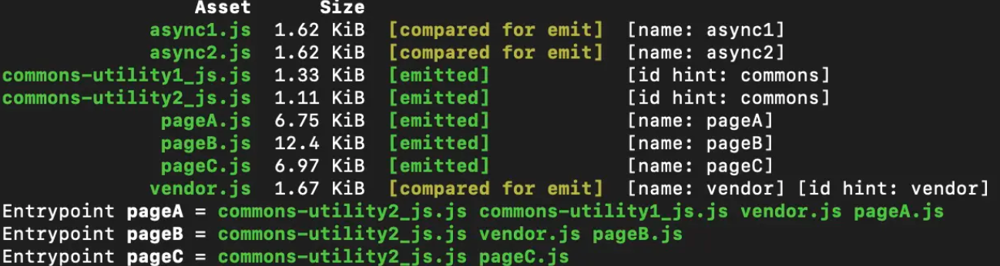

# 正文

## SplitChunksPlugin 默认配置从何而来

实际开发会发现，有时 webpack 的默认打包结果并不像官网描述的那样，到底问题出在哪里？去源码找答案。webpack 在 default.js 文件统一进行了默认配置，其中 SplitChunksPlugin 的默认配置源码如下：

```()
// D和F都是给对象赋值的方法，区别就在于F传的是方法，能根据逻辑判断分配不同的值
const D = (obj, prop, value) => {
  if (obj[prop] === undefined) {
    obj[prop] = value;
  }
};

const F = (obj, prop, factory) => {
  if (obj[prop] === undefined) {
    obj[prop] = factory();
  }
};

const applyOptimizationDefaults = (
  optimization,
  { production, development, records }
) => {
  // 省略其他配置
  const { splitChunks } = optimization;
  if (splitChunks) {
    D(splitChunks, "hidePathInfo", production);
    D(splitChunks, "chunks", "async");
    D(splitChunks, "minChunks", 1);
    //这些属性默认值在production和development模式下有不同取值
    F(splitChunks, "minSize", () => (production ? 30000 : 10000));
    F(splitChunks, "minRemainingSize", () => (development ? 0 : undefined));
    //开发模式下maxAsyncRequests为无穷大
    F(splitChunks, "maxAsyncRequests", () => (production ? 6 : Infinity));
    F(splitChunks, "maxInitialRequests", () => (production ? 4 : Infinity));
    //官网上还是默认以"~"为分割符，源码中变为"-"
    D(splitChunks, "automaticNameDelimiter", "-");
    const { cacheGroups } = splitChunks;
    F(cacheGroups, "default", () => ({
      idHint: "",
      reuseExistingChunk: true,
      minChunks: 2,
      priority: -20,
    }));
    F(cacheGroups, "defaultVendors", () => ({
      idHint: "vendors",
      reuseExistingChunk: true,
      test: NODE_MODULES_REGEXP,
      priority: -10,
    }));
  }
};
```

看了源码才知道，SplitChunksPlugin 的默认配置和官方文档中并不完全相同，几个取值会随模式切换而变化，但官网对外屏蔽了这些细节，估计因为 webpack 默认情况下是开发模式，所以官网并没有展示开发模式下的默认值，而我们开发的时候常常切换为开发模式，所以需要注意这些区别。

以上期项目为例，我们看看新版本下的打包结果：



包名不仅采用“-”分隔，而且变得更简短了，这是因为 Webpack5 用模块本身的名字和类型替代了原本的引用包名称组合的形式。这种方式更一目了然，直接帮你定位到特定文件，如果想知道模块被哪些包引用，得到更多细节信息，可以使用命令：webpack --display-chunks。

## SplitChunksPlugin 的三步走战略

Webpack 插件统一以 apply 方法为入口，然后注册优化事件，插件逻辑都在 SplitChunksPlugin.js 文件中：

```()
apply(compiler) {
    // compiler是webpack编译器实例，全局唯一，包含webpack环境的所有配置信息
    compiler.hooks.thisCompilation.tap("SplitChunksPlugin", compilation => {
        // 省略次要代码
        // compilation是每次编译的资源实例，通过它能得到当前编译的所有模块和资源信息
        // compilation拥有事件流机制，可以监听事件并触发回调（就是观察者模式），这里就是在优化事件发生时，执行代码分割逻辑
        compilation.hooks.optimizeChunks.tap(
            {
                name: "SplitChunksPlugin",
                stage: STAGE_ADVANCED
                },
                chunks => {
                    // 三步走，完成代码分割优化
            }
        )
    }
}
```

在整个编译周期中，compilation 会在生成 chunkGraph（包含代码块依赖关系的图结构）之后，触发 optimizeChunks 事件并传入 chunks，开始代码分割优化过程，所有优化都在 optimizeChunks 事件的回调函数中完成。

### 准备阶段

进行优化的预处理，定义优化过程中一些必要的方法和数据结构，在后续阶段会用到：

```()
const chunkSetsInGraph = new Map();
/**
 * 优化的核心就是提取公共的module，所以要为每个module和包含该module的chunks生成一个key值，
 * 每个module对应一个key，也对应所有包含该module的chunks集合（chunksSet），
 * 这样我们就知道每个module在哪些chunk中重复了，这对优化起了关键作用。
 * 这里将该key值和这些chunks建立映射关系，存在chunkSetsInGraph中，便于之后通过key值取出这些chunksSet，进行优化。
 */
for (const module of compilation.modules) {
  const chunksKey = getKey(chunkGraph.getModuleChunksIterable(module));
  if (!chunkSetsInGraph.has(chunksKey)) {
    chunkSetsInGraph.set(
      chunksKey,
      new Set(chunkGraph.getModuleChunksIterable(module))
    );
  }
}

const chunkSetsByCount = new Map();
/**
 * 上面我们知道了每个module在哪些chunks中重复，现在要根据重复次数将这些信息整理归类，存在chunkSetsByCount中。
 * 这么做是为了匹配minChunks属性，可以根据minChunks（module的最小重复次数）直接找到对应的chunksSet的集合，
 * 不符合minChunks的chunksSet会被自然排除在外。
 * 注意，一个module对应一个chunksSet，一个count对应多个chunksSet，也就对应多个module
 */
for (const chunksSet of chunkSetsInGraph.values()) {
  // 遍历chunkSetsInGraph，统计每个chunks集合的chunk数量，即每个module的重复次数，建立数量和chunks集合的映射
  const count = chunksSet.size;
  let array = chunkSetsByCount.get(count);
  if (array === undefined) {
    array = [];
    chunkSetsByCount.set(count, array);
  }
  array.push(chunksSet);
}

const combinationsCache = new Map();

// 获得可能满足minChunks条件chunks集合，用于后续和minChunks条件比对
const getCombinations = (key) => {
  // 根据key值取出该module对应的chunks集合（chunksSet）
  const chunksSet = chunkSetsInGraph.get(key);
  var array = [chunksSet];
  if (chunksSet.size > 1) {
    for (const [count, setArray] of chunkSetsByCount) {
      if (count < chunksSet.size) {
        // 每个module对应一个set，这里是找出setArray的子集，防止遗漏
        for (const set of setArray) {
          if (isSubset(chunksSet, set)) {
            array.push(set);
          }
        }
      }
    }
  }
  return array;
};

// 关键的Map结构，每一项对应一个分割出来的缓存组，键名为根据name属性生成的key值，键值为该key值对应的modules、chunks和cacheGroup信息对象
const chunksInfoMap = new Map();

const addModuleToChunksInfoMap = (
  cacheGroup,
  selectedChunks,
  selectedChunksKey,
  module
) => {
  const name = cacheGroup.getName(module, selectedChunks, cacheGroup.key);
  // 检查名称是否和已有的chunk有冲突，此外，webpack5以后不允许cacheGroup名称覆盖入口名称，会报错
  if (!alreadyValidatedNames.has(name)) {
    alreadyValidatedNames.add(name);
    if (compilation.namedChunks.has(name)) {
      // 省略报错内容
    }
  }
  /**
   * 如果cachGroup有name，就用cacheGroup的key和name作为key，如果没有，就是用从cacheGroup和chunk生成的key值（selectedChunksKey）。
   * 如果cachGroup有name，属于该cachGroup的module在这里的key值都是一样的，所以会合并到一个info中，最后打成一个包，
   * 而如果cachGroup没有name，每个module会生成不同key，最后每个module都会单独打成一个包，
   * 这里建议和上一期的“宝藏属性Name”一起理解
   */
  const key =
    cacheGroup.key + (name ? ` name:${name}` : ` chunks:${selectedChunksKey}`);
  // Add module to maps
  let info = chunksInfoMap.get(key);
  if (info === undefined) {
    chunksInfoMap.set(
      key,
      (info = {
        modules: new SortableSet(undefined, compareModulesByIdentifier),
        cacheGroup,
        name,
        // 判断minSize是否为正值
        validateSize:
          hasNonZeroSizes(cacheGroup.minSize) ||
          hasNonZeroSizes(cacheGroup.minRemainingSize),
        sizes: {},
        chunks: new Set(),
        reuseableChunks: new Set(),
        chunksKeys: new Set(),
      })
    );
  }
  info.modules.add(module);
  // 计算代码块的体积
  if (info.validateSize) {
    for (const type of module.getSourceTypes()) {
      info.sizes[type] = (info.sizes[type] || 0) + module.size(type);
    }
  }
  // 将代码块加入到chunksInfoMap中，以便最后打包
  if (!info.chunksKeys.has(selectedChunksKey)) {
    info.chunksKeys.add(selectedChunksKey);
    for (const chunk of selectedChunks) {
      info.chunks.add(chunk);
    }
  }
};
```

准备过程中，chunksInfoMap 和 addModuleToChunksInfoMap 是最重要的两个角色，重点提一提：

* chunksInfoMap 存储着代码分割信息，每一项都是一个缓存组，对应于最终要分割出哪些额外代码块，会不断迭代，最终将代码分割结果加入 chunkGraph 中，而 chunkGraph 最终会生成我们见到的打包文件。当然，这些缓存组目前还附带一些额外信息，比如 cacheGroup，就是我们配置的 cacheGroup 代码分割规则，用于后续校验；再比如 sizes，记录了缓存组中模块的总体积，用于之后判断是否符合我们配置的 minSize 条件。
* addModuleToChunksInfoMap 就是向 chunksInfoMap 中添加新的代码分割信息，每次添加都会根据 key 值选择是创建新的缓存组还是在已有缓存组中添加模块，并更新缓存组信息。

### 模块分组阶段

准备完成后，遍历所有 module，将符合条件的 module 通过 addModuleToChunksInfoMap 方法存到 chunksInfoMap 中，进行分组，其实就是创建缓存组的过程：

```()
for (const module of compilation.modules) {
  // 通过getCacheGroups得到module从属的cacheGroup，一个module可能符合多个cacheGroup的条件
  // Get cache group
  let cacheGroups = this.options.getCacheGroups(module, context);
  if (!Array.isArray(cacheGroups) || cacheGroups.length === 0) {
    continue;
  }

  // 包含同一个module的chunk会对应唯一的key值，以便接下来获取要优化的chunks集合
  const chunksKey = getKey(
    // 获得所有包含该module的chunk
    chunkGraph.getModuleChunksIterable(module)
  );
  let combs = combinationsCache.get(chunksKey);
  if (combs === undefined) {
    // 这是准备阶段定义的方法，获得可能满足minChunks条件chunks集合，用于后续和minChunks条件比对
    combs = getCombinations(chunksKey);
    combinationsCache.set(chunksKey, combs);
  }

  for (const cacheGroupSource of cacheGroups) {
    // 将的cacheGroup配置都取出来，如果值不存在，则会从splitChunks全局配置继承
    const cacheGroup = {
      key: cacheGroupSource.key,
      priority: cacheGroupSource.priority || 0,
      // chunksFilter对应cacheGroup配置中的chunks属性，只是进行了一些处理，变成了一个方法
      chunksFilter: cacheGroupSource.chunksFilter || this.options.chunksFilter,
      minSize: mergeSizes(
        cacheGroupSource.minSize,
        cacheGroupSource.enforce ? undefined : this.options.minSize
      ),
      minRemainingSize: mergeSizes(
        cacheGroupSource.minRemainingSize,
        cacheGroupSource.enforce ? undefined : this.options.minRemainingSize
      ),
      minSizeForMaxSize: mergeSizes(
        cacheGroupSource.minSize,
        this.options.minSize
      ),
      maxAsyncSize: mergeSizes(
        cacheGroupSource.maxAsyncSize,
        cacheGroupSource.enforce ? undefined : this.options.maxAsyncSize
      ),
      maxInitialSize: mergeSizes(
        cacheGroupSource.maxInitialSize,
        cacheGroupSource.enforce ? undefined : this.options.maxInitialSize
      ),
      minChunks:
        cacheGroupSource.minChunks !== undefined
          ? cacheGroupSource.minChunks
          : cacheGroupSource.enforce
          ? 1
          : this.options.minChunks,
      maxAsyncRequests:
        cacheGroupSource.maxAsyncRequests !== undefined
          ? cacheGroupSource.maxAsyncRequests
          : cacheGroupSource.enforce
          ? Infinity
          : this.options.maxAsyncRequests,
      maxInitialRequests:
        cacheGroupSource.maxInitialRequests !== undefined
          ? cacheGroupSource.maxInitialRequests
          : cacheGroupSource.enforce
          ? Infinity
          : this.options.maxInitialRequests,
      getName:
        cacheGroupSource.getName !== undefined
          ? cacheGroupSource.getName
          : this.options.getName,
      filename:
        cacheGroupSource.filename !== undefined
          ? cacheGroupSource.filename
          : this.options.filename,
      automaticNameDelimiter:
        cacheGroupSource.automaticNameDelimiter !== undefined
          ? cacheGroupSource.automaticNameDelimiter
          : this.options.automaticNameDelimiter,
      idHint:
        cacheGroupSource.idHint !== undefined
          ? cacheGroupSource.idHint
          : cacheGroupSource.key,
      reuseExistingChunk: cacheGroupSource.reuseExistingChunk,
    };
    // 这里就是根据我们的cacheGroup配置，筛选出符合minChunks和chunks规则的chunk
    for (const chunkCombination of combs) {
      // 如果不满足minChunks，就直接break，不建立这个缓存组，也就不会分割相应代码
      if (chunkCombination.size < cacheGroup.minChunks) continue;
      // 解构赋值，获得符合chunksFilter（"initial" | "async" | "all"，其实就是chunks属性）条件的chunks
      const {
        chunks: selectedChunks,
        key: selectedChunksKey,
      } = getSelectedChunks(chunkCombination, cacheGroup.chunksFilter);

      // 将目前符合条件的modules、chunks和cacheGroup信息存到chunksInfoMap中
      addModuleToChunksInfoMap(
        cacheGroup,
        selectedChunks,
        selectedChunksKey,
        module
      );
    }
  }
}
```

### 排队检查阶段

上一阶段生成了缓存组信息 chunksInfoMap，本阶段按照用户的 cacheGroup 配置，一项一项检查 chunksInfoMap 中各个缓存组是否符合规则，去除不符合的，留下符合的加入 compilation 的 chunkGraph 中，直至把全部代码分割结果都更新到 chunkGraph 中。代码比较长，但都是按部就班，先进行规则校验，然后将符合条件的缓存组中的模块打包成新的 chunk：

```()
// 将体积小于minSize的缓存组(这里对应chunsInfoItem)从chunksInfoMap中删除
for (const pair of chunksInfoMap) {
  const info = pair[1];
  if (info.validateSize && !checkMinSize(info.sizes, info.cacheGroup.minSize)) {
    chunksInfoMap.delete(pair[0]);
  }
}

while (chunksInfoMap.size > 0) {
  // 寻找最匹配的cacheGroup分组信息，优先进行分割，优先产生打包结果
  let bestEntryKey;
  let bestEntry;
  for (const pair of chunksInfoMap) {
    const key = pair[0];
    const info = pair[1];
    if (bestEntry === undefined || compareEntries(bestEntry, info) < 0) {
      bestEntry = info;
      bestEntryKey = key;
    }
  }

  const item = bestEntry;
  chunksInfoMap.delete(bestEntryKey);

  let chunkName = item.name;
  // 由缓存组生成的新chunk
  let newChunk;
  let isExistingChunk = false;
  let isReusedWithAllModules = false;
  // 真正的代码分割从这开始，前面其实都是准备工作
  if (chunkName) {
    const chunkByName = compilation.namedChunks.get(chunkName);
    // 如果在原本的chunks中找到了这样名字的chunk，就将它提取出来，最终会将所有同名chunk合并在一起
    if (chunkByName !== undefined) {
      newChunk = chunkByName;
      item.chunks.delete(newChunk);
      isExistingChunk = true;
    }
  } else if (item.cacheGroup.reuseExistingChunk) {
    // 如果没有设定name，则寻找是否能复用已有的chunk
    outer: for (const chunk of item.chunks) {
      if (chunkGraph.getNumberOfChunkModules(chunk) !== item.modules.size) {
        continue;
      }
      if (chunkGraph.getNumberOfEntryModules(chunk) > 0) {
        continue;
      }
      for (const module of item.modules) {
        if (!chunkGraph.isModuleInChunk(module, chunk)) {
          continue outer;
        }
      }
      if (!newChunk || !newChunk.name) {
        newChunk = chunk;
      } else if (chunk.name && chunk.name.length < newChunk.name.length) {
        newChunk = chunk;
      } else if (
        chunk.name &&
        chunk.name.length === newChunk.name.length &&
        chunk.name < newChunk.name
      ) {
        newChunk = chunk;
      }
    }
    if (newChunk) {
      item.chunks.delete(newChunk);
      chunkName = undefined;
      isExistingChunk = true;
      isReusedWithAllModules = true;
    }
  }

  // 该缓存组内没有chunk，则跳过本次循环，又因为之前chunksInfoMap.delete(bestEntryKey)删除了该缓存组，所以相当于从代码分割的结果集中去除了没有chunk的缓存组
  if (item.chunks.size === 0 && !isExistingChunk) continue;

  const usedChunks = Array.from(item.chunks);
  let validChunks = usedChunks;
  // 检测缓存组中的代码块是否满足maxInitialRequests和maxAsyncRequests条件，如果它们都是无穷大，就没必要检测了
  if (
    Number.isFinite(item.cacheGroup.maxInitialRequests) ||
    Number.isFinite(item.cacheGroup.maxAsyncRequests)
  ) {
    validChunks = validChunks.filter((chunk) => {
      // 如果chunk是初始代码块，只需判断maxInitialRequests条件是否满足；
      // 如果chunk不是初始代码块，只需判断maxAsyncRequests条件是否满足；
      // 如果chunk可以作为初始代码块，就取两者最小值；不过目前这个分支条件是走不到的，因为目前版本代码块只有初始（作为入口）或者非初始（懒加载）
      const maxRequests = chunk.isOnlyInitial()
        ? item.cacheGroup.maxInitialRequests
        : chunk.canBeInitial()
        ? Math.min(
            item.cacheGroup.maxInitialRequests,
            item.cacheGroup.maxAsyncRequests
          )
        : item.cacheGroup.maxAsyncRequests;
      // 如果不满足最大请求数的条件，则从validChunks中去除
      return !isFinite(maxRequests) || getRequests(chunk) < maxRequests;
    });
  }

  // 将那些不再包含缓存组中模块的代码块删除
  validChunks = validChunks.filter((chunk) => {
    for (const module of item.modules) {
      if (chunkGraph.isModuleInChunk(module, chunk)) return true;
    }
    return false;
  });

  // 将去除不符合条件的chunk之后的新缓存组加入chunksInfoMap，不断迭代，更新代码分割结果
  if (validChunks.length < usedChunks.length) {
    if (isExistingChunk) validChunks.push(newChunk);
    if (validChunks.length >= item.cacheGroup.minChunks) {
      for (const module of item.modules) {
        addModuleToChunksInfoMap(
          item.cacheGroup,
          validChunks,
          getKey(validChunks),
          module
        );
      }
    }
    continue;
  }

  // Webpack5新特性minRemainingSize，保证chunk被分割后的剩余体积不小于该值，防止出现特别小的单个代码块
  if (
    validChunks.length === 1 &&
    hasNonZeroSizes(item.cacheGroup.minRemainingSize)
  ) {
    const chunk = validChunks[0];
    const chunkSizes = { ...chunkGraph.getChunkModulesSizes(chunk) };
    for (const key of Object.keys(item.sizes)) {
      chunkSizes[key] -= item.sizes[key];
    }
    if (!checkMinSize(chunkSizes, item.cacheGroup.minRemainingSize)) {
      continue;
    }
  }

  // 创建新的代码块，加入我们编译器的chunkGraph，这个新的代码块就是分割出来的公共代码
  if (!isExistingChunk) {
    newChunk = compilation.addChunk(chunkName);
  }
  // 创建了新代码块还不够，还需要建立chunk和chunkGroup之间的关系
  for (const chunk of usedChunks) {
    // Add graph connections for splitted chunk
    chunk.split(newChunk);
  }

  // 提供输出信息：分割出来的新chunk是否是复用的
  newChunk.chunkReason =
    (newChunk.chunkReason ? newChunk.chunkReason + ", " : "") +
    (isReusedWithAllModules ? "reused as split chunk" : "split chunk");
  // 提供输出信息：分割出来的新chunk中会备注所属cacheGroup的信息，最终打包输出时会附加这些信息，便于我们debug
  if (item.cacheGroup.key) {
    newChunk.chunkReason += ` (cache group: ${item.cacheGroup.key})`;
  }
  if (!isReusedWithAllModules) {
    // 将缓存组中的所有模块都加入新生成的chunk中，就是把缓存组打包成新的代码块
    for (const module of item.modules) {
      // chunkCondition方法现版本永远返回true
      if (!module.chunkCondition(newChunk, compilation)) continue;
      chunkGraph.connectChunkAndModule(newChunk, module);
      // 从缓存组的chunks中删除那些已经被提取出来的模块，达到优化体积的目的
      for (const chunk of usedChunks) {
        chunkGraph.disconnectChunkAndModule(chunk, module);
      }
    }
  } else {
    // 如果缓存组中所有module都被复用了，则从usedChunks中将这些module全部删除，避免冗余
    for (const module of item.modules) {
      for (const chunk of usedChunks) {
        chunkGraph.disconnectChunkAndModule(chunk, module);
      }
    }
  }

  // 从其他缓存组中删除已经被提取出来的模块，避免产生重复代码
  for (const [key, info] of chunksInfoMap) {
    if (isOverlap(info.chunks, item.chunks)) {
      if (info.validateSize) {
        let updated = false;
        for (const module of item.modules) {
          if (info.modules.has(module)) {
            // remove module
            // 删除模块
            info.modules.delete(module);
            // 更新缓存组体积
            for (const key of module.getSourceTypes()) {
              info.sizes[key] -= module.size(key);
            }
            updated = true;
          }
        }
        // 删除重复模块后，要重新判断缓存组体积，如果小于minSize则删除该缓存组
        if (updated) {
          if (info.modules.size === 0) {
            chunksInfoMap.delete(key);
            continue;
          }
          if (!checkMinSize(info.sizes, info.cacheGroup.minSize)) {
            chunksInfoMap.delete(key);
          }
        }
      } else {
        for (const module of item.modules) {
          info.modules.delete(module);
        }
        if (info.modules.size === 0) {
          chunksInfoMap.delete(key);
        }
      }
    }
  }
}

// 最后还有一段对maxSize的校验，很长，但原理和步骤与之前大同小异，这里省略
```

经过本阶段的筛选，chunksInfoMap 中符合配置规则的缓存组会被全部打包成新代码块，并且加入 compilation 的 chunkGraph 中，完成代码分割的工作，最终生成打包文件。不要害怕大量if，else分支，其实都只是按部就班检查各类配置是否满足，排除一些特殊特殊情况。

此外，有些方法如 module 的 chunkCondition 现版本永远返回 true，应该是预留一个可扩展的分支逻辑，以后版本可能会有更多优化情况。

## 总结

SplitChunksPlugin 的核心在于将每个模块（module）按照规则分配到各个缓存组中，形成一个缓存组的 map 结构 chunksInfoMap，每个缓存组会对应最终分割出来的新代码块。我们对 splitChunks 中的 cacheGroups 进行配置，其实就是控制 chunksInfoMap 中的每个缓存组。

回顾整个过程，其实没有复杂的算法逻辑，就是在合适的时候遍历判断各个条件是否满足，但是却能将一个庞大项目的复杂包结构分割成可预测的结果。实用的工具背后的逻辑往往很简单明确，我们开发项目也一样，不需要过度设计，先用最直接的逻辑完成最需要做的事，也许才是当下最好的解决方案。如果真的需要一些复杂的设计，也应该尽量把复杂度聚合在数据结构中，采用声明式而非命令式的方式解决问题。