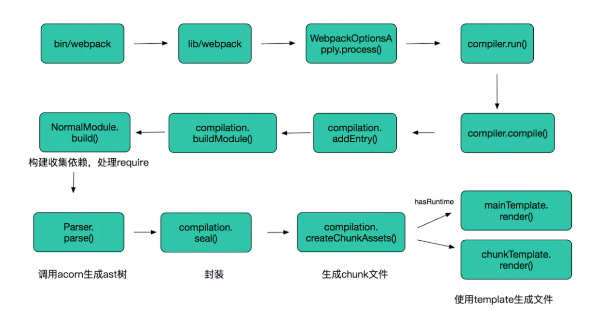
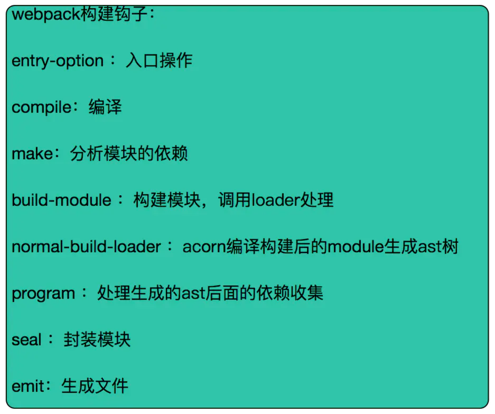

# 正文

## 概念

本质上，webpack 是一个现代 JavaScript 应用程序的静态模块打包器(module bundler)。当 webpack 处理应用程序时，它会递归地构建一个依赖关系图(dependency graph)，其中包含应用程序需要的每个模块，然后将所有这些模块打包成一个或多个 bundle。

在开始前你需要先理解四个核心概念：

* 入口(entry)
* 输出(output)
* loader
* 插件(plugins)

### 入口(entry)

入口起点(entry point)指示 webpack 应该使用哪个模块，来作为构建其内部依赖图的开始。进入入口起点后，webpack 会找出有哪些模块和库是入口起点（直接和间接）依赖的。

每个依赖项随即被处理，最后输出到称之为 bundles 的文件中

```()
// webpack.config.js

module.exports = {
  entry: './path/to/my/entry/file.js'
};
```

### 出口(output)

output 属性告诉 webpack 在哪里输出它所创建的 bundles，以及如何命名这些文件，默认值为 ./dist。基本上，整个应用程序结构，都会被编译到你指定的输出路径的文件夹中。你可以通过在配置中指定一个 output 字段，来配置这些处理过程：

```()
// webpack.config.js

const path = require('path');

module.exports = {
  entry: './path/to/my/entry/file.js',
  output: {
    path: path.resolve(__dirname, 'dist'),
    filename: 'my-first-webpack.bundle.js'
  }
};
```

### loader

loader 让 webpack 能够去处理那些非 JavaScript 文件（webpack 自身只理解 JavaScript）。loader 可以将所有类型的文件转换为 webpack 能够处理的有效模块，然后你就可以利用 webpack 的打包能力，对它们进行处理。

本质上，webpack loader 将所有类型的文件，转换为应用程序的依赖图（和最终的 bundle）可以直接引用的模块。

在更高层面，在 webpack 的配置中 loader 有两个目标：

test 属性，用于标识出应该被对应的 loader 进行转换的某个或某些文件。
use 属性，表示进行转换时，应该使用哪个 loader。

#### webpack常用的loader

样式：style-loader、css-loader、less-loader、sass-loader等
文件：raw-loader、file-loader 、url-loader等
编译：babel-loader、coffee-loader 、ts-loader等
校验测试：mocha-loader、jshint-loader 、eslint-loader等

举例：

```()
module.exports = {
    module: {
        rules: [
            {
                test: /\.scss$/,
                use:[
                    {loader:'style-loader'},
                    {loader:'css-loader',options:{sourceMap:true,modules:true}},
                    {loader:'sass-loader',options:{sourceMap:true}}
                ],
                exclude:/node_modules/
            }
        ]
    }
}
```

### 插件(plugins)

loader 被用于转换某些类型的模块，而插件则可以用于执行范围更广的任务。插件的范围包括，从打包优化和压缩，一直到重新定义环境中的变量。插件接口功能极其强大，可以用来处理各种各样的任务。

插件目的在于解决 loader 无法实现的其他事。

#### webpack常用的plugin

首先webpack内置UglifyJsPlugin，压缩和混淆代码。
webpack内置CommonsChunkPlugin，提高打包效率，将第三方库和业务代码分开打包。
ProvidePlugin：自动加载模块，代替require和import  

```()
new webpack.ProvidePlugin({
    $: 'jquery',
    jQuery: 'jquery'
})
```

html-webpack-plugin可以根据模板自动生成html代码，并自动引用css和js文件
extract-text-webpack-plugin 将js文件中引用的样式单独抽离成css文件
DefinePlugin 编译时配置全局变量，这对开发模式和发布模式的构建允许不同的行为非常有用。

```()
new webpack.DefinePlugin({
  PRODUCTION: JSON.stringify(true),
  VERSION: JSON.stringify("5fa3b9"),
  BROWSER_SUPPORTS_HTML5: true,
  TWO: "1+1",
  "typeof window": JSON.stringify("object")
})
```

optimize-css-assets-webpack-plugin 不同组件中重复的css可以快速去重

webpack-bundle-analyzer 一个webpack的bundle文件分析工具，将bundle文件以可交互缩放的treemap的形式展示。
compression-webpack-plugin 生产环境可采用gzip压缩JS和CSS
happypack：通过多进程模型，来加速代码构建

```()
    const os = require('os');
    let HappyPack = require('happypack');
    let happyThreadPool = HappyPack.ThreadPool({size: os.cpus().length});
    exports.plugins = [
      new HappyPack({
        id: 'jsx',
        threadPool: happyThreadPool,
        loaders: [ 'babel-loader' ]
      }),

      new HappyPack({
        id: 'coffeescripts',
        threadPool: happyThreadPool,
        loaders: [ 'coffee-loader' ]
      })
    ];

    exports.module.loaders = [
      {
        test: /\.js$/,
        loaders: [ 'happypack/loader?id=jsx' ]
      },
      {
        test: /\.coffee$/,
        loaders: [ 'happypack/loader?id=coffeescripts' ]
      },
    ]
```

#### 写一个webpack插件

主要的步骤如下:

1. 编写一个JavaScript命名函数。
2. 在它的原型上定义一个apply方法。
3. 指定挂载的webpack事件钩子。
4. 处理webpack内部实例的特定数据。
5. 功能完成后调用webpack提供的回调。编写插件之前要理解compiler和compilation两个对象，以及webpack生命周期的各个阶段和钩子，plugin比loader强大，通过plugin你可以访问compliler和compilation过程，通过钩子拦截webpack的执行。

比如我们可以在构建生成文件时，将所有生成的文件名生成到filelist.md的文件中

```()
function FileListPlugin(options) {}
FileListPlugin.prototype.apply = function(compiler) {
  compiler.plugin('emit', function(compilation, callback) {
    var filelist = 'In this build:\n\n';
    for (var filename in compilation.assets) {
      filelist += ('- '+ filename +'\n');
    }
    compilation.assets['filelist.md'] = {
      source: function() {
        return filelist;
      },
      size: function() {
        return filelist.length;
      }
    };
    callback();
  });
};

module.exports = FileListPlugin;
```

#### webpack 插件分析

首先介绍webpack源码分析方法

node --inspect-brk ./node_modules/webpack/bin/webpack.js --config ./webpack.config.js
chrome输入 chrome://inspect/

主要的流程是：



webpack构建的主要钩子：



主要包括编译，分析模块及依赖关系，构建模块，封装结果，生成文件等

compiler和compilation都继承于Tapablewebpack的插件是基于Tapable的，Tapable允许你添加和应用插件到javascript模块中，类似于 NodeJS的EventEmitter，可以被继承和mixin到其他模块中，详情见官网Tapable其中关键的方法是

```()
plugin(name:string, handler:function)
apply(...pluginInstances: (AnyPlugin|function)[])
applyPlugins*(name:string, ...)
mixin(pt: Object)tapable主要负责处理事件，采用的是发布订阅模式，apply相当于trigger，plugin相当于addEventListener
```

## tree shaking

webpack 2.0 开始引入 tree shaking 技术。在介绍技术之前，先介绍几个相关概念：

AST 对 JS 代码进行语法分析后得出的语法树 (Abstract Syntax Tree)。AST语法树可以把一段 JS 代码的每一个语句都转化为树中的一个节点。  

DCE Dead Code Elimination，在保持代码运行结果不变的前提下，去除无用的代码。这样的好处是:
减少程序体积
减少程序执行时间
便于将来对程序架构进行优化

而所谓 Dead Code 主要包括：

程序中没有执行的代码 (如不可能进入的分支，return 之后的语句等)导致 dead variable 的代码(写入变量之后不再读取的代码)tree shaking 是 DCE 的一种方式，它可以在打包时忽略没有用到的代码。

因此，相比于 排除不使用的代码，tree shaking 其实是 找出使用的代码。基于 ES6 的静态引用，tree shaking 通过扫描所有 ES6 的 export，找出被 import 的内容并添加到最终代码中。 webpack 的实现是把所有 import 标记为有使用/无使用两种，在后续压缩时进行区别处理。因为就如比喻所说，在放入烤箱(压缩混淆)前先剔除蛋壳(无使用的 import)，只放入有用的蛋白蛋黄(有使用的 import)

### 使用方法

首先源码必须遵循 ES6 的模块规范 (import & export)，如果是 CommonJS 规范 (require) 则无法使用。

根据webpack官网的提示，webpack2 支持 tree-shaking，需要修改配置文件，指定babel处理js文件时不要将ES6模块转成CommonJS模块，具体做法就是：
在.babelrc设置babel-preset-es2015的modules为fasle，表示不对ES6模块进行处理。

```()
// .babelrc
{
    "presets": [
        ["es2015", {"modules": false}]
    ]
}
```

经过测试，webpack 3 和 4 不增加这个 .babelrc 文件也可以正常 tree shaking

### Tree shaking 两步走

* webpack 负责对代码进行标记，把 import & export 标记为 3 类：所有 import 标记为 `/* harmony import */`

* 被使用过的 export 标记为 `/* harmony export ([type]) */`，其中 [type] 和 webpack 内部有关，可能是 binding, immutable 等等。

* 没被使用过的 export 标记为 `/* unused harmony export [FuncName] */`，其中 [FuncName] 为 export 的方法名称之后在 Uglifyjs (或者其他类似的工具) 步骤进行代码精简，把没用的都删除。

## scope hoisting

Webpack 正式发布了它的第三个版本，这个版本提供了一个新的功能：Scope Hoisting，又译作“作用域提升”。只需在配置文件中添加一个新的插件，就可以让 Webpack 打包出来的代码文件更小、运行的更快：

```()
module.exports = {
  plugins: [
    new webpack.optimize.ModuleConcatenationPlugin()
  ]
}
```

### Webpack 默认的模块打包方式

现在假设我们的项目有这样两个文件：

```()
// module-a.js
export default 'module A'
// entry.js
import a from './module-a'
console.log(a)
```

现在我们用 Webpack 打包一下，得到的文件大致像这样：

```()
// bundle.js
// 最前面的一段代码实现了模块的加载、执行和缓存的逻辑，这里直接略过
[
  /* 0 */
  function (module, exports, require) {
    var module_a = require(1)
    console.log(module_a['default'])
  },
  /* 1 */
  function (module, exports, require) {
    exports['default'] = 'module A'
  }
]
```

简单来说，Webpack 将所有模块都用函数包裹起来，然后自己实现了一套模块加载、执行与缓存的功能，使用这样的结构是为了更容易实现 Code Splitting（包括按需加载）、模块热替换等功能。

但如果你在 Webpack 3 中添加了 ModuleConcatenationPlugin 插件，这个结构会发生一些变化。

### 作用域提升后的 bundle.js

同样的源文件在使用了 ModuleConcatenationPlugin 之后，打包出来的文件会变成下面这样：

```()
// bundle.js
[
  function (module, exports, require) {
    // CONCATENATED MODULE: ./module-a.js
    var module_a_defaultExport = 'module A'

    // CONCATENATED MODULE: ./index.js
    console.log(module_a_defaultExport)
  }
]
```

显而易见，这次 Webpack 将所有模块都放在了一个函数里，直观感受就是——函数声明少了很多，因此而带来的好处有：

* 文件体积比之前更小。
* 运行代码时创建的函数作用域也比之前少了，开销也随之变小。

项目中的模块越多，上述的两点提升就会越明显。

### 它是如何实现的

这个功能的原理很简单：将所有模块的代码按照引用顺序放在一个函数作用域里，然后适当的重命名一些变量以防止变量名冲突。

但到目前为止（Webpack 3.3.0），为了在 Webpack 中使用这个功能，你的代码必须是用 ES2015 的模块语法写的。

```()
var directory = './modules/'
if (Math.random() > 0.5) {
  module.exports = require(directory + 'foo.js')
} else {
  module.exports = require(directory + 'bar.js')
}
```

这种情况很难分析出模块之间的依赖关系及输出的变量。

而 ES2015 的模块语法规定 import 和 export 关键字必须在顶层、模块路径只能用字符串字面量，这种“强制静态化”的做法使代码在编译时就能确定模块的依赖关系，以及输入和输出的变量，所以这种功能实现起来会更加简便。

### 等等，为什么在我的项目中不起作用

一些同学可能已经在自己的项目中加上了 ModuleConcatenationPlugin，但却发现打包出来的代码完全没有发生变化。

前面说过，要使用 Scope Hoisting，你的代码必须是用 ES2015 的模块语法写的，但是大部分 NPM 中的模块仍然是 CommonJS 语法（例如 lodash），所以导致 Webpack 回退到了默认的打包方式。

其他可能的原因还有：

* 使用了 ProvidePlugin
* 使用了 eval() 函数
* 你的项目有多个 entry
