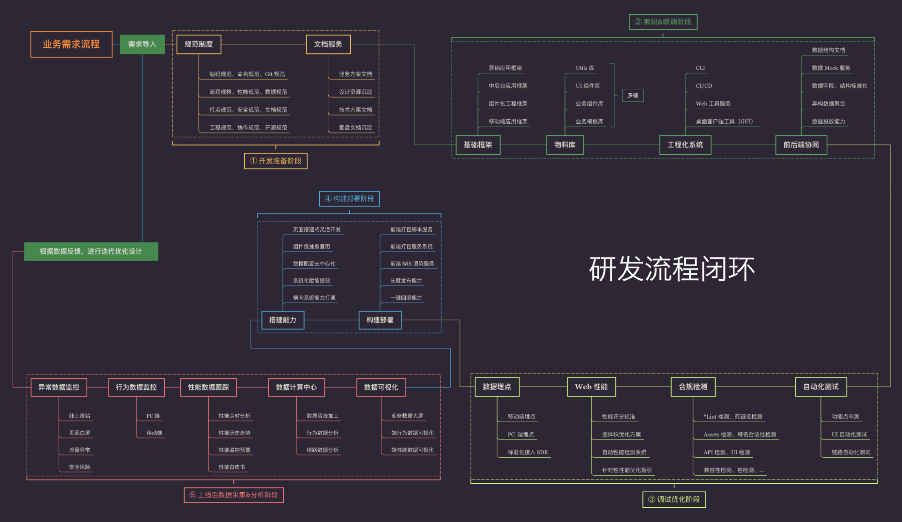
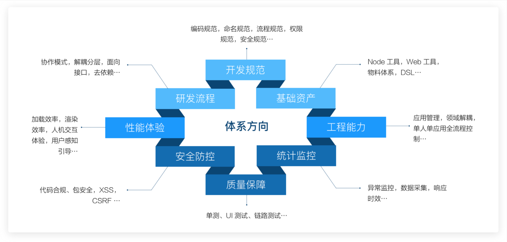
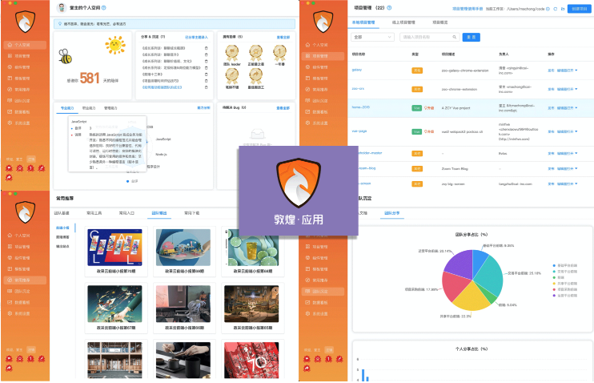
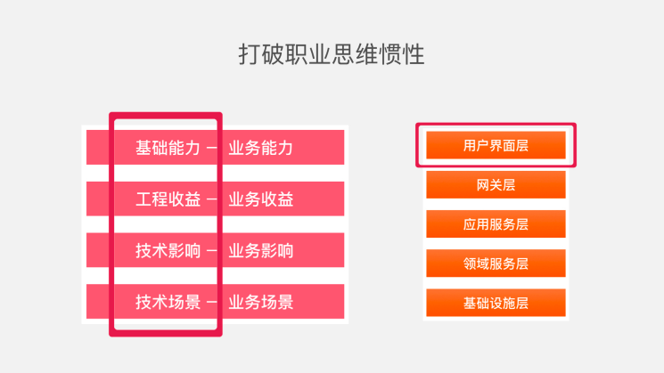
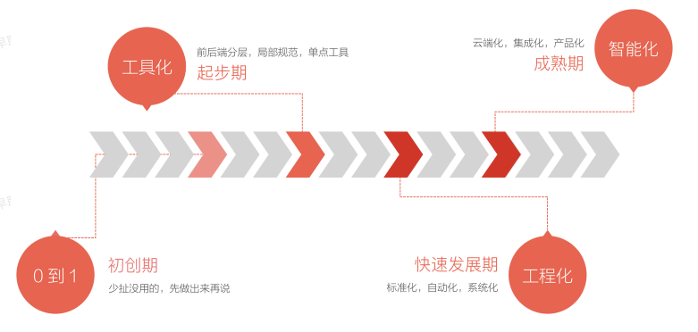
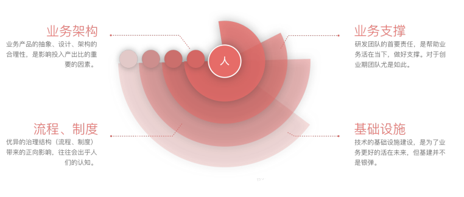

# 正文

## 如何推动基础架构项目落地

### 如何建设基建团队

#### 需要什么样的人

需要能够折腾，在平时的业务开发过程中，善于总结和喜欢分享，知道好的代码什么样，不好的代码什么样，有一定的抽象能力，时刻关注新鲜技术。

#### 需要做什么样的事情

很多前端的基础SDK，比如埋点统计、性能统计收集、错误统计收集等基础库，UI相关的一系列基础库。

#### 需要掌握什么样的技能

首先，基础建设团队的人不能给自己设限

1. 语言层面不设限
2. 领域层面不设限

#### 需要什么性格的人

性格互补，不争强好胜，不嫌麻烦，有为人服务精神的同学更适合做基建。

### 基建项目落地的方法论

1. 脸皮厚，主动推基建项目，即使被拒绝也没关系

2. 亲耕策略：每个推广者必须自己熟悉并使用过，真正的体会这个工具或者系统解决了什么问题，站在业务方的视角，亲自用一用自己的系统，工具，亲自去感受和思考是否真的解决了业务的问题，站在业务方的视角，亲自用一用自己的系统，工具。

3. 轮岗：让业务人员和架构人员能够按照季度来进行工作内容的轮换，那么就可以非常好的理解互相对彼此的作用。

4. 奉献精神：如果谁都不去做脏活，累活，难活，都去做简单的活，那么你的组织架构一定是不合理的，开发效率一定是上不去的。

5. 同理心：你的kpi不是别人的kpi，那么我让对方配合的时候对方就会把优先级降到最低，甚至就拖着不给你做了。如果你的工具和系统，是可以直接提升对方业务真正硬需求的时候，项目落地就是水到渠成的事情

## 如何理解技术基建

技术基建，就是研发团队的技术基础设施建设，是一个团队的通用技术能力的沉淀

### 技术基建的意义

* 解决问题：帮助解决业务问题。
* 团队练兵：承担建设的虚拟团队，在建设过程中能为同学们提供不同维度的锻炼场景，在业务问题与场景的识别、方案设计、新技术实践、项目管理和产品化思维方面都能提供实践成长的空间
* 梯队建设：一个虚拟建设小组本质上也是一个团队，过程中能对不同角色进行锻炼与考察，这有助于团队梯队的完善
* 影响力建设：建设结果对于业务的促进，更容易获得内部合作方的认可；沉淀下来的好的经验，可以对外输出分享，也是对影响力的有利帮助

## 基建搞什么

* 基建的内容和业务阶段团队的既有建设的沉淀是分不开的
* 越是偏创业初期的团队，其建设，往往越偏向于基础的技术收益
* 越是成熟的业务和成熟沉淀的团队，其建设，往往越偏向于获取更多的业务收益，如直接服务于业务的系统，技术提效的同时更能带来业务收益

### 基建研发流程是怎样的

确定建设的策略和步骤，主要是从拆解流程入手的

一个基本的研发流程闭环，一般是需求导入 => 需求拆解 => 技术方案制定 => 本地编码 => 联调 => 自测优化 => 提测修复bug => 打包 => 部署 => 数据收集&分析复盘 => 迭代优化 --即新一轮的需求导入

在这个基础的闭环中，每一个节点都有其进一步的内部环节，每一个环节相连，组成了一个研发周期。这个周期顺，研发流程就顺。这个周期中每一个环节的阻塞点越少，研发效率就越高，最初期的基建，就是从这些耽误研发时间的阻塞点入手，按照普遍性+高频的优先级标准，挨个突破。

提效、体验、稳定性，是基建要解决的最重要的目标，通用的公式是 *标准化+规范化+工具化+自动化*，能力完备后可以进一步提升到平台化+产品化。

参考体系方向：

* 开发规范：这一部分沉淀的是团队的标准化共识，标准化是团队有效协作的必备前提。
* 研发流程：标准化流程直接影响上下游的协作分工和效率，优秀的流程能带来更专业的协作。
* 基础资产：在我们团队，资产体系包括了工具链、团队标准DSL、物料库（组件、区块、模板等）。
* 工程管理：面向应用全生命周期的低成本管控，从应用的创建到本地环境配置到低代码搭建到打包部署。
* 性能体验：自动化工具化的方式发现页面性能瓶颈，提供优化建议。
* 安全防控：三方包依赖安全、代码合规性检查、安全风险检测等防控机制。
* 统计监控：埋点方案、数据采集、数据分析、线上异常监控等。
* 质量保障：自测CheckList、单测、UI自动化测试、链路自动化测试等

参考图片

对于研发同学来说，**身价取决于解决问题的能力，取决于面对不同的业务问题是否具备解决问题的方案**。

## 基建之外

1. 凡是建设，必有数据：凡是建设，必须要有对应的数据收集和分析，数据说明基建带来的改变，说明投入产出比。数据指标的设计，需要在某专项建设的前期即设计好并进行采集，并在整个推动周期和落地后持续收集，这样可以得到一个相对完整的变化曲线，用以作证工作的成效。数据不见得一定是完全准确的，但数据一定要能说明趋势，直观化，反馈准确。

2. 从场景出发找方案：对于人力方面，任何情况下人力都是缺失的。但很多时候我们的建设推不下去，往往不是因为人力的问题，而是没想清楚。对于研发同学，同样会存在从方案出发找场景的问题。在实践中学习，从来都是最快的方式。有价值的事从来都是从业务本身的问题出发。问题就是机会，问题就是长萝卜的坑。

3. 不设限，拓展能力边界：绝大部分的研发团队中，前端的工作，在其他研发的眼中，往往是技术含量低，很薄的一层等情况
    
    前端的传统工作范畴，都是集中在**用户界面层**，很少能往下深入，深入到网关~基础设施层。后端则不同。但现在良性的一面是，Node能力为前端提供了向下渗透的服务端能力。
    只有很少的前端团队，能较完善的去建设和发展技术体系。对于有了较完善体系的前端团队而言，其技术体系也更多是局限于前端自身的职能范畴，没能较好的互动渗透到业务侧，业务的感知力是很弱的。将技术带来的工程收益，转变为业务收益；将部门内的技术影响，转变为业务影响；将技术场景，升级到业务场景；将团队的基础能力，变为业务能力。**跳出前端，围绕并深入业务**

4. 业务的阶段匹配性：
    基建的内容，是和业务阶段相匹配的。不同团队服务的业务阶段不同，基建的内容和广深度也会不同。
    

5. 技术的价值，在于解决业务问题
    人的身价，在于解决问题的能力。但解决问题，技术基建绝不是银弹。
    