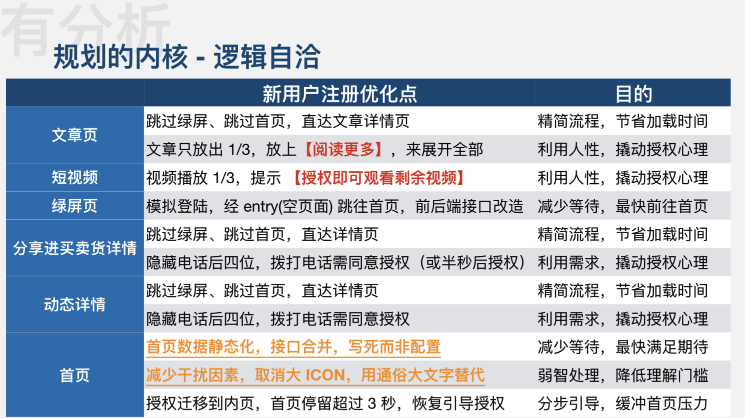

# 正文

> 一切有利于研发效能提升的，直接或间接助力于业务开展的能力建设皆为基建

## 如何推动基础架构项目落地

### 如何建设基建团队

#### 需要什么样的人

需要能够折腾，在平时的业务开发过程中，善于总结和喜欢分享，知道好的代码什么样，不好的代码什么样，有一定的抽象能力，时刻关注新鲜技术。

#### 需要做什么样的事情

很多前端的基础SDK，比如埋点统计、性能统计收集、错误统计收集等基础库，UI相关的一系列基础库。

#### 需要掌握什么样的技能

首先，基础建设团队的人不能给自己设限

1. 语言层面不设限
2. 领域层面不设限

#### 需要什么性格的人

性格互补，不争强好胜，不嫌麻烦，有为人服务精神的同学更适合做基建。

### 基建项目落地的方法论

1. 脸皮厚，主动推基建项目，即使被拒绝也没关系

2. 亲耕策略：每个推广者必须自己熟悉并使用过，真正的体会这个工具或者系统解决了什么问题，站在业务方的视角，亲自用一用自己的系统，工具，亲自去感受和思考是否真的解决了业务的问题，站在业务方的视角，亲自用一用自己的系统，工具。

3. 轮岗：让业务人员和架构人员能够按照季度来进行工作内容的轮换，那么就可以非常好的理解互相对彼此的作用。

4. 奉献精神：如果谁都不去做脏活，累活，难活，都去做简单的活，那么你的组织架构一定是不合理的，开发效率一定是上不去的。

5. 同理心：你的kpi不是别人的kpi，那么我让对方配合的时候对方就会把优先级降到最低，甚至就拖着不给你做了。如果你的工具和系统，是可以直接提升对方业务真正硬需求的时候，项目落地就是水到渠成的事情

## 如何理解技术基建

技术基建，就是研发团队的技术基础设施建设，是一个团队的通用技术能力的沉淀

### 技术基建的意义

* 解决问题：帮助解决业务问题。
* 团队练兵：承担建设的虚拟团队，在建设过程中能为同学们提供不同维度的锻炼场景，在业务问题与场景的识别、方案设计、新技术实践、项目管理和产品化思维方面都能提供实践成长的空间
* 梯队建设：一个虚拟建设小组本质上也是一个团队，过程中能对不同角色进行锻炼与考察，这有助于团队梯队的完善
* 影响力建设：建设结果对于业务的促进，更容易获得内部合作方的认可；沉淀下来的好的经验，可以对外输出分享，也是对影响力的有利帮助

#### 基建的真正价值，提效降本与成长

当提到基建时，就要想到三个词：

* 提效
* 降本
* 成长

提效降本的对象可以是人、业务、产品体验甚至是业务，成长则是我们所有从基建中受到的启发，落实到技术团队中，团队研发实力的强弱主要跟研发模式和工程师个人能力相关，而第三个最大的因素就是历年储备至今的基础设施完备程度，越强的基础设施，就带来越强的团队研发实力

#### 基建难点皆为现状，重点皆为管理

基建的起点虽然是技术，但他的重点都是管理，要去管理人、管理钱和优先级，那么综合到行业、公司、组织、团队、小组和业务运营产品等所有内在外在的现实条件，有时候即便看到了基建价值，也未必有机会来实现，这就是基建的难。

#### 基建再高大上，也要有目标与节奏

无论基建是解决开发体验的问题、研发效率问题，产品质量和稳定性的问题，无论它是小而美还是大而全的，项目都需要有它确定性的目标和推进的节奏，如果缺少这些度量单位，就很难形成共识，如果缺少共识，就势必会遭遇阻力。

## 基建搞什么

* 基建的内容和业务阶段团队的既有建设的沉淀是分不开的
* 越是偏创业初期的团队，其建设，往往越偏向于基础的技术收益
* 越是成熟的业务和成熟沉淀的团队，其建设，往往越偏向于获取更多的业务收益，如直接服务于业务的系统，技术提效的同时更能带来业务收益

### 基建研发流程是怎样的

确定建设的策略和步骤，主要是从拆解流程入手的

一个基本的研发流程闭环，一般是需求导入 => 需求拆解 => 技术方案制定 => 本地编码 => 联调 => 自测优化 => 提测修复bug => 打包 => 部署 => 数据收集&分析复盘 => 迭代优化 --即新一轮的需求导入

在这个基础的闭环中，每一个节点都有其进一步的内部环节，每一个环节相连，组成了一个研发周期。这个周期顺，研发流程就顺。这个周期中每一个环节的阻塞点越少，研发效率就越高，最初期的基建，就是从这些耽误研发时间的阻塞点入手，按照普遍性+高频的优先级标准，挨个突破。

提效、体验、稳定性，是基建要解决的最重要的目标，通用的公式是 *标准化+规范化+工具化+自动化*，能力完备后可以进一步提升到平台化+产品化。

参考体系方向：

* 开发规范：这一部分沉淀的是团队的标准化共识，标准化是团队有效协作的必备前提。
* 研发流程：标准化流程直接影响上下游的协作分工和效率，优秀的流程能带来更专业的协作。
* 基础资产：在我们团队，资产体系包括了工具链、团队标准DSL、物料库（组件、区块、模板等）。
* 工程管理：面向应用全生命周期的低成本管控，从应用的创建到本地环境配置到低代码搭建到打包部署。
* 性能体验：自动化工具化的方式发现页面性能瓶颈，提供优化建议。
* 安全防控：三方包依赖安全、代码合规性检查、安全风险检测等防控机制。
* 统计监控：埋点方案、数据采集、数据分析、线上异常监控等。
* 质量保障：自测CheckList、单测、UI自动化测试、链路自动化测试等

参考图片

对于研发同学来说，**身价取决于解决问题的能力，取决于面对不同的业务问题是否具备解决问题的方案**。

### 摸底-问题与场景的识别方法

> 当我们了解到基建对于团队的必要性和重要性，以及基建对于团队不同发展阶段所能发酵出来的力量，我们就要面临下一个问题，如何在团队中找到基建的机会呢？有什么方法可以把这种基建机会定位出来呢？

举例：

在解决问题的时候，把问题都记录下来，并且对他们进行归类，主要按照技能、合作、工具、规范、职业性、团队稳定性、业务理解等维度，再结合当时的开发流程就会有初步的判断；这些虽然看上去都是单点问题，但背后的原因都是有多方关联的，并不是单点，这时候必须放弃掉很多问题，挑重点问题解决。

定位到了问题，还原了现场，就要有一个理想的终局方案，这是我们理想中的方案，或者叫做是我们脑中的想法，它能不能实现，还要有一个很重要的东西保障，那就是制度面，或者叫做流程面和权限面，也就是具体到人。

有了问题、原因和期望的终局，我们就要把人这个因素加进去，来在流程上做一些节点的把控，通过动作隔离，无论它是物理的还是软件系统的还是口头流程的，来形成权限的收敛和责任到人的指派，这样整个团队所有人都在这一层达成了共识，当下我们就要有这样的流程来解决问题，从而达到我们脑子中想要的那个方案终局。

刚才我们从打包问题一路引申到了团队这个层面，是想给大家引出这句话：从点状的问题，摸到线状的流程，再来到团队的基本问题面，最终给出你的更立体的诊断结果，到了这一步，我们就能发现团队中隐藏的诸多问题，这些诸多问题就意味着诸多机会，这些机会或许就可以用基建的手段来解决

### 基建到底如何立项开发

> 如何促成这件事在团队中正式立项开发呢？

#### 有效的判断是授权的前提

因为处在不同的团队以及市场经营层级，所看到问题的象限和影响点是有很大的不同的，如果要启动比如一个APP的重构优化，那需要做一些准备工作：

* 首先，团队这几年下来的技术线状你要摸底清楚，整个团队有多少厉害的人，整体大家负责了那些项目，这些项目中有哪些是技术债没还的，如果对某方向某领域招人，难度高不高，会不会要做某个基建，发现连续半年都招不到合适的人。
* 其次，是要摸底这个行业中同类型公司团队和技术栈，别人的实践经验，走过哪些弯路，有没有可以花钱买过来或者半自研拎过来的方案先用起来，有没有这方面的成功案例可以吸取经验，避免自己从0摸索造轮子。
* 再次，是根据我前面分享的问题识别方法，列出来完整的问题清单归纳总结，看到底对团队当下和未来一段时间，最痛的痛点是什么，制约了我们哪些方面，对业务是否有影响。
* 最后，要对团队的组织架构，分工方式，考核制度都有一个理解，公司眼下是生死存亡之刻，还是全面规模化的时刻，是已盈利还是在小心的烧钱，有没有可能让我们具备基建的业务土壤、窗口期包括物质条件

基于这4个摸底，我们再来做这个基建价值和做事节奏，所谓判断与规划，判断在当下的现状中，当前的场景中，是否需要做某件事，最终谁是最大受益者，受益多大，能不能通过数字反应出来，或者不做这件事存在的问题有哪些，影响有多大，为什么影响，有没有数字和案例可以反应出来，如果认为这件事非做不可了，那么就要有一个规划，做这件事什么时候启动，如何启动，需要谁配合做，分几期来做，每一期可量化的结果是什么，所谓做事章法。

### 哪些是参考的立项指标

> 分别是数字、分析、优先级、里程碑、对比、大盘和到人头的职责。也就是大家所熟悉的Smart原则的扩展版

#### 数字 - 基建规划的灵魂

首先我们要有数字，无论是你拿一个业务的结果，或者线上异常量的结果，还是调研5个前端后的调查分析结果，里面一定要有数字

#### 分析 - 基建规划的内核

规划成立不成立，要看背后的逻辑是不是成立的，要把问题再拆分成点，每一个点都要有它完全成立的推导逻辑和结合后的目标，通过这个，所有人都能理解为什么要做这些事情，以及这些事情背后的意义是什么

#### 优先级 - 基建规划的紧迫性

通常一个团队的问题，都是两位数以上的，要从这里面识别出最具有价值的痛点，往往是管理者的决策视角，而作为团队成员，要说服老板认可你提出的一个新的建议，你就要设身处地的来跟老板沟通，商定出一个衡量优先级的决策标准，有些事要做，但往往不是当下来做，根据这个决策标准来决定每一个基建的紧迫程度，至于特殊的案例就特殊处理，如果每一个案列都是特殊的，那这个团队的研发模式一定是出了重大的危机

把衡量基建紧迫程度分成两种权重：

* 最高优先级的是跟业务相关，无论是伤害、制约还是影响业务，这些事情背后的基建工作都是优先级较高的，比如APP中框架依赖的包版本不一致会导致APP白屏闪退，那么这种就是直接伤害到业务，它的背后一定要尽快启动基建解决。
* 较高优先级则是关乎开发效率、体验、工程师的成长和维护成本等，越往后权重越低，同时命中的影响点越多，那么这个基建的紧迫性也越高

很多时候，就是因为这样的决策依据不同，导致同一件事，在你的眼中刻不容缓，在老板的眼中是有价值的但它是能见度更低优先级更小一些的。

#### 里程碑 - 基建规划的皮囊

当你要启动一个基建的时候，寥寥几句是很难让别人感知到你到底是要做个什么东西出来，到底要做多久，到底要用到多少开发资源，到底解决的最大痛点是什么，那么这里面有个很重要的指标，就是里程碑，当有了里程碑，这个基建就有了阶段，有了阶段就有了能看见的成果距离

#### 对比 - 基建规划合理性的校验

大部分人对于对比有着更强的感知力，无论当前是规划前、规划中还是规划后，针对这个基建方案，都可以对比组，可以是业界的方案，可以是其他部门前端的方案，可以是自己团队从前的方案，通过对比来彰显当前这个基建规划的合理性和更量化的指标，就算这个指标不是足够严谨，至少它带来的价值是可感知的。

除了对比可以让价值凸显外，更重要的是通过对比，你有一个很好的证据在手，这是你下一次启动新的基建的起点，这个成功过的经验可以进一步消减你未来做基建的阻力。

#### 人头 - 基建规划的保障

可以把它看做是一个挑战排行榜，所有参与基建的同学，都身挑不同的挑战，不同的挑战背后有不同的价值和难度，有了这样的价值和挑战对应关系，每个人都有了更具体的目标，包括跟你配合做这件事的人，一定要落实到人头

#### 大盘 - 基建规划的格局

这是大家从一开始工作就可以训练的能力，所谓更有高度的技术视野。

## 基建之外

1. 凡是建设，必有数据：凡是建设，必须要有对应的数据收集和分析，数据说明基建带来的改变，说明投入产出比。数据指标的设计，需要在某专项建设的前期即设计好并进行采集，并在整个推动周期和落地后持续收集，这样可以得到一个相对完整的变化曲线，用以作证工作的成效。数据不见得一定是完全准确的，但数据一定要能说明趋势，直观化，反馈准确。

2. 从场景出发找方案：对于人力方面，任何情况下人力都是缺失的。但很多时候我们的建设推不下去，往往不是因为人力的问题，而是没想清楚。对于研发同学，同样会存在从方案出发找场景的问题。在实践中学习，从来都是最快的方式。有价值的事从来都是从业务本身的问题出发。问题就是机会，问题就是长萝卜的坑。

3. 不设限，拓展能力边界：绝大部分的研发团队中，前端的工作，在其他研发的眼中，往往是技术含量低，很薄的一层等情况
    
    前端的传统工作范畴，都是集中在**用户界面层**，很少能往下深入，深入到网关~基础设施层。后端则不同。但现在良性的一面是，Node能力为前端提供了向下渗透的服务端能力。
    只有很少的前端团队，能较完善的去建设和发展技术体系。对于有了较完善体系的前端团队而言，其技术体系也更多是局限于前端自身的职能范畴，没能较好的互动渗透到业务侧，业务的感知力是很弱的。将技术带来的工程收益，转变为业务收益；将部门内的技术影响，转变为业务影响；将技术场景，升级到业务场景；将团队的基础能力，变为业务能力。**跳出前端，围绕并深入业务**

4. 业务的阶段匹配性：
    基建的内容，是和业务阶段相匹配的。不同团队服务的业务阶段不同，基建的内容和广深度也会不同。
    

5. 技术的价值，在于解决业务问题
    人的身价，在于解决问题的能力。但解决问题，技术基建绝不是银弹。
    

### 基建要从长考量

基建往往是长周期的事情，是无止境的，任何时候要开始决策了，都要充分考虑成本和收益，要有很强的成本意识，同时要把基建的终极目标落实在两件事情上，一个是对业务的帮助，到底能解决多少业务痛点，能带来多少协同上的效率提升；另一个就是对团队有提升，能跟团队同学打成多大程度的共识，能促成团队多少比例同学参与交流分享，业务和团队就是做基建的定海神针，所有人都会从中受益。
