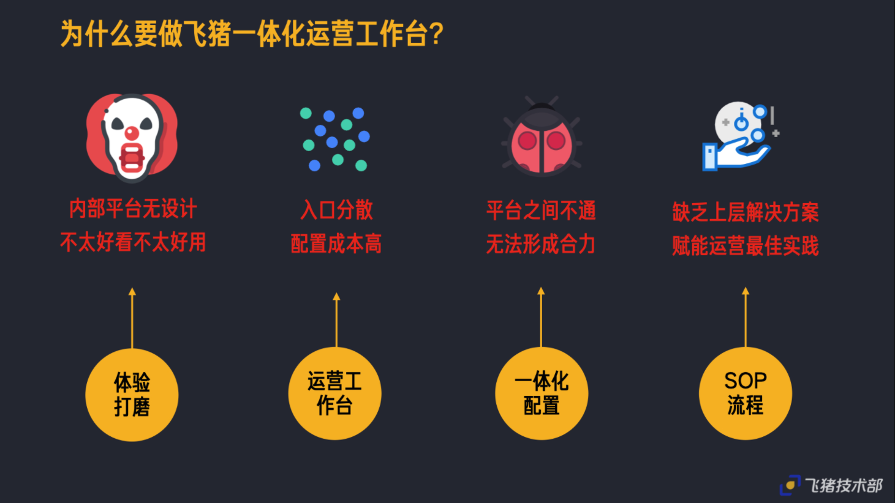
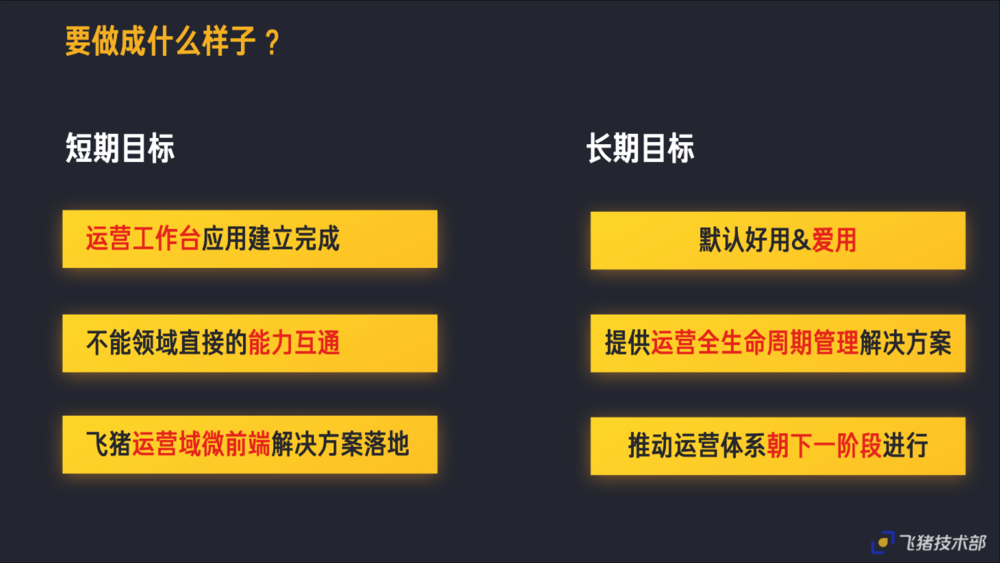
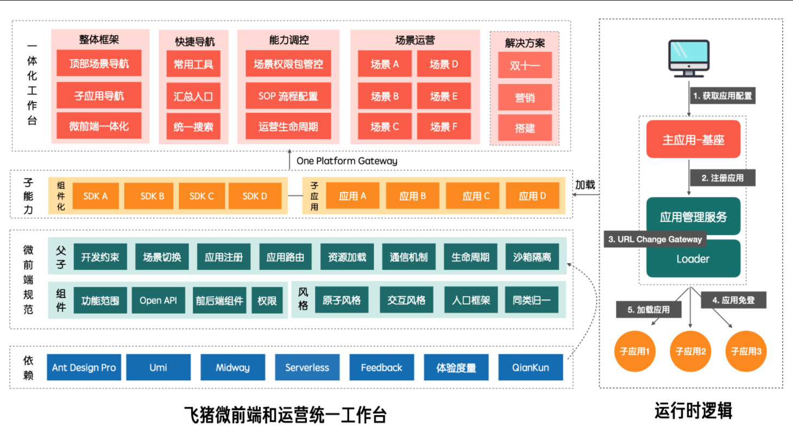
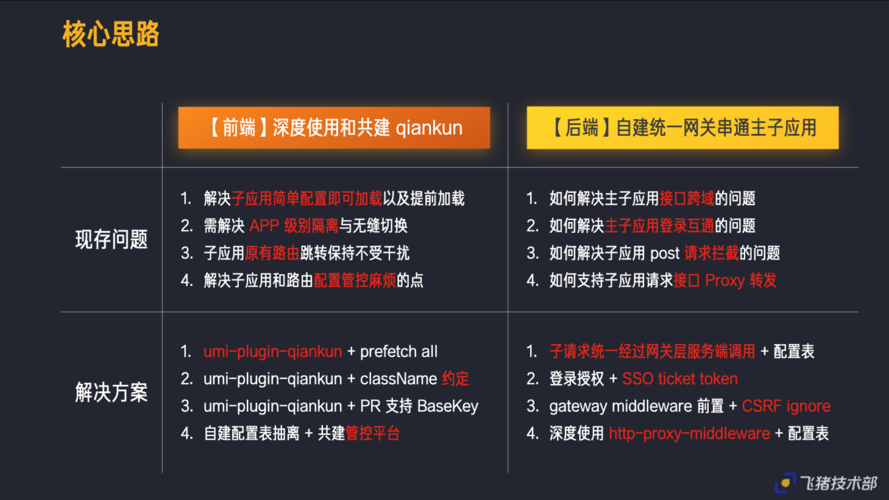

# 正文

> <https://github.com/umijs/qiankun> 目前较为完善的微前端框架

首先还是得了解一下什么是微前端:

> 微前端是一种多个团队通过独立发布功能的方式来共同构建现代化web应用的技术手段及方法策略.

微前端架构具备以下几个核心价值：

* 技术栈无关

    主框架不限制接入应用的技术栈，微应用具备完全自主权

* 独立开发、独立部署

    微应用仓库独立，前后端可独立开发，部署完成后主框架自动完成同步更新

* 增量升级

    在面对各种复杂场景时，我们通常很难对一个已经存在的系统做全量的技术栈升级或重构，而微前端是一种非常好的实施渐进式重构的手段和策略

* 独立运行时

    每个微应用之间状态隔离，运行时状态不共享

微前端架构旨在解决单体应用在一个相对长的时间跨度下，由于参与的人员、团队的增多、变迁，从一个普通应用演变成一个巨石应用(Frontend Monolith)后，随之而来的应用不可维护的问题。这类问题在企业级 Web 应用中尤其常见。

本身微前端的应用相比单一栈在性能上肯定是无法相比的,但是微前端也确实有它独有的特点,比如牺牲性能换来了比较不错的可维护性,这点在项目集合越来越大时尤其显著.

## 飞猪一体化运营工作台

### 为什么要做一体化运营工作台

随着业务逐步丰富发展,内部的各种运营工具或系统也在从 [可用提效] 往 [精耕细作] 发展

但随着产品本身业务复杂度在不断提高,只能给运营解决温饱问题,加上各平台需要互投互通诉求逐渐强烈,在此体系下无法给业务带来 `1+1 > 2`的价值,面临如下急需解决的痛点:

### 要做成什么样子

一期目标为技术侧的探通,完成工作台框架的搭建,满足多平台场景使用,沉淀一套以现有业务为基础的泛运营平台微前端解决方案.

再结合现有中后台技术和微前端解决方案,产出如下方案架构图

底层借助 Ant Design 体系加上 qiankun 的能力,中间层辅助一体化工作台里面涉及的贴合现有业务场景的规范;更上一层沉淀组件化 widget 的能力,用于各种功能的互通,同时成为现有子应用的组合来源;在最上层即飞猪运营工作台的上层主应用,包括整体框架、快捷导航、权限登录控制、运营场景的汇集,包括后续要做的业务运营sop解决方案

### 怎么做的

前端侧深度使用共建 qiankun

后端侧自建统一网关串通主子应用
在运营工作台 **Node** 侧自建了
