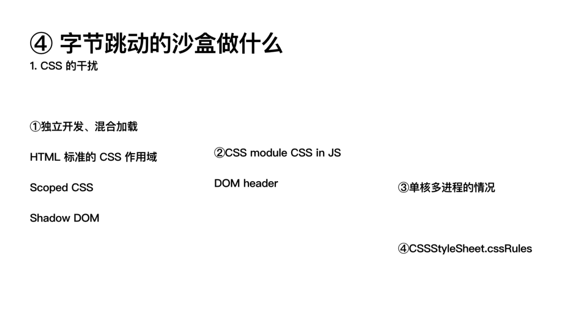
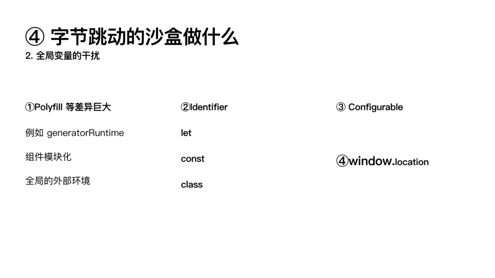

# 正文

> <https://github.com/umijs/qiankun> 目前较为完善的微前端框架

首先还是得了解一下什么是微前端:

> 微前端是一种多个团队通过独立发布功能的方式来共同构建现代化web应用的技术手段及方法策略.

微前端架构具备以下几个核心价值：

* 技术栈无关

    主框架不限制接入应用的技术栈，微应用具备完全自主权

* 独立开发、独立部署

    微应用仓库独立，前后端可独立开发，部署完成后主框架自动完成同步更新

* 增量升级

    在面对各种复杂场景时，我们通常很难对一个已经存在的系统做全量的技术栈升级或重构，而微前端是一种非常好的实施渐进式重构的手段和策略

* 独立运行时

    每个微应用之间状态隔离，运行时状态不共享

微前端架构旨在解决单体应用在一个相对长的时间跨度下，由于参与的人员、团队的增多、变迁，从一个普通应用演变成一个巨石应用(Frontend Monolith)后，随之而来的应用不可维护的问题。这类问题在企业级 Web 应用中尤其常见。

本身微前端的应用相比单一栈在性能上肯定是无法相比的,但是微前端也确实有它独有的特点,比如牺牲性能换来了比较不错的可维护性,这点在项目集合越来越大时尤其显著.

## 飞猪一体化运营工作台

### 为什么要做一体化运营工作台

随着业务逐步丰富发展,内部的各种运营工具或系统也在从 [可用提效] 往 [精耕细作] 发展

但随着产品本身业务复杂度在不断提高,只能给运营解决温饱问题,加上各平台需要互投互通诉求逐渐强烈,在此体系下无法给业务带来 `1+1 > 2`的价值,面临如下急需解决的痛点:

### 要做成什么样子

一期目标为技术侧的探通,完成工作台框架的搭建,满足多平台场景使用,沉淀一套以现有业务为基础的泛运营平台微前端解决方案.

再结合现有中后台技术和微前端解决方案,产出如下方案架构图

底层借助 Ant Design 体系加上 qiankun 的能力,中间层辅助一体化工作台里面涉及的贴合现有业务场景的规范;更上一层沉淀组件化 widget 的能力,用于各种功能的互通,同时成为现有子应用的组合来源;在最上层即飞猪运营工作台的上层主应用,包括整体框架、快捷导航、权限登录控制、运营场景的汇集,包括后续要做的业务运营sop解决方案

### 怎么做的

#### 前端侧深度使用共建 qiankun

#### 后端侧自建统一网关串通主子应用

在运营工作台 **Node** 侧自建了 **Gateway** 网关 **middleware**,底层依赖 **http-proxy-middleware**能力实现,借用服务端proxy转发接口同时在请求上加上 token 来解决接口登录权限以及跨域的问题,同时对于主子应用直接接入会出现内网登录登录权限不通的问题,此处我们使用的 **免登授权** 的能力,让子应用的登录由主应用本身来提供,这样通过中间网关层配合我们给 qiankun pr 的Fetch自定义能力和 `Slave Namebase` 可解决请求和路由跳转的兼容问题.

#### Widget 业务组件化

微前端可以很好解决主子应用间无缝的接入问题,但是对于区块场景还不成熟,存在现有问题:

* 随着业务场景的成熟发展,加上区块能力嵌入配置的场景逐步增多;
* 借此抽离原有通用招造投搭能力,减少维护压力;
* 逐步丰富现有 widget 能力,满足后续更多场景的接入使用,以及系统打通;

基于此我们通过类 **widget npm** 组件包的方式来实现业务组件,包括制定对应的协议来驱动对应的widget渲染和展示,便于后端同学对其更加可控,同时在视觉规范上,我们收拢各种场景下的使用展示,便于一个 **widget** 可以更加无缝的嵌入到已有系统.

#### 运营平台的交互体验

说到中后台的前端侧展示,大部分场景都没有设计交互同学支持,加上一线研发同学对交互视觉标准的理解不同,导致不少页面的使用体验勉强只能达到能用的状态,距离好看好用还有很大距离.

基于此,我们梳理积累运营场景的视觉规范需要把握的原则点:

* 同类统一: 不折腾,通用层面遵循 Ant Design.同类型 / 同功能模块展示保持一致;
* 舒服对齐: 对齐会让页面或者强迫症的同学看起来会很舒服.标题、按钮、表单、tag多集合类需确保对齐;
* 不常用的收起: 将不重要内容收起,便于让用户找关键执行点.类表格将不常用的内容隐藏或者放到抽屉里面去;
* 简单不阻碍: 让新用户不看说明书也可以知晓下一步操作,不能让用户由于 XXX 原因走不到下一步.

## 宋小菜微前端方案

主要内容:

* 多应用集成-Qiankun(乾坤)
* 单体拆分-Federation的探索

开始前也先总结一句 "微前端不是银弹,它并没有多么高深莫测".

### 业务价值

在用户这一侧,偏向产品和业务价值,尤其体现在多应用集成时带来的好处.

我们遇到了以下痛点:

1. 新的运营同学觉得中后台应用过多,记不住
2. UED觉得很多的应用交互体验不一致.常见的就是菜单和头部宽高不一致.虽然都是用的 Ant-design,但各个系统的全局的UI都是不一致的.
3. 运营在多个应用中操作时有时存在断层,他们期望有工作台的感觉.同时在未来我们需要接入统一的工单通知,我们想把这块维护到一个应用中,不用每个应用都接入一次.

通过微前端能力整合多个应用就可以解决上述的痛点.

### 工程价值

在开发者这一侧,则偏向工程价值.在多应用集成场景里,我们可以做到统一管理应用,使得应用的申请入驻、获得应用配置、发布平台对接等等的生命周期都可以被维护起来.在之前较为混乱,存在口头索要 appKey、SysID 这种情况.如果能有一个统一的入驻平台,并且用工作台的方式将他们管理起来,这些问题都可以被解决.

利用微前端拆分单体巨大应用,则会带来更大的工程价值,我个人其实觉得工程价值更大.将一个巨大的应用按模块拆分,可以使得团队分开维护,使得工程师能踏出部分泥潭模块.在拆解后,按需要分开独立发布模块也使得发布速度也得到提升,产品和业务方会减少焦虑感,用户自然也是受益的.

### 使用 qiankun 遇到的问题

1. 重复配置.我们将子应用重复的配置抽成了一个解决方案插件.
2. dll配置.除了要将加载应用的 **libraryTarget** 设置为 **umd** 还需要设置 **dll** 的,不然会加载失败.可以看到 qiankun 沙盒内部是靠eval去执行的,它没有业务帮你解析这个 var (dll 默认是 var 类型的导出方式),同时严格模式下也不允许.
3. Ant Design modal 销毁问题.可以利用 getContainer 指定局部渲染的节点.新版 Ant Design 中简单 false 一下即可,旧版本的则需要你指定特定的 DOM 节点,可以自己包装一个 Modal 出来达到复用目的.
4. 父子通讯.一开始我以为需要自己想办法,例如利用原生事件或者约定在 window 上的某个模块进行通信.这里 qiankun 和 single-spa 是一样的,可以利用 props 通过生命周期参数注入.
5. 我们将部分公用的 Redux model 提升到主应用,子应用就不要去再重复加载.此时注入给子应用就会存在多个 store.可以利用 `react-redux connect` 的高级用法,在新版本中是利用 context ,我们有些还是 5.x,可以用 storeKey 的方式解决.

### 单体拆分

简单说就是要把一个大应用拆出一部分出来,然后远程加载它们.一般来说,比起多应用集成,单个应用的拆分更适合大模块分活干和分开管理维护的情况.这样的应用本身就有一定约束.比如,统一的技术栈(React),使用同一个UI库(Ant Design)一般也有统一的交互标准.从 single-spa 文档上取了一个拆解方式的对比图,简单对比一下,只有动态加载模块的方式才能满足分开构建、分开部署且是代码仓库独立的需求.

#### 动态加载

其中一个系统较大(用户模块、微信管理、报表分析模块、内容管理等等),发布非常慢,偶尔还会发布失败,因此需要将一部分划分出去,单独管理.

这里想使用 **webpack5 federation(模块联邦)**

看下例子中是如何使用的.

1. 第一步,在Webpack5中加入federation的插件.我们先从插件参数看,第一个参数name是声明这个federation的名称,第二个参数libarary 是声明暴露成 libarary 时的类型和名字,第三个参数 filename 是申明打包出的运行时配置文件的名称.第四个参数 exposes 是指出你要暴露出的具体文件有哪些.第五个参数 remotes 是指定从远程加载的应用名称以及它在引用时的名字.第六个参数 shared 是指定需要共享的模块.
2. 第二步,在应用的HTML中引入运行时配置,这点和 SystemJS 很像.
3. 第三步,在应用中,我们按照 remotes 中配置的远程模块,进行加载即可,和正常的代码无异.

对我们而言就是将公共模块和业务域模块进行拆分 exposed,接着 shared 出来.

同时,业务块划分时,需要注意: 养成好习惯-按照业务领域划分页面.

### 发布

实施的最后一块是发布问题.简答模式就是什么都不用考虑,正常发布即可.精细模式则要考虑平滑上线的问题.

仔细想象一种场景: 子模块先发布成功,但是其依赖了还未发布的主应用的api,那么应用就会崩溃,反之亦然.

那如何解决呢? 首先,我们要 hash 化子应用的 HTML.但 HTML 的版本机制意味着配置动态化.参考前面乾坤的配置,我们要改动主应用中注册的子应用的地址.这份配置动态就需要从服务端获取,因此还需要开发一个配置中心.同时子应用发布时需要通知配置中心发布成功了,并将 **index_[hash].html** 或是 **federation** 的 **runtime** 配置地址传给配置中心.

最后,发布平台上还要保证发布的顺序.主应用如果有更改,必须编排在最后一个发布.

### 总结和规划

简单事简单做,让你的架构随着你的业务规模而改动,适合的才是最好的.也许不一定每个人都需要多应用集成这种场景,但是单体拆分确实是微前端的带来的巨大的工程价值点.

然后是规划:想做一个入驻平台,衔接和管理应用的生命周期.简单说就是将应用从申请入驻 => [配置中心注册、配置中心分发配置、监控平台对接、服务端配置对接] => 基础框架获取配置初始化项目 => 运行时获取配置 => 发布平台对接 => [用户侧配置获取、通知机制、增量发布]的完整流程都管理到.

## 字节-设计与实践微前端沙盒

> 以字节跳动的微前端项目运行时隔离任务触发,深入理解 sandbox(后称沙盒)的技术实现,以及上述实际实现过程中一些发生过的问题.

### 前端微服务在字节跳动的打磨与应用

> 原文链接: <https://mp.weixin.qq.com/s?__biz=MzI1MzYzMjE0MQ==&mid=2247485444&idx=1&sn=62b872dac1c7ef15305b0eca4f01c8e0&chksm=e9d0c3e6dea74af0331d908a46821ae601146c14178fa9abbea384196aed034aaab2541be816&scene=21#wechat_redirect>

#### 背景

##### 上线慢

单体应用的一大问题是发布非常慢.典型业务情况是上一次线需要至少30分钟,前端的上线就需要这么长的时间.当然这是我们在17年经历的情况,保持我们的发展态势如果不升级技术,现在可能更慢.然后17年底我们开始了大改版,开始拼命的拥抱微前端.

原本回滚一次也是10分钟的.所以当时每天上线不了几次,风险也很大.逐渐导致变更都要憋着,成了"几天上线一次、一次多个变更".

##### 理解困难

更需要关注的影响更大的其实是框架问题.大家都是几十个项目合作到一个工程里.工程化其中非常重要的一个点就是要"人可以理解".更低的认知成本,能收获更低的犯错概率.

那这些项目非得维持完全一致的组织模型就基本上是必须的。比如 model 是充血的还是失血的？是 contorller 全都放一起、还是根据 router 与视图们放一起？这些事非常鸡毛蒜皮的例子。实际上深层次的问题与之类似的非常多。

还有其它问题比如 debug 的时候到底能不能找到。也不是单体应用不行，单纯是说解决这个问题的时候投入了多少精力、多少设计，以及维持这个设计规范问题不崩坏，需要多少精力。

这一类都是单体应用本身的代码问题。“拆了就没这些事了。”

##### 框架无法调整

真的从架构角度来说，到底如今的前端项目需要怎么开发、一般是怎么干的呢。从上一段内容读过来，我们知道大部分出色的架构师工程师都已经解决了好多那些困难了，方式是通过杰出的架构设计。

然后都知道前端的各种框架各种实践实际上非常多。前端工程师有个别名不知道你们听过吗，叫“npm install 工程师”哈哈，还有“github search 工程师”。

到底发生了极端困难的情况是来自框架还是来自生产框架的方法呢，这个不好说。但是是个值得琢磨的问题。所以你看接手拿到项目什么的别说了你就学吧。反正现有架构肯定是挺好的。就是你得学一阵、用对了才好。

### 微前端的沙盒技术体系

#### 沙盒应该做什么

沙盒对软件工程来说其概念不算是新鲜事物,仅看前端对隔离的需求也由来已久.并且根据不同的实际业务场景,已经有过非常多和有特色的探索.

#### 沙盒应该像什么

在Docker得到普遍应用之前,微服务在服务端的使用主要基于虚机.相比之下使用非常复杂、维护成本提高.

诸多扩大的成本问题直到随着Docker的沙盒体系才得以解决.微服务才成为一个趋势.可惜的是这样的容器环境在前端浏览器内的运行时还不存在.

所以这里已经可以看出我们提出的前端沙盒、对它的期望,是让它就像Docker那样.我们搞的这套机制是像Docker的前端运行时容器,像Docker一样让前端的拆分能轻松一点、分享容易一点、资源节约一点.当然这不是否定 iframe 的方案

#### 沙盒应该怎么做

#### 字节跳动的沙盒采取的方案

#### CSS 沙盒

css module 和 css in js 都是把样式写成或编译成脚本,同时把脚本生成的DOM的最外面一层加一个 nounce 的 attribute;然后再给所有受控的 CSS规则都套上这个 "attribute".缺点是相对麻烦了一点、并且要完全控制掌握所有DOM创建.

目前采用的是 DOM 沙盒保护 head 内标签. 这样的 style 和 link 本身都可以收到沙盒统一保护.在实际应用中我们的子应用开发者在业务组件里也有用 CSS module 的,我们也不用管--反正去掉标签这个事情最安全.

用 NPM 上的 styled-component 包时要小心,他们会根据环境变量判断环境;然后对prod环境启用一个叫 "speedy" 的模式,它将不用 innerText 写样式规则,而是用 addRules 那一整套 API.但是这套标准似乎没明确界定这个标签被从文档DOM树里移除时的行为和表现,也许因为显而易见rules也应当一起移除.但我们插回来时,这种含糊就乱套了.浏览器实际的表现是移除再插回的标签 rules 都没了.这里显然需要我们额外处理.

### 总结

其他没有共同性,就不记录了