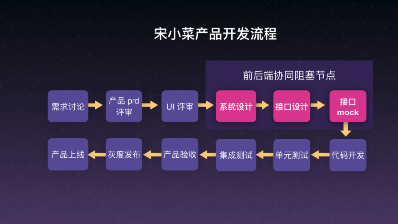

# 正文

> 原文链接: <https://tech.songxiaocai.com/posts/697229/index.html>

## GraphQL 与领域驱动带来的协同价值

大会的主题,主要有这么几个关键词,一个是协同,一个是效率,领域驱动是单独的 1 Part,然后还有前后端职能变化.

一个技术带来的价值不仅仅是开发效率本身的提升,可能还会带来额外的价值,这些额外的价值可能是协同或者是前后端职能的变化.

这些是提出的问题,等阅读完整篇会议纪要之后,应该就能得到答案了.

> 同时,扩展延伸阅读资料是 <https://www.apollographql.com/>

当所有的问题全部解决掉之后,对资深从业者来说可能还会面临一个终极问题,就是真的去推动了之后,会给团队带来哪些收益,又会遇到哪些技术上的挑战,遇到哪些坑.

以宋小菜团队举例:

宋小菜前端来说10个工程师,一共开发和维护了6款APP,1款小程序,1个复杂的ERP系统,市调系统,报表系统等.那这里面就会有很多问题,比如说APP与APP之间,人与人之间的合作,之前使用版本不稳定的RN,踩了很多坑,这个开发和协作成本太高,必须造轮子,或者用轮子优化开发效率,所以针对前端团队内部做了很多事情,就像PC端一样需要解决资源上线、打包问题、编译、版本、缓存等很多问题,可以解决的

举个例子：大伯伯推包系统，所解决的问题是在我们需要发布 APP 包的时候，如果一个人打的包，钉钉上传给那个小伙伴，他去上传的包有可能就会出错，而且这种故障有发生过，这种场景可能靠人肉是解决不掉的，所以我们开发大伯伯推包系统，让机器对接机器，通过机器去做这件事情

刚才这么多问题解决掉以后，我们发现还是不行，前端团队内部效率啊，配合成本确实降下来了，但是发现团队之间的成本还降不下来，比如有这三个比较典型的问题是我们逃不过去的，并且跟前后端关系都很大。

第一个是多端之间的类报表同步,大家现在开发前端,可能开发小程序,APP,PC,会有多端,对我们公司场景来说我们这个端比较杂,可能要在ERP要透出报表,在APP上透出报表,在小程序上透出报表,但是面对不同权限的人报表透出的维度不一样,但本质上下面的数据源是同一份,那我们就可能开发很多个接口去对应不同的APP,那这个问题靠前端是解决不了的.

第二个是多端之间多模块共享,这个模块不太准确,意思大概是比如有一个用户模块,一个订单模块,一个物流模块,每个模块里面可能会有一两个组件来组成,不一定是什么组件,但向下所需要的基本数据可能还是同一份或者同两份,只是在不同端上的UI呈现不一样.那我们想要让这些模块之间去共享数据很难,我们在不同端上开发一个组件就绑定一个接口,这个组件拿到另外一个里面去,套到那个模块去用的时候发现行不通了,这也是一个很大的成本.

第三个是业务变化快,产品总要升级迭代,难免UI设计师要找活给你干,要改版的时候,加一个字段,减一个字段,或者叠加几个字段,那么接口又要升级,或者加一个新接口,这个同样导致合作成本很高.

来看红色的几个,系统设计,里面涉及到Java服务端工程怎么搭建、骨架怎么搭建、服务怎么拆分.最后具象的时候,是服务端同学设计这个数据库和表结构,这几张表上面的字段有哪些.然后接口设计,服务端同学会给出接口的文档,比如说会给你提供五个接口,每个接口15个字段,才会进入到前后端对接完之后,再帮你去做一份Mock数据,然后前端在页面上把页面样式重构之后,再去调假的Mock数据,然后页面交互流程调通之后再切到正式接口,大概是这个套路,但是很多年都解决不掉.
因为接口设计控制权在服务端受理,前端不知道会给到多少接口,然后再接口评审时候,15分钟或者一个小时,前端基本上很难理解哪个字段背后的业务含义,过后还要和服务同学反复再沟通确认.

再抽象总结一下,其实就是这三个:

* 第一个是API的设计,服务端同学有的时候会被迫也好,我必须呀要面向你多变的UI去做API的设计,面向这些页面服务,页面变化的时候,API可能也要升级.
* 第二个是Mock职责重合,之前也知道业界很多公司自己做了Mock工具和平台,我们一直也是在使用第三方的,有时候是前后端共同维护同一份Mock接口,有的时候是服务端去维护,总之要存在一个写作成本,到底谁来负责,服务端同学给你做完了Mock之后终于可以沉下心来做底层的业务开发,但发现临时需要调整一个字段,就把接口调整了,但是忘记去更新Mock文档,前端不知道这个事情,到后面俩人一对接发现字段对不上,这就是一个典型的工作流协作问题.
* 还有一个问题,就是报表,对于管理层而言其实需要看到过去一周一个月公司交易的整个规模、吨位、物流情况、库存情况,不同维度的数据观测.业务打发一变报表的维度也要变,传统的报表开发就前后端各一个,服务端搞定数据库,跨表跨库查询,给出标准的字段结构,前端就把它套到Table表格里去,这个事情很简单,但可能需要排期,一天两天三天,可能产出报表的速度就很有限了.

宋小菜在自己的业务场景下,解决方案是在网关这一层,集成GraphQL的一个聚合服务,而他们立项中的GraphQL接入方式,是跟网关同层嵌入在里面做一个管道,但现在考虑到快速跑通,暂时把它放在网关的下面,是为了它的鉴权跟安全不想占太多开发成本,把它交给网关去做了,所以它就只做数据聚合这么一件事情.

### 回答之前的问题,那就是收益是什么

宋小菜通过这套工具,原来在2016年到2017年两年时间为了公司开发的报表一共50张,而系统上线以后,四个月就产出了200多张报表,把整个公司报表全部消化掉了.

## 再回归到这场会议的主题, GraphQL的聚合服务

### 目前他们的方向是

前端对于页面上的数据有一定的控制权,我需要什么样的数据只有我自己知道,因为我需要对数据有控制权,要更快去输出页面,包括去走通一些业务流程,点了什么按钮,触发什么事件,就必须去理解每一个字段背后的业务含义,我要去理解每个字段背后的业务含义,就必须去理解业务.以前会说我只需要UI,理解交互,理解产品就好了,业务我不管,反正给我们什么字段就用什么字段,我们去消费数据.

现在对于前段来说,可能负责的事情就有一点变化了,对于服务端来说,反而很爽,因为终于不用再面向多变的页面去设计API,从里面解放出来了.

那么解放出来之后会带来两个问题:

第一个问题是解放出来的时间用来做做什么?
第二个问题是如果前端介入到这一层,你们还会对我(服务端)提什么要求?

对于第一个问题，既然有精力时间，我可以把胶水代码都拿掉，把 Mock 的时间，粘合数据的时间省下来去做底层的服务设计，提供更稳定的数据服务，反过来前端也会希望说服务端同学提供的接口也好，不同的领域设计也好，给我趋于稳定的设计，而不要给我多变的设计，不要因为每一次前端页面改版研发而引发后端服务改动的大地震，这是前后端的一个变化。

### 介绍 GraphQL

GraphQL 全称叫 Graph Query Language，官方宣传语是“为你的 API 量身定制的查询语言”，用传统的方式来解释就是：相当于将你所有后端 API 组成的集合看成一个数据库，用户终端发送一个查询语句，你的 GraphQL 服务解析这条语句并通过一系列规则从你的“ API 数据库”里面将查询的数据结果返回给终端，而 GraphQL 就相当于这个系统的一个查询语言，像 SQL 之于 MySQL 一样。

### 单一入口

首先说一下单一的入口这一点。传统的 RESTful API 里，不管前端还是后端都要对 API 做管理，一是版本管理，二是路径管理，非常麻烦，增加了工程管理的复杂度。但是如果使用 GraphQL，只需要一个入口就可以了。刚刚也说到 GraphQL 相当于一个数据库，它的入口只有一个，我们只需要访问这个入口，将我们要查询的语句发送给这个入口，就可以拿到相应的数据，所以说它是一个单端点+多样化查询方式的这么一个结构。

### 文档

第二点是文档，这里文档虽然不能完全替代传统的文档，但是它能在一定程度上方便我们。传统的 RESTful API 文档管理，市面上有很多工具，像 Swagger、阿里开源的 RAP 以及 showdoc 等。但使用这些 API 文档管理工具的时候其实是有一定的学习成本的。像 Swagger， 可能对于老手来说使用起来不是很复杂，但是对于刚上手的开发者来说上手还是需要一点时间的。然后还有在使用这些平台的时候都会遇到让人头痛的“ API 和文档同步”的问题，很多时候需要自己去做 API 和文档同步的插件来解决。

如果使用 GraphQL 就可以在一定程度上解决 API 文档的一些问题：在做 GraphQL 类型定义的时候我们可以对类型以及类型的属性增加描述 (description) , 这相当于是对类型做注释，当类型被编译以后就可以在相应的工具上面看到我们编辑的类型详情了，像示例的这一个类型 Article，它的描述是 “文章” ，它的属性有哪些，有什么含义，都会展示在大家面前，只要我们在开发的时候规范编写类型，整个文档的展示就比较规范了。

使用 GraphQL 还有一个比较棒的功能，就是每一个 GraphQL 类型 其实相当于 mongo 里面的一个 collection，或者 mongoose 里面的 Model, 而每一个类型之间关系也可以用工具很形象的表现出来。像系统上用到这么一个模型，它对应到哪些和它有关系的模型都高亮出来了。

链接： <https://apis.guru/graphql-voyager/>

### 避免数据冗余

使用 GraphQL 的第三点好处就是可以避免数据冗余。我们在传统的 RESTful 处理冗余的数据字段大约有这么三种处理方式：

1. 前端选择要不要展示这些字段；
2. 是要么做一个中间层（BFF）去筛选这些字段，然后再返回终端来展示出来；
3. 比较传统也比较麻烦，还不一定能生效，就是前端和后端去做约定，如果说这一个接口这一个字段已经不要，可以和后端商量一下把这个删掉，但是有一种情况可能造成冗余字段删不掉的，那就是后端的同学做这个接口可能是“万能接口”，也就是说这个接口在这个页面会用，在另外一个页面也能用，在这个应用会用，在另外一个应用也可能会用，多端之间存在部分数据共享，后端同学为了方便可能会写这么一个“万能”的接口来应付这种情况，久而久之，发现字段冗余到很多了，但是随便删除又可能会影响到很多地方，导致这个接口大而不能动，所以前后端都不得不忍受它。

如果使用 GraphQL，就可以避免接口字段冗余这个问题，使用 GraphQL 的话，前端可以自己决定自己想要的返回的数据结构。刚刚我也解释过，GraphQL 实际上是一种查询语言，我们在使用时就像是在数据库里面查询数据一样，查询的某一个数据要哪些字段可以在查询语句里写好，要哪些字段就返回给我们哪些字段。

拿 PPT 上这个作为示例：我们要去拿 id 为 1 的文章，如果我只要 id 和 content，我在 query 里面指定这两个字段，那么返回的就是 id 和 content，如果除了 id 和 content 之外，我还要拿需要作者信息的时候，我只需要在 query 里面指定 author , GraphQL 就将作者的信息给返回回来。这样就能做到前端决定自己想要什么结构的数据返回的就是什么样的数据。

### 数据聚合

最重要一点当然是数据聚合，数据聚合在使用传统的 RESTful 的方式时有多种解决方案：

一种前端发针对这个页面上的多数据源单独发起数据请求，然后一一展示出来，这样可能会出现页面数据加载不同步的情况。
第二种就是开发做数据拼装的中间层（BFF），用于拼装后端提供的数据，然后返回给前端。
还有一种是宋小菜在最前期的使用一种方案，那就是后端同学编写针对页面的 API，即所谓胶水代码，来拼接各个服务的数据，返回给前端。

如果是第三种情况的话，就会有大量的工程需要我们去维护，大量的 API 需要我们去维护。但如果使用 GraphQL 的话，这些问题都不会存在，因为它是天生支持数据拼装的。

### mock

GraphQL 的类型大致可以分为两种类型：

* 一种是标量类型，像普通的开发语言一样，提供 Int，Float，String 这种标量类型，这种类型在 GraphQL 中也对用着一个 resolver，我们可以通过重新定义其 resolver 来做到对标量类型的 mock, 像 Int 返回的范围是什么，Float返回的范围是什么？String 返回的格式是什么样的？等。同时我们在开发中常用到的一些简单但是有一定规则的数据类型像手机号码、图片地址、身份证号码、身份证号码这样的数据我们也可以通过自定义标量类型来做到数据 mock。
* 第二种是普通类型，像刚刚示例中的文章（Article）类型，普通类型下面可能会有多个字段，每个字段对应的数据类型可能是普通类型也可能是标量类型，这种类型也可以做 mock，如果我们对标量类型做了适当的 mock 以后，像 Article 的 mock 数据就会自动生成。

使用 GraphQL 做数据 mock 有多方面的好处：

好处之一就是 mock 数据随着类型 (type) 走，当我们修改类型以后，它的 mock 数据也是会被同步修改，不会出现 mock 数据和类型不同步的情况；
好处之二就是能很容易地实现 mock 数据的细粒度，原理刚刚也解释过了，这样能够很大提高我们的开发效率。
好处之三是 mock 数据可以复用，节约开发时间。
最后一点，那就是 mock 数据的职责可以由前后端共同承担。或者说由前端自己来做，因为通常情况下 mock 数据的消费者都是前端自己，为何不自产自销呢，省去大量的交流成本。

同时这一个系统可以直接在线上测试并发布类型的：我们在编辑好一个类型以后，可以部署到开发环境上，然后在 IDE 里面做调试提前查看返回数据是否正确。像刚刚说到的处理数据字段冗余是怎么做的，这里可以演示一下，在前端不想要这一个字段时，直接在查询语句里面删掉然后执行查询就能拿到不包含这个字段的数据了。我们也可以通过 IDE 获取这个查询语句结果的 mock 数据。

在写查询语句的时候这个 IDE 根据我们已经生产的 schema 自动帮我们提示，就像使用普通的桌面 IDE 一样，而每一个类型的文档可以从右边的弹窗里面看到。GPM 将 IDE 分为了正式服务和测试服务的 IDE, 正式 IDE 时针对线上数据做查询的。我们在测试好了新增或者修改的类型以后就可以部署正式环境上了，不用重新发布 GPM 就可以做到。

这是刚刚提到文档展示，GPM 也集成进来了，可以看到这些类型有哪些，然后这些类型到底有什么含义，类型和类型之间的关系是什么样的，都可以在这里很方便的去查看。

在 GPM 上我们还做了一些附加的功能，因为我们后端提供的微服务大多数是用使用 RSETful 的方式去调用的，所以我们特意做了一个针对 RSETful 请求的追踪，这里可以看到每一个 RSETful 访问的情况。

### 在线编辑应用 SCHEMA

GPM 是使用 nodejs 搭建的，所以这个方案是针对 nodejs 的，其他语言的解决方案需要大家自己去探索了。实现这个功能有以下几个关键点。

关键点之一是替换 schema，实际上 schema 可以被修改的，只要我们使用特定的方式将每次执行的 schema 修改掉，那就做到了每次执行 graphql 时都会使用到最新的 schema 了。

关键点之二怎么做到修改已经在使用中的 schema：我们将 GraphQL 的 schema 分为两部分：一部分是类型定义，另一部分是 resolver。前面也提到过，每个类型下面有字段，每个字段下面绑定了 resolver，我们其实可以把类型定义和 resolver 分开来，同时对 resolver 进行适当的分层。GPM 的分层结构是这样子，但这是我们自己的这种分层，其实还有其他方案，后面的讲师会讲到。 然后我们将 resolver 和 type 定义做好以后，将它使用一些开发工具将它绑定起来，就生成了这么 GraphQL 的 schema 。

在做查询时候就参考 schema 来做，type 定义本质上是 string，关键的一点就是怎么去动态生成 resolver，也就是第三个关键点，这里稍微简单讲一下。

我们首先需要去简化 resolver，resolver 本身它的形式是固定的，函数签名其实就是这样，类型下面字段名字，字段名字下面有四个参数，然后返回结果。第一个参数是父类型的查询结果，我们有可能会使用到它类型下面的一些查询的数据；第二个是指定的查询参数；第三个最就是我们刚刚提到的执行上下文（Context），我们可以在执行上下文 (Context) 里面去调用绑定的各种服务。这就是是 GPM 中 resolver 大致形式，第一步拼装参数，第二步使用执行上下文调用服务，就可以动态拿到数据，这样就可以做到动态生成 resolver。

## 问题

我们在使用 GraphQL 的时候有一些无法避免的问题是需要去解决的，这里有两个绕不开的问题：

第一是安全问题
第二是慢查询的问题

慢查询在终端已经有很多用缓存去解决这个问题的方案了，像 apollo、relay。还有就是在 GraphQL 服务里面去做缓存，apollo 提供的 apollo-engine 就是这种方式，但这个要翻墙才能用，所以只能用来它作为参考。还有一种方案是宋小菜在 GPM 里面用到的：合理地利用 GraphQL 提供的指令 (directives) ，去置换 resolver，这样做到 GQ 服务数据的缓存。还有使用 dataloader 来批量处理多次重复查询，后面的讲师也会提到。

GraphQL 本身其实是一个标准，我们没有必要一定要使用官方 提供的 GraphQL 引擎，我们可以根据自己的实际情况去实现自己的GraphQL。

重新回到 GraphQL 的执行的一个流程，我们在实现自己的 GraphQL 引擎时可以做到以下优化：

## 总结

最后做一个总结，当宋小菜在使用 GraphQL 的时候，概括起来有以下六个特点：

单一入口，单端的入口方便前端做工程管理，避免后端做烦琐的API 版本管理。
文档，这个文档可能在一定程度上能够解决文档同步的问题和前端开发阅读的问题。
数据冗余比较方便，减少前后端交流成本。
数据聚合。GraphQL 天生支持数据聚合。因为每一个类型绑定resolver，所以定义不同的 resolver，就可以拿到不同服务上的数据，可以做到不同类型数据源的数据拼装。
MOCK，适当将 MOCK 的职责交到前端，或者前后端一起维护，而且维护起来比较简单。所以说 MOCK 方便我们开发。
动态编辑做到实时部署，敏捷开发。实时部署很快做到线上数据的响应。

对于宋小菜的前后端合作工作流，直观上可以看到这几个变化：

* 前端从接口设计环节，向前介入到服务端的系统设计中的库表结构评审环节，此时不仅能了解到库表的字段分布和业务含义，也能在库表设计上就提出一些建议，帮助服务端输出更友好的字段类型和结构给前端，比如 精度和维度，这两个是分开存，还是用逗号隔开，存一个 String，是有分别的；
* 服务端省去 Mock，省去胶水 API 的设计和维护，省去 Mock，节约的时间可以专心做底层基于业务的系统拆分，提供更稳定的数据服务，构建更健壮兼容的底层架构；
* 前端在接口评审之前，就可以在 GraphQL 的自定义类型 Mock 上抽象大部分的字段出来（服务端一但确定库表结构，后续改动的可能性就会很小了），此时就可以把 DOM 页面实现后，把占位符的字段就填进去了大部分，最终结构上在接口评审环节双方针对接口特殊性，再核对调整一遍就好了；
* 前端由于有服务端领域边界的支撑，可以针对特定领域及领域的组合，来封装更有弹性的组件，组件的扩展性可以由配置决定，而不是某一个 API 决定，这个配置向下就是 GraphQL 的聚合能力。