# 正文

## 第一章：现状

从2014年到现在：

移动互联网全面发展之前，应用大多停留在PC端；
当移动互联网起来后，应用开始从PC向移动端转移，也就是我们的 iOS 平台和 Android 平台；
然后企业为了不用一个项目两边开发，H5出现在了 webview 上；
但 H5 的性能和体验始终没有原生的APP好，于是出现了 Hybrid、Weex、RN以及近几年出现的 Flutter;
并且伴随着各类小程序的出现（微信小程序、支付宝小程序、钉钉小程序、抖音小程序）；
同时前端的技术栈也从一开始的jQuery到后来的Angular、Vue、React等等。

先来看几款常见的第三方产品：

* Fundebug：付费版159￥每个月，版本数据在云端，而数据可存放自己服务器的本地版本需要30万￥起。如果每年支付这样一笔费用，开销还是挺大的。
* FrontJS：高级版899￥每个月，专业版是2999￥每个月。
* Sentry：80$每个月

## 第二章：为什么内部自研

不能仅仅从价格这个角度去作为我们要去自己研发这套错误监控平台的衡量标准。

首先是Sentry。Sentry不支持Weex，小程序。而且稳定性不是很好，当错误大量爆发的时候100%挂。

再来看Fundebug，Fundebug不支持Weex，统计信息对我们来说不够详细。再来看Bugly，Bugly可能客户端的同学直到的比较多，仅仅支持 Android 和 iOS，以及一些游戏场景（Cocos2d、Unity3D），并且不支持拓展。但通过 Bugly 我们可以直到错误数量，错误机型等基本信息，但错误机型/版本/系统版本都很分散，错误信息只有：创建 weex 实例错误、Weex文件内容格式错误。但仅有的信息是无法定位和解决问题的！

最后看一下FrontJS，FrontJS仅支持web端和小程序，每分钟监控事件数量受限（高级版），告警通知受限，不支持拓展，筛选问题的历史事件选择也受限。

实际上想要做到充分满足需求以及后续迭代，至少得二次开发甚至自研，才能达到要求。

## 第三章：（贝贝）天网监控平台

先来看一下天网的整体架构图：

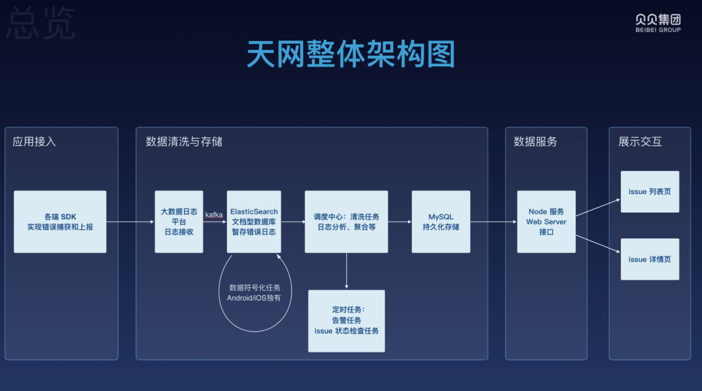

从应用接入层通过SDK去捕获错误并将错误上报。上报的数据流经 kafka 到 ES 暂存。再到调度中心执行清洗脚本，数据清洗完后再持久化存储到MySQL，最后 Node.js 为可视化提供接口，最后错误数据展示。

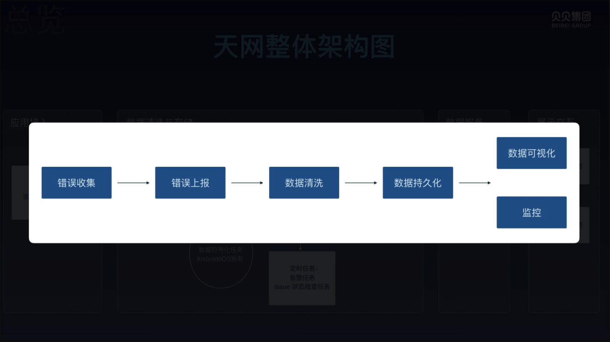

前面的整体架构图也就是由这六个部分组成：从错误收集到错误上报到数据清洗到数据持久化，最后到数据可视化和监控。

先来模拟一个线上的报错：

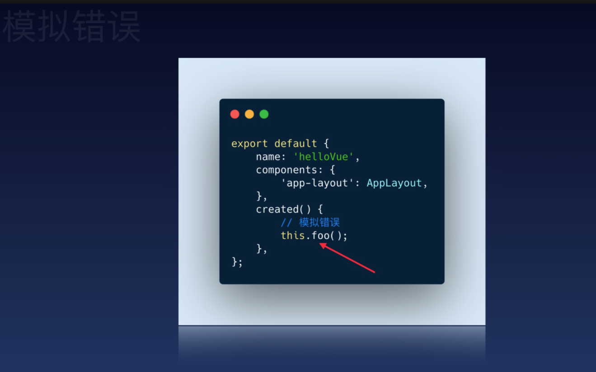

如上面截图所示，这是一个 vue 的项目，我们在 created 中执行一个没有被声明的方法 this.foo()。

那么知乎就可以看到这条错误出现在了错误监控平台的首页列表中，上面是错误趋势，横轴是错误时间，纵轴是错误数量，下面红框内是错误列表。点击列表后，我们进入错误详情页，从中间截图我们可以看到错误堆栈信息，但为了更加方便开发者定位问题，我们还在右侧展示了当前错误发生时所在的环境信息。上面有设备信息和环境信息！

那么从线上错误的发生，到最终可视化的展示，中间发生了什么？

### 一，SDK -- 错误收集/上报

1. SDK 如何设计？

    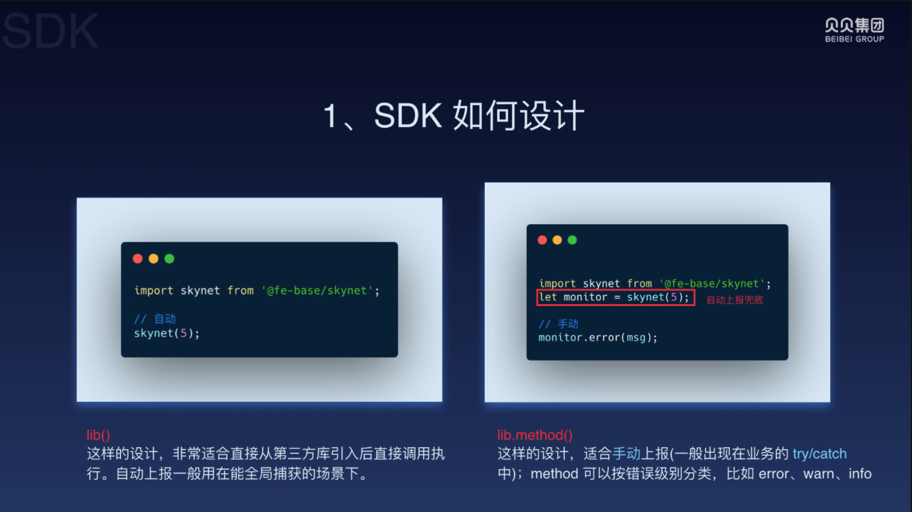
    将SDK分为自动和手动两种。手动一般用于业务的 try/catch 中，我们在手动错误上报中分为 error、warn、info 这三个 level。在手动上报没有命中的情况下，我们使用自动上报兜底！

2. 错误捕获机制

    接下来分析几个常用的错误捕获机制。

    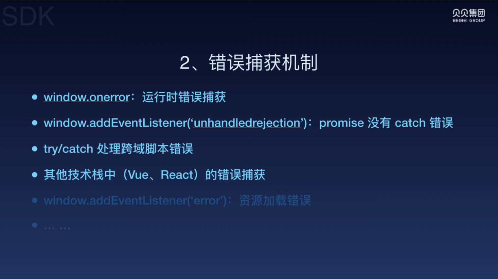

    [1] 监听 window.onerror

        当发生 JavaScript 运行时错误时，使用接口ErrorEvent的error事件将在 window 被触发，并被 window.onerror() 调用。

        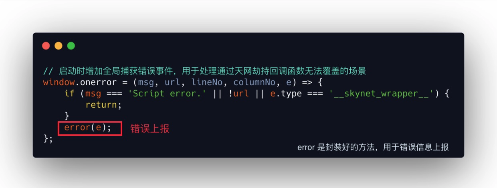

    [2] 监听 unhandledrejection 事件

        当 Promise 被 reject 并且没有得到处理的时候，会触发 unhandledrejection 事件。所以可以对此事件进行监听，将错误信息捕获上报。

        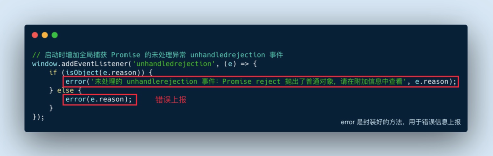

    [3] 跨域脚本错误：Script error

        由于我们一般会将静态资源存放在 cdn 等第三方域名上，所以当前业务域名中的 window.onerror 会将这类错误统一展示为 Script error，所以为了解决这个问题一般有两种解决方案：

        * 后端配置 Access-Control-Allow-origin、前端在 script 标签配置 crossOrigin
        * 劫持原生方法，使用 try/catch 绕过，将错误抛出

        由于浏览器不会对 try/catch 起来的异常进行跨域拦截，所以我们采用劫持原生方法，将原生方法用 try/catch 的函数包裹来处理。示例代码如下：

        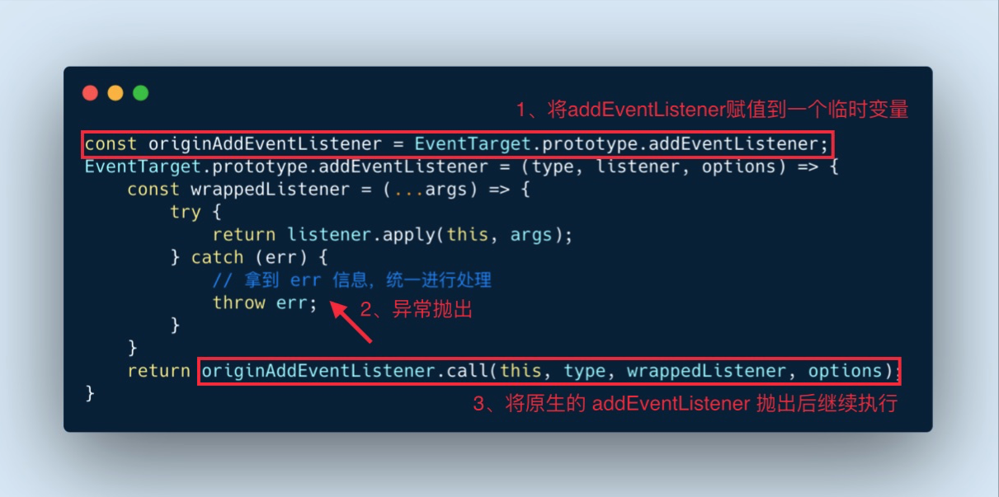

        这是 AOP 设计模式，当错误发生的时候，我们会在 catch 中重新 throw 一个错误出来，最后在将原生 addEventListener 抛出执行。为了方便理解，我们将这种解决方案流程展示一下：

        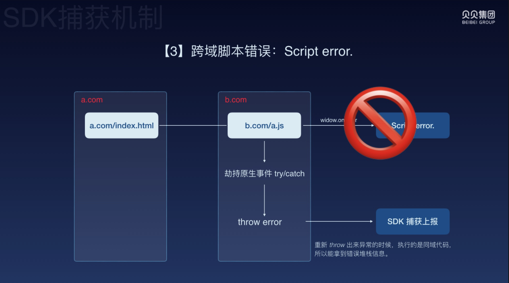

        如上图所示，假如业务在 a.com 上，静态资源在 b.com 上，此时不做任何处理的时候b域名上的 js 错误会统一展示为：Script error。但我们希望能获得完整的错误堆栈，所以我们采用劫持原生事件，将其进行 try/catch ，然后再抛出异常 throw error，重新抛出异常的时候执行的是同域代码，所以能拿到完整的堆栈错误信息。从而实现错误捕获上报。

3. 环境收集

    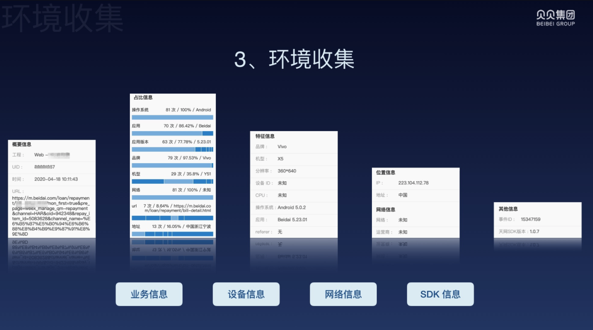
    上面 5 张截图来自可视化错误的详情页，我们针对一个错误将它的概要信息、占比信息、特征信息、位置信息和 SDK 版本信息进行展示。这有助于我们更好的知道错误的发生环境。我们将这些错误分类为：业务信息、设备信息、网络信息和SDK信息。

    3.1 环境信息收集原理

    想要获得环境信息，我们先要看它是否命中主动上报，如果有，那就采用主动上报的环境信息；如果没有，那就看是否命中 hybrid 接口（运用客户端能力捕获环境信息）的上报的环境信息，如果命中，那就采用客户端采集的环境信息；如果没有我们再去看是否命中 UA 收集的环境信息。这就是我们环境信息收集的 3 种方式。

    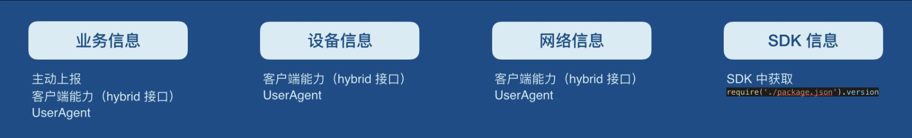

    再来看之前对环境的分类，业务信息：通过主动上报、客户端能力上报和UA上报；设备信息：通过客户端能力上报和 UA 上报；网络信息：采用客户端能力上报和 UA 上报；最后 SDK 的版本信息我们直接在 SDK 中去 require('./package.json').version 这种方式获取。

4. 为什么行为收集？

    来看下面截图：

    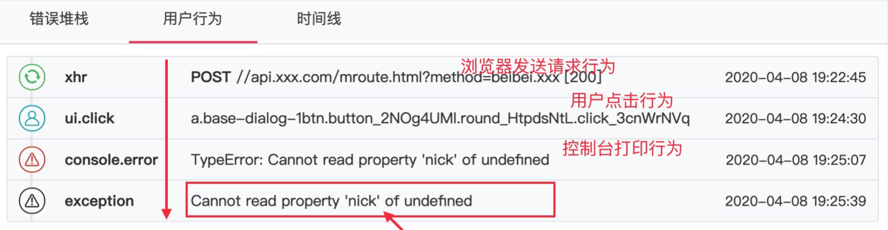

    通过上面截图，我们可以清晰的认识到 nick of undefined 这个错误发生的链路。先从浏览器发送请求行为，再到用户点击行为，再到控制台打印行为，最后到这个错误的展示，我们可以完整复现一个错误的由来。

    4.1 行为收集分类

    我们简单讲行为分类为： 用户行为、浏览器行为、控制台行为。

    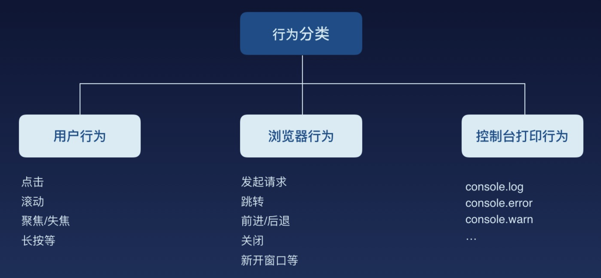

    其中，用户行为中包含了我们常见的点击、滚动、聚焦/失焦、长按等；浏览器行为包含了发起请求、跳转、前进/后退、关闭、新开窗口等；控制台行为包括了 console.log/error/warn 等。

    4.2 行为收集机制讲解

    Case1：点击行为（用户行为）

    使用 addEventListener 全局监听点击事件，将用户行为（click、input）和 dom 元素名字收集。当错误发生将错误和行为一起上报。

    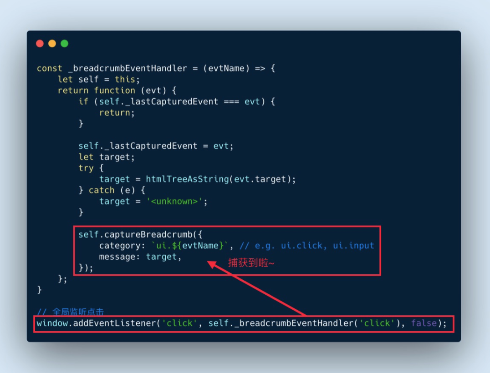

    Case2：发送请求行为（浏览器行为）

    监听 XMLHttpRequest 对象的 onreadystatechange 回调函数，在回调函数执行时收集数据。

    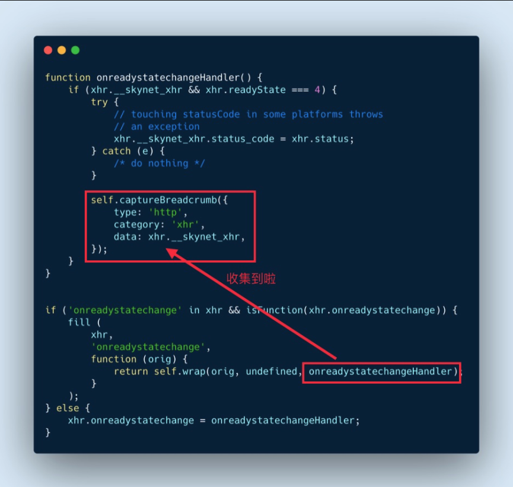

    Case3：页面跳转（浏览器行为）

    监听 window.onpopstate ，页面跳转的时候会触发此方法，将信息收集。

    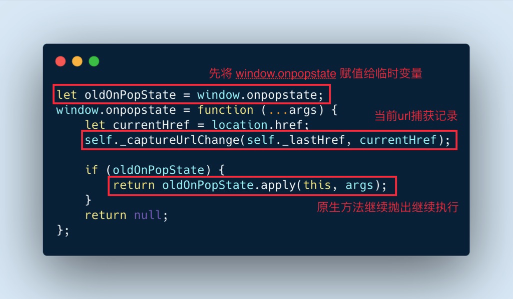

    这里用的还是 AOP 模式。

    Case4：控制台打印（控制台行为）

    这里我们通过改写 console 对象的 info、warn、error 方法，在 console 执行时将信息收集。

    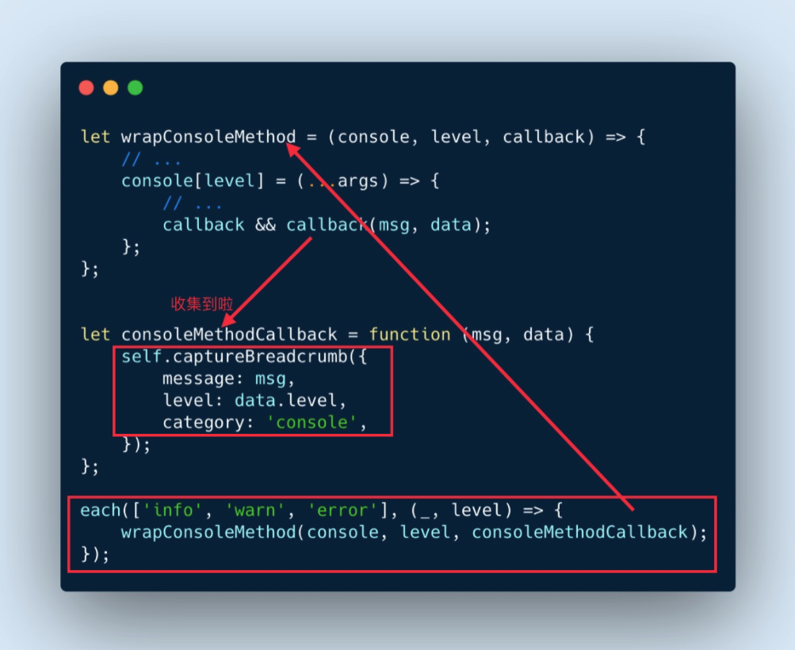

5. 数据上报

    此时，已经得到了错误、环境、行为信息，接下来需要将它们上报，这里我们使用 GET 一个 gif 对其进行上报。

    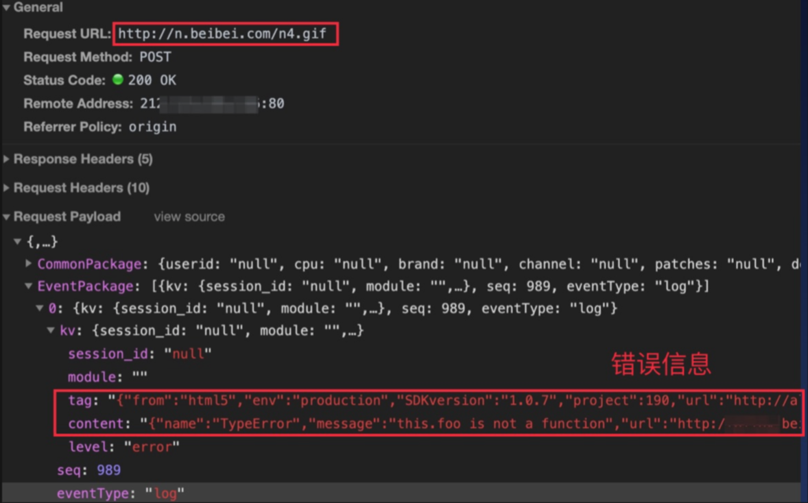

    如上面截图所示，通过请求一个名为 n4.gif 的图片将错误信息进行上报。

        5.1 为什么使用 1X1 的gif？

        原因是：
        * 没有跨域问题
        * 发GET请求之后不需要获取和处理数据、服务器也不需要发送数据
        * 不会携带当前域名 cookie！
        * 不会阻塞页面加载，影响用户的体验，只需 new Image 对象
        * 相比于 BMP/PNG 体积最小，可以节约 41%/35% 的网络资源

6. SDK小结

    > 监听 / 劫持 原始方法，获取需要上报的数据，在错误发生时 触发 函数使用 gif 上报。

### 二，数据清洗

SDK上报的原始数据有这么几个特征：

* 数据量大、体积大：动辄几兆、十几兆、还碰到过几十兆的
* 没有分类、聚合：同一类型的错误只是时间维度不同，没必要每条都去存储
* 没有对非法数据进行过滤：无用信息太多，不利于聚合，也加重了服务器负担

1. 存储介质对比

    第一个是 MySQL , MySQL 支持耳机索引、支持事务，虽然对于全文搜索不是很好，但他的使用场景其实也不太用得到全文搜索，所以他比较适合线上核心业务。

    第二个是 HBase , 诞生到现在已有 10 年了，这也是一个比较成熟的项目。Hbase拥有天然分布式，虽然不支持全文搜索、二级索引和事务，但他支持在线扩展，非常适合增长量无法预估、写入量巨大的应用。

    第三个是 ES ，ES是近年来很火的开源分布式搜索分析引擎，通过简单部署，就可以对日志进行分析、全文检索、结构化数据分析等。ES还有统计功能，还支持二级索引，同时 ES 也是天然分布式。

    存储介质对比：

    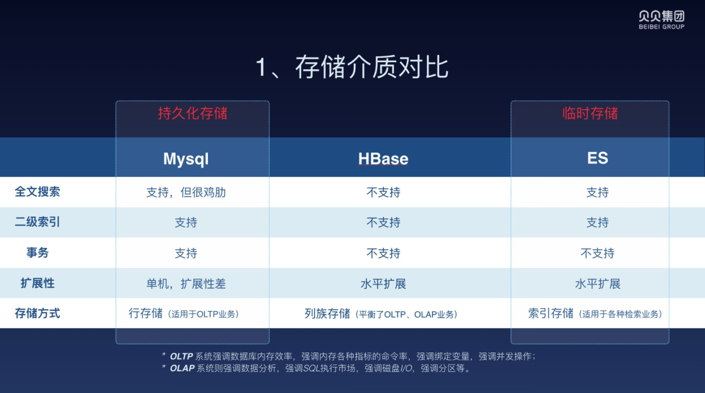

2. 清洗流程

    2.1 清洗流程

        将清洗流程分为下面 3 步： 获取数据、数据预处理、数据聚合。

        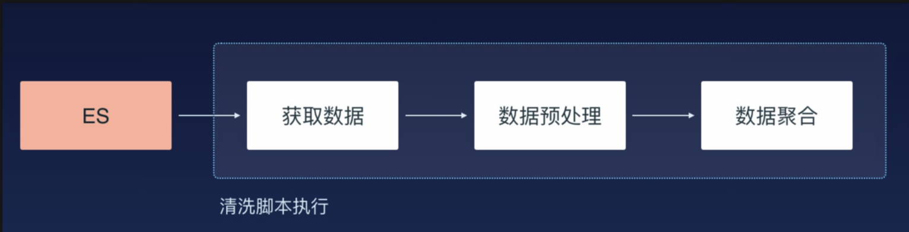

    2.2 获取数据

        从 ES 中获取数据非常简单， ES 底层是基于 Lucene 的搜索服务器的，它提供了一个分布式多用户能力的全文搜索引擎，基于 RESTful web 接口。所以我们前端开发只需要像平时开发业务调用接口一样去调用就可以了。

        1. 通过 GET 请求从 ES 获取近一分钟的错误信息

        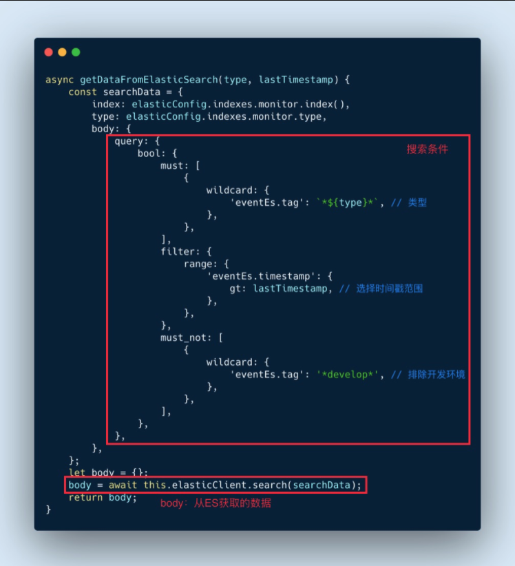

        2. 设置阀值（削峰机制），由于错误大量爆发的时候为了“不让服务器承受它不该承受的压力”，我们使用了下面两种方法做削峰机制：
            
            * 每分钟数据获取上限 10000 条，超过就采样入库
            * 同类型错误数量大于 200 条，只统计数量

    2.3 数据预处理

        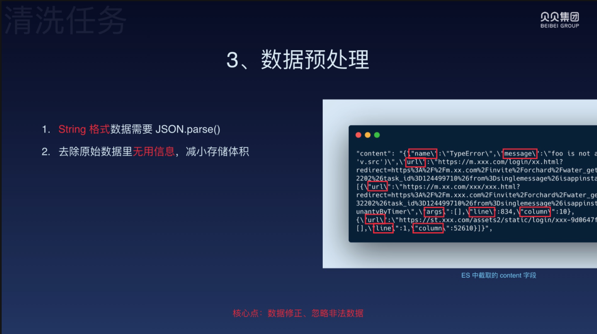

        这是一个从 ES 中截取的某个错误的 content 字段，由于 ES 中的 data是 string 格式，并且代码有被转译，所以我们需要将其 JSON.parse()。并且有时候会出现里面还不完全是个字符串包裹的对象，所以我们需要将里面我们需要的字段提取出来。并且，我们还要取出原始数据中的无用信息，减少存储体积。

        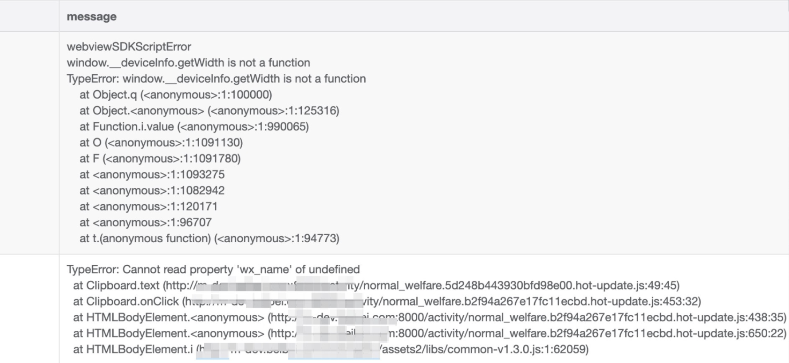

        上面截图就是我们最终存储到 mysql 中的数据。可以看到这里的数据就比较的清晰，没有多余的看不懂的内容。

    2.4 数据聚合

        目的有两个：1. 存储性能；存储小；2.查询性能，查询快。

        如何对某一类的错误进行聚合？

        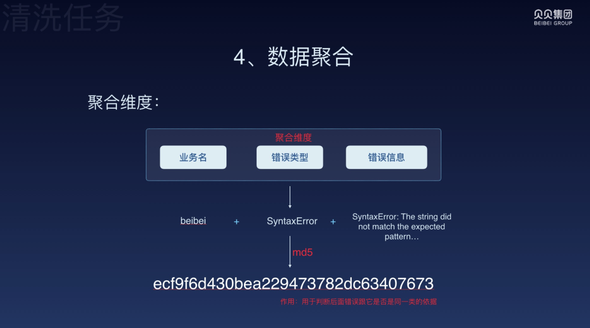

        我们从三个维度来做：1. 业务名；2. 错误类型；3. 错误信息

        接下来上报的错误都会同样采用这种方式去聚合，看这一串东西是否一样，如果一样，那我们就将他们识别为同一类错误，将他们在 MySQL 中存为同一条：

        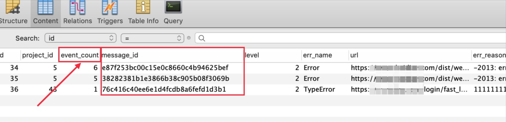

        如上图所示，message_id 是聚合后的那一串东西，event_count 表示同类型错误出现的次数。最后我们将这些数据在可视化中这样展示：

        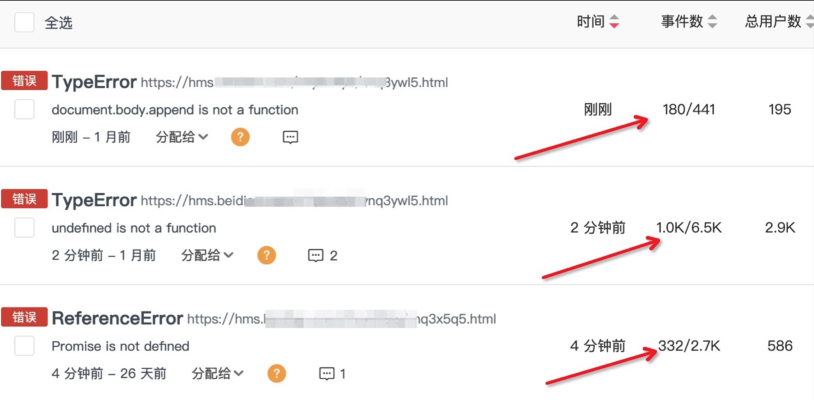

    2.5 清洗过程监控

        线上错误有了 SDK 进行监控，先看单位时间内数据量和耗时是否正常、忽略输入的数据时间轴上数量是否稳定以及每分钟拉取数据量是否是 10k

        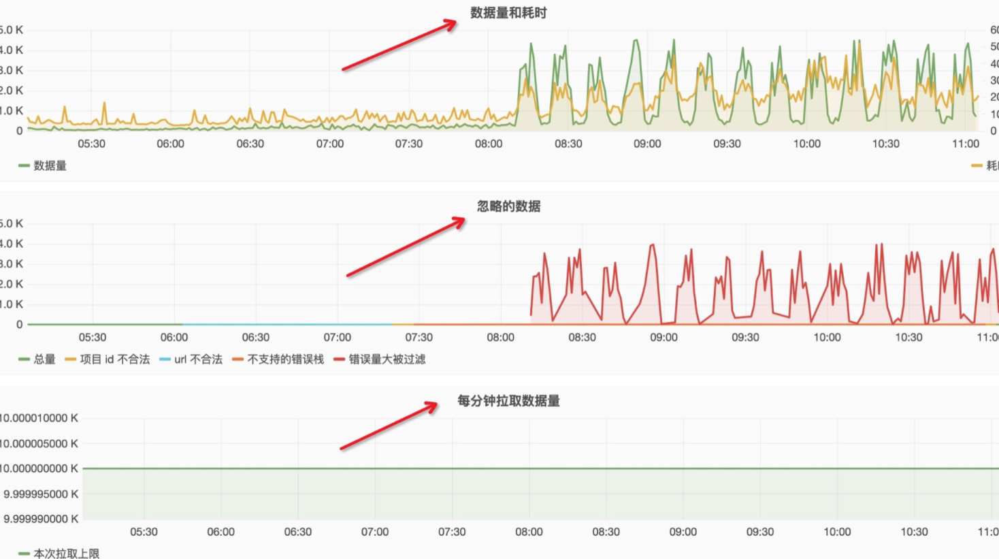

### 三，监控

当错误短时间内大量爆发的时候我们需要第一时间将错误信息告知给开发者，从而使其第一时间处理线上错误。错误的告警模型比较简单：

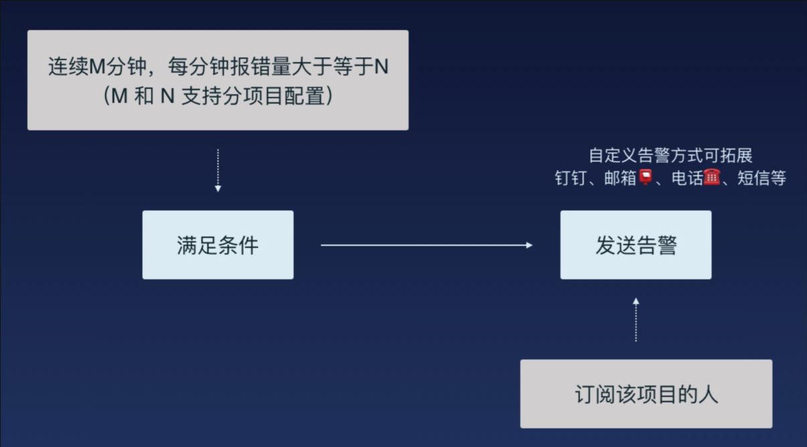

就是当某个错误满足一定条件的时候，将错误通过钉钉、邮箱、电话、短信或 webhook 等方式告诉订阅该项目的开发者。而条件我们可以通俗的理解为：某种错误，在连续2分钟内，每分钟报错量大于等于100条的时候就触发告警。然后将错误信息触达到开发者！

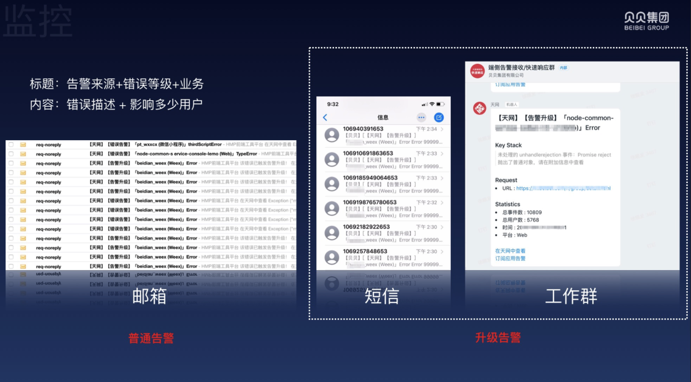

如上图所示，我们将告警分为普通告警和升级告警。升级告警中会在普通告警基础上额外增加短信和工作群，然后这些告警信息上会有标题和内容。标题含有错误来源、错误等级、业务名；错误内容上会有错误描述和影响了多少用户等等。

至此我们已经完成了 Web 端的错误监控，实现了多段错误监控的最小闭环。

而其他端的话，只需要提供相应终端的适配 SDK ，并复用上述除接入之外的逻辑即可。

### 四，node端 SDK 实现

各家公司的框架以及研发流程不一致，最好结合实际情况进行实现。

## 遇到的问题和演进

### 数据清洗

首先是 iOS 错误日志可读性差的问题。这个就是我们获取到的 iOS原始错误日志里的一段堆栈信息，它实际上是一个基地址加上一个地址偏移量，面对这样的错误堆栈开发去排查问题是很麻烦的，同时因为不同应用版本因为代码有变化都会有不同的偏移量，导致相同的错误在不同版本上会有不同的偏移量，完全没有办法进行错误聚合。所以我们会将每个 iOS 版本的符号表上传，通过符号化的任务，将上面的基地址和偏移量转化为具体的文件和方法以及行号，这样我们的开发就可以比较方便的定位到错误的原因了。

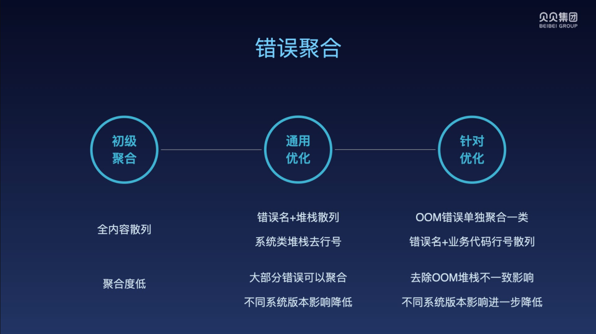

讲到错误聚合，下面我们再来看看我们在做错误聚合阶段遇到的各种坑，我们的错误聚合经历了从最初的对全内容进行散列聚合到后续进行一些通用性优化来提升聚合度，再到针对一些特别问题进行一些针对性的优化。

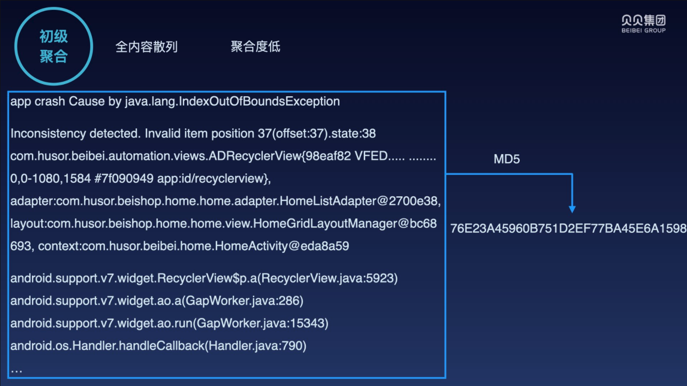

这里以一条安卓的错误日志为例，这就是我们实际上报的一条安卓错误日志，包含了3个部分：错误名称，错误描述，错误堆栈。错误名是获取了捕获的错误的类名，错误描述是错误的具体描述，一版包含了本次错误发生的原因，以及一些相关的特性信息，最后是错误堆栈，这块也是我们排查问题的关键。

最基础的聚合方式就是对上报的全部内容进行一个散列，求个 MD5 的值，然后把所有散列值相同的错误聚合成同一类错误，简单粗暴。这样做的问题是，聚合度很低，很多明明是同一种错误都被聚合成了不同的错误

### 辅助错误分析

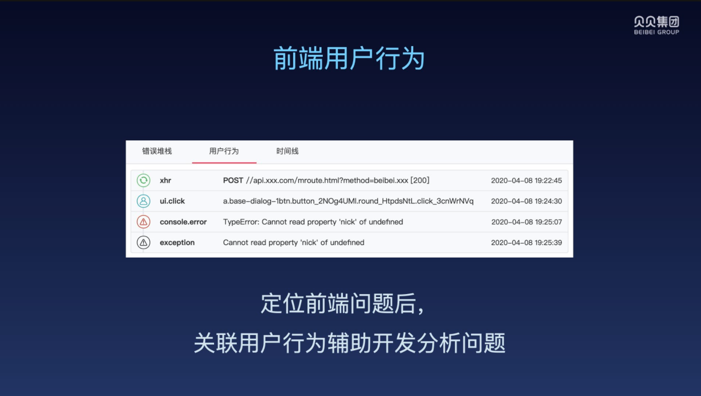

针对前段，我们记录了前端用户在页面上发的请求，点击事件，以及控制台错误日志，当发生错误的时候，我们会把这些行为日志和错误日志关联起来，让开发在排查前端错误的时候可以通过这些用户行为日志来更好的分析问题发生的原因。

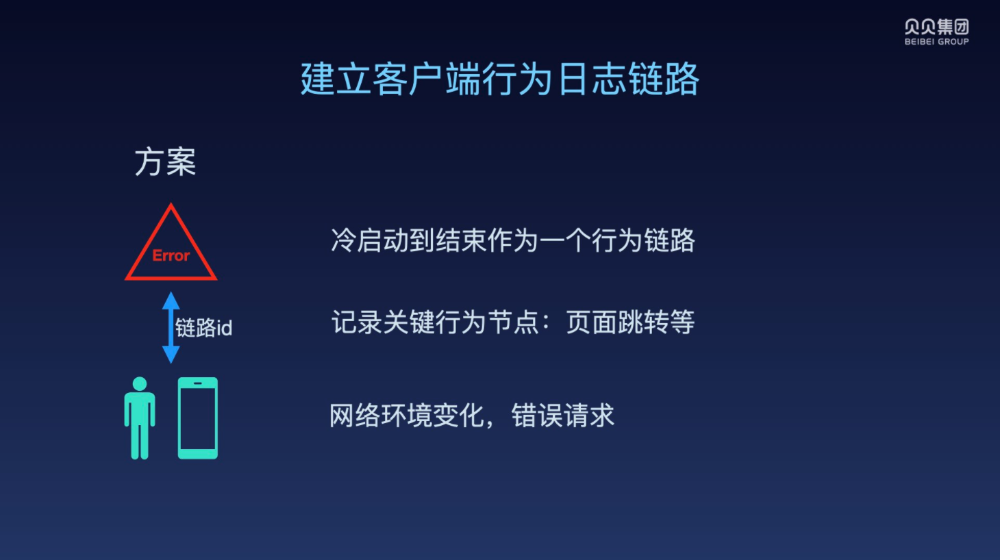

而这类需求在分析客户端问题时其实更为重要。在分析客户端问题时，仅靠错误日志上报的细腻，很多时候是不够的，因为缺少了用户浏览路径，操作行为等信息，而客户端很多错误是在特定触发条件下产生的，仅有错误堆栈很难复现问题，这就导致了开发排查问题的体验很差，要么去猜测错误是怎么发生的，要么需要自己从海量的行为日志中去查找用户行为日志，费时费力。

于是建立了一套日志链路，从客户端一次冷启动开始，我们会用 uuid 生成一个链路 id，后续的所有行为日志，网络日志和崩溃日志都会带上这个链路id，我们会记录一些关键节点，页面调整，网络环境变化，错误的网络请求，一些用户操作行为等。这样可以通过链路id直接关联到我们的相关行为日志，方便后续的问题排查。

### 数据可视化

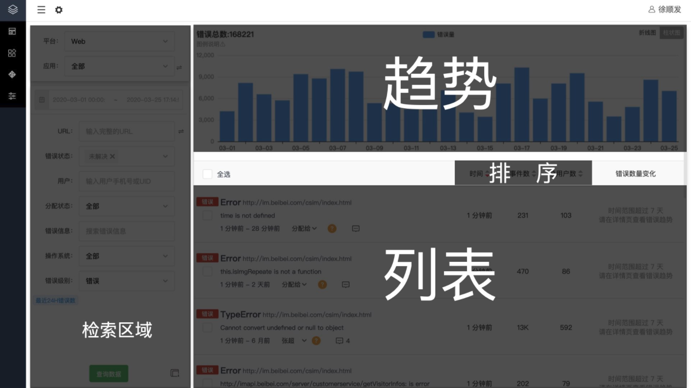

这是贝贝的天网页面，在页面左侧放了一整列的检索区域提供比较全面的检索能力；把错误趋势图表放在显眼的位置方便开发迅速定位一段时间的错误趋势；剩下页面最大的部分，留给了错误列表。

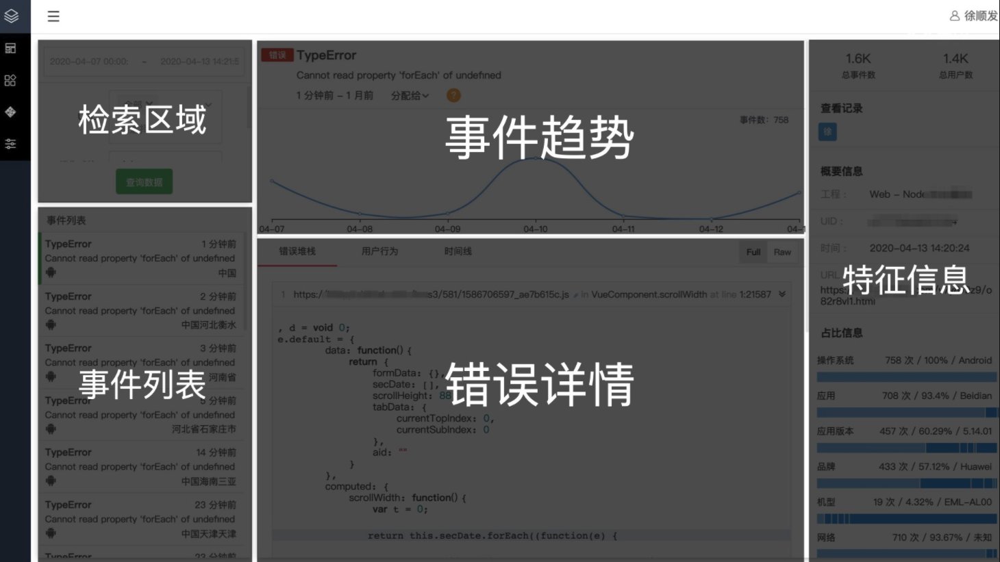

这是从列表页点击进入的详情页，页面大致是三栏布局的结构，从左往右共五个区域，分别是：检索区域，这里的检索主要是提供时间版本等简单的检索条件；事件列表，聚合后错误的每一个具体错误时间；事件趋势图表，展示这类错误的发生趋势，最中间的大片区域留给了错误详情。

### 监控告警

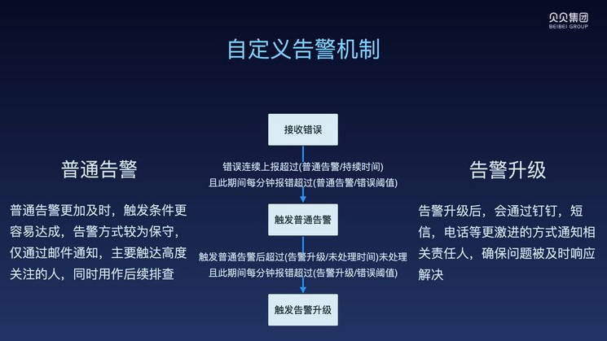

这里是一个比较基础的告警机制，监控平台接收到错误后，判断如果错误连续上报超过一定时间，且期间每分钟错误数量超过一个阀值，就触发普通告警，之后如果没有被标记处理中或已处理，且期间每分钟错误超过一个更高的阀值。就触发告警升级。可以通过钉钉，短信，电话等越来越激进的方式尝试通知相关责任人，确保问题能被及时响应解决。

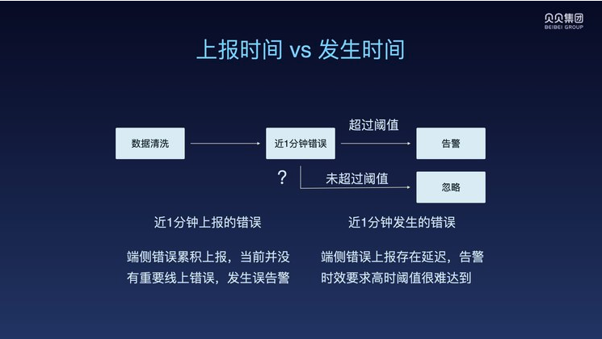

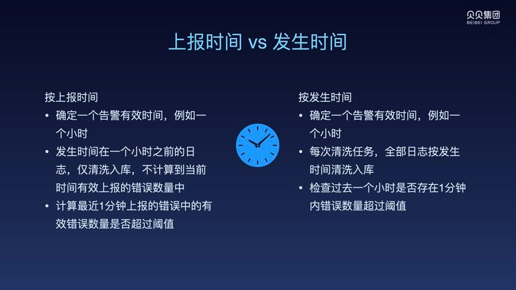

## 总结

1. 根据实际需求优化算法，更精准聚合
2. 削峰处理保持稳定的同事保住重要信息
3. 突出关注重点设计可视化
4. 打通系统形成错误监控闭环
5. 优化告警兼顾时效性和准确性。
