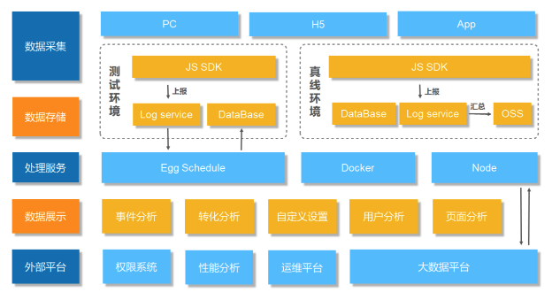

# 正文

> 政采云团队推出的浑仪系统

## 为什么需要做这样一个用户行为分析的系统

### 数据埋点的业务价值

产品以及市场想要更精准的定位，用户高频问题，降低咨询量，提升用户满意度。陆续有帮助用户答疑解惑的功能模块上线，但是，其效果无法衡量。

## 关键架构

浑仪系统总体流程可以归纳为三大步。首先，收集数据，然后进行数据处理，最后，数据透出展示。

而支撑这三大部门，实现了4个功能模块：

数据采集的SDK;
数据处理和数据存储的服务;
进行坑位级数据展示的Chrome插件;
系统级数据展示的站点;

## 浑仪的总体架构图

### 总体架构预览

收集了三端的数据，PC、H5和APP。

在PC端和H5使用了两套sdk去监听不同的事件。然后将监听到的事件通过rest接口上报给数据处理的服务，存储至阿里云日志服务中。进行了测试环境和真线环境两个环境之间的数据隔离。测试环境的SDK会走协商缓存的形式去刷新，真线会使用强缓存，并且进行版本控制；由于真线数据量庞大，会定期将日志库超过一定时限的历史数据转移存储至OSS。每天会有定时任务，筛选一部分数据存储到数据库中。另外还会和外部的很多系统进行交互。

权限系统：主要控制浑仪站点的访问权限；
性能系统：输出一些高频访问页面，进行性能检测；
运维平台：用来部署系统；和大数据平台会做一些数据的交互，我们会将行为数据推给大数据平台，也会从平台上捞取一些业务相关的数据。

### 系统关键架构

从上面总体架构预览图中可以看到，左边这一个模块，是面向用户的进行行为采集；右边模块是面向内部用户，提供给用户非常丰富的数据可视化展示。除了有可视化的站点，还提供了Chrome的插件，进行数据View的展示，还作为一个pass平台，提供对外一些SQL查询服务，报表Excel导出，和提供API拉取报表的数据，也可以基于现有的数据进行二次开发。

### 数据采集

该系统采集了页面进入和离开，用户点击和滚屏事件，还有一些标准的自定义事件。页面进入、离开和滚屏的事件我们能进行自动化的采集，点击以及自定义事件需要开发者来配合，进行代码植入。

那怎么做到零代码的自动化采集呢？

* 首先在页面当中通过项目编译的过程当中，为所有的路由页面植入了项目Id,挂载在页面的head部分。
* 然后再进入页面的时候，根据页面的路径，去自动生成页面ID，挂载在body节点上。
* 最后在用户进入页面和离开页面的时候，数据采集的SDK能自动拿到项目ID，页面ID，去定位一个唯一的页面，做到自动化的上报进入和离开的事件。

以点击事件为例，当前触发点击事件的DOM店，称之为坑位。坑位的外层包裹的DOM节点我们称之为区块。这两者需要以代码侵入的方式，进行挂载，为了降低挂载的成本，也提供了一些工具去帮助他们进行操作。

统一的站点中提供了埋点申请的功能，在申请完成之后点击生成代码，但马上会详细列出需要挂载的位置以及ID，开发人员只需要将生成的代码粘贴到需要埋点的位置即可。

通过搭建系统生成的页面也会自动植入这些位置ID，有了这些数据之后，就可以开始进行一次完整的上报。

### 采集数据分析

上图是上报的一些数据集合。这里的XY轴坐标可以用来生成用户点击区域的热力图，反映一个页面上用户主要的关注点。如下图：

* 操作系统、分辨率、浏览器这些信息可以让我们分析当前平台主流用户的一些主流浏览器，用来确定平台的兼容情况；
* 如果是APP端还会有例如是客户端版本，手机型号，当前网络情况的一些其他的数据；
* logType 对事件进行分类；
* evt 是具体的指定事件类型；
* createTime 是事件发生的时间，可以用来串联事件发生的前后顺序记录了；
* utmCnt 是触发位置用来把当前的事件定位到具体的 dom 节点；
* uuid 是访客的唯一标识，每次用户进入页面之后，SDK会去cookie中查找它，如果没有的话，我们就会生成，并且将过期时间设为永久。记录用户的IP地址可以追溯到用户的省市区。
* userId可以和uuid关联起来，将无意义的访客，关联到平台的用户，形成详细的用户画像。
* utmfrom 标记了来源的位置，后面会详细讲 a 链接的跳转，这个字段是用来串联前端的链路；
* 绿色框内的上报信息，我们可以归结为浏览器页面相关的一些信息，红色框内的事件相关的一些信息以及蓝色框内的信息可以归结为用户相关的信息。

### 具体事件拦截

将四个目标事件都委托在了 document 上，所有这些事件只要触发都会被拦截，但是经过特定的筛选，只有能获取到坑位ID和区块ID的target上触发的事件才会被上报。这让我们收集的数据更加精准，如果在这里不做筛选的话，上报的数据变得大而全，数据量就会特别庞大，就把目前的代码侵入式埋点切换为了全埋点，这也会让数据的分析变得比较困难。

在离开的使用使用 sendBeacon <https://developer.mozilla.org/zh-CN/docs/Web/API/Navigator/sendBeacon>,能在unload的或者beforeunload的事件处理器中发起一个 **HTTP request** 来发送数据，这样就能确保我们离开页面的请求会被记录下来。

在数据上报这里还使用了 **img** 标签，主要是为了保证浏览器的兼容性。因为目前， IE 是不支持 sendBeacon 方法的。而 cors 使我们最常见的一种跨域请求发送的方式，它能够使用post的请求，让我们批量上报的一些数据能够不超出长度的限制，能够成功发送。

同样能够发送单一维度的一些上报数据之外，我们还需要上报的数据能够串联起整个用户浏览的流程。当中最常见的一种方式就是链接的跳转。

### 数据分析

在数据处理部分使用了阿里云的 LOG Service，他的一个非常大的好处就是能提供日志的实时消费接口，查询手段也非常丰富；能够添加实时索引；

根据之前采集到的数据，我们很容易就可以计算出页面 PV,UV，点击数，曝光数等一些基础的指标，但是我们要怎么把它转换成一个漏斗模型？

### 数据应用

当前分析模型主要分为事件分析，页面分析转换分析和用户分析四大块，内部还分成了10几种小的指标；还在自定义设置中提供了帮助指标建立的工具；

1. 事件分析是用户行为分析的基础也是最常用的功能，次数，分布，间隔，通过事件分析可以创建各种分析报表。页面基于各个页面的行为数据，针对性的优化页面布局，增加页面的访问吸引力，

2. 转化分析会用户行为分析中最重要的分析模型，通过转化分析可以找出用户行为的转化路径和漏斗，提升平台的整体转化率。从触达用户到用户完成转化的整个过程中都存在转化率。

3. 用户分析能够很好的帮助确定产品的目标用户群，用户的行为习惯，掌握用户的活跃和留存特征，通过用户分群可以实现精细化的用户运营。
    

## 总结

也可以考虑第三方的一些产品：

