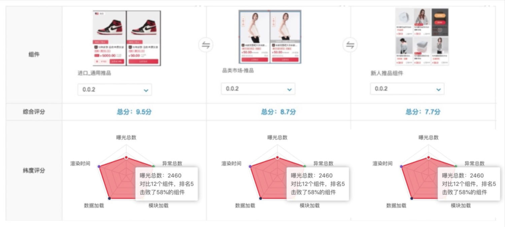
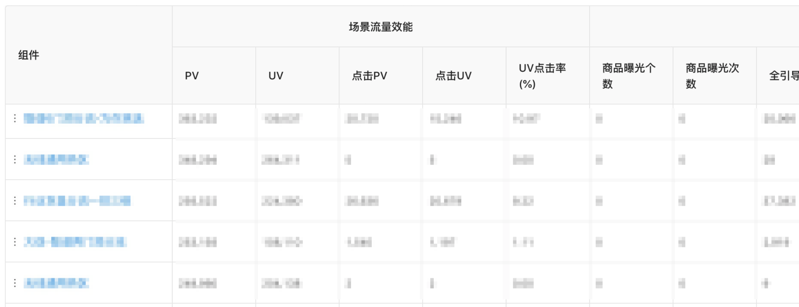

# 正文

> 这是来自阿里巴巴1688团队的结合组件设计的前端监控策略

## 业务背景

1688每年有多次 S 级大促，若干个 A++ 级大促以及各种营销活动，在2020财年累计上线了40多场主体活动，运营累计搭建了1.7多万张会场页面。

页面的基本组成单位是组件，组件的数量定义了开发成本。财年统计有一万多个组件。它们有的曾红极一时为业务带来了良好的转换效果，有的很快就会被遗忘掉，甚至还有的一经投放就快速被下线。

## 日常积累

一个很好的运营策略不见得立刻就能达到预期，还是需要一定的实验次数来持续调优，最终达到人、货、场的最大化匹配。

### 业务背景 - 痛点

想象力是创造的开端，大量实验 + 大量调优 + 大量开发 = 大量的资源池。慢慢会转变成大量的沉积、重复和浪费。有了好的策略，需要开发新组建。当会场没有达到预期效果，业务方会尝试改改尺寸、调调氛围、透几个利益点之类的，业务方称作“调整”，我们开发写作“开发”。当会场效果较为平稳，业务方可能会尝试不一样的玩法，说不定会带来惊喜。

上面这张图一方面解释了1万个组件的由来，另一方面提及了组件诞生背后的决策 -- 数据效能分析。

### 举例，内部数据系统 - APLUS

一般情况下，关系的是整个会场的 **流量** 和 **转化**。

### 页面效能与组件效能

流量的入口和去向最直接的行动点全都是聚焦在组件上的，当前页面的 PV 其实就是上一个页面组件的点击数量，页面转化率也就是组件的点击转化率。优秀的组件不仅有迷人的 UI、吸引人的内容、楼层位置、曝光量和自身稳定性都非常重要。每一个组件都是经过了心智策略的包装、产品思维的提炼、加上高超的技术，灵感 + 智慧 + 汗水的成果，除去一次性的消费品，朴实的组件也是有可能经过抛光打磨重放光彩。

为此，营销&工程团队结合搭建平台启动了组件360计划。

### 组件360定义

组件 360 承担起“经纪人”的职责，负责管理组件“人口”，丰富组件标签，开放更多组件应用场景查询，聚合组件在业务组中的曝光量、点击转化效果，自身代码质量、渲染性能、数据加载性能、失败次数，在面临组件选择上能直观的分析对比出同类组件的指标排行，数据化的择优而用。随着带来的业务效果的变化，效能数据从场景中回流到组件本身，不断的优胜劣汰，浮在上层的优秀组件就更具备维护价值，沉入池底的隐藏回收降低应用干扰和维护成本。

### 组件模型

围绕 **业务效能** 和 **质量监控** 展开的。

### 引用量

组件的引用量可以反映出它的泛用性，横跨的业务越多，表示通用性越强，应该圈出来作为重点治理对象。

## 监控

### 效能监控

创建页面确定了页面所在的站点，这就定下了 spma（站点）和 spmb（页面本身）；搭建过程中使用了一个组件，确定了 spmc 位；页面发布后，线上运行时，每个渲染出来的可点击的超链接，即生成了 spmd 。超级定位模型自动埋点常适用于流量、来源与跳失率、引导转化、成交金额、设备、日活等通用数据。

> 引导转化率 = 引导成交量/点击量/曝光量

组件的曝光 就是组件的 PV，页面的 PV 不等于组件 PV。页面一经访问就会产生页面 PV，组件的渲染加载都是采用懒加载方式提升性能，只有当组件出现在页面的可视区域才会算作一次组件 PV。

页面 PV >= 组件 PV >= 组件点击。

组件的点击量通过去向页面上的 spma、b、c位可以定位到单个页面上的成绩，一个组件在一个页面上可能被用了N次，spma、b位相同，spmc 不同；在 N 个页面中被引用了 N 次，spma、b、c都不相同。定义一个组件的点击量，要准确定位其使用的页面和楼层，全量洗出它们。组件本身是有版本的，不是最新页面就一定是最新版本，遵循 y 和 z 的向下兼容规范，一个页面上是可以使用同一个组件的不同版本。数据汇总分类以“年月日”组合为分区，组件包名、版本、spmabc 是最小分组条件。

### 质量监控

因为组件都是分模块加载和渲染的，单个组件的失败不影响整体的渲染。不熟悉页面结构的同学看到下图右边的页面甚至都不会觉得有问题。

### 异常监控

一个组件的不可见要么是有特殊逻辑控制了显示，要么就是遇到了异常。异常也分为 **脚本执行异常** 和 **数据异常** 。执行异常通过在页面级别的 JS Error 中已经监控到了，数据异常属于逻辑层面，JS Error 监控是区分不开的，因为这类异常甚至都不会报错 -- 常和接口打交道，异常的数据结果想必都做了各种兼容。

监控方案：一个组件一个数据源，数据源的结果有自己的格式。如下图所示，我们设定数据结构中的一条字段链路为监控卡点，配置上校验规则

页面搭建保存组件配置时会触发异步规则校验，此时的异常知识警告；页面往预发环境发布时会对所有组件进行同步的数据规则校验，此时的异常会阻断发布并给出原因。直到异常修复完成后才能重新发布成功，最终上线。在线上环境，服务端会对使用中的页面中的组件进行数据的轮训检查，一旦发生数据异常，立刻在工作群组中进行报警，技术同学就能第一时间发现问题并解决。

改进点：线上环境采用的是服务端轮询校验的方式，使用的数据是一个环境下的请求数据，用户个性化的真实数据才是我们需要监控的。可能把逻辑从服务端移到前端运行环境中。

### 性能监控

组件的性能监控点：

1. 模块加载时间。组件虽然是单个模块渲染，加载的时候实际上是会把所有组件的公共依赖全部提取出来合并成一个 JS 请求（称之为 JS comb），然后把组件们自身的脚本请求合并成一个 js 请求，避免多个组件之间的重复依赖冗余，合并请求减少请求频率提高加载性能。带来的影响就是无法统计单个组件的加载耗时，所以我们调过网络请求这部分，模块加载时间就归到首次引用到模块时的自执行时间。
    

2. 初始化数据加载时间。我们的页面在首屏渲染过程中会有把页面上组件的数据都请求回来，然后下发回组件进行渲染。页面的秒开率一直都是性能衡量的重要指标，组件的数据加载时间决定了未秒开的贡献度。

3. 渲染时间。beforeRender 和 afterRender 之间的渲染时间。组件性能的表现怎么样，在多个页面下看的是平均值。

## 配置复杂度

组件为了保持自身的灵活性，往往会开放很多配置参数。一次开发到位了，足够灵活了，运营同学在可视化搭建系统中可以实现更多的干预了。有需求就提，不够再加。当配置项上升到10个以上，每次配置就是个体力活了，初次使用该组件的同学得望而生畏了。同样，组件在代码层面也变得更复杂了，后续维护的成本就越来越高。当然，开放配置量多也能反映出它的功能更多。

计算复杂度是为了尽可能多的让开发把复杂的配置简单化，比如多使用选择框替代输入框，尽量提供默认值和帮助提示。组件迭代后把用不上的配置及时清理掉，减少使用者的疑惑。

配置复杂度计算规则。

## 代码质量

## 综合管理

曝光也好，性能监控也好，统计组件的综合数据，都不能忽略了它们所在的页面群体。把它们聚合在一起的核心就是 spma 、b、c。在组件市场的组件详情页面中，在“组件360”面板中可以自由聚合相关页面或者业务组来看大盘结果。

有对比才知道自身差在哪里，才能有目标性地优化。

## 可视化应用

一般监控和分析都是一端投放，另一头看数据，实际上投放的页面就一张，背后的平台可不少。比如活动平台、搭建平台、banner资源平台、算法平台、选品平台、A/B Testing 平台、场景控制平台，再加上数据平台和监控平台。

### 可视化看数据 -- 所见即所得

对于投放出去的页面，大家非常关心效能数据怎么样，去数据分析平台上你看到的组件数据是这样的。

和搭建时候的页面结构一模一样有没有，出汇总报告的首选。当我看到重复的组件名称（多次使用了“无线通用热区”），可能实在记不起来究竟是放了一张什么样的图片吸引点击了，高度有没有占很大空间，是用了红色氛围好，还是fen'se