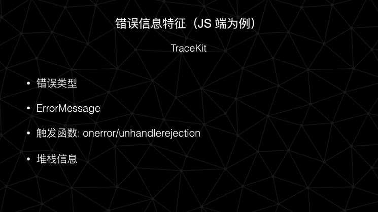

# 正文

>  思路以及实现

## 设计思路

### 前端监控的基本目的


前端监控的基本目的为以下几点：

* 开发出来的应用的使用情况：有没有用户使用，有多少用户使用；
* 用户在使用过程中遇到了什么样的问题；
* 作为开发者和运营者应该如何追踪定位到这些问题并及时解决；
* 同时从中吸取经验避免再犯；
* 埋点数据反哺业务：运营和产品负责人能从中得到哪些东西，从而优化产品质量

### 发展史

基于以上对监控体系的思考，小菜团队在5年中逐步完善了自己的监控体系，这差不多就是我们监控体系的一个简单的发展史：


对于研发成本的考虑是造成上面发展史形成的根本原因：

* 在前期人力不够的情况下我们主要依靠第三方工具，这时候使用的技术栈主要是RN和原生Android应用，由于在15年左右RN还属于比较新的技术，市面上没有较成熟的针对RN的埋点监控工具，因此是对三方SDK进行魔改达到目的。
* 在第二阶段将所有应用切换到了RN开发，于是就放弃了第一阶段的畸形方案，使用了比较简单的半自研方案，这时的埋点和监控是分开的，监控方面使用Bugsnag，但其对数据同步有限制，数据上报处理是和后端同学合作完成的，存储介质是 MongoDB，由于数据结构设计较为灵活且数据存储量很大，导致后面做数据处理时存在了瓶颈；
* 第三阶段时由于业务的高速发展，前端应用已经不仅仅局限于RN APP了，还包含微信小程序和大量的 PC/H5 应用且 H5 应用的数量和使用频率已经逐渐超过了RN应用，于是开始了当前这个多段的埋点监控系统的研发

### 基础模块

系统包含埋点和监控两部分，这里只介绍监控部分:


* 采集模块：数据应该如何采集，采集哪些端，哪些数据
* 存储：数据应该如何存储，上报和保存的数据结构应该是怎样的
* 报警：报警系统应该如何设计，如何嗅探错误，如何通知到负责人
* 异常管理：如何对上报的异常进行归类，从而进行管理
* 展现：总结异常发生情况，并展现给使用者

### 系统架构

以下是系统目前的基础架构：


#### 客户端

客户端目前覆盖到了 PC/H5、RN应用、小程序，由于node应用还比较少应用到业务中，考虑到投入产出比，还没有进行SDK的研发。

#### 日志处理

日志处理经过三层：

* 第一层考虑到流量较大采用集群的方式分散压力，同时对数据做初次处理
* 第二层主要是使用 **Kafka** 集群进行 **buffer**，降低ES写日志的压力，同时也具有缓存数据的功能，避免ES宕机造成的数据丢失， **Filebeat** 则是在应付 **Kafka** 出问题时的 **backup**;
* 原始数据则在经过处理后存放在 Elasticsearch 中。

#### 数据处理

这里便是第三层的日志处理：

* 端上的埋点数据经过处理后会存放在数据仓库内，这是后端同学的工作了；
* 从前端搜集到的错误数据则是在监控系统后台做处理的

#### 数据展现

* 一是埋点数据的展现，是在后端同学处理后保存到数据仓库中，然后由我们前端的可视化报表系统进行展现；
* 二是监控错误数据的展现，由监控系统的监控看板处理。

### 监控系统各模块间的数据流向

以下是展示监控系统中从数据上报到展示的整个数据流流向全过程。


## SDK的实现

### 采集哪些数据

首先要考虑的是应该采集哪些数据


虽然是监控错误数据，但是有时候为了分析错误的形成原因或者重现错误出现的场景，我们还是需要用到用户的行为数据，因此需要采集的数据包括两方面：

#### 用户行为数据

* 用户页面操作；点击，滑动等；
* 页面跳转：SPA/MPA 页面跳转，APP/小程序的页面切换等；
* 网络请求；
* 控制台输出：console.log/error 或者 Android log等；
* 自定义事件上报

#### 错误数据

* 后端接口错误：
  * 服务不可用导致的前端问题
  * 业务数据错误导致前端处理数据出错而形成的前端错误等
* 前端JS错误：
  * 语法错误
  * 兼容性错误等
* APP Native 错误等

### SDK实现

简单讲了两个端的SDK的简单实现：

#### RN SDK


小菜的 RN 应用是比较纯粹的RN应用，所以 RN SDK实现可以简单的分为两段：

#### JS端

* 错误捕获：RN已经提供了比较方便的API
  * ErrorUtils.setGlobalHandler类似于浏览器的window.onerror，用于捕获JS运行时错误
  * Promise.rejectionTracking类似于浏览器的 UnhandledRejection 事件
  * 还提供自定义上报错误，开发者可以在开发过程中 try/catch 然后调用
* 网络请求：代理XMLHttpRequest的send/open/onload等方法
* 页面跳转：小菜RN应用的路由组件是对三方组件react-navigation的自定义包装，我们只需要在onStateChange或者在Redux集成方式中使用 screenTracking 即可

#### Native端

* ios使用 KSCrash 进行日志采集，可以本地进行符号化
* 存储捕获到的数据（包括JS端和native端）统一上报

#### 代码展示

Promise.rejectionTracking的代码展示

```()
const tracking = require("promise/setimmediate/rejection-tracking");
  tracking.disable();
  tracking.enable({
    allRejections: true,
    onHandled: () => {
      // We do nothing
    },
    onUnhandled: (id: any, error: any) => {
      const stack = computeStackTrace(error);
      stack.mechanism = 'unhandledRejection';
      stack.data = {
        id
      }
      // tslint:disable-next-line: strict-type-predicates
      if (!stack.stack) {
          stack.stack = [];
      }
      Col.trackError(stringifyMsg(stack))
    }
  });
```

#### 微信小程序 SDK

这里简单说一下微信小程序 SDK 实现的两个方面：

网络请求
代理全局对象 wx 的 wx.requst 方法：

```()
import "miniprogram-api-typings"

export const wrapRequest = () => {
  const originRequest = wx.request;
  wx.request = function(...args: any[]): WechatMiniprogram.RequestTask {
    // get request data
    return originRequest.apply(this, ...args);
    //
  }
}
```

页面跳转
覆写 Page/Component 对象，代理其生命周期方法：

```()
/* global Page Component */

function captureOnLoad(args) {
  console.log('do what you want to do', args)
}

function captureOnShow(args) {
  console.log('do what you want to do', args)
}

function colProxy(target, method, customMethod) {
  const originMethod = target[method]
  if(target[method]){
    target[method] = function() {
      customMethod(…arguments)
      originMethod.apply(this, arguments)
    }
  }
}

// Page
const originalPage = Page
Page = function (opt) {
  colProxy(opt.methods, 'onLoad', captureOnLoad)
  colProxy(opt.methods, 'onShow', captureOnShow)
  originalPage.apply(this, arguments)
}
// Component
const originalComponent = Component
Component = function (opt) {
  colProxy(opt.methods, 'onLoad', captureOnLoad)
  colProxy(opt.methods, 'onShow', captureOnShow)
  originalComponent.apply(this, arguments)
}
```

## LOG处理

### 系统结构以及作用

首先展示一下日志处理模块（我们称之为 log-transfer）的基本结构：


#### 结构

数据上报属于处理原始数据的第一层，包含以下特点：

* 采用多节点模式：考虑到数据流量可能比较大，因此采用多节点分担压力（这里每个节点都进行了容器化）
* 每一个节点都有作为 backup 的 Filebeat : 考虑到后续处理的Kafka的稳定性，添加了 Filebeat 作为备用

#### 作用

* 解密上报的数据并验证其正确性；
* 处理部分数据字段，避免数据丢失，这会在后面提到；
* 加入一些客户端SDK无法拿到的字段：如IP;
* 转发处理过后的数据

#### 其中的要点

日志上报处理中有不少需要注意的要点


* 由于数据量较大，所以所有数据并不是写在一个索引里面的，这个时候就需要按时或者按天建立索引保存数据
* 由于上一条的缘故，我们需要建立一个固定的索引模板，因而某一字段的数据类型一定要统一，否则会造成数据保存失败的情况
* 建立索引模板的前提是所有端上报的数据有统一结构，但是又由于不同端的特性导致不可能所有端上报的字段完全统一，这就存在不变的字段和变得字段(即基于端类型的特殊字段)，哪些字段变哪些子弹不变需要设计系统时进行衡量，即要保持适度的灵活：


* 如果使用 JSON 类型数据进行上报且在ES中依然保存为 JSON 数据，虽然存在索引模板，但是在模板没有照顾得到的字段上报上来时会生成新的字段，因而会造成字段数量爆炸，例如IOS的native错误符号化以后上报会生成很多字段，处理额外字段，这也是这一节讲到的 log-transfer 的作用之一。

## 监控看板

### 看板展示

以下是监控看板的一些简单展示截图


### 看板作用


看板的作用包括：

* 实时 PU/V 查看；
* 实时错误日志查看；
* Issue管理；
* 报警任务查看和编辑等；

### Issue的处理流程

什么是issue？即对已经上报的同类型错误进行归纳和总结以后抽象出来的数据，便于我们对同一种的错误进行跟踪和处理。


issue存在明确的生命周期，这里展示的就是我们的issue生命周期；

* 对于不需要处理的issue，可以将其直接置为忽略状态；
* 如果分配的issue自己无法处理可以转派他人；
* 处理后的issue不会立马关闭，发布后系统会在线上进行验证，如果复发则会reopen。

以下是一个错误详情的示例：


使用source map转换后的堆栈信息也会展现在错误详情中

## 报警控制

### 结构以及作用

首先是系统结构


* 可以看到报警控制模块（我们称之为 Controller）与其他模块之间并不是直接交流的，而是通过 Kafka 交流的；
* 监控看板编辑报警任务，而报警控制模块消费报警任务；
* 报警控制模块通过 Kafka 控制 Inspector（即任务执行器）执行报警任务。

作用


### 其中要点

#### 错误信息特征

前面解释了什么是 issue,但是没有说明 issue 是如何抽象出来的，以 JS 错误为例：



JS 错误我们在上报时使用 Tracekit 进行标准化，从而得到具有统一结构的错误信息，然后据此判断和归类错误，参考字段包括：

* 错误类型：如 TypeError,SyntaxError等
* ErrorMessage：即错误信息；
* 触发函数：onerror/unhandledRejection;
* 堆栈信息。

以下是系统ISSUE的展示：


ISSUE的每一次状态更新都会被记录下来


Kafka的作用


Kafka的作用主要包括：

* 任务队列的存储和分发；
* 系统各个模块之间的通信。

为什么不使用实时通信（socketIO/RPC）？总的来说是为了系统稳定性考虑

* Kafka具有缓存通信信息以及缓解系统压力的作用；
* 相比于实时通信，使用 Kafka稳定性更高报警任务，到达率更有保障；如果某个单节点服务宕机，如任务控制器，那么待该服务启动后依然可以消费之前缓存在 Kafka 中为送达的信息。

当然，Kafka也有替代方案，如Redis/RabbitMQ等。

报警任务设计：


报警任务设计在报警系统中属于比较重要的部分，我们大致将其抽象成两大部分：

* 任务执行规则（或者说执行频率）
* 任务判断规则（或者说触发报警的规则）
  * 判断细则：即是否多个条件形成一个报警任务，多个条件间的关系如何
  * 查询类型：是 ES query 还是SQL查询，或者其他
  * 查询结果计算规则

数据结构示例

下面给出一个简单的报警任务数据结构示例：


报警任务是可以人为设置和控制的

## 任务执行

然后就是系统中最后的一个模块，任务执行模块（称之为Inspector）:

任务执行器则比较简单，主要用于执行控制器分发的报警任务，查询上报的线上数据根据任务的判断规则生成相应的任务结果并通过 Kafka 返回给任务控制器，由于报警任务可能较多所以采用集群的方式部署，多节点分散任务压力；


## 总结

最后在回顾一下各模块之间的 数据流向图：

