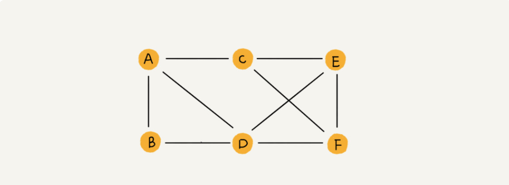
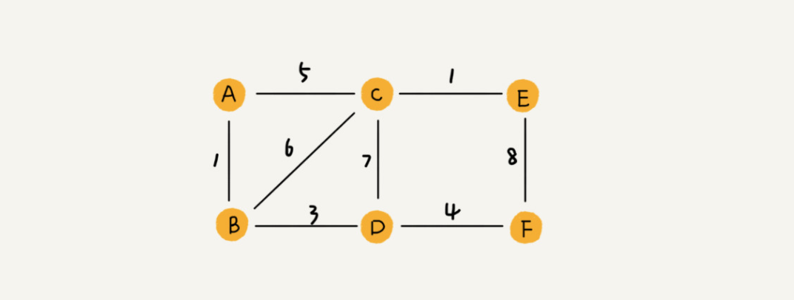
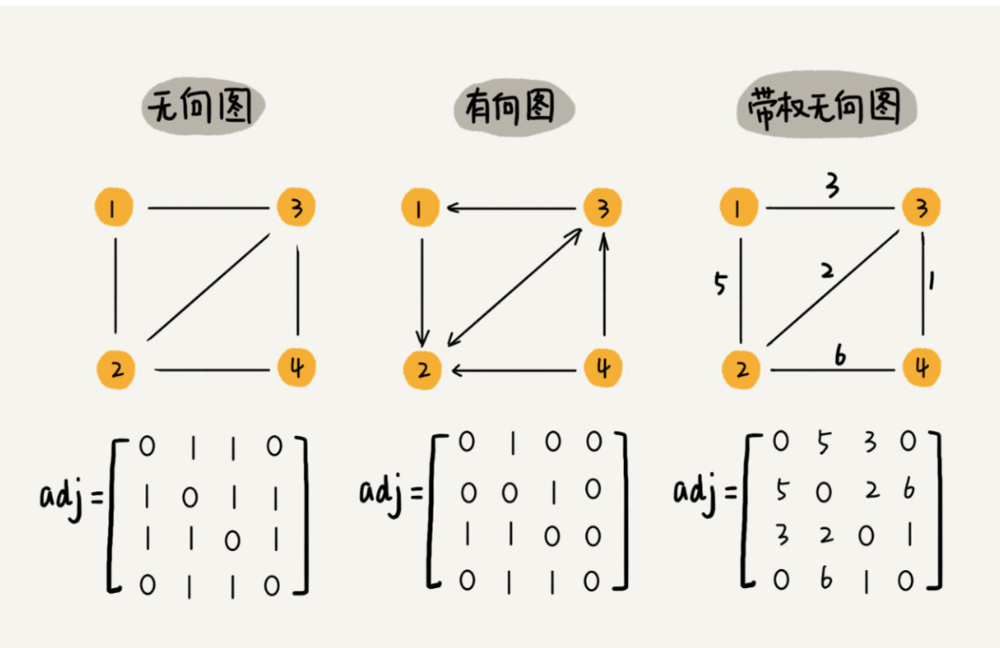
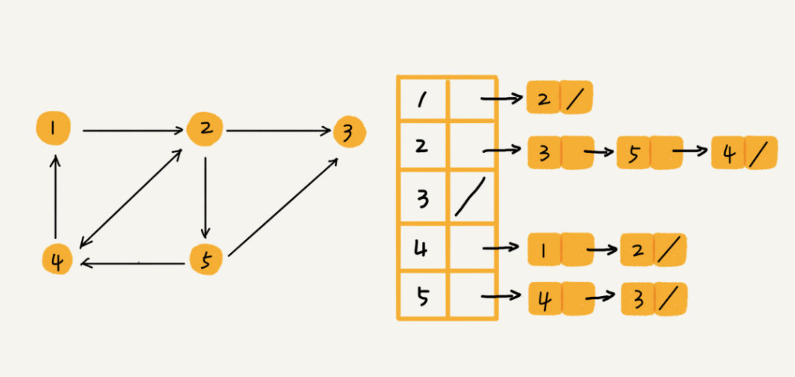
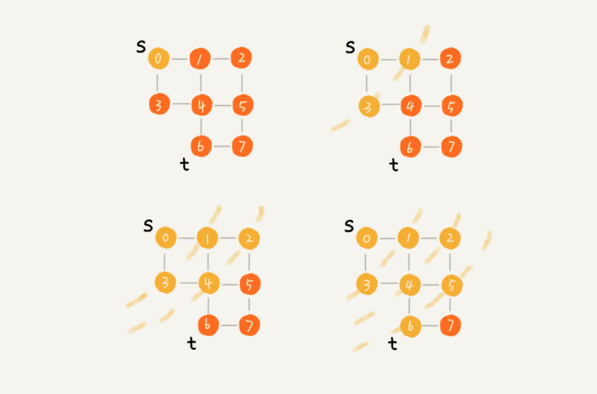
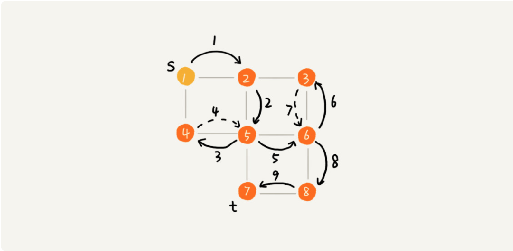
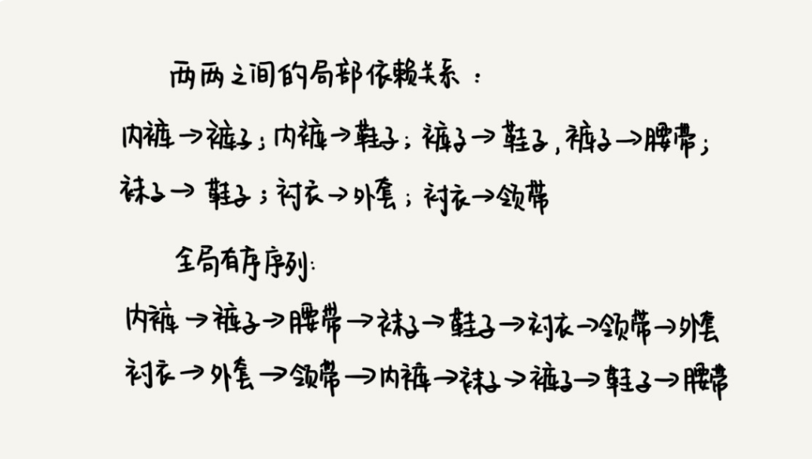

# 正文

## 图的表示：如何存储微博、微信等社交网络中的好友关系

### 如何理解“图”

我们前面讲过了树这种非线性表数据结构，今天我们要讲另一种非线性表数据结构，图（Graph）。和树比起来，这是一种更加复杂的非线性表结构。

树中的元素我们称为节点，图中的元素我们就叫作顶点（vertex）。从我画的图中可以看出来，图中的一个顶点可以与任意其他顶点建立连接关系。我们把这种建立的关系叫作边（edge）。



如果用户 A 关注了用户 B，我们就在图中画一条从 A 到 B 的带箭头的边，来表示边的方向。如果用户 A 和用户 B 互相关注了，那我们就画一条从 A 指向 B 的边，再画一条从 B 指向 A 的边。我们把这种边有方向的图叫作“有向图”。以此类推，我们把边没有方向的图就叫作“无向图”。

我们刚刚讲过，无向图中有“度”这个概念，表示一个顶点有多少条边。在有向图中，我们把度分为入度（In-degree）和出度（Out-degree）。

顶点的入度，表示有多少条边指向这个顶点；顶点的出度，表示有多少条边是以这个顶点为起点指向其他顶点。对应到微博的例子，入度就表示有多少粉丝，出度就表示关注了多少人。

QQ 中的社交关系要更复杂的一点。不知道你有没有留意过 QQ 亲密度这样一个功能。QQ 不仅记录了用户之间的好友关系，还记录了两个用户之间的亲密度，如果两个用户经常往来，那亲密度就比较高；如果不经常往来，亲密度就比较低。如何在图中记录这种好友关系的亲密度呢？

这里就要用到另一种图，带权图（weighted graph）。在带权图中，每条边都有一个权重（weight），我们可以通过这个权重来表示 QQ 好友间的亲密度。



### 邻接矩阵存储方法

图最直观的一种存储方法就是，邻接矩阵（Adjacency Matrix）。

邻接矩阵的底层依赖一个二维数组。对于无向图来说，如果顶点 i 与顶点 j 之间有边，我们就将 A[i][j]和 A[j][i]标记为 1；对于有向图来说，如果顶点 i 到顶点 j 之间，有一条箭头从顶点 i 指向顶点 j 的边，那我们就将 A[i][j]标记为 1。同理，如果有一条箭头从顶点 j 指向顶点 i 的边，我们就将 A[j][i]标记为 1。对于带权图，数组中就存储相应的权重。



### 邻接表存储方法

我画了一张邻接表的图，你可以先看下。乍一看，邻接表是不是有点像散列表？每个顶点对应一条链表，链表中存储的是与这个顶点相连接的其他顶点。另外我需要说明一下，图中画的是一个有向图的邻接表存储方式，每个顶点对应的链表里面，存储的是指向的顶点。对于无向图来说，也是类似的，不过，每个顶点的链表中存储的，是跟这个顶点有边相连的顶点，你可以自己画下。



还记得我们之前讲过的时间、空间复杂度互换的设计思想吗？邻接矩阵存储起来比较浪费空间，但是使用起来比较节省时间。相反，邻接表存储起来比较节省空间，但是使用起来就比较耗时间。

## 深度和广度优先搜索：如何找出社交网络中的三度好友关系

### 什么是“搜索”算法

我们知道，算法是作用于具体数据结构之上的，深度优先搜索算法和广度优先搜索算法都是基于“图”这种数据结构的。这是因为，图这种数据结构的表达能力很强，大部分涉及搜索的场景都可以抽象成“图”。

```()
public class Graph { // 无向图
  private int v; // 顶点的个数
  private LinkedList<Integer> adj[]; // 邻接表

  public Graph(int v) {
    this.v = v;
    adj = new LinkedList[v];
    for (int i=0; i<v; ++i) {
      adj[i] = new LinkedList<>();
    }
  }

  public void addEdge(int s, int t) { // 无向图一条边存两次
    adj[s].add(t);
    adj[t].add(s);
  }
}
```

### 广度优先搜索（BFS）

广度优先搜索（Breadth-First-Search），我们平常都把简称为 BFS。直观地讲，它其实就是一种“地毯式”层层推进的搜索策略，即先查找离起始顶点最近的，然后是次近的，依次往外搜索。理解起来并不难，所以我画了一张示意图，你可以看下。



```

public void bfs(int s, int t) {
  if (s == t) return;
  boolean[] visited = new boolean[v];
  visited[s]=true;
  Queue<Integer> queue = new LinkedList<>();
  queue.add(s);
  int[] prev = new int[v];
  for (int i = 0; i < v; ++i) {
    prev[i] = -1;
  }
  while (queue.size() != 0) {
    int w = queue.poll();
   for (int i = 0; i < adj[w].size(); ++i) {
      int q = adj[w].get(i);
      if (!visited[q]) {
        prev[q] = w;
        if (q == t) {
          print(prev, s, t);
          return;
        }
        visited[q] = true;
        queue.add(q);
      }
    }
  }
}

private void print(int[] prev, int s, int t) { // 递归打印s->t的路径
  if (prev[t] != -1 && t != s) {
    print(prev, s, prev[t]);
  }
  System.out.print(t + " ");
}
```

visited 是用来记录已经被访问的顶点，用来避免顶点被重复访问。如果顶点 q 被访问，那相应的 visited[q]会被设置为 true。queue 是一个队列，用来存储已经被访问、但相连的顶点还没有被访问的顶点。因为广度优先搜索是逐层访问的，也就是说，我们只有把第 k 层的顶点都访问完成之后，才能访问第 k+1 层的顶点。当我们访问到第 k 层的顶点的时候，我们需要把第 k 层的顶点记录下来，稍后才能通过第 k 层的顶点来找第 k+1 层的顶点。所以，我们用这个队列来实现记录的功能。prev 用来记录搜索路径。当我们从顶点 s 开始，广度优先搜索到顶点 t 后，prev 数组中存储的就是搜索的路径。不过，这个路径是反向存储的。prev[w]存储的是，顶点 w 是从哪个前驱顶点遍历过来的。比如，我们通过顶点 2 的邻接表访问到顶点 3，那 prev[3]就等于 2。为了正向打印出路径，我们需要递归地来打印，你可以看下 print() 函数的实现方式。

### 深度优先搜索（DFS）



实际上，深度优先搜索用的是一种比较著名的算法思想，回溯思想。这种思想解决问题的过程，非常适合用递归来实现。回溯思想我们后面会有专门的一节来讲，我们现在还回到深度优先搜索算法上。

我把上面的过程用递归来翻译出来，就是下面这个样子。我们发现，深度优先搜索代码实现也用到了 prev、visited 变量以及 print() 函数，它们跟广度优先搜索代码实现里的作用是一样的。不过，深度优先搜索代码实现里，有个比较特殊的变量 found，它的作用是，当我们已经找到终止顶点 t 之后，我们就不再递归地继续查找了。

```()
boolean found = false; // 全局变量或者类成员变量

public void dfs(int s, int t) {
  found = false;
  boolean[] visited = new boolean[v];
  int[] prev = new int[v];
  for (int i = 0; i < v; ++i) {
    prev[i] = -1;
  }
  recurDfs(s, t, visited, prev);
  print(prev, s, t);
}

private void recurDfs(int w, int t, boolean[] visited, int[] prev) {
  if (found == true) return;
  visited[w] = true;
  if (w == t) {
    found = true;
    return;
  }
  for (int i = 0; i < adj[w].size(); ++i) {
    int q = adj[w].get(i);
    if (!visited[q]) {
      prev[q] = w;
      recurDfs(q, t, visited, prev);
    }
  }
}
```

## 拓扑排序：如何确定代码源文件的编译依赖关系

### 算法解析

这个问题的解决思路与“图”这种数据结构的一个经典算法“拓扑排序算法”有关。那什么是拓扑排序呢？

这个概念很好理解，我们先来看一个生活中的拓扑排序的例子。

我们在穿衣服的时候都有一定的顺序，我们可以把这种顺序想成，衣服与衣服之间有一定的依赖关系。比如说，你必须先穿袜子才能穿鞋，先穿内裤才能穿秋裤。假设我们现在有八件衣服要穿，它们之间的两两依赖关系我们已经很清楚了，那如何安排一个穿衣序列，能够满足所有的两两之间的依赖关系？这就是个拓扑排序问题。从这个例子中，你应该能想到，在很多时候，拓扑排序的序列并不是唯一的。

你可以看我画的这幅图，我找到了好几种满足这些局部先后关系的穿衣序列。



