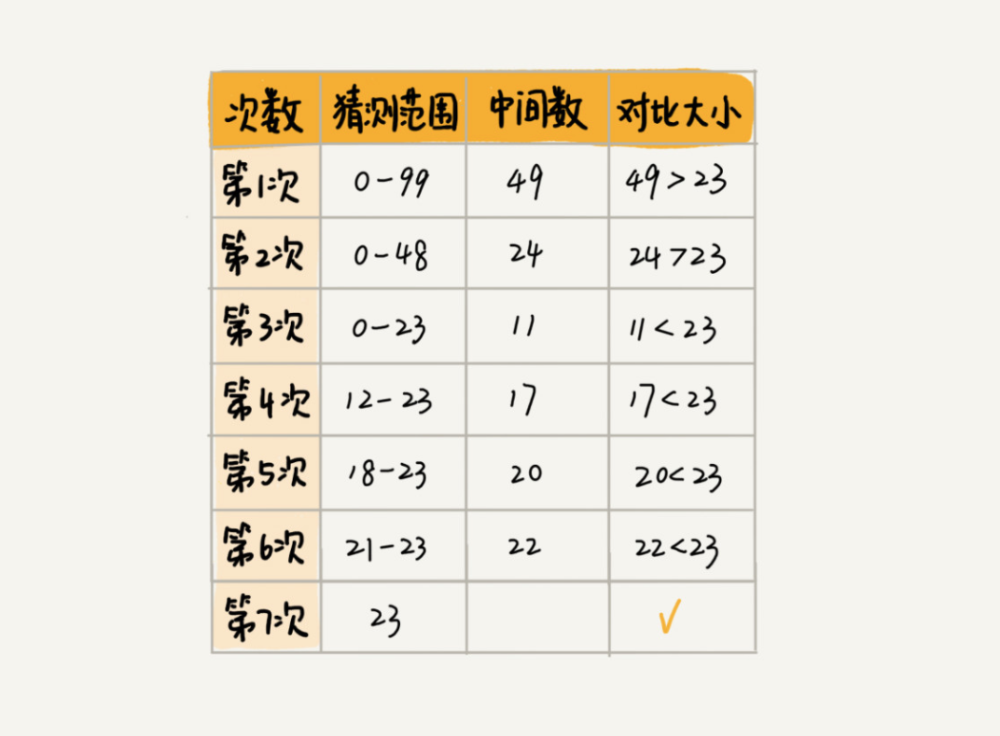
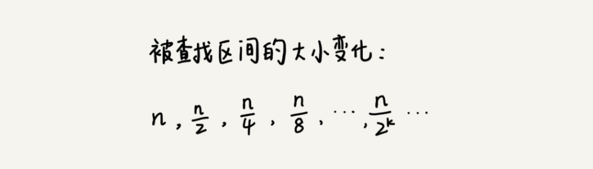
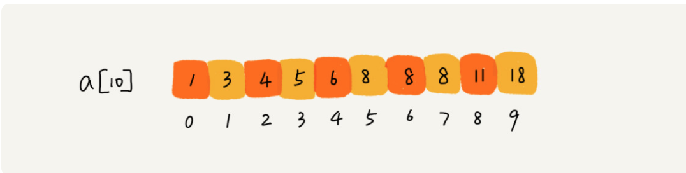

# 正文

## 二分查找（上）：如何用最省内存的方式实现快速查找功能

二分查找（Binary Search）算法，也叫折半查找算法。二分查找的思想非常简单

假设我写的数字是 23，你可以按照下面的步骤来试一试。（如果猜测范围的数字有偶数个，中间数有两个，就选择较小的那个。



二分查找针对的是一个有序的数据集合，查找思想有点类似分治思想。每次都通过跟区间的中间元素对比，将待查找的区间缩小为之前的一半，直到找到要查找的元素，或者区间被缩小为 0。

### O(logn) 惊人的查找速度

我们假设数据大小是 n，每次查找后数据都会缩小为原来的一半，也就是会除以 2。最坏情况下，直到查找区间被缩小为空，才停止。



可以看出来，这是一个等比数列。其中 n/2k=1 时，k 的值就是总共缩小的次数。而每一次缩小操作只涉及两个数据的大小比较，所以，经过了 k 次区间缩小操作，时间复杂度就是 O(k)。通过 n/2k=1，我们可以求得 k=log2n，所以时间复杂度就是 O(logn)。

二分查找是我们目前为止遇到的第一个时间复杂度为 O(logn) 的算法。后面章节我们还会讲堆、二叉树的操作等等，它们的时间复杂度也是 O(logn)。我这里就再深入地讲讲 O(logn) 这种对数时间复杂度。这是一种极其高效的时间复杂度，有的时候甚至比时间复杂度是常量级 O(1) 的算法还要高效。为什么这么说呢？

因为 logn 是一个非常“恐怖”的数量级，即便 n 非常非常大，对应的 logn 也很小。比如 n 等于 2 的 32 次方，这个数很大了吧？大约是 42 亿。也就是说，如果我们在 42 亿个数据中用二分查找一个数据，最多需要比较 32 次。

### 二分查找的递归与非递归实现

最简单的情况就是有序数组中不存在重复元素，我们在其中用二分查找值等于给定值的数据。我用 Java 代码实现了一个最简单的二分查找算法。

```(迭代)
public int bsearch(int[] a, int n, int value) {
  int low = 0;
  int high = n - 1;

  while (low <= high) {
    int mid = (low + high) / 2;
    if (a[mid] == value) {
      return mid;
    } else if (a[mid] < value) {
      low = mid + 1;
    } else {
      high = mid - 1;
    }
  }

  return -1;
}
```

容易出错的 3 个地方。

1. 循环退出条件注意是 low<=high，而不是 low

2. mid 的取值实际上，mid=(low+high)/2 这种写法是有问题的。因为如果 low 和 high 比较大的话，两者之和就有可能会溢出。改进的方法是将 mid 的计算方式写成 low+(high-low)/2。更进一步，如果要将性能优化到极致的话，我们可以将这里的除以 2 操作转化成位运算 low+((high-low)>>1)。因为相比除法运算来说，计算机处理位运算要快得多。

3. low=mid+1，high=mid-1。注意这里的 +1 和 -1，如果直接写成 low=mid 或者 high=mid，就可能会发生死循环。比如，当 high=3，low=3 时，如果 a[3]不等于 value，就会导致一直循环不退出。如果你留意我刚讲的这三点，我想一个简单的二分查找你已经可以实现了。实际上，二分查找除了用循环来实现，还可以用递归来实现，过程也非常简单。

```(递归)
// 二分查找的递归实现
public int bsearch(int[] a, int n, int val) {
  return bsearchInternally(a, 0, n - 1, val);
}

private int bsearchInternally(int[] a, int low, int high, int value) {
  if (low > high) return -1;

  int mid =  low + ((high - low) >> 1);
  if (a[mid] == value) {
    return mid;
  } else if (a[mid] < value) {
    return bsearchInternally(a, mid+1, high, value);
  } else {
    return bsearchInternally(a, low, mid-1, value);
  }
}
```

### 二分查找应用场景的局限性

首先，二分查找依赖的是顺序表结构，简单点说就是数组。

那二分查找能否依赖其他数据结构呢？比如链表。答案是不可以的，主要原因是二分查找算法需要按照下标随机访问元素。我们在数组和链表那两节讲过，数组按照下标随机访问数据的时间复杂度是 O(1)，而链表随机访问的时间复杂度是 O(n)。所以，如果数据使用链表存储，二分查找的时间复杂就会变得很高。二分查找只能用在数据是通过顺序表来存储的数据结构上。如果你的数据是通过其他数据结构存储的，则无法应用二分查找。

其次，二分查找针对的是有序数据。

二分查找对这一点的要求比较苛刻，数据必须是有序的。如果数据没有序，我们需要先排序。前面章节里我们讲到，排序的时间复杂度最低是 O(nlogn)。所以，如果我们针对的是一组静态的数据，没有频繁地插入、删除，我们可以进行一次排序，多次二分查找。这样排序的成本可被均摊，二分查找的边际成本就会比较低。

再次，数据量太小不适合二分查找。

如果要处理的数据量很小，完全没有必要用二分查找，顺序遍历就足够了。比如我们在一个大小为 10 的数组中查找一个元素，不管用二分查找还是顺序遍历，查找速度都差不多。只有数据量比较大的时候，二分查找的优势才会比较明显。

最后，数据量太大也不适合二分查找。

二分查找的底层需要依赖数组这种数据结构，而数组为了支持随机访问的特性，要求内存空间连续，对内存的要求比较苛刻。比如，我们有 1GB 大小的数据，如果希望用数组来存储，那就需要 1GB 的连续内存空间。

### 如何在 1000 万个整数中快速查找某个整数

这个问题并不难。我们的内存限制是 100MB，每个数据大小是 8 字节，最简单的办法就是将数据存储在数组中，内存占用差不多是 80MB，符合内存的限制。借助今天讲的内容，我们可以先对这 1000 万数据从小到大排序，然后再利用二分查找算法，就可以快速地查找想要的数据了。

二分查找底层依赖的是数组，除了数据本身之外，不需要额外存储其他信息，是最省内存空间的存储方式，所以刚好能在限定的内存大小下解决这个问题。

## 二分查找（下）：如何快速定位IP对应的省份地址


### 变体一：查找第一个值等于给定值的元素

如果我们将这个问题稍微修改下，有序数据集合中存在重复的数据，我们希望找到第一个值等于给定值的数据，这样之前的二分查找代码还能继续工作吗？

比如下面这样一个有序数组，其中，a[5]，a[6]，a[7]的值都等于 8，是重复的数据。我们希望查找第一个等于 8 的数据，也就是下标是 5 的元素。



```()
/** 简介写法 */
public int bsearch(int[] a, int n, int value) {
  int low = 0;
  int high = n - 1;
  while (low <= high) {
    int mid = low + ((high - low) >> 1);
    if (a[mid] >= value) {
      high = mid - 1;
    } else {
      low = mid + 1;
    }
  }

  if (low < n && a[low]==value) return low;
  else return -1;
}

/** 符合阅读的写法*/
public int bsearch(int[] a, int n, int value) {
  int low = 0;
  int high = n - 1;
  while (low <= high) {
    int mid =  low + ((high - low) >> 1);
    if (a[mid] > value) {
      high = mid - 1;
    } else if (a[mid] < value) {
      low = mid + 1;
    } else {
      if ((mid == 0) || (a[mid - 1] != value)) return mid; // 往下找集合
      else high = mid - 1;
    }
  }
  return -1;
}
```

### 变体二：查找最后一个值等于给定值的元素

```()
public int bsearch(int[] a, int n, int value) {
  int low = 0;
  int high = n - 1;
  while (low <= high) {
    int mid =  low + ((high - low) >> 1);
    if (a[mid] > value) {
      high = mid - 1;
    } else if (a[mid] < value) {
      low = mid + 1;
    } else {
      if ((mid == n - 1) || (a[mid + 1] != value)) return mid; // 往上找集合
      else low = mid + 1;
    }
  }
  return -1;
}
```

### 变体三：查找第一个大于等于给定值的元素

```()
public int bsearch(int[] a, int n, int value) {
  int low = 0;
  int high = n - 1;
  while (low <= high) {
    int mid =  low + ((high - low) >> 1);
    if (a[mid] >= value) {
      if ((mid == 0) || (a[mid - 1] < value)) return mid;
      else high = mid - 1;
    } else {
      low = mid + 1;
    }
  }
  return -1;
}
```

### 变体四：查找最后一个小于等于给定值的元素

```()
public int bsearch7(int[] a, int n, int value) {
  int low = 0;
  int high = n - 1;
  while (low <= high) {
    int mid =  low + ((high - low) >> 1);
    if (a[mid] > value) {
      high = mid - 1;
    } else {
      if ((mid == n - 1) || (a[mid + 1] > value)) return mid;
      else low = mid + 1;
    }
  }
  return -1;
}
```

### 解答

如果 IP 区间与归属地的对应关系不经常更新，我们可以先预处理这 12 万条数据，让其按照起始 IP 从小到大排序。如何来排序呢？我们知道，IP 地址可以转化为 32 位的整型数。所以，我们可以将起始地址，按照对应的整型值的大小关系，从小到大进行排序。

然后，这个问题就可以转化为我刚讲的第四种变形问题“在有序数组中，查找最后一个小于等于某个给定值的元素”了。

当我们要查询某个 IP 归属地时，我们可以先通过二分查找，找到最后一个起始 IP 小于等于这个 IP 的 IP 区间，然后，检查这个 IP 是否在这个 IP 区间内，如果在，我们就取出对应的归属地显示；如果不在，就返回未查找到。

