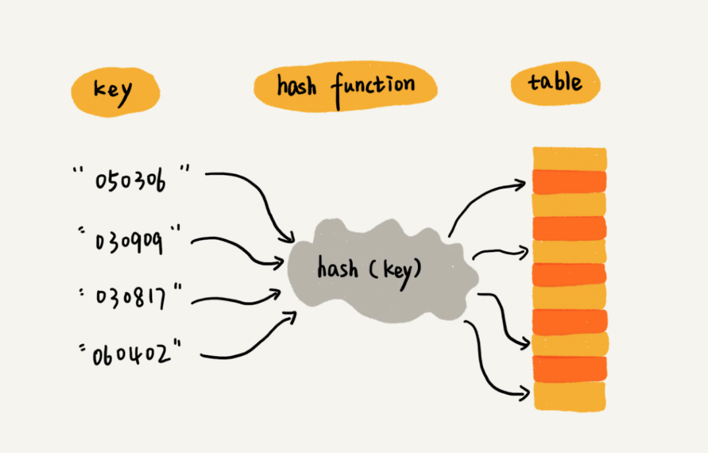
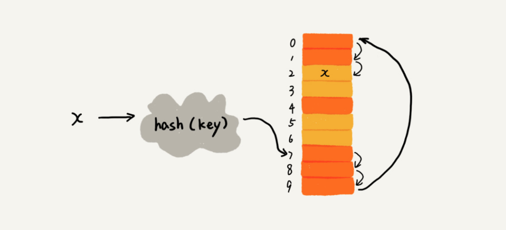
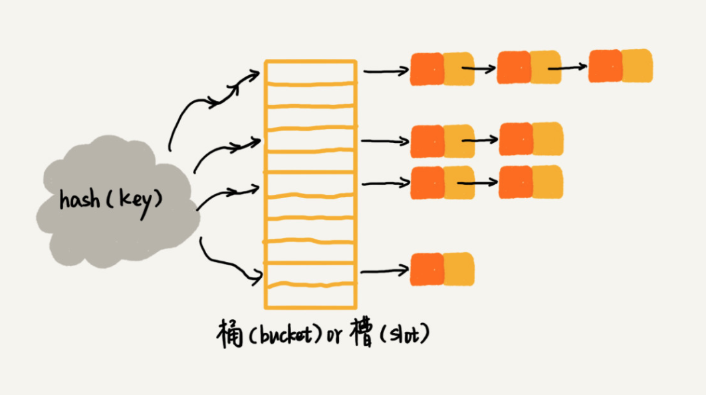
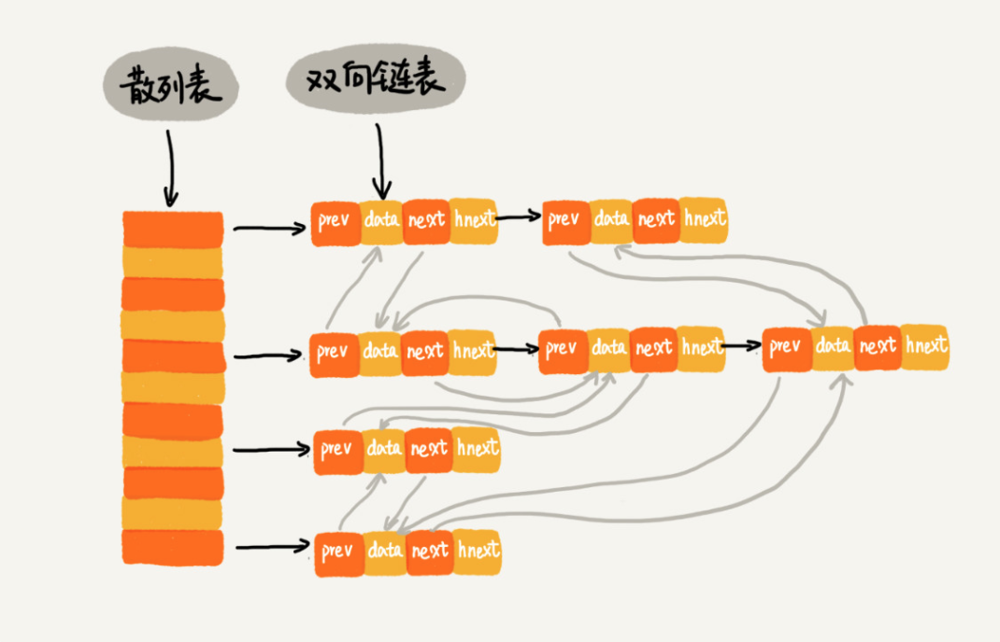

# 正文

## 散列表（上）：Word文档中的单词拼写检查功能是如何实现的

### 散列表（Hash Table）

散列表用的是数组支持按照下标随机访问数据的特性，所以散列表其实就是数组的一种扩展，由数组演化而来。可以说，如果没有数组，就没有散列表。

我用一个例子来解释一下。假如我们有 89 名选手参加学校运动会。为了方便记录成绩，每个选手胸前都会贴上自己的参赛号码。这 89 名选手的编号依次是 1 到 89。现在我们希望编程实现这样一个功能，通过编号快速找到对应的选手信息。你会怎么做呢？

我们可以把这 89 名选手的信息放在数组里。编号为 1 的选手，我们放到数组中下标为 1 的位置；编号为 2 的选手，我们放到数组中下标为 2 的位置。以此类推，编号为 k 的选手放到数组中下标为 k 的位置。

因为参赛编号跟数组下标一一对应，当我们需要查询参赛编号为 x 的选手的时候，我们只需要将下标为 x 的数组元素取出来就可以了，时间复杂度就是 O(1)。这样按照编号查找选手信息，效率是不是很高？

实际上，这个例子已经用到了散列的思想。在这个例子里，参赛编号是自然数，并且与数组的下标形成一一映射，所以利用数组支持根据下标随机访问的时候，时间复杂度是 O(1) 这一特性，就可以实现快速查找编号对应的选手信息。

这就是典型的散列思想。其中，参赛选手的编号我们叫作键（key）或者关键字。我们用它来标识一个选手。我们把参赛编号转化为数组下标的映射方法就叫作散列函数（或“Hash 函数”“哈希函数”），而散列函数计算得到的值就叫作散列值（或“Hash 值”“哈希值”）。



散列表用的就是数组支持按照下标随机访问的时候，时间复杂度是 O(1) 的特性。我们通过散列函数把元素的键值映射为下标，然后将数据存储在数组中对应下标的位置。当我们按照键值查询元素时，我们用同样的散列函数，将键值转化数组下标，从对应的数组下标的位置取数据。

散列函数，顾名思义，它是一个函数。我们可以把它定义成 hash(key)，其中 key 表示元素的键值，hash(key) 的值表示经过散列函数计算得到的散列值。

```()
int hash(String key) {
  // 获取后两位字符
  string lastTwoChars = key.substr(length-2, length);
  // 将后两位字符转换为整数
  int hashValue = convert lastTwoChas to int-type;
  return hashValue;
}
```

我总结了三点散列函数设计的基本要求：

1. 散列函数计算得到的散列值是一个非负整数；
2. 如果 key1 = key2，那 hash(key1) == hash(key2)；
3. 如果 key1 ≠ key2，那 hash(key1) ≠ hash(key2)。

### 散列冲突

1. 开放寻址法

    开放寻址法的核心思想是，如果出现了散列冲突，我们就重新探测一个空闲位置，将其插入。那如何重新探测新的位置呢？我先讲一个比较简单的探测方法，线性探测（Linear Probing）。

    

2. 链表法
    链表法是一种更加常用的散列冲突解决办法，相比开放寻址法，它要简单很多。我们来看这个图，在散列表中，每个“桶（bucket）”或者“槽（slot）”会对应一条链表，所有散列值相同的元素我们都放到相同槽位对应的链表中。

    

当插入的时候，我们只需要通过散列函数计算出对应的散列槽位，将其插入到对应链表中即可，所以插入的时间复杂度是 O(1)。当查找、删除一个元素时，我们同样通过散列函数计算出对应的槽，然后遍历链表查找或者删除。那查找或删除操作的时间复杂度是多少呢？

实际上，这两个操作的时间复杂度跟链表的长度 k 成正比，也就是 O(k)。对于散列比较均匀的散列函数来说，理论上讲，k=n/m，其中 n 表示散列中数据的个数，m 表示散列表中“槽”的个数。

### 解答

常用的英文单词有 20 万个左右，假设单词的平均长度是 10 个字母，平均一个单词占用 10 个字节的内存空间，那 20 万英文单词大约占 2MB 的存储空间，就算放大 10 倍也就是 20MB。对于现在的计算机来说，这个大小完全可以放在内存里面。所以我们可以用散列表来存储整个英文单词词典。

当用户输入某个英文单词时，我们拿用户输入的单词去散列表中查找。如果查到，则说明拼写正确；如果没有查到，则说明拼写可能有误，给予提示。借助散列表这种数据结构，我们就可以轻松实现快速判断是否存在拼写错误。

## 散列表（下）：为什么散列表和链表经常会一起使用

### LRU 缓存淘汰算法



我们使用双向链表存储数据，链表中的每个结点处理存储数据（data）、前驱指针（prev）、后继指针（next）之外，还新增了一个特殊的字段 hnext。这个 hnext 有什么作用呢？

因为我们的散列表是通过链表法解决散列冲突的，所以每个结点会在两条链中。一个链是刚刚我们提到的双向链表，另一个链是散列表中的拉链。前驱和后继指针是为了将结点串在双向链表中，hnext 指针是为了将结点串在散列表的拉链中。

