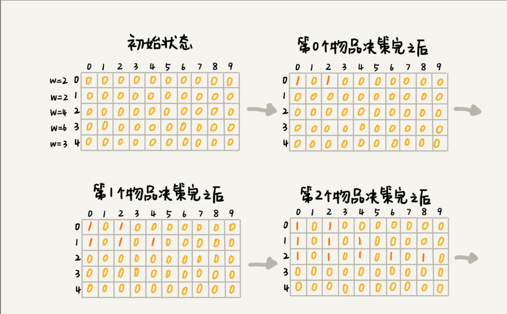
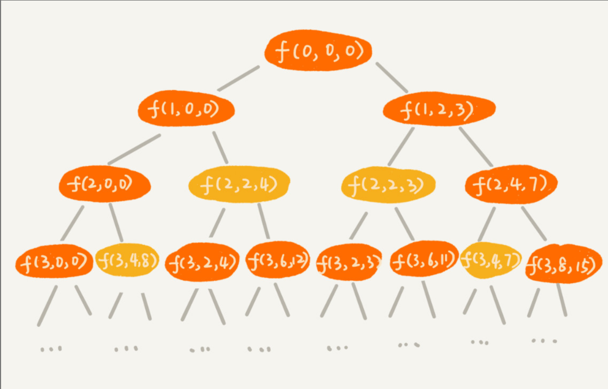

# 如何巧妙解决"双十一"购物时的凑单问题

> "双十一"有各种促销活动,比如"满200元减50元".假设你女朋友的购物车中有n个(n > 100)想买的商品,她希望从里面选几个,在凑够满减条件的前提下,让选出来的商品价格总和最大程度地接近满减条件(200元)(总价值是超过200元中的最小值),这样就可以极大限度地"薅羊毛".如何解决呢

## 动态规划学习路线

动态规划比较适合用来求解最优问题,比如求最大值、最小值等等.它可以非常显著地降低时间复杂度,提高代码的执行效率.不过它也是出了名的难学.它的主要学习难点跟递归类似,那就是,求解问题的过程不太符合人类常规的思维方式.

## 0-1 背包问题

> 对于一组不同重量、不可分割的物品,我们需要选择一些装入背包,在满足背包最大重量限制的前提下,背包中物品总重量的最大值是多少呢?

回溯蒜放可以穷举搜索所有可能的装法,然后找出满足条件的最大值.不过,回溯算法的复杂度比较高,是指数级别的.那有没有什么规律,可以有效降低时间复杂度呢?

### 举例子1

我们假设背包的最大承载重量是9.我们有5个不同的物品,每个物品的重量分别是2,2,4,6,3.如果我们把这个例子的回溯求解过程,用递归树画出来,就是下面这个样子:


递归树中的每个节点表示一种状态,我们用`(i,cw)`来表示.其中,**i**表示将要决策第几个武平是否装入背包,cw表示当前背包中物品的总重量.比如:`(2,2)`表示我们将要决策第2个物品是否装入背包,在决策前,背包中物品的总重量是2.

从递归树中,你应该能会发现,有些子问题的求解是重复的,比如图中`f(2,2)`和`f(3,4)`都被重复计算了两次.我们可以记录已经计算好的`f(i,cw)`,当再次计算到重复的`f(i,cw)`的时候,可以直接从备忘录中取出来用,就不用再递归计算了,这样就可以避免冗余计算.

```(实现伪代码)
private int maxW = Integer.MIN_VALUE; // 结果放到maxW中
private int[] weight = {2，2，4，6，3};  // 物品重量
private int n = 5; // 物品个数
private int w = 9; // 背包承受的最大重量
private boolean[][] mem = new boolean[5][10]; // 备忘录，默认值false
public void f(int i, int cw) { // 调用f(0, 0)
  if (cw == w || i == n) { // cw==w表示装满了，i==n表示物品都考察完了
    if (cw > maxW) maxW = cw;
    return;
  }
  if (mem[i][cw]) return; // 重复状态
  mem[i][cw] = true; // 记录(i, cw)这个状态
  f(i+1, cw); // 选择不装第i个物品
  if (cw + weight[i] <= w) {
    f(i+1,cw + weight[i]); // 选择装第i个物品
  }
}
```

### 再来看看动态规划是怎么做的

我们把每一层重复的状态(节点)合并,只记录不同的状态,然后基于上一层的状态集合,来推导下一层的状态集合.我们可以通过合并每一层重复的状态,这样就保证每一层不同状态的个数都不会超过**w**个(w表示背包的承载重量),也就是例子中的9,于是,我们就成功避免了每层状态个数的指数级增长

我们用一个二维数组 `states[n][w+1]`,来记录每层可以达到的不同状态.

第0个物品的重量是2,要么装入背包,要不不装入背包,决策完成后,会对应背包的两种状态,背包中物品的总重量是0或者2.我们用`states[0][0]=true`和`states[0][2]=true`来表示这两种状态.

第1个物品的重量也是2,基于之前的背包状态,在这个物品决策完之后,不同的状态有3个,背包中物品总重量分别是`0(0+0)`,`2(0+2 or 2+0)`,`4(2+2)`.我们用`states[1][0]=true`,`states[1][2]=true`,`states[1][4]=true`来表示这三种状态.

以此类推,直到考察完所有的物品后,整个**states**状态数组就都计算好了.我把整个计算的过程画了出来,你可以看看.图中0表示false,1表示true.我们只需要在最后一层,找一个值为**true**的最接近**w**的值,就是背包中物品总重量的最大值.



我们把问题分解为多个阶段,每个阶段对应一个决策.我们记录每一个阶段可达的状态集合(去掉重复的),然后通过当前阶段的状态集合,来推导下一个阶段的状态集合,动态地往前推进.这也是动态规划这个名字的由来.

有时候,我们会说,动态规划是一种空间换时间的解决思路.有什么办法可以降低空间消耗么?

实际上,我们只需要一个大小为 **w+1** 的一维数组就可以解决这个问题.动态规划状态转移的过程,都可以基于这个一维数组来操作.可以看下代码

```(一维数组减少空间消耗)
public static int knapsack2(int[] items, int n, int w) {
  boolean[] states = new boolean[w+1]; // 默认值false
  states[0] = true;  // 第一行的数据要特殊处理，可以利用哨兵优化
  if (items[0] <= w) {
    states[items[0]] = true;
  }
  for (int i = 1; i < n; ++i) { // 动态规划
    for (int j = w-items[i]; j >= 0; --j) {//把第i个物品放入背包
      if (states[j]==true) states[j+items[i]] = true;
    }
  }
  for (int i = w; i >= 0; --i) { // 输出结果
    if (states[i] == true) return i;
  }
  return 0;
}
```

这里我特别强调一下代码中的第8行,**j**需要从大到小来处理,如果我们按照**j**从小到大处理的话,会出现**for**循环重复计算的问题.

### 背包问题升级版

刚刚讲的背包问题,只涉及背包重量和物品重量.我们现在引入物品价值这一变量.对于一组不同重量、不同价值、不可分割的物品,我们选择将某些物品装入背包,在满足背包最大重量限制的前提下,背包中可装入物品的总价值最大是多少呢?

这个问题依旧可以同回溯算法来解决.

```()
private int maxV = Integer.MIN_VALUE; // 结果放到maxV中
private int[] items = {2,2,4,6,3}; // 物品的重量
private int[] value = {3,4,8,9,6}; // 物品的价值
private int n = 5; // 物品个数
private int w = 9; // 背包承受的最大重量
public void f(int i, int cw, int cv){
  if(cw == w || i == n){ // cw==w表示装满了,i==n表示物品都考察完了
    if(cv > maxV) maxV = cv;
    return;
  }
  f(i+1,cw,cv); // 选择不装第i个物品
  if(cw + weight[i] <= w){
    f(i+1,cw+weight[i], cv+value[i]); // 选择装第i个物品
  }
}
```

我们照例还需画出递归树,在递归树中,每个节点表示一个状态.现在我们需要3个变量(i,cw,cv)来表示一个状态.其中,i表示即将要决策第i个物品是否装入背包,cw表示当前背包中物品的总重量,cv表示当前背包中物品的总价值.



在递归树中,有几个节点的i和cw是完全相同的,比如`f(2,2,4)`和`f(2,2,3)`.在背包中物品总重量一样的情况下,`f(2,2,4)`这种状态对应的物品总价值更大,我们可以舍弃`f(2,2,3)`这种状态,只需沿着`f(2,2,4)`这条决策路线继续往下决策就可以.

也就是说,对于`(i,cw)`相同的不同状态,那我们只需要保留cv值最大的那个,继续递归处理,其他状态不予考虑.

我们还是把整个求解过程分为n个阶段,每个阶段会决策一个物品是否放到背包中.每个阶段决策完之后,背包中的物品的总重量以及总价值,会有多种情况,也就是会达到多种不同的状态.

我们用一个二维数组 `states[n][w+1]`,来记录每层可以达到的不同状态.不过这里数组存储的值不再是 boolean 类型的了,而是当前状态对应的最大总价值.我们把每一层中`(i,cw)`重复的状态(节点)合并,只记录cv值最大的那个状态,然后基于这些状态来推导下一层的状态.

翻译成代码就是:

```()

public static int knapsack3(int[] weight, int[] value, int n, int w) {
  int[][] states = new int[n][w+1];
  for (int i = 0; i < n; ++i) { // 初始化states
    for (int j = 0; j < w+1; ++j) {
      states[i][j] = -1;
    }
  }
  states[0][0] = 0;
  if (weight[0] <= w) {
    states[0][weight[0]] = value[0];
  }
  for (int i = 1; i < n; ++i) { //动态规划，状态转移
    for (int j = 0; j <= w; ++j) { // 不选择第i个物品
      if (states[i-1][j] >= 0) states[i][j] = states[i-1][j];
    }
    for (int j = 0; j <= w-weight[i]; ++j) { // 选择第i个物品
      if (states[i-1][j] >= 0) {
        int v = states[i-1][j] + value[i];
        if (v > states[i][j+weight[i]]) {
          states[i][j+weight[i]] = v;
        }
      }
    }
  }
  // 找出最大值
  int maxvalue = -1;
  for (int j = 0; j <= w; ++j) {
    if (states[n-1][j] > maxvalue) maxvalue = states[n-1][j];
  }
  return maxvalue;
}
```

时间复杂度是`O(n*w)`,空间复杂度也是`O(n*w)`.

状态`(i,j)`只有可能是从`(i-1,j-value[i])`两个状态推导过来.所以,我们就检查这两个状态是否是可达的,也就是`states[i-1]`或者`states[i-1][j-value[i]]`是否是true.

如果`states[i-1][j]`可达,就说明我们没有选择购买第i个商品,如果`states[i-1][j-value[i]]`可达,那就说明我们选择了购买第i个商品.我们从中选择一个可达的状态(如果两个都可达,就随意选择一个),然后,继续迭代地考察其他商品是否有选择购买.

## 总结

大部分动态规划能解决的问题,都可以通过回溯算法来解决,只不过回溯算法解决起来效率比较低,时间复杂度是指数级的.动态规划算法,在执行效率方面,要高很多.尽管执行效率提高了,但是动态规划的空间复杂度也提高了,所以,很多时候,我们会说,动态规划是一种空间换时间的算法思想.