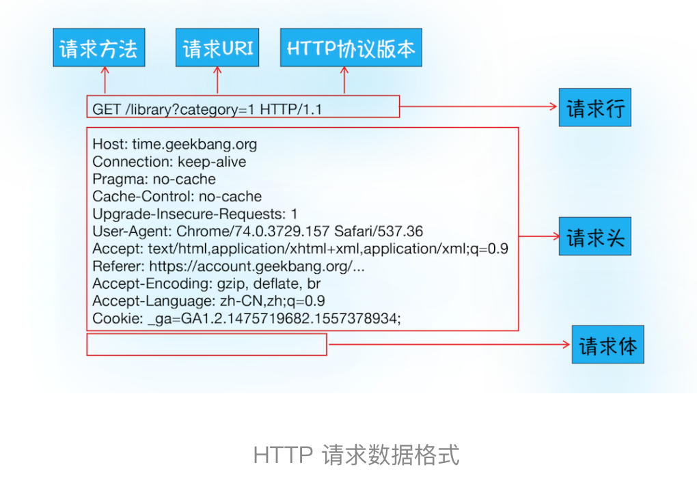
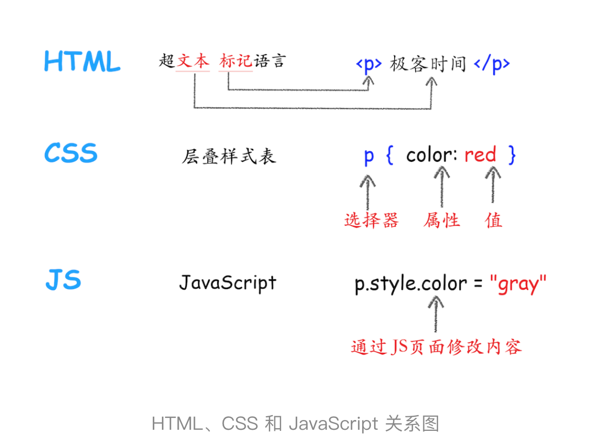
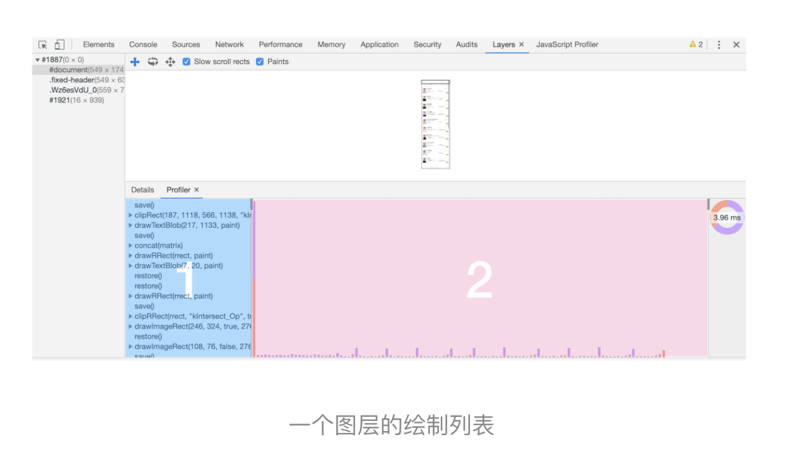

# 正文

## Chrome 浏览器为什么对应四个进程


### 进程和线程

#### 什么是并行处理

计算机中的并行处理就是同一时刻处理多个任务,使用并行处理能大大提升性能。

#### 线程 VS 进程

线程是不能单独存在的，它是由进程来启动和管理的，一个进程就是一个程序的运行实例。详细解释就是，启动一个程序的时候，操作系统会为该程序创建一块内存，用来存放代码、运行中的数据和一个执行任务的主线程，我们把这样的一个运行环境叫进程。


线程是依附于进程的，而进程中使用多线程并行处理能提升运算效率。

总结来说，进程和线程之间的关系有以下 4 个特点。

- 进程中的任意一线程执行出错，都会导致整个进程的崩溃。
- 线程之间共享进程中的数据
- 当一个进程关闭之后，操作系统会回收进程所占用的内存
- 进程之间的内容相互隔离

#### 目前多进程架构

- 浏览器进程。主要负责界面显示、用户交互、子进程管理，同时提供存储等功能。
- 渲染进程。核心任务是将 HTML、CSS 和 JavaScript 转换为用户可以与之交互的网页，排版引擎 Blink 和 JavaScript 引擎 V8 都是运行在该进程中，默认情况下，Chrome 会为每个 Tab 标签创建一个渲染进程。出于安全考虑，渲染进程都是运行在沙箱模式下。
- GPU 进程。其实，Chrome 刚开始发布的时候是没有 GPU 进程的。而 GPU 的使用初衷是为了实现 3D CSS 的效果，只是随后网页、Chrome 的 UI 界面都选择采用 GPU 来绘制，这使得 GPU 成为浏览器普遍的需求。最后，Chrome 在其多进程架构上也引入了 GPU 进程。
- 网络进程。主要负责页面的网络资源加载，之前是作为一个模块运行在浏览器进程里面的，直至最近才独立出来，成为一个单独的进程。
- 插件进程。主要是负责插件的运行，因插件易崩溃，所以需要通过插件进程来隔离，以保证插件进程崩溃不会对浏览器和页面造成影响。

这里就可以得出结果：
仅仅打开了 1 个页面，为什么有 4 个进程？因为打开 1 个页面至少需要 1 个网络进程、1 个浏览器进程、1 个 GPU 进程以及 1 个渲染进程，共 4 个；如果打开的页面有运行插件的话，还需要再加上 1 个插件进程。

## TCP协议：如何保证页面文件能被完整送达浏览器

在衡量 Web 页面性能的时候有一个重要的指标叫“FP（First Paint）”，是指从页面加载到首次开始绘制的时长。这个指标直接影响了用户的跳出率，更快的页面响应意味着更多的 PV、更高的参与度，以及更高的转化率。那什么影响 FP 指标呢？其中一个重要的因素是网络加载速度。

在网络中，一个文件通常会被拆分为很多数据包来进行传输，而数据包在传输过程中又有很大概率丢失或者出错。那么如何保证页面文件能被完整地送达浏览器呢？

互联网，实际上是一套理念和协议组成的体系架构。

其中，协议是一套众所周知的规则和标准，如果各方都同意使用，那么它们之间的通信将变得毫无障碍。互联网中的数据是通过数据包来传输的。如果发送的数据很大，那么该数据就会被拆分为很多小数据包来传输。比如你现在听的音频数据，是拆分成一个个小的数据包来传输的，并不是一个大的文件一次传输过来的。

1. IP：把数据包送达目的主机数据包要在互联网上进行传输，就要符合网际协议（Internet Protocol，简称 IP）标准。互联网上不同的在线设备都有唯一的地址，地址只是一个数字，这和大部分家庭收件地址类似，你只需要知道一个家庭的具体地址，就可以往这个地址发送包裹，这样物流系统就能把物品送到目的地。计算机的地址就称为 IP 地址，访问任何网站实际上只是你的计算机向另外一台计算机请求信息。

2. UDP：把数据包送达应用程序，需要基于 IP 之上开发能和应用打交道的协议，最常见的是“用户数据包协议（User Datagram Protocol）”，简称 UDP。UDP 中一个最重要的信息是端口号，端口号其实就是一个数字，每个想访问网络的程序都需要绑定一个端口号。通过端口号 UDP 就能把指定的数据包发送给指定的程序了，所以 IP 通过 IP 地址信息把数据包发送给指定的电脑，而 UDP 通过端口号把数据包分发给正确的程序。和 IP 头一样，端口号会被装进 UDP 头里面，UDP 头再和原始数据包合并组成新的 UDP 数据包。UDP 头中除了目的端口，还有源端口号等信息。在使用 UDP 发送数据时，有各种因素会导致数据包出错，虽然 UDP 可以校验数据是否正确，但是对于错误的数据包，UDP 并不提供重发机制，只是丢弃当前的包，而且 UDP 在发送之后也无法知道是否能达到目的地，虽说 UDP 不能保证数据可靠性，但是传输速度却非常快。

3. TCP：把数据完整地送达应用程序，TCP（Transmission Control Protocol，传输控制协议）是一种面向连接的、可靠的、基于字节流的传输层通信协议。相对于 UDP，TCP 有下面两个特点:

    - 对于数据包丢失的情况，TCP 提供重传机制；
    - TCP 引入了数据包排序机制，用来保证把乱序的数据包组合成一个完整的文件。

    

    一个完整的 TCP 连接的生命周期包括了“建立连接”“传输数据”和“断开连接”三个阶段。

    
    - 首先，建立连接阶段。这个阶段是通过“三次握手”来建立客户端和服务器之间的连接。TCP 提供面向连接的通信传输。面向连接是指在数据通信开始之前先做好两端之间的准备工作。所谓三次握手，是指在建立一个 TCP 连接时，客户端和服务器总共要发送三个数据包以确认连接的建立。
    - 其次，传输数据阶段。在该阶段，接收端需要对每个数据包进行确认操作，也就是接收端在接收到数据包之后，需要发送确认数据包给发送端。所以当发送端发送了一个数据包之后，在规定时间内没有接收到接收端反馈的确认消息，则判断为数据包丢失，并触发发送端的重发机制。同样，一个大的文件在传输过程中会被拆分成很多小的数据包，这些数据包到达接收端后，接收端会按照 TCP 头中的序号为其排序，从而保证组成完整的数据。
    - 最后，断开连接阶段。数据传输完毕之后，就要终止连接了，涉及到最后一个阶段“四次挥手”来保证双方都能断开连接。

## HTTP请求流程：为什么很多站点第二次打开速度会很快

HTTP 协议，正是建立在 TCP 连接基础之上的。HTTP 是一种允许浏览器向服务器获取资源的协议，是 Web 的基础，通常由浏览器发起请求，用来获取不同类型的文件，例如 HTML 文件、CSS 文件、JavaScript 文件、图片、视频等。此外，HTTP 也是浏览器使用最广的协议。

### 浏览器端发起 HTTP 请求流程

如果在浏览器的地址栏中输入一个地址，那么浏览器会：

1. 构建请求：
    首先，浏览器构建请求行信息（如下所示），构建好后，浏览器准备发起网络请求。

    ```()
    GET /index.html HTTP1.1
    ```

2. 查找缓存:
    在真正发起网络请求之前，浏览器会先在浏览器缓存中查询是否有要请求的文件。其中，浏览器缓存是一种在本地保存资源副本，以供下次请求时直接使用的技术。当浏览器发现请求的资源已经在浏览器缓存中存有副本，它会拦截请求，返回该资源的副本，并直接结束请求，而不会再去源服务器重新下载。当然，如果缓存查找失败，就会进入网络请求过程了。

3. 准备 IP 地址和端口:
    在 HTTP 工作开始之前，浏览器需要通过 TCP 与服务器建立连接。也就是说 HTTP 的内容是通过 TCP 的传输数据阶段来实现的，

    

    数据包都是通过 IP 地址传输给接收方的。由于 IP 地址是数字标识，比如极客时间网站的 IP 是 39.106.233.176, 难以记忆，但使用极客时间的域名（time.geekbang.org）就好记多了，所以基于这个需求又出现了一个服务，负责把域名和 IP 地址做一一映射关系。这套域名映射为 IP 的系统就叫做“域名系统”，简称 DNS（Domain Name System）。所以，这样一路推导下来，你会发现在第一步浏览器会请求 DNS 返回域名对应的 IP。当然浏览器还提供了 DNS 数据缓存服务，如果某个域名已经解析过了，那么浏览器会缓存解析的结果，以供下次查询时直接使用，这样也会减少一次网络请求。

4. 等待 TCP 队列:
    Chrome 有个机制，同一个域名同时最多只能建立 6 个 TCP 连接，如果在同一个域名下同时有 10 个请求发生，那么其中 4 个请求会进入排队等待状态，直至进行中的请求完成。当然，如果当前请求数量少于 6，会直接进入下一步，建立 TCP 连接。
    这里不一定存在，但是也比较重要。

5. 建立 TCP 连接:

6. 发送 HTTP 请求:
    

### 服务器端处理 HTTP 请求流程

1. 返回请求
    一旦服务器处理结束，便可以返回数据给浏览器了。你可以通过工具软件 curl 来查看返回请求数据，具体使用方法是在命令行中输入以下命令：`curl -i https://time.geekbang.org/`。注意这里加上了-i是为了返回响应行、响应头和响应体的数据。
    

2. 断开连接:
    一旦服务器向客户端返回了请求数据，它就要关闭 TCP 连接。不过如果浏览器或者服务器在其头信息中加入了：`Connection:Keep-Alive` 那么 TCP 连接在发送后将仍然保持打开状态，这样浏览器就可以继续通过同一个 TCP 连接发送请求。保持 TCP 连接可以省去下次请求时需要建立连接的时间，提升资源加载速度。比如，一个 Web 页面中内嵌的图片就都来自同一个 Web 站点，如果初始化了一个持久连接，你就可以复用该连接，以请求其他资源，而不需要重新再建立新的 TCP 连接。

3. 重定向:
    

### 结论

1. 为什么很多站点第二次打开速度会很快？
    如果第二次页面打开很快，主要原因是第一次加载页面过程中，缓存了一些耗时的数据。那么，哪些数据会被缓存呢？从上面介绍的核心请求路径可以发现，DNS 缓存和页面资源缓存这两块数据是会被浏览器缓存的。
    

    从上图的第一次请求可以看出，当服务器返回 HTTP 响应头给浏览器时，浏览器是通过响应头中的 Cache-Control 字段来设置是否缓存该资源。通常，我们还需要为这个资源设置一个缓存过期时长，而这个时长是通过 Cache-Control 中的 Max-age 参数来设置的，比如上图设置的缓存过期时间是 2000 秒。`Cache-Control:Max-age=2000`。
    这也就意味着，在该缓存资源还未过期的情况下, 如果再次请求该资源，会直接返回缓存中的资源给浏览器。但如果缓存过期了，浏览器则会继续发起网络请求，并且在 HTTP 请求头中带上：`If-None-Match:"4f80f-13c-3a1xb12a"`
    服务器收到请求头后，会根据 If-None-Match 的值来判断请求的资源是否有更新。

总体过程为:
    

## 导航流程：从输入URL到页面展示，这中间发生了什么


这个过程可以大致描述为如下:

- 首先，浏览器进程接收到用户输入的 URL 请求，浏览器进程便将该 URL 转发给网络进程。
- 然后，在网络进程中发起真正的 URL 请求。
- 接着网络进程接收到了响应头数据，便解析响应头数据，并将数据转发给浏览器进程。
- 浏览器进程接收到网络进程的响应头数据之后，发送“提交导航 (CommitNavigation)”消息到渲染进程；
- 渲染进程接收到“提交导航”的消息之后，便开始准备接收 HTML 数据，接收数据的方式是直接和网络进程建立数据管道；
- 最后渲染进程会向浏览器进程“确认提交”，这是告诉浏览器进程：“已经准备好接受和解析页面数据了”。
- 浏览器进程接收到渲染进程“提交文档”的消息之后，便开始移除之前旧的文档，然后更新浏览器进程中的页面状态。

这其中，用户发出 URL 请求到页面开始解析的这个过程，就叫做导航。

### 用户输入

当用户在地址栏中输入一个查询关键字时，地址栏会判断输入的关键字是搜索内容，还是请求的 URL。

- 如果是搜索内容，地址栏会使用浏览器默认的搜索引擎，来合成新的带搜索关键字的 URL。
- 如果判断输入内容符合 URL 规则，比如输入的是 time.geekbang.org，那么地址栏会根据规则，把这段内容加上协议，合成为完整的 URL，如 `https://time.geekbang.org`。

当用户输入关键字并键入回车之后，这意味着当前页面即将要被替换成新的页面，不过在这个流程继续之前，浏览器还给了当前页面一次执行 beforeunload 事件的机会，beforeunload 事件允许页面在退出之前执行一些数据清理操作，还可以询问用户是否要离开当前页面，比如当前页面可能有未提交完成的表单等情况，因此用户可以通过 beforeunload 事件来取消导航，让浏览器不再执行任何后续工作。

### URL请求过程

首先，网络进程会查找本地缓存是否缓存了该资源。如果有缓存资源，那么直接返回资源给浏览器进程；如果在缓存中没有查找到资源，那么直接进入网络请求流程。这请求前的第一步是要进行 DNS 解析，以获取请求域名的服务器 IP 地址。如果请求协议是 HTTPS，那么还需要建立 TLS 连接。接下来就是利用 IP 地址和服务器建立 TCP 连接。连接建立之后，浏览器端会构建请求行、请求头等信息，并把和该域名相关的 Cookie 等数据附加到请求头中，然后向服务器发送构建的请求信息。服务器接收到请求信息后，会根据请求信息生成响应数据（包括响应行、响应头和响应体等信息），并发给网络进程。等网络进程接收了响应行和响应头之后，就开始解析响应头的内容了。（为了方便讲述，下面我将服务器返回的响应头和响应行统称为响应头。）

重定向相关已经在上面章节进行了说明。

#### 响应数据类型处理

URL 请求的数据类型，有时候是一个下载类型，有时候是正常的 HTML 页面，那么浏览器是如何区分它们呢？答案是 Content-Type。Content-Type 是 HTTP 头中一个非常重要的字段， 它告诉浏览器服务器返回的响应体数据是什么类型，然后浏览器会根据 Content-Type 的值来决定如何显示响应体的内容。这里我们还是以极客时间为例，看看极客时间官网返回的 Content-Type 值是什么。在终端输入以下命令：`curl -I https://time.geekbang.org/`。


### 准备渲染进程

默认情况下，Chrome 会为每个页面分配一个渲染进程，也就是说，每打开一个新页面就会配套创建一个新的渲染进程。但是，也有一些例外，在某些情况下，浏览器会让多个页面直接运行在同一个渲染进程中。

那什么情况下多个页面会同时运行在一个渲染进程中呢？要解决这个问题，我们就需要先了解下什么是同一站点（same-site）。具体地讲，我们将“同一站点”定义为根域名（例如，geekbang.org）加上协议（例如，<https://>或者 <http://>），还包含了该根域名下的所有子域名和不同的端口，比如下面这三个：

```()
https://time.geekbang.org
https://www.geekbang.org
https://www.geekbang.org:8080
```

它们都是属于同一站点，因为它们的协议都是 HTTPS，而且根域名也都是 geekbang.org。Chrome 的默认策略是，每个标签对应一个渲染进程。但如果从一个页面打开了另一个新页面，而新页面和当前页面属于同一站点的话，那么新页面会复用父页面的渲染进程。官方把这个默认策略叫 process-per-site-instance。

### 提交文档

所谓提交文档，就是指浏览器进程将网络进程接收到的 HTML 数据提交给渲染进程，具体流程是这样的：

- 首先当浏览器进程接收到网络进程的响应头数据之后，便向渲染进程发起“提交文档”的消息；
- 渲染进程接收到“提交文档”的消息后，会和网络进程建立传输数据的“管道”；
- 等文档数据传输完成之后，渲染进程会返回“确认提交”的消息给浏览器进程；
- 浏览器进程在收到“确认提交”的消息后，会更新浏览器界面状态，包括了安全状态、地址栏的 URL、前进后退的历史状态，并更新 Web 页面。


### 渲染阶段

一旦页面生成完成，渲染进程会发送一个消息给浏览器进程，浏览器接收到消息后，会停止标签图标上的加载动画。

## 渲染流程：HTML、CSS和JavaScript，是如何变成页面的


这中间的渲染模块就是我们今天要讨论的主题。为了能更好地理解下文，你可以先结合下图快速抓住 HTML、CSS 和 JavaScript 的含义：



HTML 的内容是由标记和文本组成。标记也称为标签，每个标签都有它自己的语义，浏览器会根据标签的语义来正确展示 HTML 内容。CSS 又称为层叠样式表，是由选择器和属性组成，至于 JavaScript（简称为 JS），使用它可以使网页的内容“动”起来。

由于渲染机制过于复杂，所以渲染模块在执行过程中会被划分为很多子阶段，输入的 HTML 经过这些子阶段，最后输出像素。我们把这样的一个处理流程叫做渲染流水线。

接下来，在介绍每个阶段的过程中，你应该重点关注以下三点内容：

- 开始每个子阶段都有其输入的内容；
- 然后每个子阶段有其处理过程；
- 最终每个子阶段会生成输出内容。

### 构建DOM树

为什么要构建 DOM 树呢？这是因为浏览器无法直接理解和使用 HTML，所以需要将 HTML 转换为浏览器能够理解的结构——DOM 树。

### 样式计算（Recalculate Style）

样式计算的目的是为了计算出 DOM 节点中每个元素的具体样式，这个阶段大体可分为三步来完成。

1. 把 CSS 转换为浏览器能够理解的结构，当渲染引擎接收到 CSS 文本时，会执行一个转换操作，将 CSS 文本转换为浏览器可以理解的结构——styleSheets。

2. 转换样式表中的属性值，使其标准化，需要将所有值转换为渲染引擎容易理解的、标准化的计算值，这个过程就是属性值标准化。

3. 计算出 DOM 树中每个节点的具体样式
    首先是 CSS 继承。CSS 继承就是每个 DOM 节点都包含有父节点的样式。
    样式计算过程中的第二个规则是样式层叠。层叠是 CSS 的一个基本特征，它是一个定义了如何合并来自多个源的属性值的算法。

### 布局阶段

需要计算出 DOM 树中可见元素的几何位置，我们把这个计算过程叫做布局。Chrome 在布局阶段需要完成两个任务：创建布局树和布局计算。

1. 创建布局树
    为了构建布局树，浏览器大体上完成了下面这些工作：
    - 遍历 DOM 树中的所有可见节点，并把这些节点加到布局树中；
    - 而不可见的节点会被布局树忽略掉，如 head 标签下面的全部内容，再比如 body.p.span 这个元素，因为它的属性包含 dispaly:none，所以这个元素也没有被包进布局树。

2. 布局计算

### 分层

页面中有很多复杂的效果，如一些复杂的 3D 变换、页面滚动，或者使用 z-indexing 做 z 轴排序等，为了更加方便地实现这些效果，渲染引擎还需要为特定的节点生成专用的图层，并生成一棵对应的图层树（LayerTree）

并不是布局树的每个节点都包含一个图层，如果一个节点没有对应的层，那么这个节点就从属于父节点的图层
第一点，拥有层叠上下文属性的元素会被提升为单独的一层。


第二点，需要剪裁（clip）的地方也会被创建为图层。（有重绘以及产生滚动条等情况）

### 图层绘制

在chrome中可通过控制台 **layers** 选项卡，进行具体查看



### 栅格化（raster）操作

绘制列表只是用来记录绘制顺序和绘制指令的列表，而实际上绘制操作是由渲染引擎中的合成线程来完成的


我们把用户可以看到的这个部分叫做视口（viewport）。因为视口不一定都能显示，所以合成线程会将图层划分为图块（tile）。然后合成线程会按照视口附近的图块来优先生成位图，实际生成位图的操作是由栅格化来执行的。所谓栅格化，是指将图块转换为位图，而图块是栅格化执行的最小单位。渲染进程维护了一个栅格化的线程池，所有的图块栅格化都是在线程池内执行的。


如果栅格化操作使用了 GPU，那么最终生成位图的操作是在 GPU 中完成的，这就涉及到了跨进程操作。

### 结果

一个完整的渲染流程大致可总结为如下：

1. 渲染进程将 HTML 内容转换为能够读懂的 DOM 树结构。
2. 渲染引擎将 CSS 样式表转化为浏览器可以理解的 styleSheets，计算出 DOM 节点的样式。
3. 创建布局树，并计算元素的布局信息。
4. 对布局树进行分层，并生成分层树。
5. 为每个图层生成绘制列表，并将其提交到合成线程。
6. 合成线程将图层分成图块，并在光栅化线程池中将图块转换成位图。
7. 合成线程发送绘制图块命令 DrawQuad 给浏览器进程。
8. 浏览器进程根据 DrawQuad 消息生成页面，并显示到显示器上。

#### 相关概念

1. 更新了元素的几何属性（重排）：如果你通过 JavaScript 或者 CSS 修改元素的几何位置属性，例如改变元素的宽度、高度等，那么浏览器会触发重新布局，解析之后的一系列子阶段，这个过程就叫重排。无疑，重排需要更新完整的渲染流水线，所以开销也是最大的。

2. 更新元素的绘制属性（重绘）：没有改变元素几何属性，跳过布局阶段，直接进入了绘制阶段，相较于重排操作，重绘省去了布局和分层阶段，所以执行效率会比重排操作要高一些。

3. 直接合成阶段：使用了 CSS 的 transform 来实现动画效果，这可以避开重排和重绘阶段，直接在非主线程上执行合成动画操作，因为是在非主线程上合成，并没有占用主线程的资源，另外也避开了布局和绘制两个子阶段，所以相对于重绘和重排，合成能大大提升绘制效率。

### 重新说明

1，用户输入url并回车
2，浏览器进程检查url，组装协议，构成完整的url
3，浏览器进程通过进程间通信（IPC）把url请求发送给网络进程
4，网络进程接收到url请求后检查本地缓存是否缓存了该请求资源，如果有则将该资源返回给浏览器进程
5，如果没有，网络进程向web服务器发起http请求（网络请求），请求流程如下：
    5.1 进行DNS解析，获取服务器ip地址，端口（端口是通过dns解析获取的吗？这里有个疑问）
    5.2 利用ip地址和服务器建立tcp连接
    5.3 构建请求头信息
    5.4 发送请求头信息
    5.5 服务器响应后，网络进程接收响应头和响应信息，并解析响应内容
6，网络进程解析响应流程；
    6.1 检查状态码，如果是301/302，则需要重定向，从Location自动中读取地址，重新进行第4步
        （301/302跳转也会读取本地缓存吗？这里有个疑问），如果是200，则继续处理请求。
    6.2 200响应处理：
        检查响应类型Content-Type，如果是字节流类型，则将该请求提交给下载管理器，该导航流程结束，不再进行
        后续的渲染，如果是html则通知浏览器进程准备渲染进程准备进行渲染。
7，准备渲染进程
    7.1 浏览器进程检查当前url是否和之前打开的渲染进程根域名是否相同，如果相同，则复用原来的进程，如果不同，则开启新的渲染进程
8. 传输数据、更新状态
    8.1 渲染进程准备好后，浏览器向渲染进程发起“提交文档”的消息，渲染进程接收到消息和网络进程建立传输数据的“管道”
    8.2 渲染进程接收完数据后，向浏览器发送“确认提交”
    8.3 浏览器进程接收到确认消息后更新浏览器界面状态：安全、地址栏url、前进后退的历史状态、更新web页面。
