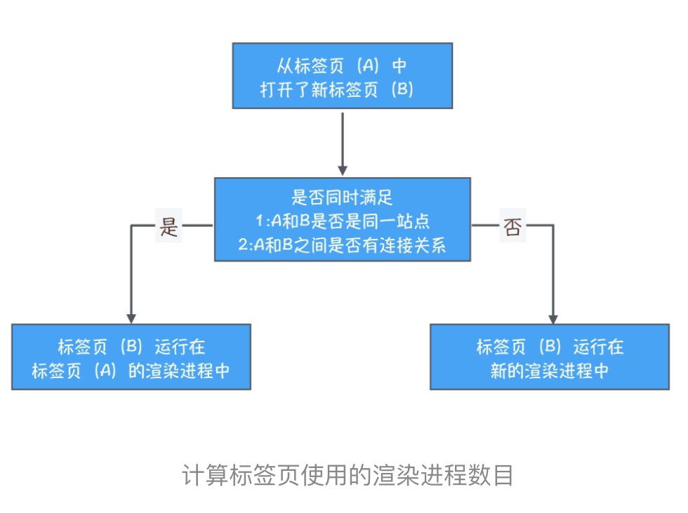
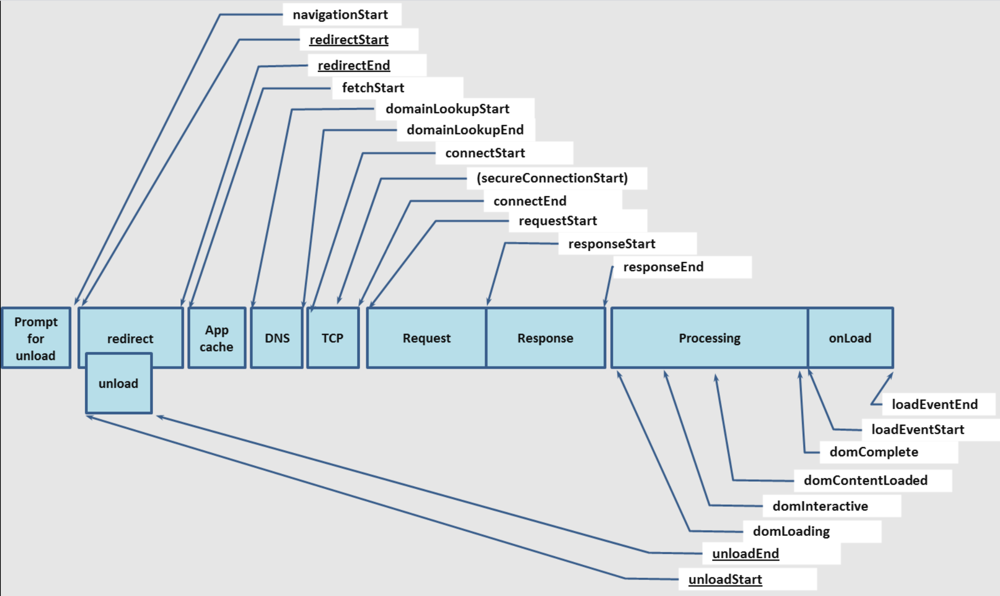
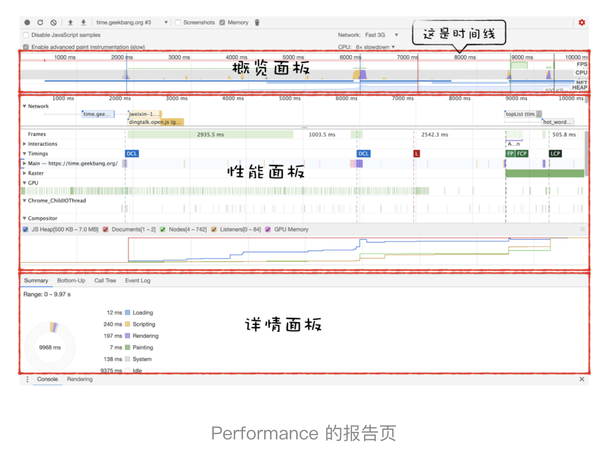
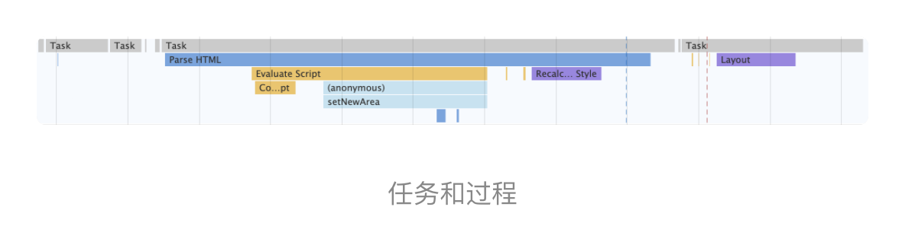
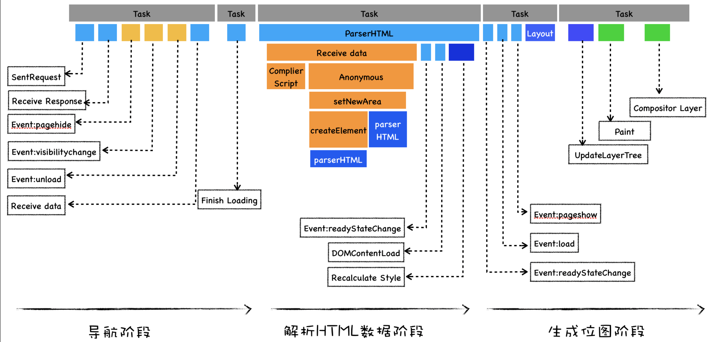

# 正文

## 浏览上下文组：如何计算Chrome中渲染进程的个数

### 标签页之间的连接

第一种是通过标签来和新标签建立连接，这种方式我们最熟悉

还可以通过 JavaScript 中的 window.open 方法来和新标签页建立连接

在 WhatWG 规范中，把这一类具有相互连接关系的标签页称为浏览上下文组 ( browsing context group)。

Chrome 浏览器会将浏览上下文组中属于同一站点的标签分配到同一个渲染进程中

### 一个“例外”

好了，现在我们清楚了 Chrome 浏览器为标签页分配渲染进程的策略了：

- 如果两个标签页都位于同一个浏览上下文组，且属于同一站点，那么这两个标签页会被浏览器分配到同一个渲染进程中。
- 如果这两个条件不能同时满足，那么这两个标签页会分别使用不同的渲染进程来渲染。

### 站点隔离

这意味着标签页中的 iframe 也会遵守同一站点的分配原则，如果标签页中的 iframe 和标签页是同一站点，并且有连接关系，那么标签页依然会和当前标签页运行在同一个渲染进程中，如果 iframe 和标签页不属于同一站点，那么 iframe 会运行在单独的渲染进程中。

## 任务调度：有了setTimeOut，为什么还要使用rAF

### 单消息队列的队头阻塞问题

在单消息队列架构下，存在着低优先级任务会阻塞高优先级任务的情况，

### 总结

我们引入了多个不同优级的消息队列，并将紧急的任务添加到高优先级队列，不过大多数任务需要保持其相对执行顺序，如果将用户输入的消息或者合成消息添加进多个不同优先级的队列中，那么这种任务的相对执行顺序就会被打乱，所以我们又迭代了第二个版本。在第二个版本中，按照不同的任务类型来划分任务优先级，不过由于采用的静态优先级策略，对于其他一些场景，这种静态调度的策略并不是太适合，所以接下来，我们又迭代了第三版。第三个版本，基于不同的场景来动态调整消息队列的优先级，到了这里已经非常完美了，不过依然存在着任务饿死的问题，为了解决任务饿死的问题，我们给每个队列一个权重，如果连续执行了一定个数的高优先级的任务，那么中间会执行一次低优先级的任务，这样我们就完成了 Chromium 的任务改造。

## 加载阶段性能：使用Audits来优化Web性能

### 性能检测工具：Performance vs Audits

最直接的方式是想办法提高性能指标的分数，而性能指标的分数是由六项指标决定的，它们分别是：

- 首次绘制 (First Paint)；
- 首次有效绘制 (First Meaningfull Paint)；
- 首屏时间 (Speed Index)；
- 首次 CPU 空闲时间 (First CPU Idle)；
- 完全可交互时间 (Time to Interactive)；
- 最大估计输入延时 (Max Potential First Input Delay)。

我们先来分析下

- 第一项指标FP，如果 FP 时间过久，那么直接说明了一个问题，那就是页面的 HTML 文件可能由于网络原因导致加载时间过久，这块具体的分析过程你可以参考《21｜Chrome 开发者工具：利用网络面板做性能分析》这节内容。

- 第二项是 FMP，上面也提到过由于 FMP 计算复杂，所以现在不建议使用该指标了，另外由于 LCP 的计算规则简单，所以推荐使用 LCP 指标，具体文章你可以参考这里。不过是 FMP 还是 LCP，优化它们的方式都是类似的，你可以结合上图，如果 FMP 和 LCP 消耗时间过久，那么有可能是加载关键资源花的时间过久，也有可能是 JavaScript 执行过程中所花的时间过久，所以我们可以针对具体的情况来具体分析。

- 第三项是首屏时间 (Speed Index)，这就是我们上面提到的 LCP，它表示填满首屏页面所消耗的时间，首屏时间的值越大，那么加载速度越慢，具体的优化方式同优化第二项 FMP 是一样。

- 第四项是首次 CPU 空闲时间 (First CPU Idle)，也称为 First Interactive，它表示页面达到最小化可交互的时间，也就是说并不需要等到页面上的所有元素都可交互，只要可以对大部分用户输入做出响应即可。要缩短首次 CPU 空闲时长，我们就需要尽可能快地加载完关键资源，尽可能快地渲染出来首屏内容，因此优化方式和第二项 FMP 和第三项 LCP 是一样的。

- 第五项是完全可交互时间 (Time to Interactive)，简称 TTI，它表示页面中所有元素都达到了可交互的时长。简单理解就这时候页面的内容已经完全显示出来了，所有的 JavaScript 事件已经注册完成，页面能够对用户的交互做出快速响应，通常满足响应速度在 50 毫秒以内。如果要解决 TTI 时间过久的问题，我们可以推迟执行一些和生成页面无关的 JavaScript 工作。

- 第六项是最大估计输入延时 (Max Potential First Input Delay），这个指标是估计你的 Web 页面在加载最繁忙的阶段， 窗口中响应用户输入所需的时间，为了改善该指标，我们可以使用 WebWorker 来执行一些计算，从而释放主线程。另一个有用的措施是重构 CSS 选择器，以确保它们执行较少的计算。

#### js如何统计页面性能

可以使用 <https://developer.mozilla.org/zh-CN/docs/Web/API/Performance>(Window.performance) 相关api:

;

## 页面性能工具：如何使用Performance

图上方有很多一段一段灰色横条，每个灰色横条就对应了一个任务，灰色长条的长度对应了任务的执行时长。通常，渲染主线程上的任务都是比较复杂的，如果只单纯记录任务执行的时长，那么依然很难定位问题，因此，还需要将任务执行过程中的一些关键的细节记录下来，这些细节就是任务的过程，灰线下面的横条就是一个个过程，同样这些横条的长度就代表这些过程执行的时长。

通过上面的图形我们可以看出，加载过程主要分为三个阶段，它们分别是：

- 导航阶段，该阶段主要是从网络进程接收 HTML 响应头和 HTML 响应体。
- 解析 HTML 数据阶段，该阶段主要是将接收到的 HTML 数据转换为 DOM 和 CSSOM。
- 生成可显示的位图阶段，该阶段主要是利用 DOM 和 CSSOM，经过计算布局、生成层树 (LayerTree)、生成绘制列表 (Paint)、完成合成等操作，生成最终的图片。