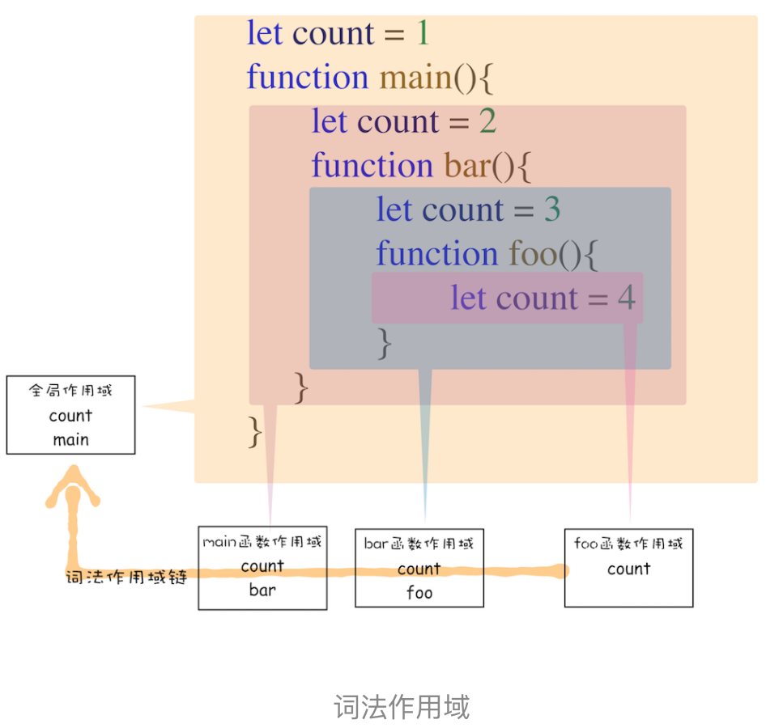

# 正文

## 变量提升

所谓的变量提升，是指在 JavaScript 代码执行过程中，JavaScript 引擎把变量的声明部分和函数的声明部分提升到代码开头的“行为”。变量被提升后，会给变量设置默认值，这个默认值就是我们熟悉的 undefined。

输入一段代码，经过编译后，会生成两部分内容：执行上下文（Execution context）和可执行代码。执行上下文是 JavaScript 执行一段代码时的运行环境

## 调用栈：为什么JavaScript代码会出现栈溢出

调用栈就是用来管理函数调用关系的一种数据结构。因此要讲清楚调用栈，你还要先弄明白函数调用和栈结构。

### 什么是栈

栈就是类似于一端被堵住的单行线，车子类似于栈中的元素，栈中的元素满足后进先出的特点。

### 什么是 JavaScript 的调用栈

在执行上下文创建好后，JavaScript 引擎会将执行上下文压入栈中，通常把这种用来管理执行上下文的栈称为执行上下文栈，又称调用栈。

### 在开发中如何利用好调用栈

1. 如何利用浏览器查看调用栈的信息：
    
    除了通过断点来查看调用栈，你还可以使用 console.trace() 来输出当前的函数调用关系，

2. 栈溢出：
    调用栈是有大小的，当入栈的执行上下文超过一定数目，JavaScript 引擎就会报错，我们把这种错误叫做栈溢出。表现为：超过了最大栈调用大小 **（Maximum call stack size exceeded）**。

## 块级作用域：var缺陷以及为什么要引入let和const

### 作用域

作用域是指在程序中定义变量的区域，该位置决定了变量的生命周期。通俗地理解，作用域就是变量与函数的可访问范围，即作用域控制着变量和函数的可见性和生命周期。

在 ES6 之前，ES 的作用域只有两种：全局作用域和函数作用域。

- 全局作用域中的对象在代码中的任何地方都能访问，其生命周期伴随着页面的生命周期。
- 函数作用域就是在函数内部定义的变量或者函数，并且定义的变量或者函数只能在函数内部被访问。函数执行结束之后，函数内部定义的变量会被销毁。

### ES6 是如何解决变量提升带来的缺陷

为了解决这些问题，ES6 引入了 let 和 const 关键字，

### JavaScript 是如何支持块级作用域的

在词法环境内部，维护了一个小型栈结构，栈底是函数最外层的变量，进入一个作用域块后，就会把该作用域块内部的变量压到栈顶；当作用域执行完成之后，该作用域的信息就会从栈顶弹出，这就是词法环境的结构。需要注意下，我这里所讲的变量是指通过 let 或者 const 声明的变量。


通过执行上下文的分析来看，var定义的变量是存放在变量环境的，而let或者const，则使用词法环境，通俗来讲，就是两个栈，分别存放，查找时浏览器也是分别去查找的。

## 作用域链和闭包 ：代码中出现相同的变量，JavaScript引擎是如何选择的

### 作用域链

在每个执行上下文的变量环境中，都包含了一个外部引用，用来指向外部的执行上下文，我们把这个外部引用称为 outer。

在 JavaScript 执行过程中，其作用域链是由词法作用域决定的。

#### 词法作用域

词法作用域就是指作用域是由代码中函数声明的位置来决定的，所以词法作用域是静态的作用域，通过它就能够预测代码在执行过程中如何查找标识符。



也就是说，词法作用域是代码阶段就决定好的，和函数是怎么调用的没有关系。

```()
function bar() {
    console.log(myName);
}
function foo() {
    var myName = "极客邦";
    bar();
    console.log(myName);
}
var myName = "极客时间";
foo(); // 极客时间
       // 极客邦
```

所以这里即使是在foo内部调用的bar，但是词法作用域决定了bar会从全局作用域开始查找。

```()
function bar() {
    var myName = "极客世界";
    let test1 = 100;
    if (1) {
        let myName = "Chrome浏览器";
        console.log(test);
    }
}
function foo() {
    var myName = "极客邦";
    let test = 2;
    {
        let test = 3;
        bar();
    }
}
var myName = "极客时间";
let myAge = 10;
let test = 1;
foo(); // 这里仍然是1，不要被块作用域迷惑
```

### 闭包

在 JavaScript 中，根据词法作用域的规则，内部函数总是可以访问其外部函数中声明的变量，当通过调用一个外部函数返回一个内部函数后，即使该外部函数已经执行结束了，但是内部函数引用外部函数的变量依然保存在内存中，我们就把这些变量的集合称为闭包。比如外部函数是 foo，那么这些变量的集合就称为 foo 函数的闭包。

#### 闭包如何回收

通常，如果引用闭包的函数是一个全局变量，那么闭包会一直存在直到页面关闭；
但如果这个闭包以后不再使用的话，就会造成内存泄漏。

如果引用闭包的函数是个局部变量，等函数销毁后，在下次 JavaScript 引擎执行垃圾回收时，判断闭包这块内容如果已经不再被使用了，那么 JavaScript 引擎的垃圾回收器就会回收这块内存。

所以在使用闭包的时候，你要尽量注意一个原则：如果该闭包会一直使用，那么它可以作为全局变量而存在；但如果使用频率不高，而且占用内存又比较大的话，那就尽量让它成为一个局部变量。

## this：从JavaScript执行上下文的视角讲清楚this

